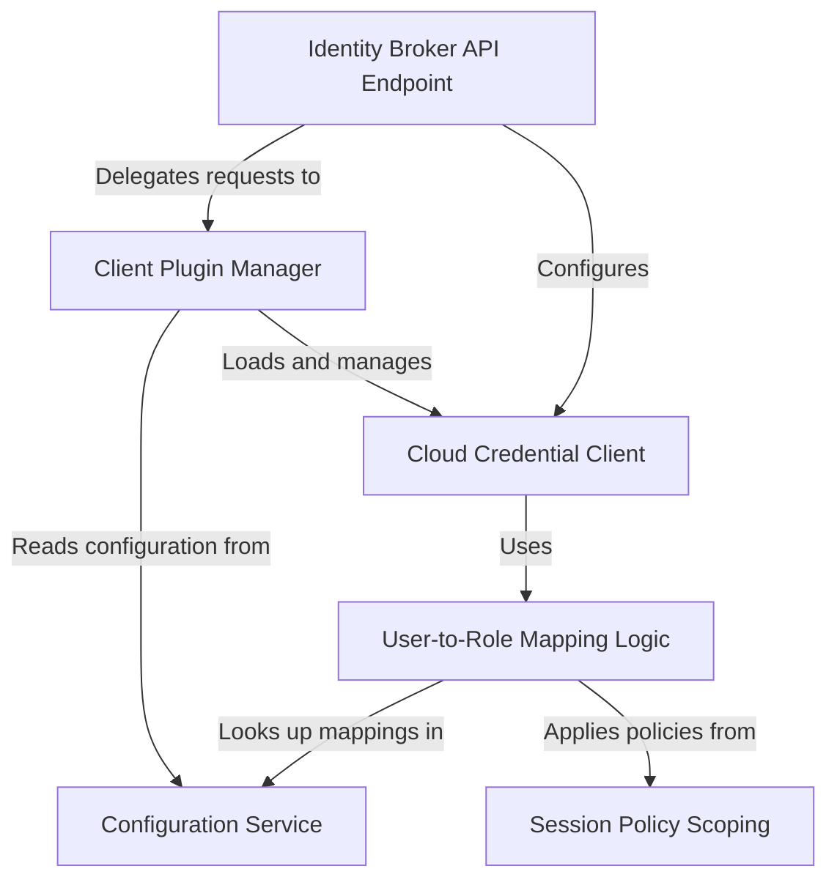

# Tutorial: gateway-service-idbroker

The Identity Broker service acts as a secure **middleman** between a user and a cloud provider (like *AWS*, *Azure*, or *GCP*).
After a user authenticates, this service automatically determines which cloud *role* they are allowed to use based on their username or group memberships. It then generates and returns temporary, short-lived credentials, enhancing security by avoiding the need to distribute long-term cloud access keys to users.

**Source Repository:** [None](None)

## Chapters

1. [User-to-Role Mapping Logic
](01_user_to_role_mapping_logic_.md)
2. [Configuration Service
](02_configuration_service_.md)
3. [Session Policy Scoping
](03_session_policy_scoping_.md)
4. [Identity Broker API Endpoint
](04_identity_broker_api_endpoint_.md)
5. [Client Plugin Manager
](05_client_plugin_manager_.md)
6. [Cloud Credential Client
](06_cloud_credential_client_.md)

---

Generated by [AI Codebase Knowledge Builder](https://github.com/The-Pocket/Tutorial-Codebase-Knowledge)