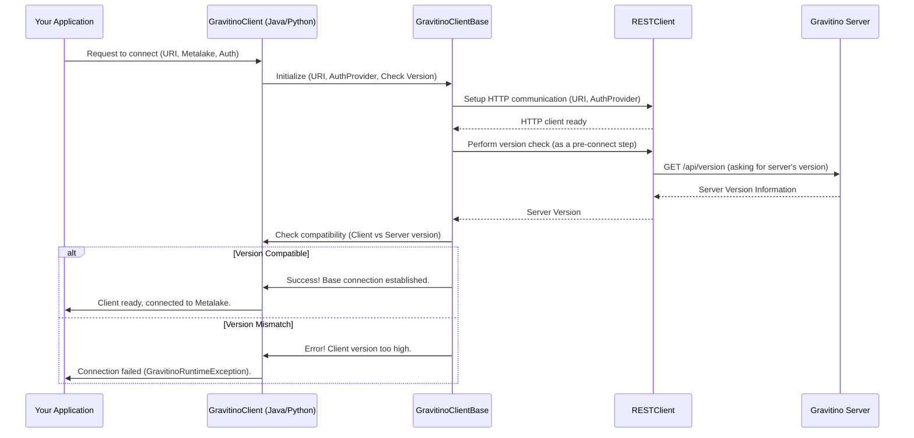

# Chapter 1: Gravitino Client Base

Imagine you have an important library that stores information about *all* your company's data assets – where they are, what they contain, who owns them, and more. This is your "metadata library" (Gravitino server). Now, your application needs to talk to this library: to find out what data tables exist, create new ones, or update information about existing datasets. How does your application communicate with this library reliably and securely?

This is where the **Gravitino Client Base** comes in.

## What is the Gravitino Client Base?

Think of the **Gravitino Client Base** as the foundational "communication module" or the "reception desk" for any application wanting to talk to the Gravitino server. It's not a complete client on its own, but rather the essential engine that handles all the basic, yet crucial, aspects of connecting and communicating with Gravitino.

Here's what it primarily takes care of:

1.  **Knowing the Server's Address:** Just like you need the address to visit a library, your application needs to know where the Gravitino server is located. The Client Base stores this server address (a URL).
2.  **Managing Security Credentials (Authentication):** The library won't let just anyone in. You need to show your ID. Similarly, the Client Base handles how your application proves its identity to the Gravitino server. This is called *authentication*, ensuring only authorized applications can access metadata.
3.  **Ensuring Version Compatibility:** Imagine trying to speak to a librarian who only understands ancient Latin, while you only speak modern English. There would be misunderstandings! The Client Base performs a "language check" to ensure your application's version of the Gravitino client software is compatible with the Gravitino server's version. This prevents unexpected errors and ensures smooth communication.

All other, more specific operations you might want to do, like listing data catalogs or managing "metalakes" (which we'll cover later), build upon this reliable communication foundation established by the Client Base.

## How to Connect to Gravitino

Let's see how you might use a Gravitino client (which uses the Client Base under the hood) to establish a connection.

### Java Example

In Java, you would typically use `GravitinoClient` (which extends `GravitinoClientBase`) and its `builder` to set up your connection.

```java
import org.apache.gravitino.client.GravitinoClient;
import org.apache.gravitino.client.GravitinoMetalake;

public class BasicConnection {
    public static void main(String[] args) {
        // 1. Specify the Gravitino server's address
        String serverUri = "http://localhost:8080";
        // 2. Specify which metalake you want to work with (e.g., "test_metalake")
        String metalakeName = "test_metalake";

        try (GravitinoClient client = GravitinoClient.builder(serverUri)
                .withMetalake(metalakeName)
                .withSimpleAuth() // Use simple authentication for demonstration
                .build()) { // Build the client!

            GravitinoMetalake metalake = client.getMetalake();
            System.out.println("Successfully connected to metalake: " + metalake.name());

        } catch (Exception e) {
            System.err.println("Failed to connect to Gravitino: " + e.getMessage());
        }
    }
}
```

This code snippet shows how to create a `GravitinoClient` instance.
*   `builder(serverUri)`: Tells the client where the Gravitino server is.
*   `withMetalake(metalakeName)`: Specifies the particular "metalake" (a top-level organizational unit in Gravitino) your application wants to interact with.
*   `withSimpleAuth()`: This is a basic authentication method. In real applications, you might use more robust methods like OAuth2 or Kerberos, but for a simple connection, this works.
*   `.build()`: Creates the actual client object, ready to communicate.

Once `client.build()` is called, the `GravitinoClientBase` silently gets to work, setting up the connection and performing the version check. If successful, you get a client that can interact with the specified metalake.

### Python Example

The Python client also provides a straightforward way to connect:

```python
from gravitino.client import GravitinoClient
from gravitino.auth.auth_data_provider import AuthDataProvider # Import if needed for complex auth

# 1. Specify the Gravitino server's address
server_uri = "http://localhost:8080"
# 2. Specify which metalake you want to work with (e.g., "test_metalake")
metalake_name = "test_metalake"

try:
    client = GravitinoClient(
        uri=server_uri,
        metalake_name=metalake_name,
        # For simple auth, you might pass None or a SimpleTokenProvider
        auth_data_provider=None # Using default (often simple or no-auth)
    )

    metalake = client.get_metalake()
    print(f"Successfully connected to metalake: {metalake.name()}")

except Exception as e:
    print(f"Failed to connect to Gravitino: {e}")
```

Similar to the Java example, this Python code creates a `GravitinoClient` instance.
*   `uri=server_uri`: Sets the server address.
*   `metalake_name=metalake_name`: Defines the target metalake.
*   `auth_data_provider=None`: For basic usage, this might default to a simple authentication or no authentication if configured on the server side. You can replace `None` with specific authentication providers later on.

## Under the Hood: How the Client Base Works

Let's peek behind the curtain to understand what happens when you create a Gravitino client.

### Step-by-Step Walkthrough

When you ask `GravitinoClient` to connect, `GravitinoClientBase` is the first to establish the fundamental communication. Here's a simplified sequence of events:



### Deeper Dive into the Code

Let's look at the actual code in `GravitinoClientBase.java` and `gravitino_client_base.py` to see how these steps are implemented.

#### 1. Initializing the REST Client

The `GravitinoClientBase` constructor is where the core `RESTClient` (which handles HTTP requests) is set up.

**Java (`clients/client-java/src/main/java/org/apache/gravitino/client/GravitinoClientBase.java`)**

```java
public abstract class GravitinoClientBase implements Closeable {
  protected final RESTClient restClient; // This is our communication engine

  protected GravitinoClientBase(
      String uri,
      AuthDataProvider authDataProvider,
      boolean checkVersion, // Flag to enable version check
      Map<String, String> headers,
      Map<String, String> properties) {
    ObjectMapper mapper = ObjectMapperProvider.objectMapper();

    if (checkVersion) {
      this.restClient =
          HTTPClient.builder(properties)
              .uri(uri)
              .withAuthDataProvider(authDataProvider)
              .withObjectMapper(mapper)
              .withPreConnectHandler(this::checkVersion) // HERE: Version check before connecting
              .withHeaders(headers)
              .build();
    } else {
      // ... (client without version check) ...
    }
  }
  // ... other methods ...
}
```

In this Java code:
*   `this.restClient`: This variable holds the actual HTTP client that sends requests to the Gravitino server.
*   `HTTPClient.builder(...)`: This is how `GravitinoClientBase` creates the `RESTClient`. It gives it the server `uri`, `authDataProvider` (for security), and an `ObjectMapper` (to convert Java objects to JSON and vice-versa).
*   `.withPreConnectHandler(this::checkVersion)`: This is crucial! If `checkVersion` is true, it tells the `RESTClient` to first run the `checkVersion()` method (from `GravitinoClientBase`) before making any other requests. This ensures compatibility right away.

**Python (`clients/client-python/gravitino/client/gravitino_client_base.py`)**

```python
class GravitinoClientBase:
    _rest_client: HTTPClient # This is our communication engine

    def __init__(
        self,
        uri: str,
        check_version: bool = True, # Flag to enable version check
        auth_data_provider: AuthDataProvider = None,
        request_headers: dict = None,
        client_config: dict = None,
    ):
        new_headers = request_headers.copy() if request_headers else {}
        client_version = self.get_client_version().version()
        if client_version is not None:
            new_headers[self.CLIENT_VERSION_HEADER] = client_version.strip()

        self._rest_client = HTTPClient( # HERE: Creating the HTTP client
            uri,
            auth_data_provider=auth_data_provider,
            request_headers=new_headers,
            client_config=client_config,
        )
        if check_version:
            self.check_version() # HERE: Calling checkVersion directly
```

In the Python code:
*   `self._rest_client = HTTPClient(...)`: Similar to Java, this initializes the `HTTPClient` (our `RESTClient`) with the server `uri` and `auth_data_provider`.
*   `if check_version: self.check_version()`: If version checking is enabled, the `check_version()` method is called right after the `HTTPClient` is set up.

#### 2. Performing the Version Check

The `checkVersion()` method is where the compatibility "language check" happens.

**Java (`clients/client-java/src/main/java/org/apache/gravitino/client/GravitinoClientBase.java`)**

```java
  public void checkVersion() {
    GravitinoVersion serverVersion = serverVersion(); // Get server's version
    GravitinoVersion clientVersion = clientVersion(); // Get client's version
    if (!clientVersion.compatibleWithServerVersion(serverVersion)) {
      throw new GravitinoRuntimeException( // Error if incompatible
          "Gravitino does not support the case that the client-side version is higher than the server version."
              + "The client version is %s, and the server version %s",
          clientVersion.version(), serverVersion.version());
    }
  }

  public GravitinoVersion serverVersion() {
    VersionResponse resp =
        restClient.get(
            "api/version", // Endpoint to get server version
            VersionResponse.class,
            Collections.emptyMap(),
            ErrorHandlers.restErrorHandler());
    resp.validate();
    return new GravitinoVersion(resp.getVersion());
  }
  // ... clientVersion() is similar, reading from local config ...
```

Here:
*   `serverVersion()`: Makes a `GET` request to the Gravitino server's `api/version` endpoint to retrieve its version.
*   `clientVersion()`: Reads the version of the Gravitino client itself from its local configuration.
*   `clientVersion.compatibleWithServerVersion(serverVersion)`: This crucial line compares the two versions. Gravitino has a rule: the client version *cannot* be higher than the server version. If it is, a `GravitinoRuntimeException` is thrown, stopping the connection before any issues arise.

**Python (`clients/client-python/gravitino/client/gravitino_client_base.py`)**

```python
class GravitinoClientBase:
    # ... __init__ and other methods ...

    def check_version(self):
        server_version = self.get_server_version() # Get server's version
        client_version = self.get_client_version() # Get client's version

        if not client_version.compatible_with_server_version(server_version):
            raise GravitinoRuntimeException( # Error if incompatible
                "Gravitino does not support the case that "
                "the client-side version is higher than the server-side version."
                f"The client version is {client_version.version()}, and the server version {server_version.version()}"
            )

    def get_server_version(self) -> GravitinoVersion:
        resp = self._rest_client.get("api/version", error_handler=REST_ERROR_HANDLER) # Endpoint to get server version
        version_response = VersionResponse.from_json(resp.body, infer_missing=True)
        version_response.validate()
        return GravitinoVersion(version_response.version())
    # ... get_client_version() is similar, reading from local config ...
```

The Python implementation mirrors the Java one, fetching both client and server versions and throwing an error if the client's version is too new for the server.

#### 3. Loading a Metalake

Once the base connection and version check are successful, operations like loading a metalake can proceed.

**Java (`clients/client-java/src/main/java/org/apache/gravitino/client/GravitinoClientBase.java`)**

```java
  public GravitinoMetalake loadMetalake(String metalakeName) throws NoSuchMetalakeException {
    checkMetalakeName(metalakeName); // Validate the name

    MetalakeResponse resp =
        restClient.get(
            API_METALAKES_IDENTIFIER_PATH + metalakeName, // API path for a specific metalake
            MetalakeResponse.class,
            Collections.emptyMap(),
            ErrorHandlers.metalakeErrorHandler());
    resp.validate();

    return DTOConverters.toMetaLake(resp.getMetalake(), restClient);
  }
```

*   `restClient.get(...)`: Here, the `restClient` (which `GravitinoClientBase` initialized) is used to send a `GET` request to the server, asking for details of the specified `metalakeName`.
*   `MetalakeResponse.class`: The response from the server is expected to be converted into a `MetalakeResponse` object.
*   `DTOConverters.toMetaLake(...)`: If the request is successful, the data received from the server (a DTO) is converted into a `GravitinoMetalake` object, which `GravitinoClient` then uses.

This illustrates how higher-level operations (like `loadMetalake`) are built on the reliable HTTP communication provided by the `RESTClient`, which is managed by `GravitinoClientBase`.

## Conclusion

The **Gravitino Client Base** is the indispensable foundation for any application interacting with a Gravitino server. It simplifies the complex tasks of establishing a connection, handling authentication, and ensuring client-server compatibility. By providing this robust lower layer, it allows other components of the Gravitino client to focus on specific metadata operations, without worrying about the underlying network details.

In the next chapter, we'll explore how Gravitino handles file system-like operations through the **Gravitino Virtual File System (GVFS)**, which also relies on this fundamental client communication layer.

[Next Chapter: Gravitino Virtual File System (GVFS) Operations](02_gravitino_virtual_file_system__gvfs__operations_.md)

---

Generated by [AI Codebase Knowledge Builder](https://github.com/The-Pocket/Tutorial-Codebase-Knowledge)