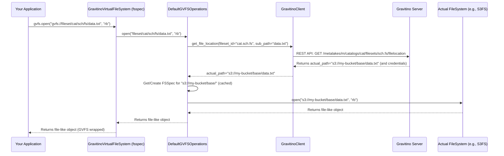

# Chapter 2: Gravitino Virtual File System (GVFS) Operations

In the [previous chapter](01_gravitino_client_base_.md), we learned how the Gravitino Client Base provides the essential communication channel to the Gravitino server. Now that your application can *talk* to Gravitino, what kind of powerful things can it ask for? One of the most common and important tasks is interacting with data files, no matter where they are stored.

This is where the **Gravitino Virtual File System (GVFS)** comes into play.

## The Challenge: Data Lives Everywhere!

Imagine your company's data is scattered across many different storage systems: some files are in Amazon S3, others in Google Cloud Storage, some on your local HDFS cluster, and perhaps some in Azure Blob Storage. Each of these systems has its own unique way of being accessed – different commands, different connection details, and different authentication mechanisms.

If you wanted to write a simple program to read a file, say `sales_report.csv`, you'd have to write completely different code depending on where that file lives:

*   If on S3: Use S3 SDK, provide AWS credentials, specify bucket and key.
*   If on HDFS: Use Hadoop FileSystem API, provide Kerberos tickets, specify HDFS path.
*   If on local disk: Use standard `open()` commands.

This quickly becomes a headache! Your code gets complicated, hard to maintain, and tied to specific storage technologies.

## What is Gravitino Virtual File System (GVFS)?

Gravitino Virtual File System (GVFS) is designed to solve this exact problem. Think of GVFS as a **universal remote control** for all your data storage systems.

Instead of writing specific code for S3, HDFS, or any other system, you tell GVFS what you want to do (e.g., "read this file") using a single, unified way. GVFS then acts as a **specialized translator and agent**:

1.  **You give it a "virtual" path**: This path looks like a regular file path, but it contains information about where Gravitino *thinks* the file should be (e.g., `gvfs://fileset/my_catalog/my_schema/my_fileset/data.txt`).
2.  **GVFS figures out the "actual" location**: Behind the scenes, GVFS talks to the Gravitino server. It asks, "Where does `my_fileset` actually store its files?" The server knows this important metadata (e.g., "Oh, `my_fileset` stores its data on `s3://my-data-lake-bucket/raw_sales/`").
3.  **GVFS uses the right tool**: Once GVFS knows the actual location, it automatically picks the correct low-level tool (like an S3 client or an HDFS client) and performs your requested action (reading, writing, listing).
4.  **Security and details are handled**: GVFS also takes care of passing the correct security credentials (which we'll cover more in the next chapter on [Auth Data Provider](03_auth_data_provider_.md)) and other complex details for you.

So, for you, it's like interacting with a single, unified file system, even though your data is spread across many different underlying storage technologies.

## Key Concepts of GVFS

Let's break down how GVFS achieves this magic:

### 1. Filesets: Logical Groupings of Files

In Gravitino, a "fileset" is a logical grouping of files. It's a metadata object that describes a collection of files, including their *actual storage location*. When you define a fileset in Gravitino, you tell it things like: "This fileset, `my_fileset`, actually lives in `s3://my-bucket/raw_data/sales/`."

GVFS uses this metadata to map your virtual path to the real one.

### 2. The GVFS Virtual Path Structure

To interact with files via GVFS, you'll use a special path that follows this structure:

`gvfs://fileset/{catalog_name}/{schema_name}/{fileset_name}/sub_path`

Let's dissect this:

*   **`gvfs://`**: This is the protocol, indicating you want to use the Gravitino Virtual File System.
*   **`fileset/`**: This part signifies that you are accessing a "fileset" resource within Gravitino.
*   **`{catalog_name}`**: The name of the catalog where your fileset is defined. Catalogs are top-level organizational units within a metalake.
*   **`{schema_name}`**: The name of the schema within the catalog that contains your fileset. Schemas organize entities within a catalog.
*   **`{fileset_name}`**: The actual name of the fileset you want to access.
*   **`/sub_path`**: This is the path to the specific file or directory *within* that fileset's storage location. For example, if `my_fileset` maps to `s3://my-bucket/raw_data/`, then `/my_data/file.txt` would translate to `s3://my-bucket/raw_data/my_data/file.txt`.

### 3. Integration with `fsspec` (Python) / Hadoop `FileSystem` (Java)

GVFS doesn't reinvent the wheel for actual file operations. It integrates with existing, widely used file system abstractions:

*   **Python**: It builds upon `fsspec`, a fantastic library that provides a unified Pythonic interface to local, remote, and embedded file systems (S3, HDFS, Google Cloud Storage, etc.).
*   **Java**: It extends Hadoop's `FileSystem` API, a standard for interacting with distributed file systems like HDFS, S3, and Azure Blob Storage in the Hadoop ecosystem.

This means if you're already familiar with `fsspec` or Hadoop `FileSystem`, using GVFS will feel very natural!

## Using GVFS: A Simple Example (Python)

Let's revisit our use case: you want to read and write a file called `data.txt` that belongs to a fileset named `my_fileset` in `my_catalog.my_schema`, without caring where it's physically stored.

First, ensure you have `fsspec` installed: `pip install fsspec`

```python
import fsspec
# Assuming gravitino client libraries are installed

# 1. Define your Gravitino server details (from Chapter 1)
GRAVITINO_SERVER_URI = "http://localhost:8080"
GRAVITINO_METALAKE_NAME = "test_metalake" # Replace with your metalake

# 2. Get a GVFS instance using fsspec
# fsspec handles the creation of GravitinoVirtualFileSystem under the hood
# and passes the necessary connection details.
print("Connecting to GVFS...")
gvfs = fsspec.filesystem(
    "gvfs",
    server_uri=GRAVITINO_SERVER_URI,
    metalake_name=GRAVITINO_METALAKE_NAME
)
print("GVFS connection established.")

# 3. Define the virtual path to your file
# Remember: gvfs://fileset/{catalog_name}/{schema_name}/{fileset_name}/sub_path
VIRTUAL_FILE_PATH = "gvfs://fileset/my_catalog/my_schema/my_fileset/data.txt"
VIRTUAL_DIR_PATH = "gvfs://fileset/my_catalog/my_schema/my_fileset/"

try:
    # 4. Perform basic file operations using the GVFS instance
    # Example: Create a directory
    print(f"\nCreating directory: {VIRTUAL_DIR_PATH}")
    gvfs.makedirs(VIRTUAL_DIR_PATH, exist_ok=True)
    print("Directory created (or already exists).")

    # Example: Write some content to the file
    print(f"\nWriting to file: {VIRTUAL_FILE_PATH}")
    with gvfs.open(VIRTUAL_FILE_PATH, "wb") as f:
        f.write(b"Hello from Gravitino GVFS! This is my data.\n")
        f.write(b"It could be on S3, HDFS, or anywhere else!")
    print("File written successfully.")

    # Example: Read the content back
    print(f"\nReading from file: {VIRTUAL_FILE_PATH}")
    with gvfs.open(VIRTUAL_FILE_PATH, "rb") as f:
        content = f.read().decode("utf-8")
        print("--- File Content ---")
        print(content)
        print("--------------------")

    # Example: List files in the virtual directory
    print(f"\nListing files in: {VIRTUAL_DIR_PATH}")
    file_list = gvfs.ls(VIRTUAL_DIR_PATH, detail=False)
    for f in file_list:
        print(f"  - {f}")

    # Example: Check if the file exists
    print(f"\nDoes {VIRTUAL_FILE_PATH} exist? {gvfs.exists(VIRTUAL_FILE_PATH)}")

    # Example: Delete the file
    print(f"\nDeleting file: {VIRTUAL_FILE_PATH}")
    gvfs.rm_file(VIRTUAL_FILE_PATH)
    print("File deleted.")

    print(f"Does {VIRTUAL_FILE_PATH} exist now? {gvfs.exists(VIRTUAL_FILE_PATH)}")

except Exception as e:
    print(f"An error occurred: {e}")
```

In this example, notice that all file operations (`open`, `makedirs`, `ls`, `exists`, `rm_file`) are performed against the `gvfs` object using the virtual path. You don't need to write any S3-specific or HDFS-specific code!

## Under the Hood: How GVFS Works Its Magic

Let's peel back the layers to understand how `gvfs.open()` actually translates your virtual path into a physical file operation.

### Step-by-Step Walkthrough

When you call an operation like `gvfs.open("gvfs://fileset/my_catalog/my_schema/my_fileset/data.txt")`:

1.  **Your Application Initiates**: Your code calls the `open` method on the `GravitinoVirtualFileSystem` instance (which `fsspec.filesystem("gvfs", ...)` provided).
2.  **GVFS Delegates**: The `GravitinoVirtualFileSystem` itself doesn't directly perform the low-level file operations. Instead, it delegates this to an internal component, typically `DefaultGVFSOperations`.
3.  **Path Parsing**: `DefaultGVFSOperations` first parses your virtual path (`gvfs://fileset/my_catalog/my_schema/my_fileset/data.txt`) to extract:
    *   The Gravitino Metalake name (provided during GVFS initialization).
    *   The Catalog name (`my_catalog`).
    *   The Schema name (`my_schema`).
    *   The Fileset name (`my_fileset`).
    *   The `sub_path` within the fileset (`/data.txt`).
4.  **Query Gravitino Server**: `DefaultGVFSOperations` then uses the [Gravitino Client Base](01_gravitino_client_base_.md) to communicate with the Gravitino server. It asks the server: "For `my_fileset` in `my_catalog.my_schema`, what is its *actual* physical storage location, and what are the credentials needed to access it?" This involves looking up the fileset's [Metadata Entity Model](05_metadata_entity_model_.md).
5.  **Server Response**: The Gravitino server responds with the actual storage path (e.g., `s3://my-data-lake-bucket/raw_sales/`) and potentially temporary security credentials (like AWS IAM role credentials, handled by the [Auth Data Provider](03_auth_data_provider_.md)).
6.  **Create Actual FileSystem**: `DefaultGVFSOperations` now has the actual storage path (e.g., `s3://my-data-lake-bucket/raw_sales/`) and any necessary credentials. It uses this information to create an instance of the *actual* filesystem client (e.g., an `S3FileSystem` from `fsspec`'s ecosystem). This actual filesystem client is typically cached for performance.
7.  **Map Sub-Path**: It combines the actual storage path with the `sub_path` (`/data.txt`) to form the complete physical path: `s3://my-data-lake-bucket/raw_sales/data.txt`.
8.  **Delegate to Actual FileSystem**: Finally, `DefaultGVFSOperations` delegates the original `open` call to this newly created (or cached) `S3FileSystem` instance, using the full physical path.
9.  **Return Result**: The `S3FileSystem` performs the actual `open` operation, and the result (a file-like object) is returned back through `DefaultGVFSOperations` and `GravitinoVirtualFileSystem` to your application.

Here's a simplified sequence diagram:



### Deeper Dive into the Code (Python)

Let's look at the actual Python code to see these steps in action.

#### 1. Initializing GVFS and its Operations

The `GravitinoVirtualFileSystem` class in `gravitino/filesystem/gvfs.py` is the `fsspec` implementation. Its `__init__` method sets up the `_operations` object that handles the core logic.

```python
# File: clients/client-python/gravitino/filesystem/gvfs.py
class GravitinoVirtualFileSystem(fsspec.AbstractFileSystem):
    # ... other members ...

    def __init__(
        self,
        server_uri: str = None,
        metalake_name: str = None,
        options: Dict = None,
        **kwargs,
    ):
        # ... (argument processing omitted for brevity) ...
        # This line creates the DefaultGVFSOperations instance
        self._operations = self._get_gvfs_operations_class(
            server_uri, metalake_name, options
        )
        super().__init__(**kwargs)

    def _get_gvfs_operations_class( # This helper method creates the actual operations handler
        self,
        server_uri: str = None,
        metalake_name: str = None,
        options: Dict = None,
    ) -> BaseGVFSOperations:
        # ... (logic to load custom operations class, if configured) ...
        # By default, it returns DefaultGVFSOperations
        return DefaultGVFSOperations(
            server_uri=server_uri,
            metalake_name=metalake_name,
            options=options,
            **self._kwargs,
        )
```

This snippet shows that `GravitinoVirtualFileSystem` delegates the heavy lifting to `DefaultGVFSOperations`.

#### 2. The `open` Method: Delegation and Exception Handling

When `gvfs.open()` is called, `GravitinoVirtualFileSystem` prepares the path, wraps the `_operations.open` call with error translation, and then handles any post-processing.

```python
# File: clients/client-python/gravitino/filesystem/gvfs.py
class GravitinoVirtualFileSystem(fsspec.AbstractFileSystem):
    # ... other methods ...

    def open(
        self,
        path, # This is your virtual path: "gvfs://fileset/..."
        mode="rb",
        # ... other arguments ...
    ):
        # 1. Pre-process the path (e.g., strip "gvfs://")
        new_path = self._hook.pre_open(path, mode, # ... )

        # 2. Determine the Gravitino audit operation type
        data_operation = FilesetDataOperation.OPEN # or OPEN_AND_WRITE/OPEN_AND_APPEND

        # 3. Decorate the actual operations.open call with exception translation
        decorated_open = self._with_exception_translation(data_operation)(
            self._operations.open # The call is delegated here!
        )
        try:
            # 4. Execute the decorated operation
            result = decorated_open(
                new_path, mode, # ... actual arguments ...
            )
        except FilesetPathNotFoundError as e:
            # Specific error handling for file not found during open/create
            # ...
            raise
        # 5. Perform post-processing and return the file-like object
        return self._hook.post_open(
            new_path, mode, # ... result ...
        )
```

This code illustrates that the `GravitinoVirtualFileSystem` acts as a facade, channeling the request to `_operations.open` and handling common errors.

#### 3. Resolving the Actual Path and FileSystem in `DefaultGVFSOperations`

The real magic of translating the virtual path happens within the `DefaultGVFSOperations` class, specifically in its `open` method.

```python
# File: clients/client-python/gravitino/filesystem/gvfs_default_operations.py
class DefaultGVFSOperations(BaseGVFSOperations):
    # ... other methods ...

    def open(
        self,
        path, # This is the pre-processed virtual path (e.g., "fileset/cat/sch/fs/data.txt")
        mode="rb",
        # ... other arguments ...
    ):
        # 1. Determine the Gravitino data operation type (for audit logs)
        # ... (code omitted for brevity) ...

        # 2. Get the actual FSSpec filesystem instance.
        # This method handles creating/caching the underlying S3FileSystem, HDFSFileSystem, etc.
        actual_fs = self._get_actual_filesystem(path, self.current_location_name)

        # 3. Request the actual physical path from the Gravitino server.
        # This is the core translation step!
        actual_file_path = self._get_actual_file_path(
            path, self.current_location_name, data_operation
        )

        # 4. Get a storage handler to strip the protocol (e.g., "s3://") if the underlying FSSpec
        #    implementation doesn't expect it directly in the path argument.
        storage_handler = get_storage_handler_by_path(actual_file_path)

        # 5. Finally, delegate the 'open' call to the actual, low-level FSSpec filesystem.
        return actual_fs.open(
            storage_handler.strip_storage_protocol(actual_file_path),
            mode,
            # ... other arguments ...
        )
```

This is the heart of GVFS. It shows how it first obtains the right `fsspec` instance (e.g., `S3FileSystem`), then asks the Gravitino server for the *actual* path, and finally calls `open` on the specific `fsspec` implementation.

#### 4. Getting the Actual File Path from Gravitino Server

The `_get_actual_file_path` method within `BaseGVFSOperations` is responsible for contacting the Gravitino server to resolve the virtual path to a real one.

```python
# File: clients/client-python/gravitino/filesystem/gvfs_base_operations.py
class BaseGVFSOperations(ABC):
    # ... other members ...

    def _get_actual_file_path(
        self, gvfs_path: str, location_name: str, operation: FilesetDataOperation
    ) -> str:
        # 1. Parse the virtual path to extract identifying information
        processed_virtual_path: str = self._pre_process_path(gvfs_path)
        identifier: NameIdentifier = extract_identifier(
            self._metalake, processed_virtual_path # Extracts catalog, schema, fileset names
        )
        catalog_ident: NameIdentifier = NameIdentifier.of(
            self._metalake, identifier.namespace().level(1)
        )
        fileset_catalog = self._get_fileset_catalog(catalog_ident).as_fileset_catalog()

        sub_path: str = get_sub_path_from_virtual_path( # Extracts "/data.txt" part
            identifier, processed_virtual_path
        )
        # ... (prepare caller context for audit logs, details omitted) ...

        # 2. Use the Gravitino client to ask the Gravitino server for the actual location
        # This calls a REST API on the server that resolves the path
        return fileset_catalog.get_file_location(
            NameIdentifier.of(identifier.namespace().level(2), identifier.name()),
            sub_path,
            location_name,
        )
```

Here, the `fileset_catalog.get_file_location()` method is the crucial interaction with the Gravitino server, using the [Gravitino Client Base](01_gravitino_client_base_.md) to fetch the physical location metadata.

#### 5. Managing Actual FileSystem Instances (Caching and Credentials)

The `_get_filesystem` method in `BaseGVFSOperations` handles the creation and caching of the underlying `fsspec` instances, and also integrates with credential vending.

```python
# File: clients/client-python/gravitino/filesystem/gvfs_base_operations.py
class BaseGVFSOperations(ABC):
    # ... other members ...

    def _get_filesystem(
        self,
        actual_file_location: str, # e.g., "s3://my-bucket/base/"
        fileset_catalog: Catalog,
        name_identifier: NameIdentifier, # The identifier for the fileset
        location_name: str,
    ):
        # ... (Read-lock and cache lookup logic omitted for brevity) ...

        # If not found in cache or expired, proceed to load/create
        # 1. Load the fileset metadata to get its properties and credential information
        fileset: GenericFileset = fileset_catalog.as_fileset_catalog().load_fileset(
            NameIdentifier.of(
                name_identifier.namespace().level(2), name_identifier.name()
            )
        )
        # 2. Check if credential vending is enabled and fetch credentials from the fileset
        credentials = (
            fileset.support_credentials().get_credentials()
            if self._enable_credential_vending
            else None
        )
        # 3. Use a storage handler to get the appropriate fsspec.AbstractFileSystem
        #    (e.g., s3fs.S3FileSystem, hdfs.HDFSFileSystem) with credentials.
        new_cache_value = get_storage_handler_by_path(
            actual_file_location
        ).get_filesystem_with_expiration(
            credentials, # Potentially temporary credentials from Gravitino
            fileset_catalog.properties(),
            self._options,
            actual_file_location,
            **self._kwargs,
        )
        # ... (Update cache with new_cache_value, release write-lock) ...
        return new_cache_value[1]
```

This method demonstrates intelligent caching for performance and the crucial role of fetching security credentials (if [Auth Data Provider](03_auth_data_provider_.md) is configured) before initializing the actual underlying file system client.

## Conclusion

The **Gravitino Virtual File System (GVFS)** provides a powerful abstraction that allows your applications to interact with data files across diverse storage systems using a single, unified interface. By abstracting away the complexities of storage locations, proprietary APIs, and security details, GVFS empowers developers to focus on data logic rather than infrastructure specifics. It achieves this by translating virtual paths into actual physical locations, leveraging metadata from the Gravitino server, and integrating with established file system libraries like `fsspec`.

In the next chapter, we will delve into the **[Auth Data Provider](03_auth_data_provider_.md)**, which is essential for securely accessing these diverse storage systems and is a key component that GVFS relies on.

[Next Chapter: Auth Data Provider](03_auth_data_provider_.md)

---

Generated by [AI Codebase Knowledge Builder](https://github.com/The-Pocket/Tutorial-Codebase-Knowledge)