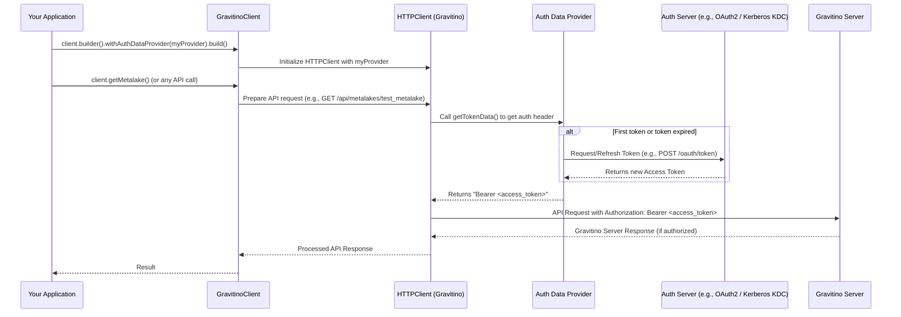

# Chapter 3: Auth Data Provider

In the [previous chapter](02_gravitino_virtual_file_system__gvfs__operations_.md), we explored the Gravitino Virtual File System (GVFS), which allows your applications to interact with files across various storage systems. We saw that for GVFS to work its magic, it often needs **credentials** – like passwords or special keys – to access those underlying storage locations (e.g., your S3 bucket, HDFS cluster, or even the Gravitino server itself).

But how does your application securely handle these sensitive credentials? And what if your company uses different security systems, like OAuth2 for cloud services or Kerberos for on-premise clusters? Constantly changing your application's code to match each security system would be a nightmare!

This is where the **Auth Data Provider** comes to the rescue.

## What is an Auth Data Provider?

Think of an **Auth Data Provider** as your application's **secure valet service for authentication keys**.

Instead of your application directly carrying around passwords or figuring out complex security rituals for every data source:

1.  **You give your "keys" (initial credentials or configuration) to the valet (Auth Data Provider) once.**
2.  **When your application needs to open a "locked door" (access a Gravitino server API or an external storage system), it asks the valet for the right "key."**
3.  **The valet then goes and fetches, generates, or refreshes the necessary security token (like an OAuth2 token or a Kerberos ticket) and hands it to the client.**
4.  **Your application presents this token to the "door," gaining access.**

This means your application code doesn't need to know the intricate details of *how* to authenticate. It just knows to ask the `Auth Data Provider` for a valid token. This simple delegation makes your application more secure, flexible, and easier to maintain.

## Key Concepts of Auth Data Provider

Let's break down the core ideas behind this important component:

### 1. Secure Key-Holder

The primary role of the `Auth Data Provider` is to be a secure key-holder. It takes on the responsibility of managing your sensitive authentication details, isolating them from your main application logic.

### 2. Abstraction of Authentication

Different security protocols (like OAuth2, Kerberos, or basic username/password) work very differently. The `Auth Data Provider` abstracts away these differences. Your Gravitino client just needs an `Auth Data Provider` instance, and it doesn't care if it's getting an OAuth2 token or a Kerberos ticket – it just gets *a* token.

### 3. On-Demand Token Provisioning

Instead of storing a token that might expire, a good `Auth Data Provider` is smart. It can fetch a new token from an authentication server when needed or automatically refresh an expired one. This ensures your application always has a valid token without manual intervention.

### 4. Support for Various Protocols

Gravitino comes with built-in `Auth Data Provider` implementations for common authentication methods, such as:

*   **Simple Authentication**: For basic setups, often using a username (like a system user or an environment variable).
*   **OAuth2**: A widely used industry standard for delegated authorization, often used with cloud services.
*   **Kerberos**: A network authentication protocol that works on the basis of "tickets" to allow nodes communicating over a non-secure network to prove their identity to one another.

## How to Use an Auth Data Provider

When you connect your `GravitinoClient` to the Gravitino server, you tell it which `Auth Data Provider` to use.

### Java Example

In Java, you specify the `AuthDataProvider` when building your `GravitinoClient`.

```java
import org.apache.gravitino.client.GravitinoClient;
import org.apache.gravitino.client.GravitinoMetalake;
import org.apache.gravitino.client.AuthDataProvider;
import org.apache.gravitino.client.DefaultOAuth2TokenProvider; // For OAuth2
// import org.apache.gravitino.client.KerberosTokenProvider; // For Kerberos
// import java.io.File; // Needed for Kerberos keytab file

public class AuthExample {
    public static void main(String[] args) {
        String serverUri = "http://localhost:8080";
        String metalakeName = "test_metalake";

        // 1. Using Simple Authentication (as seen in Chapter 1)
        // This is easy for local testing.
        try (GravitinoClient client = GravitinoClient.builder(serverUri)
                .withMetalake(metalakeName)
                .withSimpleAuth() // Uses a SimpleTokenProvider internally
                .build()) {
            System.out.println("Connected with Simple Auth: " + client.getMetalake().name());
        } catch (Exception e) {
            System.err.println("Simple Auth failed: " + e.getMessage());
        }

        // 2. Using an OAuth2 Token Provider
        // This is common for production environments.
        AuthDataProvider oauthProvider = DefaultOAuth2TokenProvider.builder()
                .withUri("http://authserver:9000") // Your OAuth2 server base URL
                .withPath("oauth/token")          // The token endpoint
                .withCredential("myClientId:myClientSecret") // Your client ID and secret
                .withScope("read write")          // Requested permissions
                .build();

        try (GravitinoClient client = GravitinoClient.builder(serverUri)
                .withMetalake(metalakeName)
                .withAuthDataProvider(oauthProvider) // Provide your custom provider
                .build()) {
            System.out.println("Connected with OAuth2: " + client.getMetalake().name());
        } catch (Exception e) {
            System.err.println("OAuth2 Auth failed: " + e.getMessage());
        }
    }
}
```
In this Java example, `withSimpleAuth()` provides basic authentication. For more advanced security, you create an instance of a specific `AuthDataProvider` (like `DefaultOAuth2TokenProvider`) using its builder and then pass it to `withAuthDataProvider()`.

### Python Example

The Python client offers similar flexibility using the `auth_data_provider` parameter.

```python
from gravitino.client import GravitinoClient
from gravitino.auth.simple_auth_provider import SimpleAuthProvider
from gravitino.auth.default_oauth2_token_provider import DefaultOAuth2TokenProvider
import os # Useful for environment variables

server_uri = "http://localhost:8080"
metalake_name = "test_metalake"

# 1. Using Simple Authentication
# This will use GRAVITINO_USER environment variable or system username.
try:
    client = GravitinoClient(
        uri=server_uri,
        metalake_name=metalake_name,
        auth_data_provider=SimpleAuthProvider() # Explicitly use SimpleAuth
    )
    print(f"Connected with Simple Auth: {client.get_metalake().name()}")
except Exception as e:
    print(f"Simple Auth failed: {e}")

# 2. Using an OAuth2 Token Provider
# This requires your OAuth2 server details.
oauth_provider = DefaultOAuth2TokenProvider(
    uri="http://authserver:9000",       # Base URI of your OAuth2 server
    path="/oauth/token",                # Token request endpoint
    credential="myClientId:myClientSecret", # Client ID and Secret
    scope="read write"                  # Desired scope
)

try:
    client = GravitinoClient(
        uri=server_uri,
        metalake_name=metalake_name,
        auth_data_provider=oauth_provider # Pass your custom provider instance
    )
    print(f"Connected with OAuth2: {client.get_metalake().name()}")
except Exception as e:
    print(f"OAuth2 Auth failed: {e}")
```
Here, you instantiate `SimpleAuthProvider` or `DefaultOAuth2TokenProvider` and pass the object directly to the `GravitinoClient` constructor. Notice how your core client code remains the same, regardless of the underlying authentication mechanism!

## Under the Hood: How Auth Data Provider Works Its Magic

Let's peek behind the curtain to understand what happens when your `GravitinoClient` uses an `Auth Data Provider`.

### Step-by-Step Walkthrough

When your application initiates a connection or makes an API call to the Gravitino server:

1.  **Application Configures Client**: You configure the `GravitinoClient` with your chosen `Auth Data Provider` (e.g., `DefaultOAuth2TokenProvider`).
2.  **HTTPClient Initialization**: The `GravitinoClientBase` (as we learned in [Chapter 1: Gravitino Client Base](01_gravitino_client_base_.md)) creates an `HTTPClient` and passes your `Auth Data Provider` to it.
3.  **Request for Token Data**: Whenever the `HTTPClient` is about to send an actual HTTP request to the Gravitino server, it asks the `Auth Data Provider`: "Hey, do you have any authentication data for me?" (by calling `getTokenData()`).
4.  **Token Generation/Refresh**:
    *   If it's the first time, or if the previous token has expired, the `Auth Data Provider` will contact an external authentication server (e.g., an OAuth2 server or Kerberos Key Distribution Center) to fetch a fresh security token.
    *   It caches this token and its expiration time internally.
5.  **Token Provided**: The `Auth Data Provider` returns the valid token data (e.g., "Bearer eyJ...xyz") to the `HTTPClient`.
6.  **Authorization Header**: The `HTTPClient` then adds this token as an `Authorization` header to the outgoing HTTP request.
7.  **Request Sent**: The HTTP request, now properly authenticated, is sent to the Gravitino server.
8.  **Gravitino Server Validation**: The Gravitino server receives the request, validates the token, and, if valid, processes the request.

Here's a simplified sequence diagram:



### Deeper Dive into the Code

Let's look at the actual code structure to understand how `AuthDataProvider` integrates.

#### 1. The `AuthDataProvider` Interface

Both Java and Python define an `AuthDataProvider` interface/abstract class that all concrete providers must implement. This defines the contract:

**Java (`clients/client-java/src/main/java/org/apache/gravitino/client/AuthDataProvider.java`)**

```java
interface AuthDataProvider extends Closeable {
  default boolean hasTokenData() {
    return false;
  }

  default byte[] getTokenData() {
    return null;
  }
  // close() method is inherited from Closeable interface
}
```

**Python (`clients/client-python/gravitino/auth/auth_data_provider.py`)**

```python
from abc import ABC, abstractmethod

class AuthDataProvider(ABC):
    @abstractmethod
    def has_token_data(self) -> bool:
        pass

    @abstractmethod
    def get_token_data(self) -> bytes:
        pass

    @abstractmethod
    def close(self):
        pass
```
**Explanation**: This interface (or abstract class in Python) defines three methods: `hasTokenData()` (to check if it actually provides a token), `getTokenData()` (to retrieve the actual token data as bytes), and `close()` (to release resources). The `HTTPClient` will call `getTokenData()` to get the security information.

#### 2. `HTTPClient` Using the `Auth Data Provider`

The `HTTPClient` is the core component that sends requests. It checks if an `AuthDataProvider` is configured and uses it to add the `Authorization` header.

**Java (`clients/client-java/src/main/java/org/apache/gravitino/client/HTTPClient.java`)**

```java
public class HTTPClient implements RESTClient {
  // ... (fields and other methods) ...
  private final AuthDataProvider authDataProvider; // Our AuthDataProvider instance

  private HTTPClient( // Constructor
      String uri,
      // ... other args ...
      AuthDataProvider authDataProvider, // Passed in here
      // ... other args ...
      ) {
    // ...
    this.authDataProvider = authDataProvider; // Store the provider
  }

  private <T> T execute( // Method that sends HTTP requests
      Method method, String path, // ... other args ... ) {
    // ...
    if (authDataProvider != null) {
      // THIS IS THE CRUCIAL LINE:
      // Get token data and set it in the HTTP Authorization header
      request.setHeader(
          AuthConstants.HTTP_HEADER_AUTHORIZATION,
          new String(authDataProvider.getTokenData(), StandardCharsets.UTF_8));
    }
    // ... (rest of the HTTP request execution) ...
  }
  // ...
}
```

**Explanation**: In the `HTTPClient`'s `execute` method (which handles sending all HTTP requests), you can see that if an `authDataProvider` is present, it calls `authDataProvider.getTokenData()`. The returned bytes are then converted to a string and set as the value for the `Authorization` HTTP header. This header is how the client tells the Gravitino server who it is and if it's authorized.

#### 3. Example: `SimpleTokenProvider` (Basic Authentication)

This is the simplest implementation, often used for development or when strong external authentication isn't required.

**Java (`clients/client-java/src/main/java/org/apache/gravitino/client/SimpleTokenProvider.java`)**

```java
final class SimpleTokenProvider implements AuthDataProvider {
  private final byte[] token; // Stores the pre-computed token

  public SimpleTokenProvider() {
    String gravitinoUser = System.getenv("GRAVITINO_USER"); // Try environment var
    if (gravitinoUser == null) gravitinoUser = System.getProperty("user.name"); // Fallback to system user
    // Build a Basic Authorization token (e.g., "Basic <base64_encoded_username:dummy>")
    this.token = buildToken(gravitinoUser);
  }

  @Override
  public byte[] getTokenData() {
    return token; // Simply returns the stored token
  }
  // ... other methods ...
}
```

**Explanation**: The `SimpleTokenProvider` (which is used by `withSimpleAuth()` in Java) reads a username, combines it with a dummy password (`:dummy`), Base64-encodes it, and prefixes it with "Basic ". This simple token is generated once during initialization and then returned for every request.

#### 4. Example: `DefaultOAuth2TokenProvider` (OAuth2 Authentication)

This provider is more sophisticated, handling token fetching and automatic refresh.

**Java (`clients/client-java/src/main/java/org/apache/gravitino/client/DefaultOAuth2TokenProvider.java`)**

```java
public class DefaultOAuth2TokenProvider extends OAuth2TokenProvider {
  private String token; // Stores the current access token

  // ... constructor and other fields ...

  @Override
  protected String getAccessToken() { // Called by getTokenData()
    synchronized (this) {
      // 1. Check if the current token is null or has expired
      Long expires = OAuth2ClientUtil.expiresAtMillis(token);
      if (expires == null || expires <= System.currentTimeMillis()) {
        // 2. If expired or not present, fetch a new token from the OAuth2 server
        token =
            OAuth2ClientUtil.fetchToken(client, Collections.emptyMap(), credential, scope, path)
                .getAccessToken();
      }
      return token; // 3. Return the valid (new or existing) token
    }
  }
  // ... other methods ...
}
```

**Python (`clients/client-python/gravitino/auth/default_oauth2_token_provider.py`)**

```python
import time
# ... (imports) ...
class DefaultOAuth2TokenProvider(OAuth2TokenProvider):
    _token: Optional[str] # Stores the current access token

    # ... __init__ and other methods ...

    def _get_access_token(self) -> Optional[str]:
        # 1. Check if the current token's expiration time is still in the future
        expires = self._expires_at_millis()
        if expires is None or expires > time.time() * 1000:
            return self._token # 2. If valid, return the existing token
        
        # 3. If expired, fetch a new token from the OAuth2 server
        self._token = self._fetch_token()
        return self._token # 4. Return the newly fetched token
```

**Explanation**: The `DefaultOAuth2TokenProvider` (Java) and `DefaultOAuth2TokenProvider` (Python) are intelligent. When `getAccessToken()` (which is called by `getTokenData()`) is invoked, they first check if the currently held OAuth2 access token is still valid. If it's expired or not yet fetched, they make an HTTP request to the configured OAuth2 authentication server to get a new token. This ensures that your application always sends a fresh, unexpired token, handling the complexity of token lifecycle management for you.

## Conclusion

The **Auth Data Provider** is a fundamental component for secure and flexible interactions with Gravitino. By abstracting away the specifics of various authentication protocols and securely managing the lifecycle of authentication tokens, it empowers developers to build applications that are robust, easily configurable, and adaptable to different security landscapes without entangling sensitive logic within the main application code. It ensures that whether you're connecting to the Gravitino server or accessing external data sources via GVFS, your requests are properly authorized.

In the next chapter, we will shift our focus to **[Data Transfer Objects (DTOs)](04_data_transfer_objects__dtos__.md)**, which are the standardized "messages" that the Gravitino client and server exchange during all these operations.

[Next Chapter: Data Transfer Objects (DTOs)](04_data_transfer_objects__dtos__.md)

---

Generated by [AI Codebase Knowledge Builder](https://github.com/The-Pocket/Tutorial-Codebase-Knowledge)