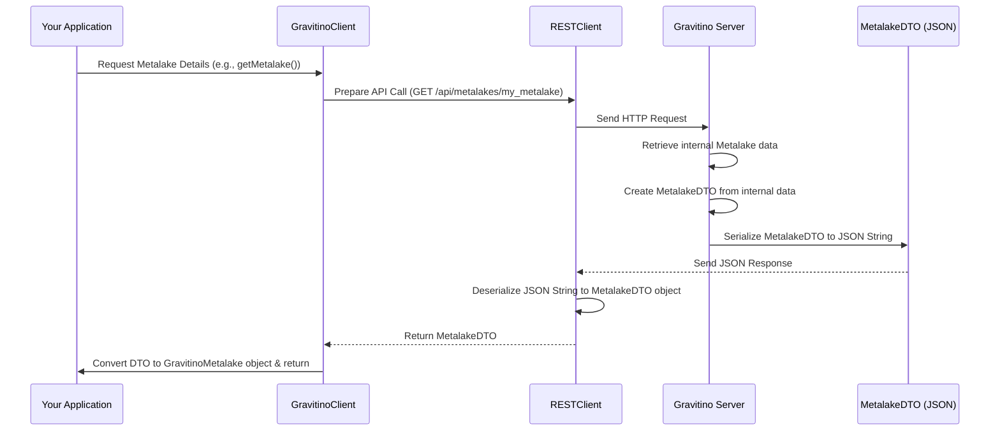

# Chapter 4: Data Transfer Objects (DTOs)

In the [previous chapter](03_auth_data_provider_.md), we learned about the Auth Data Provider, which securely handles credentials when your application talks to the Gravitino server or external data sources. Now that your application has a secure way to communicate, what exactly does it *send* and *receive* when interacting with Gravitino?

Imagine you're sending a package through the mail. You don't send your entire house; you put specific items into a box, label it clearly, and address it. Similarly, when your Gravitino client talks to the Gravitino server, they don't exchange complex, living software objects directly. Instead, they use simple, standardized "packages" of information. These packages are called **Data Transfer Objects**, or **DTOs**.

## What are Data Transfer Objects (DTOs)?

DTOs are like **standardized envelopes for messages** that contain *only the data*, with no complex business logic. Their main job is to reliably carry information between different parts of the Gravitino system, especially between your client application and the Gravitino server via its REST APIs.

Here's why they are so important:

1.  **Efficient Communication**: When you communicate over a network (like the internet), sending large, complex objects with many internal methods and dependencies is inefficient. DTOs contain only the essential data, making network transfers faster and lighter.
2.  **Standardized Format**: Both the client and the server agree on the structure of these "envelopes." This ensures that when the server sends information about, say, a "metalake," the client knows exactly what fields to expect (like its name, comment, properties, and audit information). This prevents misunderstandings.
3.  **Separation of Concerns**: DTOs keep the "transport" of data separate from the "business logic" that operates on that data. Your application might have a rich `Metalake` object with methods for creating catalogs or managing permissions. The `MetalakeDTO`, however, simply holds the raw facts about that metalake, without any of those complex behaviors.
4.  **Language Agnostic**: DTOs are usually designed to be easily converted to common data formats like JSON. This means a Java client can talk to a Gravitino server (also in Java), and a Python client can talk to the same server, all using the same DTO structure encoded as JSON.

For example, when your Gravitino client asks the server for details about a metalake, the server will package up all the relevant information (name, comment, creation time, etc.) into a `MetalakeDTO` and send it back. Your client then unwraps this DTO to access the data.

## How DTOs are Used in Gravitino

You won't typically *create* DTOs directly in your application code unless you are building custom client logic. Instead, DTOs are generally handled automatically by the Gravitino client library when it communicates with the server.

Let's consider an example you've already seen: connecting to a metalake.

```java
// From Chapter 1: Gravitino Client Base
// ...
try (GravitinoClient client = GravitinoClient.builder(serverUri)
        .withMetalake(metalakeName)
        .withSimpleAuth()
        .build()) {
    GravitinoMetalake metalake = client.getMetalake(); // Here's where DTOs are involved!
    System.out.println("Successfully connected to metalake: " + metalake.name());
}
// ...
```

When you call `client.getMetalake()`, the Gravitino client sends a request to the server. The server retrieves the metalake's information, puts it into a `MetalakeDTO`, serializes it to JSON, and sends it back. Your client then *deserializes* that JSON into a `MetalakeDTO` and then typically converts it into a richer `GravitinoMetalake` object for your application to use. The DTO is the invisible but crucial messenger in this exchange!

## Under the Hood: How DTOs Travel

Let's trace how a `MetalakeDTO` flows when your application requests information about a metalake.

### Step-by-Step Walkthrough

When your application asks for details about a metalake (e.g., its name, comment, properties):

1.  **Your Application Requests**: Your code calls a method like `client.getMetalake()`.
2.  **Client Sends API Call**: The [Gravitino Client Base](01_gravitino_client_base_.md) (specifically its `RESTClient`) sends an HTTP GET request to the Gravitino server, targeting the API endpoint for metalake information (e.g., `/api/metalakes/your_metalake_name`).
3.  **Server Retrieves Data**: The Gravitino server processes this request. It fetches the necessary metadata about the metalake from its internal storage or data model.
4.  **Server Creates DTO**: The server takes this internal metalake data and populates a new `MetalakeDTO` object with just the relevant fields (name, comment, properties, audit info).
5.  **Server Serializes DTO**: The server then converts this `MetalakeDTO` object into a standardized string format, typically JSON, for sending over the network.
6.  **Server Sends Response**: The server sends this JSON string back to the client as an HTTP response.
7.  **Client Receives Response**: The `RESTClient` in your application receives the JSON string.
8.  **Client Deserializes DTO**: The `RESTClient` (using an object mapper) converts the JSON string back into a `MetalakeDTO` object in your application's memory.
9.  **Client Converts to Application Object**: Finally, your Gravitino client often converts this simple `MetalakeDTO` into a more functional `GravitinoMetalake` object, which is what your application actually interacts with.

This ensures that the client and server agree on the "shape" of the data being exchanged, even if their internal representations of a "metalake" are more complex.

Here's a simplified sequence diagram to illustrate this flow:



### Deeper Dive into the Code

Gravitino uses Python's `dataclasses` and `dataclasses_json` library to easily define DTOs and handle their conversion to and from JSON. Let's look at some examples from the provided code snippets.

#### 1. The `MetalakeDTO`

This is the "envelope" for metalake information. Notice how it primarily consists of fields to hold data and simple methods to access that data.

```python
# File: clients/client-python/gravitino/dto/metalake_dto.py
from dataclasses import dataclass, field
from typing import Optional, Dict
from dataclasses_json import DataClassJsonMixin, config # For JSON handling

from gravitino.api.metalake import Metalake
from gravitino.dto.audit_dto import AuditDTO # Audit info is also a DTO

@dataclass
class MetalakeDTO(Metalake, DataClassJsonMixin):
    """Represents a Metalake Data Transfer Object (DTO)."""

    _name: str = field(metadata=config(field_name="name"))
    _comment: Optional[str] = field(metadata=config(field_name="comment"))
    _properties: Optional[Dict[str, str]] = field(
        metadata=config(field_name="properties")
    )
    _audit: Optional[AuditDTO] = field(metadata=config(field_name="audit"))

    def name(self) -> str:
        return self._name

    def comment(self) -> str:
        return self._comment

    # ... other simple getter methods ...
```

**Explanation:**
*   `@dataclass`: This Python decorator automatically generates common methods like `__init__`, `__repr__`, etc., for classes that primarily store data.
*   `DataClassJsonMixin`: This mixin from `dataclasses_json` is powerful! It provides methods (like `to_json()` and `from_json()`) that automatically convert `MetalakeDTO` objects to JSON strings and vice-versa, making client-server communication seamless.
*   `_name`, `_comment`, `_properties`, `_audit`: These are the fields that hold the actual data. Notice they are simple types (`str`, `Dict`) or other DTOs (`AuditDTO`).
*   `metadata=config(field_name="name")`: This tells `dataclasses_json` that the internal Python attribute `_name` should be mapped to the JSON key `"name"` when serializing/deserializing.
*   `name()`, `comment()`: These are simple "getter" methods to access the data. There's no complex logic here, just retrieval of stored values.

This `MetalakeDTO` provides a clear, compact definition of the data structure expected for metalake information, perfectly suited for network transfer.

#### 2. The `AuditDTO`

Metadata in Gravitino often includes audit information (who created/modified something and when). This too is represented as a DTO.

```python
# File: clients/client-python/gravitino/dto/audit_dto.py
from dataclasses import dataclass, field
from typing import Optional
from dataclasses_json import DataClassJsonMixin, config

from gravitino.api.audit import Audit

@dataclass
class AuditDTO(Audit, DataClassJsonMixin):
    """Data transfer object representing audit information."""

    _creator: Optional[str] = field(default=None, metadata=config(field_name="creator"))
    _create_time: Optional[str] = field(
        default=None, metadata=config(field_name="createTime")
    )
    _last_modifier: Optional[str] = field(
        default=None, metadata=config(field_name="lastModifier")
    )
    _last_modified_time: Optional[str] = field(
        default=None, metadata=config(field_name="lastModifiedTime")
    )

    def creator(self) -> str:
        return self._creator

    # ... other simple getter methods ...
```

**Explanation:**
Similar to `MetalakeDTO`, `AuditDTO` is a simple `dataclass` with `DataClassJsonMixin` for JSON conversion. It contains fields like `_creator` and `_create_time` which are mapped to JSON keys `creator` and `createTime`. This shows how even nested information within an entity (like audit details for a metalake) can be cleanly transported using other DTOs.

#### 3. Other DTO Examples

Gravitino defines DTOs for almost every metadata entity that is exchanged between the client and server. You'll find similar structures for:

*   **`VersionDTO`**: Carries version information (like client/server compatibility checks in [Chapter 1: Gravitino Client Base](01_gravitino_client_base_.md)).
*   **`CatalogDTO`**: Data for catalogs within a metalake.
*   **`SchemaDTO`**: Data for schemas within a catalog.
*   **`FilesetDTO`**: Data for filesets (important for [Chapter 2: Gravitino Virtual File System (GVFS) Operations](02_gravitino_virtual_file_system__gvfs__operations_.md)).
*   **`ModelDTO`** and **`ModelVersionDTO`**: For AI/ML models.
*   **`JobDTO`** and **`JobTemplateDTO`**: For job orchestration.

Each of these DTOs follows the same pattern: a simple data structure, usually with `dataclass` and `DataClassJsonMixin`, and basic getter methods, designed purely for data exchange.

## Conclusion

**Data Transfer Objects (DTOs)** are the unsung heroes of client-server communication in Gravitino. They provide a clean, efficient, and standardized way to package and exchange data, ensuring that your Gravitino client and server can speak the same "language" of information. By focusing solely on data, DTOs enable robust and flexible interactions without entangling complex business logic in network transfers.

Now that we understand how data is packaged and transported, in the next chapter, we will look at how this data is structured *internally* within Gravitino using the **Metadata Entity Model**.

[Next Chapter: Metadata Entity Model](05_metadata_entity_model_.md)

---

Generated by [AI Codebase Knowledge Builder](https://github.com/The-Pocket/Tutorial-Codebase-Knowledge)