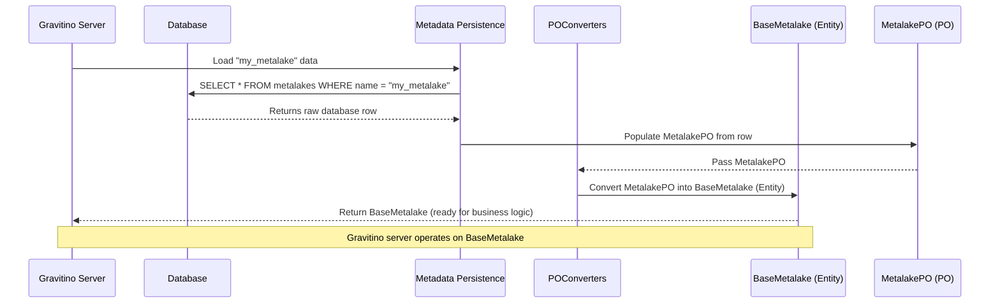

# Chapter 5: Metadata Entity Model

In the [previous chapter](04_data_transfer_objects__dtos__.md), we explored Data Transfer Objects (DTOs) as the standardized "envelopes" for information exchanged between the Gravitino client and server. These DTOs carry data *about* various things – like metalakes, catalogs, or tables. But what *are* these "things" inside Gravitino? How does Gravitino internally understand and manage all the different kinds of metadata it's responsible for?

Imagine Gravitino as a vast digital library, not just for books, but for *all types* of data assets your company owns. This library needs a very clear way to define and categorize everything it stores: books, authors, readers, shelves, categories, and so on. Without these definitions, it would be chaos!

This is exactly the problem the **Metadata Entity Model** solves. It defines the fundamental "blueprints" for all the data assets Gravitino manages, ensuring everything is consistently structured and understood throughout the system.

## What is the Metadata Entity Model?

The **Metadata Entity Model** is Gravitino's internal dictionary and structural guide for all its metadata. It describes the core building blocks that Gravitino manages, such as:

*   **Metalake**: The highest organizational unit.
*   **Catalog**: A collection of schemas within a metalake.
*   **Schema**: A collection of tables, filesets, or topics within a catalog.
*   **Table**: A structured dataset.
*   **Fileset**: A collection of unstructured files (as seen in [Chapter 2: Gravitino Virtual File System (GVFS) Operations](02_gravitino_virtual_file_system__gvfs__operations_.md)).
*   **Topic**: For streaming data.
*   **Model** / **ModelVersion**: For AI/ML models and their versions.
*   **User**, **Group**, **Role**, **Policy**: For managing access and permissions (which we'll cover in [Chapter 7: Authorization and Access Control](07_authorization_and_access_control_.md)).
*   **Tag**: For semantic labeling of metadata.

These definitions exist in two main forms within Gravitino, serving different purposes:

### 1. Domain-Level Objects (Entities)

Think of these as the **"living objects"** within the Gravitino server's brain. They are rich, fully-fledged representations of metadata assets, containing not just their data but also any business logic or specific behaviors related to them.

*   **Examples**: `BaseMetalake`, `CatalogEntity`, `SchemaEntity`, `TableEntity`.
*   **Purpose**: Used by Gravitino's internal logic to perform operations, enforce rules, and understand relationships between metadata. They often have methods (like `name()`, `id()`, `auditInfo()`) and can participate in complex workflows.

Let's look at a simplified version of `BaseMetalake` in Java:

```java
// Simplified: core/src/main/java/org/apache/gravitino/meta/BaseMetalake.java
public class BaseMetalake { // Represents a Metalake within Gravitino's logic
  private Long id;
  private String name;
  private String comment;
  private Map<String, String> properties;
  private AuditInfo auditInfo; // Audit details (who, when)
  private SchemaVersion version;

  // Constructor and builder methods omitted for brevity

  public String name() { return name; }
  public Long id() { return id; }
  public String comment() { return comment; }
  public Map<String, String> properties() { return properties; }
  public AuditInfo auditInfo() { return auditInfo; }
  public EntityType type() { return EntityType.METALAKE; } // Defines its type
  // ... other methods related to Metalake behavior
}
```
This `BaseMetalake` is a domain object. It holds all the necessary information about a metalake and can be used by Gravitino's server-side logic to perform various actions related to metalakes.

### 2. Persistence-Level Objects (POs)

These are much simpler, **"flat data structures"** designed specifically for storing and retrieving data from a database. They typically mirror the columns of a database table directly. They don't contain complex business logic or behaviors.

*   **Examples**: `MetalakePO`, `CatalogPO`, `SchemaPO`, `TablePO`.
*   **Purpose**: Used by Gravitino's [Metadata Persistence Layer](08_metadata_persistence_layer_.md) to save `Entity` data into a database and load it back.

Here's a simplified `MetalakePO` in Java:

```java
// Simplified: core/src/main/java/org/apache/gravitino/storage/relational/po/MetalakePO.java
public class MetalakePO { // Represents a Metalake as it's stored in the DB
  private Long metalakeId;
  private String metalakeName;
  private String metalakeComment;
  private String properties; // Stored as a JSON string
  private String auditInfo;  // Stored as a JSON string
  private String schemaVersion;
  private Long currentVersion;
  private Long lastVersion;
  private Long deletedAt;

  // Getters, setters, and builder methods omitted for brevity
}
```
Notice how `MetalakePO` has fields like `metalakeId` (for the database ID) and stores complex objects like `properties` and `auditInfo` as simple `String`s (JSON strings, actually). This makes it easy to save and load from a relational database.

### Why Two Forms? (Separation of Concerns)

Having two distinct forms (`Entity` and `PO`) is a common and good practice in software design, known as **"Separation of Concerns"**.

*   The **`Entity`** objects are optimized for the *business logic* of Gravitino. They represent what a metadata object *is* and *does* in the system.
*   The **`PO`** objects are optimized for *database storage*. They represent how a metadata object is *persisted*.

This separation prevents the business logic from being tied to the database structure and allows each layer to evolve independently.

## The Role of `POConverters`

Since `Entity` and `PO` objects have different structures, Gravitino needs a way to seamlessly transform data between them. This is where the `POConverters` utility comes in.

`POConverters` acts as a **specialized translator**.

*   When Gravitino needs to **save** an `Entity` (like `BaseMetalake`) to the database, `POConverters` takes the `BaseMetalake` object and creates a `MetalakePO` from it. It knows how to convert the `Entity`'s rich data into the simpler `PO` format suitable for the database (e.g., converting maps and complex objects into JSON strings).
*   When Gravitino needs to **load** an `Entity` from the database, `POConverters` takes the `MetalakePO` retrieved from the database and constructs a `BaseMetalake` object from it, reversing the process.

This utility ensures a consistent data model across different layers of the system, acting as the bridge between Gravitino's internal operational model and its persistent storage model.

## How the Metadata Entity Model Works Under the Hood

Let's trace a common scenario: when the Gravitino server receives a request to *load* a `Metalake` (which would eventually create a `GravitinoMetalake` object on the client side, as we saw in [Chapter 1: Gravitino Client Base](01_gravitino_client_base_.md)).

### Step-by-Step Walkthrough

1.  **Client Request**: Your Gravitino client calls `client.getMetalake("my_metalake")`.
2.  **Server Receives Request**: The Gravitino server receives this API request.
3.  **Persistence Layer Query**: Gravitino's internal logic determines it needs to fetch information about "my_metalake" from the database. It asks the [Metadata Persistence Layer](08_metadata_persistence_layer_.md).
4.  **Database Retrieval**: The persistence layer queries the database and retrieves the raw data, populating a `MetalakePO` object.
5.  **`POConverters` Translates (PO to Entity)**: The persistence layer passes this `MetalakePO` to `POConverters`. `POConverters` reads the `MetalakePO`'s fields (including deserializing JSON strings back into maps and `AuditInfo` objects) and uses them to construct a `BaseMetalake` (the domain-level `Entity`).
6.  **Business Logic Operations**: This `BaseMetalake` object is now ready for any server-side business logic, like validation or further processing.
7.  **`DTOConverters` Prepares Response**: Before sending the data back to the client, the server converts the `BaseMetalake` entity into a `MetalakeDTO` (as discussed in [Chapter 4: Data Transfer Objects (DTOs)](04_data_transfer_objects__dtos__.md)).
8.  **Server Sends Response**: The server serializes the `MetalakeDTO` into JSON and sends it back to the client.
9.  **Client Processes Response**: The client receives the `MetalakeDTO` and converts it into a client-side `GravitinoMetalake` object for your application to use.

Here's a simplified sequence diagram focusing on the Entity/PO conversion:



### Deeper Dive into the Code (Java)

Let's look at a snippet from `POConverters.java` to see how the conversion from `MetalakePO` to `BaseMetalake` happens.

```java
// Simplified: core/src/main/java/org/apache/gravitino/storage/relational/utils/POConverters.java

import org.apache.gravitino.json.JsonUtils; // For JSON serialization/deserialization
import org.apache.gravitino.meta.AuditInfo;
import org.apache.gravitino.meta.BaseMetalake;
import org.apache.gravitino.meta.SchemaVersion;
import org.apache.gravitino.storage.relational.po.MetalakePO;

public class POConverters {
  // ... other conversion methods ...

  /**
   * Convert {@link MetalakePO} to {@link BaseMetalake}
   * @param metalakePO MetalakePO object to be converted
   * @return BaseMetalake object from MetalakePO object
   */
  public static BaseMetalake fromMetalakePO(MetalakePO metalakePO) {
    try {
      return BaseMetalake.builder() // Using the builder pattern for BaseMetalake
          .withId(metalakePO.getMetalakeId())
          .withName(metalakePO.getMetalakeName())
          .withComment(metalakePO.getMetalakeComment())
          .withProperties( // Deserialize properties from JSON string back to Map
              JsonUtils.anyFieldMapper().readValue(metalakePO.getProperties(), Map.class))
          .withAuditInfo( // Deserialize audit info from JSON string back to AuditInfo object
              JsonUtils.anyFieldMapper().readValue(metalakePO.getAuditInfo(), AuditInfo.class))
          .withVersion( // Deserialize schema version
              JsonUtils.anyFieldMapper()
                  .readValue(metalakePO.getSchemaVersion(), SchemaVersion.class))
          .build();
    } catch (JsonProcessingException e) {
      throw new RuntimeException("Failed to deserialize json object:", e);
    }
  }

  // Example of converting Entity to PO (for saving)
  public static MetalakePO initializeMetalakePOWithVersion(BaseMetalake baseMetalake) {
    try {
      return MetalakePO.builder()
          .withMetalakeId(baseMetalake.id())
          .withMetalakeName(baseMetalake.name())
          .withMetalakeComment(baseMetalake.comment())
          .withProperties(JsonUtils.anyFieldMapper().writeValueAsString(baseMetalake.properties()))
          .withAuditInfo(JsonUtils.anyFieldMapper().writeValueAsString(baseMetalake.auditInfo()))
          .withSchemaVersion(JsonUtils.anyFieldMapper().writeValueAsString(baseMetalake.getVersion()))
          .withCurrentVersion(1L) // Initial version for saving
          .withLastVersion(1L)
          .withDeletedAt(0L)
          .build();
    } catch (JsonProcessingException e) {
      throw new RuntimeException("Failed to serialize json object:", e);
    }
  }
}
```

**Explanation:**

*   `fromMetalakePO(MetalakePO metalakePO)`: This method shows the process of converting a database-friendly `MetalakePO` into a `BaseMetalake` domain object.
    *   It takes individual fields (like `metalakeId`, `metalakeName`) directly.
    *   For fields like `properties` and `auditInfo`, which are stored as JSON strings in `MetalakePO`, it uses `JsonUtils.anyFieldMapper().readValue()` to convert them back into their original object types (`Map` and `AuditInfo`).
    *   Finally, it uses `BaseMetalake.builder()...build()` to create a fully formed `BaseMetalake` entity.
*   `initializeMetalakePOWithVersion(BaseMetalake baseMetalake)`: This method shows the reverse, converting a `BaseMetalake` domain object into a `MetalakePO` for storage.
    *   It uses `JsonUtils.anyFieldMapper().writeValueAsString()` to serialize complex objects (like `properties`, `auditInfo`, `version`) into JSON strings, suitable for a database column.
    *   It populates `MetalakePO` fields that directly correspond to database columns.

This demonstrates how `POConverters` meticulously handles the transformations, bridging the gap between how Gravitino operates on metadata and how it stores it. Similar conversion methods exist for all other entity types (Catalog, Schema, Table, etc.).

## Conclusion

The **Metadata Entity Model** is foundational to Gravitino's architecture. By clearly defining and separating domain-level **Entities** (rich objects with business logic) from persistence-level **POs** (lean objects for database storage), Gravitino achieves a robust, modular, and maintainable system. The `POConverters` utility acts as the crucial translator, ensuring seamless data flow between these two essential representations. Understanding this model is key to comprehending how Gravitino consistently manages and operates on its diverse range of metadata assets.

In the next chapter, we will explore the **[Metadata Operation Dispatcher Chain](06_metadata_operation_dispatcher_chain_.md)**, which is responsible for routing and executing operations on these metadata entities, building upon the consistent structure provided by the Metadata Entity Model.

[Next Chapter: Metadata Operation Dispatcher Chain](06_metadata_operation_dispatcher_chain_.md)

---

Generated by [AI Codebase Knowledge Builder](https://github.com/The-Pocket/Tutorial-Codebase-Knowledge)