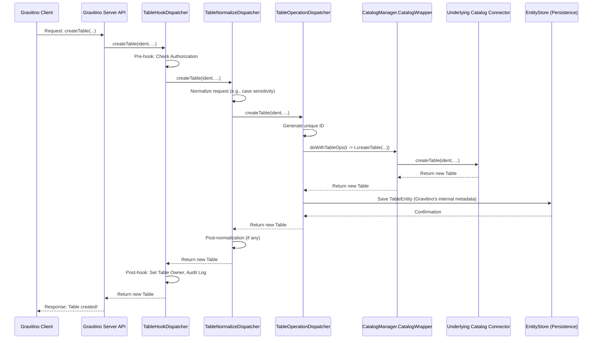

# Chapter 6: Metadata Operation Dispatcher Chain


In the [previous chapter: Metadata Entity Model](05_metadata_entity_model_.md), we explored how Gravitino internally structures and defines all the different types of metadata it manages, using "Entities" for business logic and "POs" for persistence. Now that Gravitino knows *what* its metadata objects are, how does it actually *perform actions* on them? How does it create a new table, alter a schema, or drop a fileset in a structured, consistent, and secure way?

Imagine you're managing a bustling restaurant. Orders come in (metadata operations like "create table"). You can't just shout the order to the chef. There's a process:

1.  **Host/Hostess (Normalize)**: Greets the customer, confirms the order, checks for special requests (like case sensitivity, valid names), and makes sure everything is clear before passing it on.
2.  **Chef (Operation)**: Takes the clear order and actually prepares the meal (executes the core business logic, interacts with the kitchen's pantry/storage).
3.  **Manager (Hook)**: Oversees the whole process. Before the chef starts, the manager checks if the customer has a reservation or if the kitchen is overloaded (pre-operation checks like authorization). After the meal is prepared, the manager might update the inventory or log the sale (post-operation tasks like auditing).

This layered process for handling every single request is exactly what the **Metadata Operation Dispatcher Chain** is in Gravitino.

## What is the Metadata Operation Dispatcher Chain?

The **Metadata Operation Dispatcher Chain** is an abstraction that defines a structured, layered process for handling every metadata operation in Gravitino. It ensures that every request, whether it's creating a table, altering a schema, or loading a fileset, goes through a predictable series of steps.

Think of it as a **series of specialized agents** or a **relay race** for your metadata requests. Each agent (a "dispatcher") has a specific job to do, and once it's done, it passes the request (or the result) to the next agent in the chain.

There are three main types of dispatchers in this chain, each with a distinct role:

### 1. Normalize Dispatchers (`*NormalizeDispatcher`)

*   **Purpose**: These are the "receptionists" or "pre-processors" of the chain. Their job is to standardize and clean up incoming requests before the main work begins. This includes handling things like case sensitivity (e.g., ensuring "My_Table" and "my_table" are treated consistently if the underlying system is case-insensitive), validating names, or converting data formats. This ensures consistency across different underlying systems Gravitino connects to.
*   **Example**: `TableNormalizeDispatcher`, `SchemaNormalizeDispatcher`.
*   **Why it's important**: Different data systems (like Hive, Iceberg, or custom databases) might have different rules for naming, case sensitivity, or property handling. Normalize Dispatchers smooth out these differences, so the core logic doesn't have to deal with them repeatedly.

### 2. Operation Dispatchers (`*OperationDispatcher`)

*   **Purpose**: These are the "workhorses" – they contain the main business logic for performing the actual metadata operation. This is where a `create table` request genuinely results in a table being created, or an `alter schema` request changes a schema. They interact with the core Gravitino components, like the [Metadata Persistence Layer](08_metadata_persistence_layer_.md) and the actual underlying data catalog connectors.
*   **Example**: `TableOperationDispatcher`, `SchemaOperationDispatcher`.
*   **Why it's important**: This layer is where the core functionality resides. It's focused on *what* needs to be done, without worrying about standardization or extra checks.

### 3. Hook Dispatchers (`*HookDispatcher`)

*   **Purpose**: These are the "managers" or "auditors" that wrap the entire process. They execute "hooks" – special actions *before* (pre-hooks) and *after* (post-hooks) the core operation. These actions often involve cross-cutting concerns like security checks (e.g., [Authorization and Access Control](07_authorization_and_access_control_.md)), audit logging, or setting object owners.
*   **Example**: `TableHookDispatcher`, `SchemaHookDispatcher`.
*   **Why it's important**: Hooks ensure that common, vital tasks like security and auditing are applied consistently to *all* operations without cluttering the core business logic. If you need to add a new security check, you can add it as a hook, and it will automatically apply to all relevant operations.

## How a Request Flows Through the Chain (Example: Creating a Table)

Let's trace what happens when your Gravitino client sends a request to create a new table, say `my_new_table`, within a specific schema:

1.  **Your Client Sends Request**: Your application calls `gravitinoClient.createTable(...)`.
2.  **Gravitino Server Receives**: The Gravitino server's API receives this request.
3.  **Entry Point: `TableHookDispatcher`**: The request first enters the `TableHookDispatcher`.
    *   **Pre-Hook**: It might perform initial checks, such as verifying the current user's identity and permissions (e.g., "Is this user allowed to create tables in this schema?").
4.  **Next: `TableNormalizeDispatcher`**: If the pre-hooks pass, the `TableHookDispatcher` passes the request to the `TableNormalizeDispatcher`.
    *   **Standardization**: This dispatcher takes the table name, column definitions, and other properties from your request and normalizes them. For instance, it might convert the table name to lowercase if the underlying catalog is case-insensitive. It also applies any other relevant capabilities or validation specific to the target catalog.
5.  **Next: `TableOperationDispatcher`**: The standardized request is then passed to the `TableOperationDispatcher`.
    *   **Core Logic**: This is where the actual work happens. It performs the core business logic for creating a table:
        *   It generates a unique internal ID for the new table.
        *   It interacts with the specific underlying catalog (e.g., Hive, Iceberg) to create the table there.
        *   It also interacts with Gravitino's [Metadata Persistence Layer](08_metadata_persistence_layer_.md) to store Gravitino's internal metadata about this new table.
6.  **Return to `TableNormalizeDispatcher` (if needed)**: The result (the newly created `Table` object) flows back up. The `TableNormalizeDispatcher` might apply any post-operation normalization if the returned table object needs further standardization to match Gravitino's internal model.
7.  **Return to `TableHookDispatcher`**: Finally, the `TableHookDispatcher` receives the result.
    *   **Post-Hook**: It executes post-operation tasks, such as:
        *   Setting the creating user as the owner of the new table.
        *   Logging the successful table creation for auditing purposes.
8.  **Server Sends Response**: The server then sends the final, processed `Table` object back to your client.

This chain ensures that every table creation follows a consistent path, with proper validation, core logic, and security/auditing applied at the right stages.

## Under the Hood: The Dispatcher Chain in Action

Let's look at a simplified sequence diagram to visualize this flow for creating a table.



### Deeper Dive into the Code (Java)

Gravitino's dispatcher chain is built using a "decorator pattern" or "chain of responsibility" pattern. Each dispatcher takes another dispatcher as input, effectively wrapping it and adding its own logic before or after delegating to the next one.

Let's look at simplified snippets from the Java codebase to see how these dispatchers interact for a `createTable` operation.

#### 1. `TableHookDispatcher`: The Entry and Exit Point

The `TableHookDispatcher` is typically the first and last dispatcher in the chain for a `Table` operation. It handles pre- and post-operation logic like authorization and setting ownership.

```java
// Simplified from core/src/main/java/org/apache/gravitino/hook/TableHookDispatcher.java
public class TableHookDispatcher implements TableDispatcher {
  private final TableDispatcher dispatcher; // Holds the next dispatcher in the chain

  public TableHookDispatcher(TableDispatcher dispatcher) {
    this.dispatcher = dispatcher;
  }

  @Override
  public Table createTable(NameIdentifier ident, Column[] columns, String comment,
      Map<String, String> properties, Transform[] partitions, Distribution distribution,
      SortOrder[] sortOrders, Index[] indexes) {

    // PRE-HOOK: Check if the current user has permission to create tables
    AuthorizationUtils.checkCurrentUser(ident.namespace().level(0), PrincipalUtils.getCurrentUserName());

    // CORE OPERATION: Delegate to the next dispatcher in the chain (often a NormalizeDispatcher)
    Table table = dispatcher.createTable( // This calls the TableNormalizeDispatcher's createTable
        ident, columns, comment, properties, partitions, distribution, sortOrders, indexes);

    // POST-HOOK: Set the creator as the owner of the newly created table
    OwnerDispatcher ownerManager = GravitinoEnv.getInstance().ownerDispatcher();
    if (ownerManager != null) {
      ownerManager.setOwner(ident.namespace().level(0), NameIdentifierUtil.toMetadataObject(ident, Entity.EntityType.TABLE),
          PrincipalUtils.getCurrentUserName(), Owner.Type.USER);
    }
    return table;
  }
  // ... other methods like loadTable, alterTable, dropTable also have hooks ...
}
```
**Explanation:**
*   The `TableHookDispatcher`'s constructor takes another `TableDispatcher` (`dispatcher`). This is how the chain is built.
*   `AuthorizationUtils.checkCurrentUser(...)`: This line represents a **pre-hook**, checking permissions *before* the table creation proceeds.
*   `dispatcher.createTable(...)`: This is the crucial line where the call is delegated to the *next* dispatcher in the chain, which typically would be a `TableNormalizeDispatcher`.
*   `ownerManager.setOwner(...)`: This is a **post-hook**, assigning an owner to the table *after* it has been successfully created.

#### 2. `TableNormalizeDispatcher`: Standardizing the Request

The `TableNormalizeDispatcher` ensures the request conforms to Gravitino's internal standards and the capabilities of the target catalog.

```java
// Simplified from core/src/main/java/org/apache/gravitino/catalog/TableNormalizeDispatcher.java
public class TableNormalizeDispatcher implements TableDispatcher {
  private final CatalogManager catalogManager;
  private final TableDispatcher dispatcher; // Holds the next dispatcher (often an OperationDispatcher)

  public TableNormalizeDispatcher(TableDispatcher dispatcher, CatalogManager catalogManager) {
    this.dispatcher = dispatcher;
    this.catalogManager = catalogManager;
  }

  @Override
  public Table createTable(NameIdentifier ident, Column[] columns, String comment,
      Map<String, String> properties, Transform[] partitions, Distribution distribution,
      SortOrder[] sortOrders, Index[] indexes) {
    // Get the capabilities (e.g., case sensitivity rules) of the specific catalog
    Capability capability = getCapability(ident, catalogManager);

    // Apply normalization based on the catalog's capabilities
    return dispatcher.createTable( // This calls the TableOperationDispatcher's createTable
        applyCapabilities(ident, Capability.Scope.TABLE, capability), // Normalize table name
        applyCapabilities(columns, capability), // Normalize column definitions
        comment,
        properties,
        applyCapabilities(partitions, capability), // Normalize partition definitions
        applyCapabilities(distribution, capability),
        applyCapabilities(sortOrders, capability),
        applyCapabilities(indexes, capability));
  }
  // ... other methods also apply normalization ...
}
```
**Explanation:**
*   The `TableNormalizeDispatcher` also takes a `TableDispatcher` (the `dispatcher`) in its constructor, continuing the chain. It also needs the `CatalogManager` to understand the capabilities of the specific catalog where the table is being created.
*   `getCapability(ident, catalogManager)`: This retrieves the specific rules and limitations of the target catalog (e.g., "this catalog is case-sensitive for table names").
*   `applyCapabilities(...)`: These calls are the core of normalization. They modify the incoming request parameters (like `ident`, `columns`, `partitions`) to comply with the target catalog's rules before passing them to the next dispatcher.

#### 3. `TableOperationDispatcher`: The Core Business Logic

The `TableOperationDispatcher` contains the heart of the table creation logic, interacting with the underlying connector and Gravitino's persistence layer.

```java
// Simplified from core/src/main/java/org/apache/gravitino/catalog/TableOperationDispatcher.java
public class TableOperationDispatcher extends OperationDispatcher implements TableDispatcher {
  // ... constructor and other fields (catalogManager, store, idGenerator) ...

  @Override
  public Table createTable(NameIdentifier ident, Column[] columns, String comment,
      Map<String, String> properties, Transform[] partitions, Distribution distribution,
      SortOrder[] sortOrders, Index[] indexes)
      throws NoSuchSchemaException, TableAlreadyExistsException {

    // 1. (Implicitly) Ensure schema exists by loading it.
    // SchemaDispatcher schemaDispatcher = GravitinoEnv.getInstance().schemaDispatcher(); // simplified
    // schemaDispatcher.loadSchema(NameIdentifier.of(ident.namespace().levels())); // simplified

    // 2. Validate user-provided properties against catalog's metadata.
    // doWithCatalog(getCatalogIdentifier(ident), c -> c.doWithPropertiesMeta(p -> validatePropertyForCreate(...))); // simplified

    // 3. Generate a unique ID for Gravitino's internal tracking
    long uid = idGenerator.nextId();
    StringIdentifier stringId = StringIdentifier.fromId(uid);
    Map<String, String> updatedProperties = StringIdentifier.newPropertiesWithId(stringId, properties);

    // 4. Delegate to the actual underlying catalog connector to create the table
    Table table = doWithCatalog( // This loads the catalog & calls its createTable method
        getCatalogIdentifier(ident),
        c -> c.doWithTableOps(t -> t.createTable(ident, columns, comment, updatedProperties, partitions, distribution, sortOrders, indexes)),
        NoSuchSchemaException.class, TableAlreadyExistsException.class);

    // 5. Create a metadata entity for Gravitino's internal persistence
    AuditInfo audit = AuditInfo.builder().withCreator(PrincipalUtils.getCurrentPrincipal().getName()).withCreateTime(Instant.now()).build();
    List<ColumnEntity> columnEntities = toColumnEntities(columns, audit); // Convert columns to ColumnEntity
    TableEntity tableEntity = TableEntity.builder()
        .withId(uid).withName(ident.name()).withNamespace(ident.namespace())
        .withColumns(columnEntities).withAuditInfo(audit).build();

    // 6. Save the table's metadata in Gravitino's own persistence layer
    try {
      store.put(tableEntity, true); // Persist the TableEntity
    } catch (Exception e) {
      LOG.error("Failed to put table entity to store.", e);
      // Return a partially combined table if persistence fails but catalog operation succeeded
      return EntityCombinedTable.of(table) /* ... with hidden properties ... */;
    }

    // 7. Return the combined table (from catalog and Gravitino's store)
    return EntityCombinedTable.of(table, tableEntity) /* ... with hidden properties ... */;
  }
  // ... other core operation methods ...
}
```
**Explanation:**
*   This dispatcher extends `OperationDispatcher`, which provides helper methods like `doWithCatalog`.
*   `idGenerator.nextId()`: Generates a unique ID for the new table, which is crucial for Gravitino's internal tracking and [Metadata Persistence Layer](08_metadata_persistence_layer_.md).
*   `doWithCatalog(...)`: This powerful helper method (from `OperationDispatcher` and `CatalogManager`) is responsible for:
    *   Loading the correct catalog (e.g., HiveCatalog, IcebergCatalog) for the given table.
    *   Using an isolated class loader (to prevent dependency conflicts).
    *   Calling the actual `createTable` method on that specific `Catalog` instance's `TableCatalog` interface (the `t.createTable(...)` part).
*   `store.put(tableEntity, true)`: After the table is created in the underlying system, Gravitino saves its own [Metadata Entity Model](05_metadata_entity_model_.md) (`TableEntity`) into its [Metadata Persistence Layer](08_metadata_persistence_layer_.md).
*   `EntityCombinedTable.of(table, tableEntity)`: This combines the information from the underlying catalog and Gravitino's internal entity to provide a complete view of the table.

## Conclusion

The **Metadata Operation Dispatcher Chain** is a fundamental architectural pattern in Gravitino that brings order and consistency to how metadata operations are handled. By breaking down complex requests into a series of specialized steps (normalization, core operation, and hooks), Gravitino ensures:

*   **Consistency**: Operations are handled uniformly across different catalogs.
*   **Modularity**: Each type of dispatcher focuses on a single responsibility.
*   **Extensibility**: New features like authorization checks or audit logging can be added easily as hooks without modifying core logic.
*   **Security**: Pre- and post-operation checks are enforced reliably.

This chain acts as a robust backbone, allowing Gravitino to manage diverse metadata operations effectively. In the next chapter, we will delve deeper into **[Authorization and Access Control](07_authorization_and_access_control_.md)**, a crucial cross-cutting concern that is often implemented as a hook within this very dispatcher chain.

[Next Chapter: Authorization and Access Control](07_authorization_and_access_control_.md)

---

Generated by [AI Codebase Knowledge Builder](https://github.com/The-Pocket/Tutorial-Codebase-Knowledge)