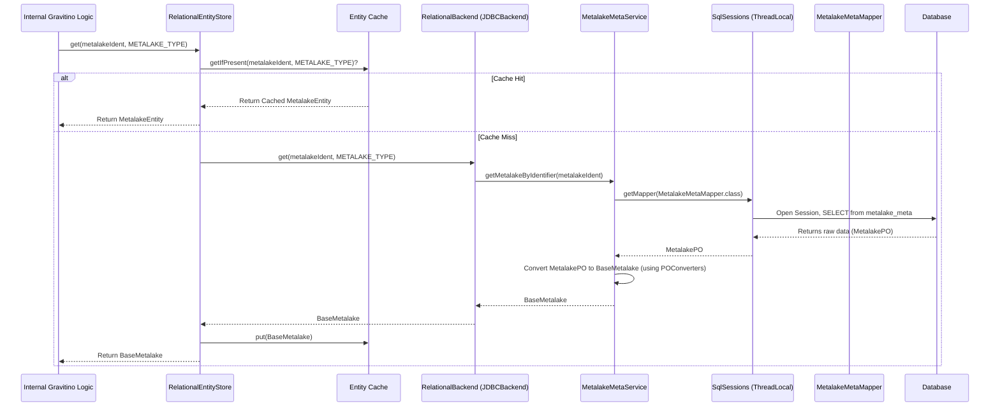

# Chapter 8: Metadata Persistence Layer

In the [previous chapter: Authorization and Access Control](07_authorization_and_access_control_.md), we learned how Gravitino secures your metadata, ensuring only authorized users can perform specific operations. But all the valuable information about metalakes, catalogs, schemas, tables, users, roles, and their permissions needs to be stored somewhere safe and reliably – even if the Gravitino server restarts or experiences an outage. Where does Gravitino keep all these important records?

Imagine Gravitino as a busy government office managing all your country's data assets. This office needs a highly organized, secure, and reliable "National Archives" to store every single document and record. This archive ensures that information is never lost, can be retrieved quickly, and remains consistent, no matter what happens to the daily operations.

This "National Archive" for Gravitino's metadata is precisely what the **Metadata Persistence Layer** is.

## What is the Metadata Persistence Layer?

The **Metadata Persistence Layer** is the part of Gravitino's architecture responsible for **how all of Gravitino's metadata entities are reliably stored and retrieved from a relational database**. It's the mechanism that ensures Gravitino's memory isn't wiped clean when the server shuts down and restarts.

It's like a specialized library management system for all of Gravitino's important records, making sure they are:

*   **Durable**: Saved permanently, surviving server restarts.
*   **Consistent**: Always accurate and reflective of the latest changes.
*   **Accessible**: Can be found and loaded quickly when needed.

This layer deals with the nitty-gritty details of talking to a database, so the rest of Gravitino's system doesn't have to worry about it.

## Key Concepts of the Metadata Persistence Layer

Let's break down the main components that make up this crucial layer:

### 1. `RelationalEntityStore`: The Front Desk

Think of `RelationalEntityStore` as the **head librarian** or the **front desk** of Gravitino's metadata archive. It's the primary interface that other parts of Gravitino (like the [Metadata Operation Dispatcher Chain](06_metadata_operation_dispatcher_chain_.md)) interact with when they need to store, retrieve, update, or delete metadata entities.

It provides generic operations (`get`, `put`, `delete`, `list`) that work for *any* type of Gravitino entity (metalake, table, user, etc.). It also integrates with [Metadata Object Caching](09_metadata_object_caching_.md) for performance.

### 2. `RelationalBackend` (and `JDBCBackend`): The Filing Cabinet

The `RelationalBackend` is an interface that defines *how* to actually perform database operations. The `JDBCBackend` is a concrete implementation of this interface. It's the actual **filing cabinet** where the records are kept.

*   **`JDBCBackend`**: This implementation uses standard Java Database Connectivity (JDBC) to connect to various relational databases. Gravitino supports common databases like H2 (often used for embedded or testing environments), MySQL, and PostgreSQL.
*   The `JDBCBackend` acts as a dispatcher itself, directing requests to the right specialized service based on the type of metadata entity.

### 3. `*MetaService` Classes (e.g., `MetalakeMetaService`, `TableMetaService`): The Specialized Clerks

These are like **specialized clerks** in the archive, each an expert in handling a particular type of record.

*   `MetalakeMetaService`: Knows how to store and retrieve `Metalake` records.
*   `TableMetaService`: Knows the specific steps for handling `Table` records, including associated columns.
*   `UserMetaService`, `RoleMetaService`, `PolicyMetaService`, `FilesetMetaService`, etc.

Each `*MetaService` class contains the business logic for its specific entity type's persistence. They interact with **MyBatis mappers** to perform the actual database commands.

### 4. MyBatis Mappers (e.g., `MetalakeMetaMapper`): The SQL Templates

MyBatis mappers are like **pre-written instruction manuals** for talking to the database. They contain the specific SQL queries needed to interact with the database tables.

*   For example, `MetalakeMetaMapper` would have methods and corresponding SQL for `INSERT INTO metalakes (...)`, `SELECT * FROM metalakes WHERE ...`, etc.
*   These mappers handle the translation between Java objects (specifically, [Persistence-Level Objects (POs)](05_metadata_entity_model_.md)) and the rows/columns in your database tables.

### 5. `SqlSessionFactoryHelper` and `SqlSessions`: The Connection and Transaction Managers

These two components are crucial for managing the underlying database connections and ensuring data integrity.

*   **`SqlSessionFactoryHelper`**: This is the **database connection manager**. It's responsible for setting up and managing a pool of database connections (like `BasicDataSource`). When Gravitino needs to talk to the database, it gets a connection from this factory. It's configured once when Gravitino starts.
*   **`SqlSessions`**: This is the **transaction manager** for individual database operations. It ensures that a sequence of database commands (like inserting a new table and its columns) are treated as a single, atomic unit. If any part of the sequence fails, the entire operation is rolled back (undone), preventing inconsistent data. If everything succeeds, it's committed (saved permanently). `SqlSessions` often uses a `ThreadLocal` mechanism to ensure that each thread has its own dedicated database session, allowing multiple operations to run concurrently without interfering with each other's transactions.

## How Gravitino Stores and Retrieves Metadata: A Use Case

Let's trace a common scenario: when Gravitino needs to **save a new `MetalakeEntity`** to the database and then **retrieve it** later. This process heavily relies on the [Metadata Entity Model](05_metadata_entity_model_.md) and the [Metadata Operation Dispatcher Chain](06_metadata_operation_dispatcher_chain_.md).

### Scenario: Creating and Loading a Metalake

1.  **Client Requests to Create Metalake**: Your Gravitino client calls an API to create a new metalake.
2.  **Dispatcher Chain**: The request goes through the [Metadata Operation Dispatcher Chain](06_metadata_operation_dispatcher_chain_.md), eventually reaching the core logic that needs to persist the `MetalakeEntity`.
3.  **`RelationalEntityStore.put()`**: The core logic calls `relationalEntityStore.put(newMetalakeEntity, false)`.
4.  **`RelationalBackend.insert()`**: `RelationalEntityStore` delegates this call to `relationalBackend.insert(newMetalakeEntity, false)`.
5.  **`*MetaService` Handles**: `JDBCBackend` (our `RelationalBackend`) recognizes it's a `BaseMetalake` entity and calls `MetalakeMetaService.getInstance().insertMetalake(newMetalakeEntity, false)`.
6.  **`POConverters` (Entity to PO)**: Inside `MetalakeMetaService`, the `newMetalakeEntity` (a domain-level `BaseMetalake` object) is converted into a `MetalakePO` (a persistence-level object suitable for the database) using `POConverters`.
7.  **`SqlSessions` and Mapper**: `MetalakeMetaService` uses `SessionUtils.doWithCommit()` (which internally uses `SqlSessions.getMapper()` and `SqlSessions.commitAndCloseSqlSession()`) to get a `MetalakeMetaMapper`. This mapper then executes an `INSERT` SQL statement to save the `MetalakePO` data into the `metalake_meta` database table. The transaction is committed.
8.  **Caching**: `RelationalEntityStore` adds the `newMetalakeEntity` to its [Metadata Object Caching](09_metadata_object_caching_.md) for faster future access.

Now, let's see how Gravitino would retrieve that same metalake:

1.  **Client Requests to Load Metalake**: Your Gravitino client calls an API to load the metalake.
2.  **`RelationalEntityStore.get()`**: The core logic calls `relationalEntityStore.get(metalakeIdentifier, Entity.EntityType.METALAKE, BaseMetalake.class)`.
3.  **Cache Check**: `RelationalEntityStore` first checks its [Metadata Object Caching](09_metadata_object_caching_.md). If the metalake is in the cache, it's returned immediately.
4.  **`RelationalBackend.get()`**: If not in cache, `RelationalEntityStore` delegates to `relationalBackend.get(metalakeIdentifier, Entity.EntityType.METALAKE)`.
5.  **`*MetaService` Retrieves**: `JDBCBackend` calls `MetalakeMetaService.getInstance().getMetalakeByIdentifier(metalakeIdentifier)`.
6.  **`SqlSessions` and Mapper**: `MetalakeMetaService` uses `SessionUtils.getWithoutCommit()` (which uses `SqlSessions.getMapper()` and `SqlSessions.closeSqlSession()`) to get a `MetalakeMetaMapper`. The mapper executes a `SELECT` SQL statement to retrieve the data from the `metalake_meta` table and populates a `MetalakePO`.
7.  **`POConverters` (PO to Entity)**: `MetalakeMetaService` then uses `POConverters` to transform the `MetalakePO` retrieved from the database back into a rich `BaseMetalake` object (our domain-level entity).
8.  **Caching and Return**: `RelationalEntityStore` adds this `BaseMetalake` object to its cache and returns it to the caller.

## Under the Hood: The Persistence Flow

Here's a simplified sequence diagram illustrating the retrieval (`get`) of a metalake, highlighting the core components of the Metadata Persistence Layer:



### Deeper Dive into the Code (Java)

Let's look at some simplified code snippets to understand how these components are implemented.

#### 1. `RelationalEntityStore`: The Entry Point

`RelationalEntityStore` orchestrates caching and delegation to the `RelationalBackend`.

```java
// Simplified: core/src/main/java/org/apache/gravitino/storage/relational/RelationalEntityStore.java
public class RelationalEntityStore implements EntityStore {
  private RelationalBackend backend; // Delegates to the actual backend
  private EntityCache cache; // Manages caching

  @Override
  public void initialize(Config config) throws RuntimeException {
    this.backend = createRelationalEntityBackend(config); // Creates JDBCBackend
    this.cache = CacheFactory.getEntityCache(config); // Initializes cache
    // ... garbage collector starts ...
  }

  @Override
  public <E extends Entity & HasIdentifier> E get(
      NameIdentifier ident, Entity.EntityType entityType, Class<E> e)
      throws NoSuchEntityException, IOException {
    return cache.withCacheLock( // Ensure thread-safe cache access
        () -> {
          Optional<E> entityFromCache = cache.getIfPresent(ident, entityType);
          if (entityFromCache.isPresent()) {
            return entityFromCache.get();
          }
          // If not in cache, get from backend
          E entity = backend.get(ident, entityType);
          cache.put(entity); // Put into cache for future use
          return entity;
        });
  }

  @Override
  public <E extends Entity & HasIdentifier> void put(E e, boolean overwritten)
      throws IOException, EntityAlreadyExistsException {
    backend.insert(e, overwritten); // Delegate to backend for insertion
    cache.put(e); // Put into cache after successful insertion
  }
  // ... other list, update, delete methods that delegate to backend ...
}
```
**Explanation**:
*   The `initialize` method sets up the `backend` (e.g., `JDBCBackend`) and the `cache`.
*   The `get` method first checks the `cache`. If the entity is not found, it calls `backend.get()` to retrieve it from the database, then `cache.put()`s the result, and finally returns it.
*   The `put` method calls `backend.insert()` to save the entity to the database, then `cache.put()`s it.

#### 2. `RelationalBackend` and `JDBCBackend`: The Delegation Hub

`RelationalBackend` is the interface, and `JDBCBackend` implements it, delegating to the right `*MetaService`.

```java
// Simplified: core/src/main/java/org/apache/gravitino/storage/relational/RelationalBackend.java
public interface RelationalBackend extends Closeable {
  // ... initialize, list, exists methods ...
  <E extends Entity & HasIdentifier> void insert(E e, boolean overwritten) throws IOException;
  <E extends Entity & HasIdentifier> E get(NameIdentifier ident, Entity.EntityType entityType) throws IOException;
  // ... update, delete, batch operations ...
}

// Simplified: core/src/main/java/org/apache/gravitino/storage/relational/JDBCBackend.java
public class JDBCBackend implements RelationalBackend {
  private JDBCDatabase jdbcDatabase; // For embedded DB like H2

  @Override
  public void initialize(Config config) {
    jdbcDatabase = startJDBCDatabaseIfNecessary(config); // Starts H2 if configured
    SqlSessionFactoryHelper.getInstance().init(config); // Initializes MyBatis connection factory
    // ... exception converter init ...
  }

  @Override
  public <E extends Entity & HasIdentifier> void insert(E e, boolean overwritten) throws IOException {
    if (e instanceof BaseMetalake) {
      // Delegates to MetalakeMetaService for Metalake entities
      MetalakeMetaService.getInstance().insertMetalake((BaseMetalake) e, overwritten);
    } else if (e instanceof CatalogEntity) {
      // Delegates to CatalogMetaService for Catalog entities
      CatalogMetaService.getInstance().insertCatalog((CatalogEntity) e, overwritten);
    } // ... and so on for other entity types ...
    else { throw new UnsupportedEntityTypeException(...); }
  }

  @Override
  public <E extends Entity & HasIdentifier> E get(NameIdentifier ident, Entity.EntityType entityType) throws IOException {
    switch (entityType) {
      case METALAKE:
        // Delegates to MetalakeMetaService for Metalake entities
        return (E) MetalakeMetaService.getInstance().getMetalakeByIdentifier(ident);
      case CATALOG:
        // Delegates to CatalogMetaService for Catalog entities
        return (E) CatalogMetaService.getInstance().getCatalogByIdentifier(ident);
      // ... and so on for other entity types ...
      default: throw new UnsupportedEntityTypeException(...);
    }
  }
  // ... other methods ...
}
```
**Explanation**:
*   `JDBCBackend`'s `initialize` method is where `SqlSessionFactoryHelper` is initialized, preparing the database connection pool for MyBatis.
*   The `insert` and `get` methods demonstrate a crucial pattern: `JDBCBackend` uses `instanceof` checks (for `insert`) or `switch` statements (for `get`) to determine the type of entity and then delegates the actual work to the specific `*MetaService` responsible for that entity.

#### 3. `MetalakeMetaService`: The Specialized Logic

This service contains the detailed steps for handling `Metalake` entities.

```java
// Simplified: core/src/main/java/org/apache/gravitino/storage/relational/service/MetalakeMetaService.java
public class MetalakeMetaService {
  private static final MetalakeMetaService INSTANCE = new MetalakeMetaService();
  public static MetalakeMetaService getInstance() { return INSTANCE; }

  public void insertMetalake(BaseMetalake baseMetalake, boolean overwrite) throws IOException {
    try {
      // 1. Convert BaseMetalake (Entity) to MetalakePO (Persistence Object)
      MetalakePO po = POConverters.initializeMetalakePOWithVersion(baseMetalake);
      // 2. Use SessionUtils to execute with transaction commit
      SessionUtils.doWithCommit(
          MetalakeMetaMapper.class, // Specify which mapper to use
          mapper -> {
            if (overwrite) {
              mapper.insertMetalakeMetaOnDuplicateKeyUpdate(po);
            } else {
              mapper.insertMetalakeMeta(po);
            }
          });
    } catch (RuntimeException re) { /* ... exception handling ... */ throw re; }
  }

  public BaseMetalake getMetalakeByIdentifier(NameIdentifier ident) {
    MetalakePO metalakePO =
        SessionUtils.getWithoutCommit( // Execute without explicit commit (SELECT)
            MetalakeMetaMapper.class,
            mapper -> mapper.selectMetalakeMetaByName(ident.name())); // Use mapper to get PO
    if (metalakePO == null) { throw new NoSuchEntityException(...); }
    // 3. Convert MetalakePO (Persistence Object) back to BaseMetalake (Entity)
    return POConverters.fromMetalakePO(metalakePO);
  }
  // ... list, update, delete methods ...
}
```
**Explanation**:
*   `insertMetalake` calls `POConverters.initializeMetalakePOWithVersion()` to turn the `BaseMetalake` entity into a `MetalakePO`. It then uses `SessionUtils.doWithCommit()` to ensure the database operation is transactional and calls `mapper.insertMetalakeMeta()` via the `MetalakeMetaMapper`.
*   `getMetalakeByIdentifier` uses `SessionUtils.getWithoutCommit()` to execute a `SELECT` query via `mapper.selectMetalakeMetaByName()`, which returns a `MetalakePO`. This `MetalakePO` is then converted back into a `BaseMetalake` entity using `POConverters.fromMetalakePO()`.

#### 4. `SqlSessionFactoryHelper` and `SqlSessions`: Connection & Transaction Management

These classes manage the underlying JDBC connections and ensure transactional integrity.

```java
// Simplified: core/src/main/java/org/apache/gravitino/storage/relational/session/SqlSessionFactoryHelper.java
public class SqlSessionFactoryHelper {
  private static volatile SqlSessionFactory sqlSessionFactory; // Singleton factory
  public void init(Config config) {
    BasicDataSource dataSource = new BasicDataSource(); // JDBC connection pool
    dataSource.setUrl(config.get(Configs.ENTITY_RELATIONAL_JDBC_BACKEND_URL));
    dataSource.setUsername(config.get(Configs.ENTITY_RELATIONAL_JDBC_BACKEND_USER));
    dataSource.setPassword(config.get(Configs.ENTITY_RELATIONAL_JDBC_BACKEND_PASSWORD));
    dataSource.setDefaultAutoCommit(false); // Crucial for manual transaction control!
    // ... other connection pool settings ...

    TransactionFactory transactionFactory = new JdbcTransactionFactory();
    Environment environment = new Environment("development", transactionFactory, dataSource);
    Configuration configuration = new Configuration(environment);
    // Register all MyBatis mappers
    ServiceLoader.load(MapperPackageProvider.class).forEach(provider -> provider.getMapperClasses().forEach(configuration::addMapper));

    // Build the SqlSessionFactory
    sqlSessionFactory = new SqlSessionFactoryBuilder().build(configuration);
  }
  public SqlSessionFactory getSqlSessionFactory() { return sqlSessionFactory; }
  public void close() { /* ... shutdown dataSource ... */ }
}

// Simplified: core/src/main/java/org/apache/gravitino/storage/relational/session/SqlSessions.java
public final class SqlSessions {
  private static final ThreadLocal<SqlSession> sessions = new ThreadLocal<>(); // One session per thread
  private static final ThreadLocal<AtomicInteger> sessionCount = ThreadLocal.withInitial(() -> new AtomicInteger(0));

  public static SqlSession getSqlSession() {
    SqlSession sqlSession = sessions.get();
    if (sqlSession == null) {
      // Open a new session if none exists for this thread
      sqlSession = SqlSessionFactoryHelper.getInstance().getSqlSessionFactory().openSession(TransactionIsolationLevel.READ_COMMITTED);
      sessions.set(sqlSession);
    }
    sessionCount.get().incrementAndGet(); // Track how many times session is borrowed by nested calls
    return sqlSession;
  }

  public static void commitAndCloseSqlSession() { handleSessionClose(true /* commit */, false); }
  public static void rollbackAndCloseSqlSession() { handleSessionClose(false, true /* rollback */); }
  public static void closeSqlSession() { handleSessionClose(false, false); }

  public static <T> T getMapper(Class<T> className) {
    // getSqlSession() ensures a session is open and managed
    return getSqlSession().getMapper(className);
  }

  private static void handleSessionClose(boolean commit, boolean rollback) {
    SqlSession sqlSession = sessions.get();
    if (sqlSession == null) { return; }

    int count = sessionCount.get().decrementAndGet();
    if (count == 0) { // Only truly close and commit/rollback when no more nested calls
      try { if (commit) { sqlSession.commit(); } else if (rollback) { sqlSession.rollback(); } }
      finally { try { sqlSession.close(); } finally { sessions.remove(); sessionCount.remove(); } }
    }
  }
}
```
**Explanation**:
*   `SqlSessionFactoryHelper.init()`: This is called once at Gravitino startup. It configures a `BasicDataSource` (a connection pool) and sets `defaultAutoCommit(false)`, which is crucial for manually managing transactions. It then uses this to build the `SqlSessionFactory`.
*   `SqlSessions.getSqlSession()`: Each time a database operation is needed on a thread, this method is called. It ensures that a `SqlSession` (representing a database conversation) is created and stored in a `ThreadLocal` for that specific thread. It also tracks the "depth" of nested calls so that the session is only committed/rolled back and closed when the outermost operation is complete.
*   `SqlSessions.commitAndCloseSqlSession()` / `rollbackAndCloseSqlSession()`: These methods are called to finalize the transaction for the current thread's `SqlSession` and release its resources. This ensures "transactional integrity" – either all changes are saved, or none are.

The `SessionUtils.doWithCommit()` and `SessionUtils.getWithoutCommit()` methods (used by `*MetaService` classes) are convenient wrappers around these `SqlSessions` calls, simplifying transactional operations for developers.

## Conclusion

The **Metadata Persistence Layer** is the bedrock of Gravitino's reliability. By meticulously defining how metadata entities are stored and retrieved from relational databases, it guarantees that your valuable data asset information is always durable, consistent, and available. Through the coordinated efforts of the `RelationalEntityStore`, `RelationalBackend`, specialized `*MetaService` classes, MyBatis mappers, and the crucial transaction management provided by `SqlSessionFactoryHelper` and `SqlSessions`, Gravitino builds a robust and trustworthy foundation for its metadata management.

In the next chapter, we will discover how Gravitino further enhances performance by introducing **[Metadata Object Caching](09_metadata_object_caching_.md)**, which works hand-in-hand with this persistence layer to deliver fast metadata access.

[Next Chapter: Metadata Object Caching](09_metadata_object_caching_.md)

---

Generated by [AI Codebase Knowledge Builder](https://github.com/The-Pocket/Tutorial-Codebase-Knowledge)