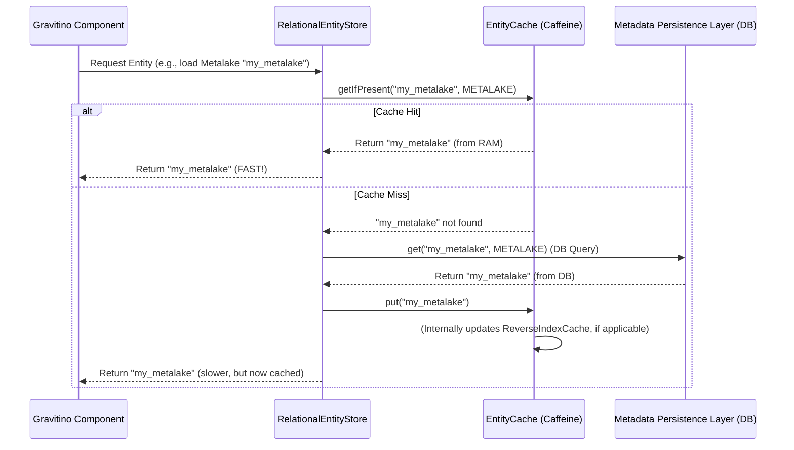

# Chapter 9: Metadata Object Caching

In the [previous chapter: Metadata Persistence Layer](08_metadata_persistence_layer_.md), we learned how Gravitino reliably stores all its important metadata (like metalake, catalog, and table definitions) in a database. This ensures that your data is safe and sound, even if the Gravitino server restarts. But databases, while durable, can be slower to access than computer memory (RAM).

Imagine you're a busy librarian who constantly needs to fetch books. If every time someone asks for a book, you have to run all the way to the archive in the basement, it would take a long time! What if you could keep the most popular or recently accessed books right on your desk for quick access?

This is exactly the problem that **Metadata Object Caching** solves in Gravitino.

## What is Metadata Object Caching?

**Metadata Object Caching** is like Gravitino's "librarian's desk" – a **fast-access temporary storage area in memory (RAM)**. Its main goal is to significantly boost performance by storing frequently used metadata entities (like a specific metalake, a catalog, or a user's permissions) in memory.

By keeping these important bits of information readily available in RAM, Gravitino can:

*   **Respond much faster**: Instead of waiting for a database query every time, it can instantly retrieve data from memory.
*   **Reduce database load**: Fewer requests go to the database, which means the database can focus on other critical tasks and isn't overwhelmed.

This mechanism makes interacting with Gravitino metadata feel snappy and efficient.

## Key Concepts of Metadata Object Caching

Let's explore the core components that make Gravitino's caching system powerful:

### 1. `EntityCache`: The Blueprint for Caching

The `EntityCache` is an interface. Think of it as the **standard contract** or **blueprint** that defines *what* any Gravitino cache should be able to do. It specifies basic caching operations:

*   `getIfPresent`: "Check if this item is on my desk; if yes, give it to me, otherwise tell me it's not here."
*   `put`: "Place this new item on my desk."
*   `invalidate`: "This item is no longer valid, remove it from my desk."

This interface ensures that any caching implementation in Gravitino behaves predictably.

### 2. `CaffeineEntityCache`: The High-Performance Implementation

`CaffeineEntityCache` is Gravitino's default, high-performance implementation of the `EntityCache` blueprint. It uses the popular [Caffeine](https://github.com/ben-manes/caffeine) caching library, known for its speed and efficiency.

`CaffeineEntityCache` comes with smart features:

*   **Size-based Eviction (`EntityCacheWeigher`)**: What happens if the "desk" (memory) gets too full? `CaffeineEntityCache` uses an `EntityCacheWeigher` to decide which items to remove. More important or frequently used items (like Metalakes) are given a higher "weight" and are less likely to be removed than less critical items.
    *   For example, `Metalake` entities might have a weight of 100, `Catalog` entities 75, `Schema` entities 50, and others 15. This prioritizes top-level metadata.
*   **Time-based Expiration**: Items can also be removed if they haven't been accessed for a certain period, or after a specific time has passed since they were written.
*   **Monitoring**: It keeps track of how well the cache is performing (e.g., how many times an item was found versus not found), providing valuable insights.

### 3. `ReverseIndexCache`: Keeping Relationships Consistent

Many metadata entities in Gravitino are related. For example, a `User` entity might be assigned to a `Role` entity, and that `Role` might have privileges on a `Table` entity. If a `Role` is deleted or changed, the `User` entities associated with it should ideally trigger an update or invalidation in the cache to prevent stale data.

The `ReverseIndexCache` handles these complex relationships. It's like a **smart cross-reference system**:

*   If you cache a `User`, the `ReverseIndexCache` might also record that this `User` is connected to certain `Role`s.
*   If a `Role` is updated or removed, `ReverseIndexCache` can quickly find all related `User`s (or other entities) that need to be invalidated from the cache, ensuring data consistency.

This acts like a temporary index that maps "what is affected by what," so when one entity changes, all its related cached items can be consistently updated or removed.

## How Gravitino Uses Caching

As an application developer using Gravitino, you generally won't directly interact with `EntityCache` or `CaffeineEntityCache`. Instead, these caching mechanisms work automatically behind the scenes within the Gravitino server.

For example, when your application asks to load a metalake using the [Gravitino Client Base](01_gravitino_client_base_.md):

```java
// Example: Loading a metalake from Chapter 1
// ...
GravitinoMetalake metalake = client.getMetalake(); // This operation *benefits* from caching!
System.out.println("Successfully connected to metalake: " + metalake.name());
// ...
```

When `client.getMetalake()` is called, the Gravitino server's internal `RelationalEntityStore` (which we discussed in [Chapter 8: Metadata Persistence Layer](08_metadata_persistence_layer_.md)) first checks the `CaffeineEntityCache`. If the metalake information is found there, it's returned almost instantly, making the operation much faster! Only if it's not in the cache will it go to the database.

## Under the Hood: How Caching Works Its Magic

Let's trace what happens when Gravitino needs to load a `Metalake` entity from its internal system, focusing on how caching is involved.

### Step-by-Step Walkthrough (Loading a Metalake)

1.  **Internal Request**: Some internal Gravitino component (e.g., from the [Metadata Operation Dispatcher Chain](06_metadata_operation_dispatcher_chain_.md)) requests a specific `Metalake` entity.
2.  **`RelationalEntityStore` Receives**: The request goes to the `RelationalEntityStore` (the "head librarian").
3.  **Cache Check**: The `RelationalEntityStore` first asks the `CaffeineEntityCache`: "Do you have the `Metalake` with this name (`getIfPresent`)?"
4.  **Cache Hit (Fast Path)**:
    *   If `CaffeineEntityCache` finds the `Metalake` entity in memory, it immediately returns it to the `RelationalEntityStore`.
    *   The `RelationalEntityStore` then quickly returns the entity to the requesting component. This is the **performance boost** in action!
5.  **Cache Miss (Slower Path)**:
    *   If `CaffeineEntityCache` *doesn't* find the `Metalake` entity, it reports a "miss" to the `RelationalEntityStore`.
    *   The `RelationalEntityStore` then falls back to its normal process: it goes to the actual [Metadata Persistence Layer](08_metadata_persistence_layer_.md) and fetches the `Metalake` from the database.
    *   Once retrieved from the database, `RelationalEntityStore` calls `put()` on the `CaffeineEntityCache` to store this `Metalake` in memory for future, faster access.
    *   If this `Metalake` (or any other entity) has relationships (e.g., a `User` in this `Metalake` is linked to a `Role`), the `ReverseIndexCache` is updated to reflect these connections, ensuring consistency during future invalidations.
    *   Finally, the `RelationalEntityStore` returns the `Metalake` entity to the requesting component.

Here's a simplified sequence diagram:



### Deeper Dive into the Code (Java)

Let's look at simplified snippets from the Gravitino codebase that illustrate these concepts.

#### 1. The `EntityCache` Interface

This interface defines the core caching operations.

```java
// File: core/src/main/java/org/apache/gravitino/cache/EntityCache.java
public interface EntityCache extends SupportsEntityStoreCache, SupportsRelationEntityCache {
  // Retrieves an entity from the cache if it exists (like "getIfPresent")
  <E extends Entity & HasIdentifier> Optional<E> getIfPresent(
      NameIdentifier ident, Entity.EntityType type);

  // Invalidates a cache entry (removes it)
  boolean invalidate(NameIdentifier ident, Entity.EntityType type);

  // Puts an entity into the cache
  <E extends Entity & HasIdentifier> void put(E entity);

  // ... methods for relation caching, clearing, size, and locking ...
}
```
**Explanation**: This shows the fundamental methods any cache needs. `getIfPresent`, `invalidate`, and `put` are the core actions. The `SupportsRelationEntityCache` part extends it to handle lists of related entities, which `CaffeineEntityCache` implements.

#### 2. `CaffeineEntityCache` Configuration

The constructor of `CaffeineEntityCache` sets up the Caffeine cache with its advanced features.

```java
// File: core/src/main/java/org/apache/gravitino/cache/CaffeineEntityCache.java (simplified)
public class CaffeineEntityCache extends BaseEntityCache {
  private final Cache<EntityCacheRelationKey, List<Entity>> cacheData; // The actual Caffeine cache

  public CaffeineEntityCache(Config cacheConfig) {
    super(cacheConfig); // Basic configuration

    Caffeine<Object, Object> builder = Caffeine.newBuilder();

    // Enable size-based eviction using our custom weigher
    if (cacheConfig.get(Configs.CACHE_WEIGHER_ENABLED)) {
      builder.maximumWeight(EntityCacheWeigher.getMaxWeight());
      builder.weigher(EntityCacheWeigher.getInstance());
    } else {
      builder.maximumSize(cacheConfig.get(Configs.CACHE_MAX_ENTRIES));
    }

    // Enable time-based expiration
    if (cacheConfig.get(Configs.CACHE_EXPIRATION_TIME) > 0) {
      builder.expireAfterWrite(
          cacheConfig.get(Configs.CACHE_EXPIRATION_TIME), TimeUnit.MILLISECONDS);
    }

    // Enable cache statistics for monitoring
    if (cacheConfig.get(Configs.CACHE_STATS_ENABLED)) {
      builder.recordStats();
      startCacheStatsMonitor(); // Starts a scheduler to log stats
    }

    this.cacheData = builder.build(); // Build the Caffeine cache!
  }
  // ... other methods ...
}
```
**Explanation**: This snippet demonstrates how `CaffeineEntityCache` uses configuration to enable `EntityCacheWeigher` for intelligent size management, sets expiration times, and turns on performance monitoring. The `builder.build()` call constructs the actual in-memory cache.

#### 3. `EntityCacheWeigher`: Prioritizing Cached Items

The `EntityCacheWeigher` assigns a "weight" to each entity based on its type, influencing what gets evicted when the cache is full.

```java
// File: core/src/main/java/org/apache/gravitino/cache/EntityCacheWeigher.java (simplified)
public class EntityCacheWeigher implements Weigher<EntityCacheKey, List<Entity>> {
  public static final int METALAKE_WEIGHT = 100; // Highest priority
  public static final int CATALOG_WEIGHT = 75;
  public static final int SCHEMA_WEIGHT = 50;
  public static final int OTHER_WEIGHT = 15; // Lowest priority

  private static final Map<Entity.EntityType, Integer> ENTITY_WEIGHTS =
      ImmutableMap.of(
          Entity.EntityType.METALAKE, METALAKE_WEIGHT,
          Entity.EntityType.CATALOG, CATALOG_WEIGHT,
          Entity.EntityType.SCHEMA, SCHEMA_WEIGHT);

  @Override
  public @NonNegative int weigh(
      @NonNull EntityCacheKey storeEntityCacheKey, @NonNull List<Entity> entities) {
    int weight = 0;
    for (Entity entity : entities) {
      // Calculate weight based on entity type
      weight += ENTITY_WEIGHTS.getOrDefault(entity.type(), OTHER_WEIGHT);
    }
    return weight;
  }
}
```
**Explanation**: This `weigher` ensures that larger or more important entities (like Metalakes) consume more "weight" in the cache. When the cache reaches its `maximumWeight`, Caffeine will evict items with lower weights first.

#### 4. `ReverseIndexCache`: Managing Entity Relationships

The `ReverseIndexCache` helps maintain consistency by tracking relationships and enabling efficient invalidation of dependent entities.

```java
// File: core/src/main/java/org/apache/gravitino/cache/ReverseIndexCache.java (simplified)
public class ReverseIndexCache {
  private RadixTree<EntityCacheKey> reverseIndex; // Stores key relationships

  private final Map<Class<? extends Entity>, ReverseIndexRule> reverseIndexRules = new HashMap<>();

  public ReverseIndexCache() {
    this.reverseIndex = new ConcurrentRadixTree<>(new DefaultCharArrayNodeFactory());
    // Register rules for how different entity types affect others
    registerReverseRule(UserEntity.class, ReverseIndexRules.USER_REVERSE_RULE);
    registerReverseRule(GroupEntity.class, ReverseIndexRules.GROUP_REVERSE_RULE);
    registerReverseRule(RoleEntity.class, ReverseIndexRules.ROLE_REVERSE_RULE);
  }

  // Method to add an entity and its relations to the reverse index
  public void indexEntity(Entity entity, EntityCacheRelationKey key) {
    ReverseIndexRule rule = reverseIndexRules.get(entity.getClass());
    if (rule != null) {
      // Execute the specific rule for this entity type
      rule.indexEntity(entity, key, this);
    }
  }

  // Functional interface for defining a reverse indexing rule
  @FunctionalInterface
  interface ReverseIndexRule {
    void indexEntity(Entity entity, EntityCacheRelationKey key, ReverseIndexCache cache);
  }
  // ... methods for removing, getting keys, etc. ...
}

// File: core/src/main/java/org/apache/gravitino/cache/ReverseIndexRules.java (simplified for example)
public class ReverseIndexRules {
  public static final ReverseIndexCache.ReverseIndexRule USER_REVERSE_RULE =
      (entity, key, reverseIndexCache) -> {
        UserEntity userEntity = (UserEntity) entity;
        if (userEntity.roleNames() != null) {
          userEntity
              .roleNames()
              .forEach(
                  role -> {
                    // If a User is assigned to a Role, index the Role -> User relationship
                    NameIdentifier roleIdent = NameIdentifier.ofRole(userEntity.namespace().level(0), role);
                    reverseIndexCache.put(roleIdent, Entity.EntityType.ROLE, key); // Key points back to the User
                  });
        }
      };
}
```
**Explanation**: When an entity (like a `UserEntity`) is put into the main cache, `indexEntity` is called. It looks up the specific `ReverseIndexRule` for `UserEntity`. The `USER_REVERSE_RULE` then identifies all roles the user belongs to and adds entries to the `reverseIndexCache`. These entries essentially say: "If Role X changes, it might affect User Y (identified by `key`)." This allows for cascading invalidation later.

#### 5. `CaffeineEntityCache.invalidateOnKeyChange()`: Cascading Invalidation

This method in `CaffeineEntityCache` uses the `ReverseIndexCache` to perform smart invalidations when an entity changes.

```java
// File: core/src/main/java/org/apache/gravitino/cache/CaffeineEntityCache.java (simplified)
@Override
public <E extends Entity & HasIdentifier> void invalidateOnKeyChange(E entity) {
  // If inserting a ModelVersion, invalidate the corresponding Model entry
  if (Objects.requireNonNull(entity.type()) == Entity.EntityType.MODEL_VERSION) {
    NameIdentifier modelIdent = ((ModelVersionEntity) entity).modelIdentifier();
    invalidate(modelIdent, Entity.EntityType.MODEL); // Invalidate the parent Model
  }

  // The logic below (simplified from the actual code) would use ReverseIndexCache
  // to find and invalidate other dependent entities based on their relationships.
  // This ensures consistency across related cached items.
  // E.g., if a Role is updated, find all Users associated with it via ReverseIndexCache
  // and invalidate those User entries too.
  // List<EntityCacheKey> keysToInvalidate = reverseIndex.getRelatedKeys(entity.nameIdentifier());
  // keysToInvalidate.forEach(k -> invalidate(k.identifier(), k.entityType()));
}
```
**Explanation**: When an entity is changed or inserted (`put`), `invalidateOnKeyChange` is called. It checks for specific cases (like `ModelVersion` affecting its parent `Model`). More generally (though simplified here), it would consult the `ReverseIndexCache` to find all other entities whose cached data might become stale due to this change and then `invalidate` them, ensuring data consistency.

## Conclusion

**Metadata Object Caching** is a critical performance component in Gravitino. By strategically storing frequently accessed metadata in memory and leveraging advanced features like size-based eviction and reverse indexing, Gravitino provides extremely fast access to metadata while maintaining data consistency. This mechanism significantly reduces latency and load on the [Metadata Persistence Layer](08_metadata_persistence_layer_.md), creating a more responsive and efficient metadata management system.

In the next chapter, we will learn about the **[Metadata Event Dispatcher](10_metadata_event_dispatcher_.md)**, which describes how Gravitino reacts to changes and notifies other parts of the system when metadata operations occur.

[Next Chapter: Metadata Event Dispatcher](10_metadata_event_dispatcher_.md)

---

Generated by [AI Codebase Knowledge Builder](https://github.com/The-Pocket/Tutorial-Codebase-Knowledge)