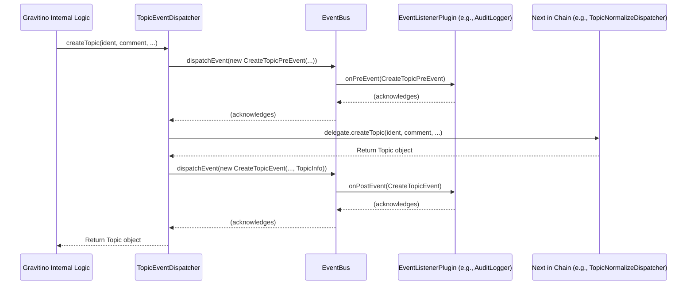

# Chapter 10: Metadata Event Dispatcher

In the [previous chapter: Metadata Object Caching](09_metadata_object_caching_.md), we explored how Gravitino boosts performance by keeping frequently accessed metadata in a fast-access memory cache. This makes retrieving information incredibly quick. But what happens when that information *changes*? How does Gravitino ensure that other parts of the system – or even external applications – are aware of significant updates, creations, or deletions of metadata?

Imagine Gravitino as the central brain managing all your company's data blueprints. If you create a new data table, alter a schema, or delete a crucial dataset, many different organs might need to know:
*   An **auditing system** needs to record who did what and when.
*   A **data quality tool** might need to rescan a table after it's altered.
*   An **internal dashboard** might need to update its display of available datasets.

Constantly checking for changes would be inefficient. Instead, we need a way for Gravitino to automatically *announce* these important events. This "announcement system" is precisely what the **Metadata Event Dispatcher** provides.

## What is the Metadata Event Dispatcher?

The **Metadata Event Dispatcher** is like the **central nervous system** for Gravitino's metadata operations. Whenever something important happens to a metadata entity (like creating a catalog, altering a schema, or deleting a model), this system makes sure that all relevant "listeners" are notified.

Think of it as a **post office for metadata changes**:
1.  **Something happens** (an "event," like "Table X was created").
2.  Gravitino's internal system creates an **event message** (like a postcard describing the event).
3.  The **Event Dispatcher** (the post office) takes this message and makes sure all interested parties (the "listeners") receive a copy, either immediately or soon after.

This ensures that any component or application interested in metadata changes can react accordingly, without having to constantly ask Gravitino "Has anything changed?".

## Key Concepts of the Metadata Event Dispatcher

Let's break down the essential ideas behind this important system:

### 1. Events

An **Event** is a simple message that describes a significant occurrence. In Gravitino, events are plain data objects that carry information about what just happened.

Examples of events include:
*   `CreateMetalakeEvent`: Fired after a metalake is successfully created.
*   `AlterTableEvent`: Fired after a table's properties are successfully changed.
*   `DeleteFilesetEvent`: Fired after a fileset is successfully deleted.
*   `CreateSchemaFailureEvent`: Fired if an attempt to create a schema fails.

There are generally two types of events for most operations:
*   **Pre-Events**: Fired *before* an operation is attempted (e.g., `CreateMetalakePreEvent`). These can sometimes be used to halt an operation if certain conditions aren't met.
*   **Post-Events**: Fired *after* an operation has completed, either successfully (e.g., `CreateMetalakeEvent`) or with a failure (e.g., `CreateMetalakeFailureEvent`).

### 2. `EventBus`

The `EventBus` is the **central hub** or the "post office manager" of the Event Dispatcher system. Its job is to:
*   Receive all event messages from various parts of Gravitino.
*   Efficiently deliver these messages to all registered `EventListenerPlugin`s.
*   It handles both synchronous (immediate) and asynchronous (background) delivery of events.

### 3. `EventListenerPlugin`

An `EventListenerPlugin` is an "interested party" or a "subscriber." These are components (internal to Gravitino or custom extensions) that **register** with the `EventBus` to receive specific types of events.

For example, an `AuditLogger` `EventListenerPlugin` would subscribe to all `Create`, `Alter`, and `Delete` events to record them. When a `CreateMetalakeEvent` is dispatched, the `AuditLogger` would receive it and log the details.

### 4. `*EventDispatcher` (e.g., `TableEventDispatcher`)

These are specialized components that sit at the beginning of the [Metadata Operation Dispatcher Chain](06_metadata_operation_dispatcher_chain_.md) for each type of metadata entity (Metalake, Catalog, Schema, Table, Fileset, Topic, Model). Their role is to:
*   **Intercept** an operation request (e.g., `createTable`).
*   **Dispatch a Pre-Event** to the `EventBus` *before* the core operation.
*   **Delegate** the actual operation to the next dispatcher in the chain.
*   **Dispatch a Post-Event** (success or failure) to the `EventBus` *after* the core operation completes.

They act as the "event reporters" for their respective metadata entities.

## How to Use the Metadata Event Dispatcher (Conceptual)

As a regular user interacting with Gravitino via its client, you don't directly "dispatch" events. Instead, you perform standard operations, and the Gravitino server automatically generates and dispatches the relevant events behind the scenes.

For instance, if you create a new table:

```java
// Your application code using GravitinoClient
// ...
gravitinoClient.createTable(
    metalakeName,
    catalogName,
    schemaName,
    tableName,
    columns,
    comment,
    properties,
    partitions,
    distribution,
    sortOrders,
    indexes
);
// ...
System.out.println("Table created successfully! Events were dispatched internally.");
```

When this `createTable` method is called, the Gravitino server will automatically:
1.  Dispatch a `CreateTablePreEvent`.
2.  Perform the actual table creation (which involves the [Metadata Operation Dispatcher Chain](06_metadata_operation_dispatcher_chain_.md) and [Metadata Persistence Layer](08_metadata_persistence_layer_.md)).
3.  If successful, dispatch a `CreateTableEvent`.
4.  If it fails, dispatch a `CreateTableFailureEvent`.

From an **administrator or extensibility perspective**, the "use" case involves *implementing and configuring `EventListenerPlugin`s*. For example, you might write a custom plugin to:
*   Send a notification to a messaging queue whenever a `Metalake` is created.
*   Log detailed access patterns for auditing whenever a `LoadTableEvent` occurs.

By implementing your own `EventListenerPlugin` and registering it with Gravitino, you can react to these events without modifying Gravitino's core code.

## Under the Hood: Event Dispatcher in Action

Let's trace what happens when an internal Gravitino component calls `createTopic` (e.g., to create a streaming topic). This illustrates how an `*EventDispatcher` wraps the core operation and uses the `EventBus`.

### Step-by-Step Walkthrough

1.  **Internal Gravitino Logic Calls**: An internal component requests `topicDispatcher.createTopic(...)`. This `topicDispatcher` is actually an instance of `TopicEventDispatcher`.
2.  **`TopicEventDispatcher` Intercepts**: The `TopicEventDispatcher` receives the `createTopic` call.
3.  **Dispatch Pre-Event**: It immediately creates a `CreateTopicPreEvent` object (containing details about the requested topic) and sends it to the `EventBus`.
4.  **`EventBus` Notifies Listeners**: The `EventBus` then takes this `CreateTopicPreEvent` and delivers it to all registered `EventListenerPlugin`s that are interested in pre-events. An auditing plugin, for example, might log the *attempt* to create a topic.
5.  **Delegate Core Operation**: The `TopicEventDispatcher` then calls the `createTopic` method on the *next* dispatcher in its chain (which could be a `TopicNormalizeDispatcher`, then a `TopicHookDispatcher`, and finally `TopicOperationDispatcher`). This is where the actual work of creating the topic in the underlying system and persisting its metadata happens.
6.  **Operation Completes (Success/Failure)**: The core `createTopic` operation either succeeds or throws an exception.
7.  **Dispatch Post-Event**:
    *   **If successful**: The `TopicEventDispatcher` creates a `CreateTopicEvent` (including details of the successfully created topic) and sends it to the `EventBus`.
    *   **If failed**: The `TopicEventDispatcher` catches the exception, creates a `CreateTopicFailureEvent` (including the error details), and sends it to the `EventBus`.
8.  **`EventBus` Notifies Listeners**: The `EventBus` delivers this post-event to all relevant `EventListenerPlugin`s. The auditing plugin would record the success or failure, and perhaps a monitoring plugin would update a metric.
9.  **Return Result**: The `TopicEventDispatcher` returns the result (the created `Topic` object or re-throws the exception) to the original caller.

Here's a simplified sequence diagram for a successful topic creation:



### Deeper Dive into the Code (Java)

Let's look at simplified snippets from the Gravitino codebase to see how this event dispatching mechanism is implemented.

#### 1. `GravitinoEnv.java`: Wiring Up the Event Dispatchers

The `GravitinoEnv` class (Gravitino's environment setup) is where the `EventBus` is created and where all the `*EventDispatcher`s are linked into the [Metadata Operation Dispatcher Chain](06_metadata_operation_dispatcher_chain_.md). Notice they are usually the *first* dispatcher in the chain.

```java
// Simplified: core/src/main/java/org/apache/gravitino/GravitinoEnv.java
public class GravitinoEnv {
  // ... fields ...
  private EventBus eventBus; // The central event bus

  // ... initialization methods ...

  private void initBaseComponents() {
    // ... other initializations ...
    this.eventListenerManager = new EventListenerManager();
    eventListenerManager.init(
        config.getConfigsWithPrefix(EventListenerManager.GRAVITINO_EVENT_LISTENER_PREFIX));
    this.eventBus = eventListenerManager.createEventBus(); // EventBus is created here
    // ...
  }

  private void initGravitinoServerComponents() {
    // ... other initializations ...

    // Metalake operation chain: MetalakeEventDispatcher -> MetalakeNormalizeDispatcher -> MetalakeHookDispatcher -> MetalakeManager
    MetalakeManager metalakeManager = new MetalakeManager(entityStore, idGenerator);
    MetalakeHookDispatcher metalakeHookDispatcher = new MetalakeHookDispatcher(metalakeManager);
    MetalakeNormalizeDispatcher metalakeNormalizeDispatcher =
        new MetalakeNormalizeDispatcher(metalakeHookDispatcher);
    this.metalakeDispatcher = new MetalakeEventDispatcher(eventBus, metalakeNormalizeDispatcher); // EventDispatcher first!

    // Fileset operation chain: FilesetEventDispatcher -> FilesetHookDispatcher -> FilesetNormalizeDispatcher -> FilesetOperationDispatcher
    FilesetOperationDispatcher filesetOperationDispatcher =
        new FilesetOperationDispatcher(catalogManager, entityStore, idGenerator);
    FilesetHookDispatcher filesetHookDispatcher =
        new FilesetHookDispatcher(filesetOperationDispatcher);
    FilesetNormalizeDispatcher filesetNormalizeDispatcher =
        new FilesetNormalizeDispatcher(filesetHookDispatcher, catalogManager);
    this.filesetDispatcher = new FilesetEventDispatcher(eventBus, filesetNormalizeDispatcher); // EventDispatcher first!

    // Topic operation chain: TopicEventDispatcher -> TopicHookDispatcher -> TopicNormalizeDispatcher -> TopicOperationDispatcher
    TopicOperationDispatcher topicOperationDispatcher =
        new TopicOperationDispatcher(catalogManager, entityStore, idGenerator);
    TopicHookDispatcher topicHookDispatcher = new TopicHookDispatcher(topicOperationDispatcher);
    TopicNormalizeDispatcher topicNormalizeDispatcher =
        new TopicNormalizeDispatcher(topicHookDispatcher, catalogManager);
    this.topicDispatcher = new TopicEventDispatcher(eventBus, topicNormalizeDispatcher); // EventDispatcher first!

    // ... similar for Catalog, Schema, Table, Model, AccessControl ...
  }
}
```
**Explanation**: `GravitinoEnv` first creates the `EventBus` (which manages event listeners). Then, for each type of metadata entity (like `Metalake`, `Fileset`, `Topic`), it constructs its operation chain. Crucially, the `*EventDispatcher` (e.g., `MetalakeEventDispatcher`) is placed at the very beginning of the chain, wrapping the subsequent normalization, hook, and operation dispatchers. This ensures that every operation passes through the event dispatcher first.

#### 2. `EventBus.java`: The Central Dispatcher

This class is responsible for receiving events and passing them to the appropriate listeners.

```java
// Simplified: core/src/main/java/org/apache/gravitino/listener/EventBus.java
public class EventBus {
  private final List<EventListenerPlugin> eventListeners; // Registered listeners

  public EventBus(List<EventListenerPlugin> eventListeners) {
    this.eventListeners = eventListeners;
    // ... async queue setup ...
  }

  public Optional<BaseEvent> dispatchEvent(BaseEvent baseEvent) {
    if (baseEvent instanceof PreEvent) {
      // Handles pre-events, potentially transforming them
      return dispatchAndTransformPreEvent((PreEvent) baseEvent);
    } else if (baseEvent instanceof Event) {
      // Handles post-events
      dispatchPostEvent((Event) baseEvent);
      return Optional.empty();
    } else {
      throw new RuntimeException("Unknown event type:" + baseEvent.getClass().getSimpleName());
    }
  }

  private void dispatchPostEvent(Event postEvent) {
    // Calls onPostEvent for every registered listener
    eventListeners.forEach(eventListener -> eventListener.onPostEvent(postEvent));
  }

  private Optional<BaseEvent> dispatchAndTransformPreEvent(PreEvent originalEvent) {
    // Calls onPreEvent for every registered listener
    eventListeners.forEach(eventListener -> eventListener.onPreEvent(originalEvent));
    // ... logic for transforming pre-events ...
    return Optional.of(originalEvent); // Return potentially transformed event
  }
}
```
**Explanation**: The `dispatchEvent` method is the heart of the `EventBus`. It determines if an event is a `PreEvent` or a `PostEvent` and then calls the respective `dispatchAndTransformPreEvent` or `dispatchPostEvent` method. These methods then iterate through all registered `eventListeners` and invoke their `onPreEvent` or `onPostEvent` methods.

#### 3. `TopicEventDispatcher.java`: Reporting Events for Topic Operations

Let's look at a concrete example: how `TopicEventDispatcher` reports events for `createTopic`.

```java
// Simplified: core/src/main/java/org/apache/gravitino/listener/TopicEventDispatcher.java
public class TopicEventDispatcher implements TopicDispatcher {
  private final EventBus eventBus;
  private final TopicDispatcher dispatcher; // The next dispatcher in the chain

  public TopicEventDispatcher(EventBus eventBus, TopicDispatcher dispatcher) {
    this.eventBus = eventBus;
    this.dispatcher = dispatcher;
  }

  @Override
  public Topic createTopic(
      NameIdentifier ident, String comment, DataLayout dataLayout, Map<String, String> properties)
      throws NoSuchTopicException, TopicAlreadyExistsException {

    // 1. Prepare event data and dispatch the PRE-EVENT
    TopicInfo createTopicRequest = new TopicInfo(ident.name(), comment, properties, null);
    eventBus.dispatchEvent(
        new CreateTopicPreEvent(PrincipalUtils.getCurrentUserName(), ident, createTopicRequest));
    try {
      // 2. Delegate the actual topic creation to the next dispatcher
      Topic topic = dispatcher.createTopic(ident, comment, dataLayout, properties);
      
      // 3. Dispatch the SUCCESS POST-EVENT
      eventBus.dispatchEvent(
          new CreateTopicEvent(PrincipalUtils.getCurrentUserName(), ident, new TopicInfo(topic)));
      return topic;
    } catch (Exception e) {
      // 4. If an exception occurs, dispatch the FAILURE POST-EVENT
      eventBus.dispatchEvent(
          new CreateTopicFailureEvent(
              PrincipalUtils.getCurrentUserName(), ident, e, createTopicRequest));
      throw e; // Re-throw the exception to the original caller
    }
  }

  @Override
  public boolean dropTopic(NameIdentifier ident) {
    // Similar pattern:
    eventBus.dispatchEvent(new DropTopicPreEvent(PrincipalUtils.getCurrentUserName(), ident));
    try {
      boolean isExists = dispatcher.dropTopic(ident); // Delegate
      eventBus.dispatchEvent(
          new DropTopicEvent(PrincipalUtils.getCurrentUserName(), ident, isExists)); // Success event
      return isExists;
    } catch (Exception e) {
      eventBus.dispatchEvent(
          new DropTopicFailureEvent(PrincipalUtils.getCurrentUserName(), ident, e)); // Failure event
      throw e;
    }
  }
  // ... other topic operations (alterTopic, loadTopic, listTopics) follow a similar pattern ...
}
```
**Explanation**:
*   The `TopicEventDispatcher` wraps another `TopicDispatcher` (the `dispatcher` field), which represents the rest of the processing chain.
*   For `createTopic`, it first dispatches a `CreateTopicPreEvent` to the `eventBus`.
*   Then, it calls `dispatcher.createTopic(...)` to perform the actual operation.
*   If the operation succeeds, it dispatches a `CreateTopicEvent`.
*   If an `Exception` occurs, it catches it, dispatches a `CreateTopicFailureEvent` (including the exception details), and then re-throws the exception so the original caller is informed.
*   Other methods like `dropTopic` follow the same `PreEvent -> Delegate -> PostEvent (success/failure)` pattern.

This structure is repeated across all `*EventDispatcher` classes (e.g., `MetalakeEventDispatcher`, `SchemaEventDispatcher`, `TableEventDispatcher`, `FilesetEventDispatcher`, `ModelEventDispatcher`, `CatalogEventDispatcher`), ensuring that every significant metadata operation consistently triggers corresponding events.

## Conclusion

The **Metadata Event Dispatcher** is Gravitino's robust mechanism for communicating significant metadata changes throughout the system. By leveraging **Events**, a central **`EventBus`**, and specialized **`*EventDispatcher`s** within the [Metadata Operation Dispatcher Chain](06_metadata_operation_dispatcher_chain_.md), Gravitino ensures that all interested parties (`EventListenerPlugin`s) are reliably notified of operations, their outcomes, and their details. This creates a highly reactive, extensible, and auditable metadata management system, empowering developers and administrators to build sophisticated workflows and monitoring solutions on top of Gravitino.

This completes our exploration of Gravitino's core infrastructure concepts.

---

Generated by [AI Codebase Knowledge Builder](https://github.com/The-Pocket/Tutorial-Codebase-Knowledge)