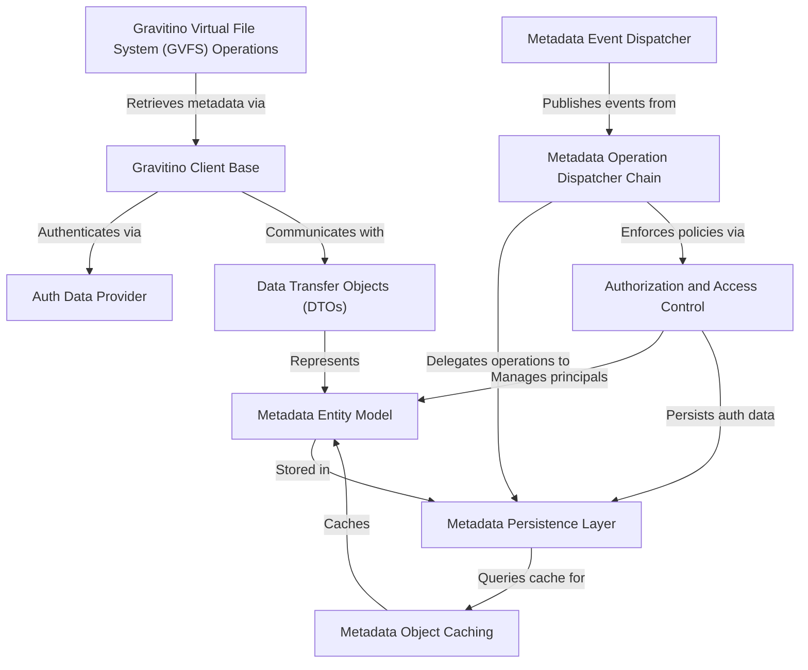

# Tutorial: gravitino

Gravitino is a **metadata management platform** that acts as a *unified gateway* for diverse data sources. It allows users to manage and access metadata entities like catalogs, schemas, and tables across different storage systems, providing **consistent access control**, *performance optimizations*, and **event-driven notifications** for metadata changes.

**Source Repository:** [None](None)

## Chapters

1. [Gravitino Client Base
](01_gravitino_client_base_.md)
2. [Gravitino Virtual File System (GVFS) Operations
](02_gravitino_virtual_file_system__gvfs__operations_.md)
3. [Auth Data Provider
](03_auth_data_provider_.md)
4. [Data Transfer Objects (DTOs)
](04_data_transfer_objects__dtos__.md)
5. [Metadata Entity Model
](05_metadata_entity_model_.md)
6. [Metadata Operation Dispatcher Chain
](06_metadata_operation_dispatcher_chain_.md)
7. [Authorization and Access Control
](07_authorization_and_access_control_.md)
8. [Metadata Persistence Layer
](08_metadata_persistence_layer_.md)
9. [Metadata Object Caching
](09_metadata_object_caching_.md)
10. [Metadata Event Dispatcher
](10_metadata_event_dispatcher_.md)

---

Generated by [AI Codebase Knowledge Builder](https://github.com/The-Pocket/Tutorial-Codebase-Knowledge)