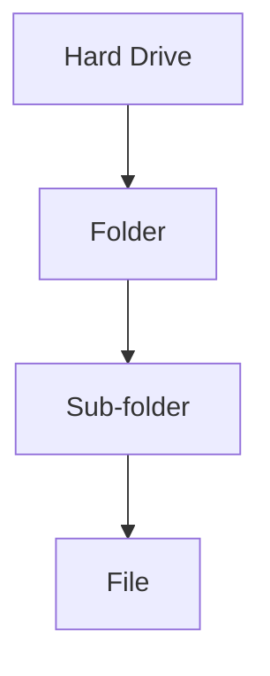
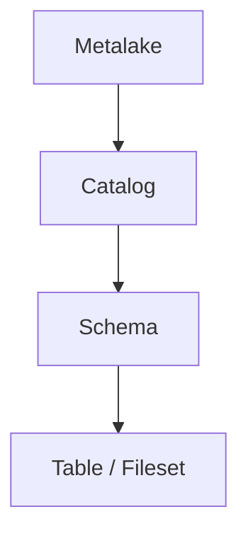
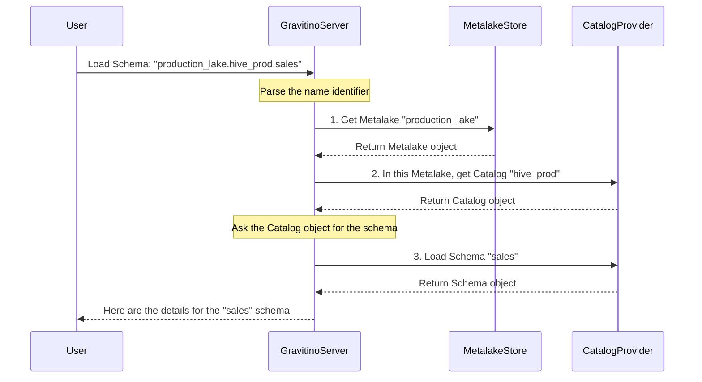

# Chapter 1: Entity Hierarchy

Welcome to the Gravitino tutorial! If you've ever felt overwhelmed trying to manage data scattered across different systems like Hive, Iceberg, and various databases, you're in the right place. Gravitino is designed to bring order to that chaos.

Let's start with a common problem: Imagine your team uses a Hive warehouse for sales data, an S3 bucket for raw event logs, and a PostgreSQL database for user information. Finding, understanding, and governing this data is difficult because it's siloed. There's no single "map" to see everything you have.

This is where Gravitino's foundational concept, the **Entity Hierarchy**, comes in. It provides a simple, unified way to organize all your metadata, much like using folders and files on a computer.

### The File System Analogy

Think about how you organize files on your computer. You don't just dump everything onto your main drive. You create a structure:

`C:\` (Hard Drive) -> `\Projects\` (Folder) -> `\Q4_Report\` (Sub-folder) -> `summary.docx` (File)

Gravitino applies this same intuitive idea to metadata.



The Gravitino hierarchy mirrors this structure, making it easy to navigate and manage vast amounts of data from different sources.



Let's break down each of these levels.

### Metalake: Your Virtual Data Center

A **`Metalake`** is the top-level container in Gravitino. You can think of it as the main hard drive or even an entire data center for a specific environment.

Its primary purpose is to provide **isolation**. For example, you could have separate metalakes for different teams or environments:
- `development_lake`: For developers to experiment without affecting production.
- `production_lake`: For all live, production-ready data sources.

By creating these boundaries, you ensure that actions in one metalake (like deleting a test catalog) don't accidentally impact another.

The `GravitinoMetalake` class is the entry point for managing everything within that isolated space. As you can see from its methods, it's responsible for handling the next level down: `Catalog`s.

```java
// From: clients/client-java/src/main/java/org/apache/gravitino/client/GravitinoMetalake.java

public class GravitinoMetalake implements SupportsCatalogs {
    // ...
    @Override
    public Catalog createCatalog(
      String catalogName,
      Catalog.Type type,
      String provider,
      String comment,
      Map<String, String> properties) {
        // ... implementation details ...
    }
    // ...
}
```
This snippet shows that a `Metalake` object is used to create and manage `Catalog`s, reinforcing its position at the top of the hierarchy.

### Catalog: A Folder for Each Data Source

Inside a `Metalake`, you have **`Catalog`s**. A `Catalog` represents a single data source. It's like a top-level folder on your hard drive dedicated to a specific application or type of data.

Each catalog connects to an external system. For example:
- A `hive_prod` catalog could connect to your production Hive Metastore.
- An `s3_logs` catalog could point to your S3 bucket containing log files.
- A `pg_users` catalog could connect to a PostgreSQL database.

This abstraction allows you to group all metadata from a specific source under one logical name.

```java
// From: clients/client-java/src/main/java/org/apache/gravitino/client/BaseSchemaCatalog.java

abstract class BaseSchemaCatalog implements Catalog, SupportsSchemas {
    // ...
    @Override
    public Schema createSchema(String schemaName, String comment, Map<String, String> properties)
      throws NoSuchCatalogException, SchemaAlreadyExistsException {
        // ... implementation details ...
    }
    // ...
}
```
As you can see, a `Catalog` object is responsible for managing its own `Schema`s. This directly reflects the parent-child relationship in the hierarchy.

### Schema: A Sub-folder for Related Data

Within each `Catalog`, you have **`Schema`s**. A `Schema` is a logical grouping for related data assets, like tables or filesets. In the database world, this is often called a "database."

For example, inside your `hive_prod` catalog, you might organize your tables into schemas like:
- `sales`: Containing tables like `orders` and `customers`.
- `marketing`: Containing tables like `campaigns` and `user_engagement`.

This final layer of organization makes your data assets much easier to find and manage.

### Putting It All Together: A Unified Name

This hierarchy gives every single data asset a unique, fully-qualified name. This name, or `NameIdentifier`, tells you exactly where to find it.

`metalake.catalog.schema.table`

For example, `production_lake.hive_prod.sales.orders` clearly points to the `orders` table within the `sales` schema of the `hive_prod` catalog, all managed inside the `production_lake`.

Gravitino has helper classes to work with these structured names.

```python
# From: clients/client-python/gravitino/name_identifier.py

# A name like "production_lake.hive_prod.sales"
ident = NameIdentifier.of("production_lake", "hive_prod", "sales")

# The namespace is everything but the last part
namespace = ident.namespace() # Returns Namespace("production_lake", "hive_prod")

# The name is the final part
name = ident.name() # Returns "sales"
```
This code shows how Gravitino parses a hierarchical name into its constituent parts—the `namespace` (the path to the entity) and the `name` (the entity itself).

### How It Works Under the Hood

When you ask Gravitino for a specific schema, how does it use this hierarchy to find it? Let's trace a request for `production_lake.hive_prod.sales`.



This step-by-step resolution is also reflected in the REST API endpoints. The path to a schema resource clearly shows the nested structure.

```java
// From: clients/client-java/src/main/java/org/apache/gravitino/client/BaseSchemaCatalog.java

static String formatSchemaRequestPath(Namespace ns) {
  // Example namespace 'ns' would be ["production_lake", "hive_prod"]
  return new StringBuilder()
      .append("api/metalakes/")
      .append(RESTUtils.encodeString(ns.level(0))) // production_lake
      .append("/catalogs/")
      .append(RESTUtils.encodeString(ns.level(1))) // hive_prod
      .append("/schemas")
      .toString();
}
```
This method builds the URL to interact with schemas, perfectly matching the `Metalake -> Catalog -> Schema` hierarchy we've discussed.

### Conclusion

You've just learned the most fundamental concept in Gravitino: the **Entity Hierarchy**.

- **Metalakes** provide top-level isolation.
- **Catalogs** connect to your various data sources.
- **Schemas** organize related data assets within those sources.

This simple but powerful structure is the key to creating a unified, easy-to-navigate map of all your metadata.

Now that you understand the "what"—the structure of the metadata—it's time to learn about the "how." In the next chapter, we'll dive into the primary tool you'll use to interact with this hierarchy: the [Gravitino Client](02_gravitino_client_.md).

---

Generated by [AI Codebase Knowledge Builder](https://github.com/The-Pocket/Tutorial-Codebase-Knowledge)