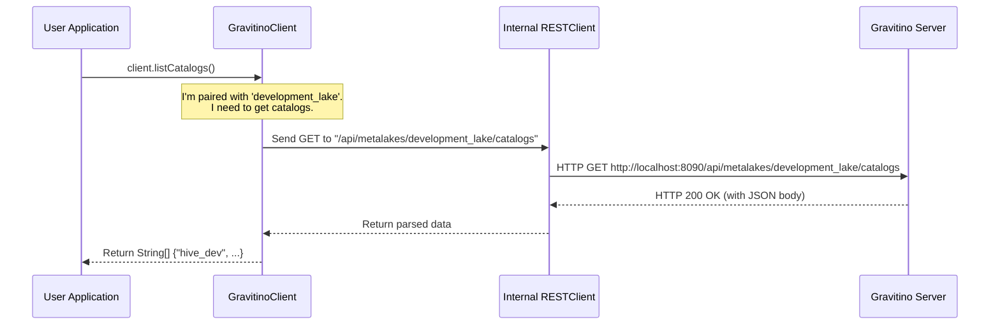

# Chapter 2: Gravitino Client

In the [previous chapter](01_entity_hierarchy_.md), we learned about Gravitino's **Entity Hierarchy**—the simple, folder-like structure of `Metalake -> Catalog -> Schema -> Table` that organizes all your metadata. Now that we understand the "map" of our data, how do we actually *use* it? How do we create, read, or update these entities?

This is where the **Gravitino Client** comes in.

### The Client as a Friendly Remote Control

Imagine the Gravitino server is a powerful but complex machine in another room. You don't want to go into that room and mess with its internal wiring every time you need something. What you want is a simple, intuitive remote control in your hand.

The Gravitino Client is that remote control.

It hides all the complex details of network communication (like REST APIs, JSON formatting, and HTTP requests). You just press a button on your "remote"—like calling a method `createCatalog()` or `listCatalogs()`—and the client sends the correct signals to the server, which then does the heavy lifting. This lets you manage your metadata from your own application code in a clean and simple way.

```mermaid
graph TD
    subgraph Your Application
        A[You call `client.listCatalogs()`]
    end

    subgraph Gravitino Client (The Remote Control)
        B{Translates call to REST API request}
    end

    subgraph Network
        C[HTTP GET /api/metalakes/dev/catalogs]
    end

    subgraph Gravitino Server (The Machine)
        D{Processes request and returns data}
    end

    A --> B;
    B --> C;
    C --> D;
```

### Two Remotes for Two Different Jobs

Gravitino provides two types of clients, each designed for a specific role, much like having a "User" remote and a "System Settings" remote for your TV.

1.  **`GravitinoAdminClient`**: This is for system administrators. Its main job is to manage the top-level `Metalake`s. Think of it as the master remote that can create, delete, or list all the virtual data centers.

2.  **`GravitinoClient`**: This is for regular users and applications. This client is designed to work *inside* a specific `Metalake`. Once you select a metalake (e.g., `development_lake`), this client is your tool for managing everything within it, like catalogs, schemas, and tables.

### Let's Use the Client: A Practical Example

Let's solve a common task: **List all the `Catalog`s in our `development_lake`**.

#### Step 1: Building an Admin Client (Optional but good practice)

First, an administrator might want to see what `Metalake`s even exist on the server. They would use the `GravitinoAdminClient`.

**Java**

```java
// From: clients/client-java/src/main/java/org/apache/gravitino/client/GravitinoAdminClient.java

import org.apache.gravitino.client.GravitinoAdminClient;

String gravitinoUri = "http://localhost:8090";
GravitinoAdminClient adminClient = GravitinoAdminClient.builder(gravitinoUri).build();

// List all metalakes
GravitinoMetalake[] metalakes = adminClient.listMetalakes();
```
This code creates a `GravitinoAdminClient` connected to our server. The `.builder()` pattern makes it easy to construct, and `listMetalakes()` gives us a list of all available metalakes.

#### Step 2: Building a User Client

Now, as an application developer, you know you want to work within the `development_lake`. You'll use the `GravitinoClient`, telling it which metalake you're interested in.

**Java**

```java
// From: clients/client-java/src/main/java/org/apache/gravitino/client/GravitinoClient.java

import org.apache.gravitino.client.GravitinoClient;

String gravitinoUri = "http://localhost:8090";
String metalakeName = "development_lake";

GravitinoClient client = GravitinoClient.builder(gravitinoUri)
    .withMetalake(metalakeName)
    .build();
```
Notice the extra `.withMetalake(metalakeName)` step. This "pairs" our client remote to a specific metalake, so all our future commands are automatically sent to the right place.

**Python**

```python
# From: clients/client-python/gravitino/client/gravitino_client.py

from gravitino.client.gravitino_client import GravitinoClient

gravitino_uri = "http://localhost:8090"
metalake_name = "development_lake"

# The client is initialized with the metalake name
client = GravitinoClient(
    uri=gravitino_uri,
    metalake_name=metalake_name
)
```
The Python client is just as simple, taking the URI and `metalake_name` directly in its constructor.

#### Step 3: Listing the Catalogs

With our client ready, listing the catalogs is a single, easy-to-read line of code.

**Java**

```java
// From: clients/client-java/src/main/java/org/apache/gravitino/client/GravitinoClient.java

// Action: List the names of all catalogs in 'development_lake'
String[] catalogNames = client.listCatalogs();

// Output might be: ["hive_dev", "s3_logs", "pg_testing"]
```

**Python**

```python
# From: clients/client-python/gravitino/client/gravitino_client.py

# Action: List the names of all catalogs in 'development_lake'
catalog_names = client.list_catalogs()

# Output might be: ['hive_dev', 's3_logs', 'pg_testing']
```
That's it! You didn't have to write any HTTP code, deal with JSON, or even construct a URL. The client handled everything.

### How It Works Under the Hood

So what magic happens when you call `client.listCatalogs()`?

1.  **Method Call**: Your application calls the simple `listCatalogs()` method on the `GravitinoClient` object.
2.  **Request Building**: The client knows the server's address (`uri`) and the metalake (`development_lake`). It uses this information to construct the correct REST API endpoint, like `/api/metalakes/development_lake/catalogs`.
3.  **HTTP Communication**: An internal component called `RESTClient` takes this endpoint and sends a standard HTTP GET request over the network to the Gravitino server.
4.  **Server Response**: The server finds the requested metadata and sends it back as a JSON response.
5.  **Parsing**: The `RESTClient` receives the JSON, and the `GravitinoClient` parses it, converting the raw text into clean, usable Java or Python objects.
6.  **Return Value**: The client returns a simple list of strings to your application.

This entire process is illustrated below.



The core of this abstraction lies in the `GravitinoClientBase` class, which initializes the underlying `RESTClient`.

```java
// From: clients/client-java/src/main/java/org/apache/gravitino/client/GravitinoClientBase.java

public abstract class GravitinoClientBase implements Closeable {
  // The REST client to communicate with the REST server
  protected final RESTClient restClient;

  protected GravitinoClientBase(String uri, ...) {
    // The base client creates an HTTPClient to handle all network calls.
    this.restClient = HTTPClient.builder(properties)
        .uri(uri)
        // ... other configurations ...
        .build();
  }
  // ...
}
```
This snippet shows that when any Gravitino client is created, it immediately sets up a `restClient` (an `HTTPClient` implementation). This client is the engine that powers all the "remote control" functionality, making the network communication happen seamlessly.

### Conclusion

You've now learned about the **Gravitino Client**, your primary tool for interacting with the Gravitino server.

- It acts as a **friendly remote control**, hiding network complexity.
- The **`GravitinoAdminClient`** manages top-level `Metalake`s.
- The **`GravitinoClient`** works inside a specific `Metalake` to manage catalogs, schemas, and more.

By providing a clean, programmatic interface, the client empowers you to build applications and automation scripts that can manage all your metadata in a unified way.

Now that you've seen how to interact with Gravitino using code, what if you just want to perform a quick action from your terminal? In the next chapter, we'll explore the [Command-Line Interface (CLI) Handlers](03_command_line_interface__cli__handlers_.md).

---

Generated by [AI Codebase Knowledge Builder](https://github.com/The-Pocket/Tutorial-Codebase-Knowledge)