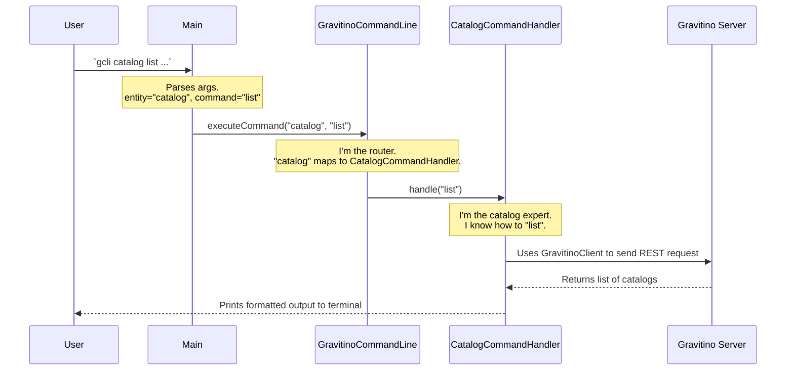

# Chapter 3: Command-Line Interface (CLI) Handlers

In the [previous chapter](02_gravitino_client_.md), we saw how the [Gravitino Client](02_gravitino_client_.md) acts like a remote control, letting you manage metadata from within your own application code. But what if you don't want to write a program for a simple task? What if you just want to quickly list catalogs or check a table's properties directly from your terminal?

This is where Gravitino's Command-Line Interface (CLI) comes in, and the **`CommandHandler`** is its brain.

### The CLI Handler as a Smart Assistant

Imagine you have a robot assistant. To get it to do something, you give it a clear, two-part command:
1.  **The Subject:** What are you talking about? (e.g., "the lights," "the music")
2.  **The Action:** What should be done? (e.g., "turn on," "play rock")

Gravitino's CLI works the same way. You specify an **entity** (the subject) and a **command** (the action).

`gcli catalog list --metalake dev_lake`

-   **Entity:** `catalog`
-   **Command:** `list`

The `CommandHandler` is the robot's processor. It hears "catalog list," understands that it needs to use its catalog-management tool, and executes the "list" function. If you had said "table create," it would have picked up its table-creation tool instead. Each entity (`Metalake`, `Catalog`, `Schema`, `Table`) has its own specialized handler, making the system organized and easy to command.

```mermaid
graph TD
    A["User types: `gcli catalog list`"] --> B{CLI Main Processor};
    B -- "Entity is 'catalog'" --> C[CatalogCommandHandler];
    B -- "Entity is 'table'" --> D[TableCommandHandler];
    B -- "Entity is 'schema'" --> E[SchemaCommandHandler];

    C -- "Action is 'list'" --> F[Executes listCatalogs() function];
```

### A Practical Example: Listing Catalogs from the Terminal

Let's stick with our goal from the last chapter: listing all `Catalog`s in our `dev_lake`. With the CLI, it's a single command.

**Input (Your Terminal):**
```bash
# The entity is 'catalog', the command is 'list'
gcli catalog list --metalake dev_lake
```

**Output (The Result):**
```
hive_dev
s3_logs
pg_testing
```
Simple, right? But how does Gravitino know what to do with the words "catalog" and "list"? This is the job of the `CommandHandler` system.

### How It Works Under the Hood: The Command Dispatch System

When you press Enter, a three-step process begins, moving from a general parser to a specific expert.

1.  **The Entry Point (`Main.java`):** The `Main` class is the first to see your command. Its only job is to parse the raw text and identify the two most important words: the entity (`catalog`) and the command (`list`).

    ```java
    // From: clients/cli/src/main/java/org/apache/gravitino/cli/Main.java

    // Simplified for clarity
    public static void main(String[] args) {
      // 1. Parse all the arguments from the command line
      CommandLine line = parser.parse(options, args);

      // 2. Figure out the main subject (the entity)
      String entity = resolveEntity(line); // This will return "catalog"

      // 3. Figure out the main action (the command)
      String command = resolveCommand(line); // This will return "list"

      // 4. Pass them on to the main command line handler
      new GravitinoCommandLine(line, options, entity, command).handleCommandLine();
    }
    ```
    This code acts like a receptionist, taking your initial request and figuring out which department to send you to.

2.  **The Router (`GravitinoCommandLine.java`):** This class acts as a switchboard. It takes the `entity` ("catalog") and routes the request to the correct specialist—the `CommandHandler` designed specifically for catalogs.

    ```java
    // From: clients/cli/src/main/java/org/apache/gravitino/cli/GravitinoCommandLine.java

    private void executeCommand(CommandContext context) {
      // ... other checks
      if (entity.equals(CommandEntities.TABLE)) {
        new TableCommandHandler(this, line, command, context).handle();
      } else if (entity.equals(CommandEntities.SCHEMA)) {
        new SchemaCommandHandler(this, line, command, context).handle();
      } else if (entity.equals(CommandEntities.CATALOG)) {
        // We found a match! Hand off to the catalog expert.
        new CatalogCommandHandler(this, line, command, context).handle();
      } else if (entity.equals(CommandEntities.METALAKE)) {
        new MetalakeCommandHandler(this, line, command, context).handle();
      }
      // ... more entities
    }
    ```
    This `if-else` block is the core of the routing logic. It ensures that a command about a `Catalog` is only ever handled by the `CatalogCommandHandler`.

3.  **The Specialist (`CatalogCommandHandler.java`):** This is the expert that knows everything about managing catalogs. It receives the command (`list`) and executes the specific logic for that action.

    ```java
    // From: clients/cli/src/main/java/org/apache/gravitino/cli/CatalogCommandHandler.java

    private boolean executeCommand() {
      switch (command) {
        case CommandActions.DETAILS:
          handleDetailsCommand();
          return true;
        case CommandActions.CREATE:
          handleCreateCommand();
          return true;
        case CommandActions.LIST: // The command is "list"
          handleListCommand(); // Execute the list logic
          return true;
        default:
          return false;
      }
    }

    private void handleListCommand() {
      // This uses the GravitinoClient from Chapter 2 behind the scenes!
      gravitinoCommandLine.newListCatalogs(context, metalake).validate().handle();
    }
    ```
    The `CatalogCommandHandler` doesn't care about tables or schemas. Its focus is narrow and deep: it only handles catalog-related tasks, making the code clean, organized, and easy to maintain.

Let's visualize this flow.



### Why This Design Matters

This handler-based design is powerful because it makes the CLI **extensible**.

Imagine we want to add a new entity to Gravitino, like `Topic`. To add CLI support, we don't need to change any of the existing code for `Catalog` or `Table`. We simply:
1.  Create a new `TopicCommandHandler.java`.
2.  Add an `else if` condition to the router (`GravitinoCommandLine.java`) to direct "topic" commands to our new handler.

That's it! The system is decoupled and modular, preventing a single, massive file from trying to handle every possible command.

### Conclusion

You've now seen the "brain" behind the Gravitino CLI: the **Command-Line Interface Handlers**.

-   The CLI provides a quick, text-based way to manage metadata.
-   The system uses a **router-and-specialist** model.
-   A central router (`GravitinoCommandLine`) directs traffic based on the **entity** (`catalog`, `table`).
-   Specialized **`CommandHandler`** classes (`CatalogCommandHandler`) contain the logic for specific **commands** (`list`, `create`, `delete`).

This clean separation of concerns makes the CLI robust, easy to understand, and simple to extend with new features.

So far, we've explored how to interact with Gravitino, both programmatically and via the command line. But in a real-world system, not everyone should be able to do everything. How do we secure Gravitino? In the next chapter, we'll dive into the first layer of security: the [Pluggable Authentication Provider](04_pluggable_authentication_provider_.md).

---

Generated by [AI Codebase Knowledge Builder](https://github.com/The-Pocket/Tutorial-Codebase-Knowledge)