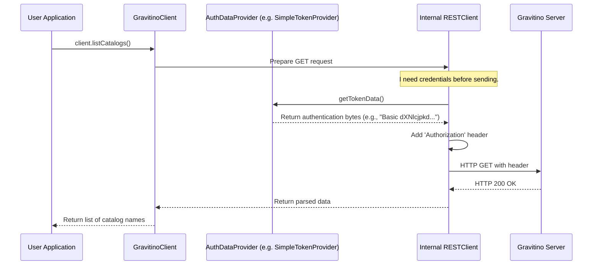

# Chapter 4: Pluggable Authentication Provider

In the last chapter on [Command-Line Interface (CLI) Handlers](03_command_line_interface__cli__handlers_.md), we learned how to interact with Gravitino from our terminal. Whether we use the CLI or the [Gravitino Client](02_gravitino_client_.md), every connection to the Gravitino server is a potential security concern. How does the server know who is making the request? And how can we ensure that only authorized users can connect?

This brings us to the first layer of security: **Authentication**, or proving who you are.

### The Problem: A One-Size-Fits-All Lock is Insecure and Inflexible

Imagine building a house. You wouldn't use the same simple lock for a garden shed as you would for the front door of a bank. Different situations have vastly different security requirements.

The same is true for software systems:
-   A developer testing on their laptop needs a quick, simple way to log in.
-   A small company might use a standard username and password system.
-   A large enterprise will likely require a robust, industry-standard protocol like Kerberos or OAuth2.

If Gravitino only supported one method, it would either be too insecure for enterprises or too complex for developers. It needs a flexible system that can adapt to any environment.

### The Solution: A Door with Multiple, Swappable Locks

Gravitino solves this problem with its **Pluggable Authentication Provider** system. Think of the Gravitino server as a secure room with a special door. This door doesn't have just one lock; it has a universal slot where you can install different kinds of locks.

-   You can plug in a **simple key lock** (`SimpleAuth`).
-   You can plug in a **company ID card reader** (`OAuth`).
-   You can plug in a **biometric scanner** (`Kerberos`).

The "universal slot" is a contract called `AuthDataProvider`. It defines a very simple rule: "you must provide a way to get security credentials." Each "lock" is an implementation of this contract, providing the specific logic for its method. This makes Gravitino incredibly flexible and secure, as it can adapt to any organization's security needs without changing its core code.

```mermaid
graph TD
    subgraph Your Application (Client)
        A[Gravitino Client]
    end

    subgraph Authentication "Locks" (Implementations)
        B[SimpleTokenProvider]
        C[OAuth2TokenProvider]
        D[KerberosTokenProvider]
    end

    subgraph The Universal Slot
        E(AuthDataProvider Interface)
    end

    subgraph Server
        F[Gravitino Server]
    end

    A -- Plugs in one of --> B
    A -- or --> C
    A -- or --> D

    B -- Implements --> E
    C -- Implements --> E
    D -- Implements --> E

    A -- "Here are my credentials from the provider" --> F
```

### A Practical Example: Connecting a Client with Simple Auth

Let's say you're a developer working locally. You don't need complex enterprise security; you just want to connect to your local Gravitino server as your system user.

With the pluggable system, you simply tell the [Gravitino Client](02_gravitino_client_.md) to use the "simple key" lock.

```java
// From: clients/client-java/src/main/java/org/apache/gravitino/client/GravitinoClientBase.java

// Tell the builder to use the simple authentication method.
GravitinoClient client = GravitinoClient.builder(gravitinoUri)
    .withMetalake(metalakeName)
    .withSimpleAuth() // This is where you "plug in" the simple lock
    .build();
```
The `.withSimpleAuth()` call is a convenient shortcut that tells the client builder to create and use a `SimpleTokenProvider`. This provider automatically picks up your system username (e.g., `GRAVITINO_USER` environment variable) and uses it to authenticate.

Now, let's say your application is moving to a production environment that requires Kerberos. Do you need to rewrite your client code? No! You just swap the lock.

```java
// From: clients/client-java/src/main/java/org/apache/gravitino/client/GravitinoClientBase.java

// Assume 'kerberosProvider' is a configured KerberosTokenProvider instance
GravitinoClient client = GravitinoClient.builder(gravitinoUri)
    .withMetalake(metalakeName)
    .withKerberosAuth(kerberosProvider) // Swap to the "biometric scanner" lock
    .build();
```
The rest of your application code, which lists catalogs or creates tables, remains completely unchanged. You've only changed the authentication mechanism, demonstrating the power of the "pluggable" design.

### How It Works Under the Hood

What happens when the client makes a request? How does the "lock" actually provide the "key"?

1.  **Configuration:** When you build the `GravitinoClient`, your choice (`.withSimpleAuth()`, `.withKerberosAuth()`, etc.) sets which `AuthDataProvider` implementation will be used.
2.  **Request Time:** Your application calls a method like `client.listCatalogs()`.
3.  **Credential Request:** The client's internal `RESTClient` is about to send the HTTP request to the server. Before it does, it turns to the configured `AuthDataProvider` and asks, "Please give me the security token." It does this by calling the `getTokenData()` method.
4.  **Credential Generation:**
    *   If you used `SimpleTokenProvider`, its `getTokenData()` method takes your username, encodes it, and returns it as a "Basic" authentication header.
    *   If you used `KerberosTokenProvider`, its `getTokenData()` method performs a complex Kerberos ticket negotiation and returns a "Negotiate" header.
5.  **Request Sent:** The `RESTClient` attaches the provided credentials to the HTTP request's `Authorization` header and sends it to the server.
6.  **Server Validation:** The Gravitino server receives the request, inspects the `Authorization` header, and uses its corresponding security configuration to validate that the credentials are correct.

This flow is illustrated below.



#### The Universal Contract: `AuthDataProvider`

The entire system is built on one simple interface. This is the "universal keyhole" we talked about.

```java
// From: clients/client-java/src/main/java/org/apache/gravitino/client/AuthDataProvider.java

interface AuthDataProvider extends Closeable {
  // Can this provider give token data?
  default boolean hasTokenData() {
    return false;
  }

  // If yes, what is the data?
  default byte[] getTokenData() {
    return null;
  }
}
```
Any class that implements this interface can be plugged into the Gravitino client. It's a simple yet powerful contract. The Python client has an equivalent abstract base class.

```python
# From: clients/client-python/gravitino/auth/auth_data_provider.py

class AuthDataProvider(ABC):
    @abstractmethod
    def has_token_data(self) -> bool:
        pass

    @abstractmethod
    def get_token_data(self) -> bytes:
        pass
```

#### A Simple Implementation: `SimpleTokenProvider`

Let's look at the "simple key" implementation. It takes a username, combines it with a dummy password, and encodes it using Base64—a standard for basic HTTP authentication.

```java
// From: clients/client-java/src/main/java/org/apache/gravitino/client/SimpleTokenProvider.java

final class SimpleTokenProvider implements AuthDataProvider {

  private final byte[] token;

  // Constructor gets the username (e.g., from an environment variable)
  public SimpleTokenProvider() {
    String gravitinoUser = System.getProperty("user.name");
    // ... logic to build token from user ...
    this.token = buildToken(gravitinoUser);
  }

  // The actual implementation of the interface method
  @Override
  public byte[] getTokenData() {
    return token;
  }
}
```
This class is straightforward. It prepares the token once and returns it every time `getTokenData()` is called. In contrast, implementations like `OAuth2TokenProvider` or `KerberosTokenProvider` might need to perform network requests or refresh tokens within their `getTokenData()` methods, but they still fulfill the same simple contract.

### Conclusion

You've just learned how Gravitino handles security in a flexible and extensible way with its **Pluggable Authentication Provider**.

-   **The Goal:** Support diverse security needs, from simple development setups to complex enterprise environments.
-   **The Core Idea:** A universal contract (`AuthDataProvider`) that defines *how* to ask for credentials, without dictating *what* those credentials are.
-   **The Implementations:** Different "locks" like `SimpleTokenProvider`, `OAuth2TokenProvider`, and `KerberosTokenProvider` can be plugged in to provide specific security mechanisms.
-   **The Benefit:** Your application code remains clean and unchanged, even when the underlying security requirements change.

Authentication is about proving *who you are*. But once the server knows who you are, it needs to decide *what you are allowed to do*. This next layer of security is called **Authorization**. In the next chapter, we'll explore Gravitino's [Pluggable Authorization Framework](05_pluggable_authorization_framework_.md).

---

Generated by [AI Codebase Knowledge Builder](https://github.com/The-Pocket/Tutorial-Codebase-Knowledge)