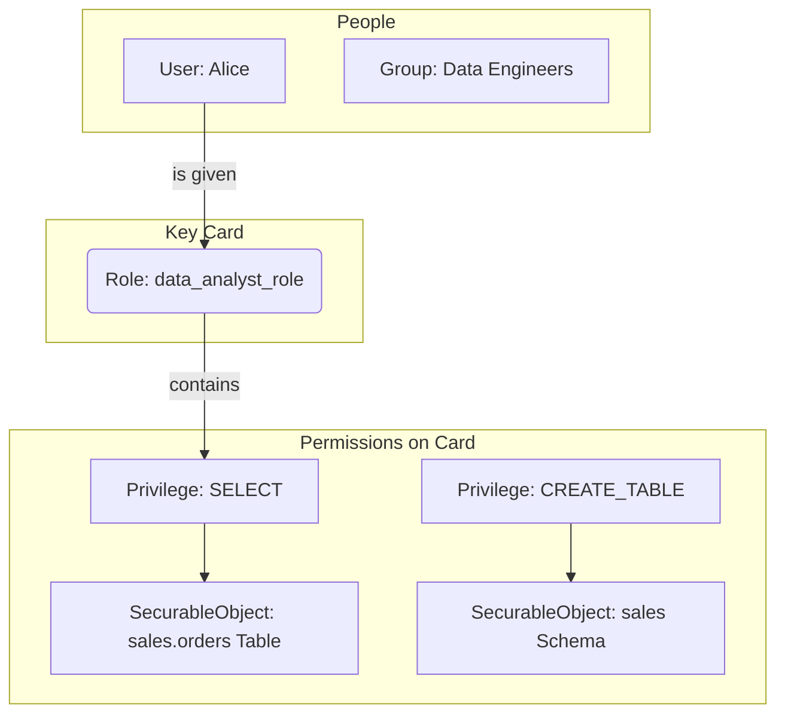
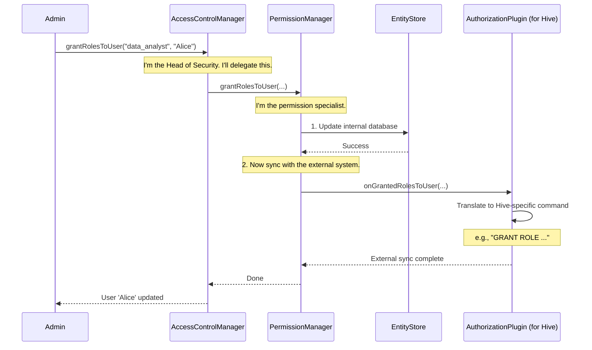

# Chapter 5: Pluggable Authorization Framework

In the [previous chapter](04_pluggable_authentication_provider_.md), we learned how Gravitino's [Pluggable Authentication Provider](04_pluggable_authentication_provider_.md) answers the question: "**Who are you?**" It's like a security guard checking your ID at the front door.

But once you're inside the building, a new question arises: "**What are you allowed to do?**" Can you enter the server room? Can you access the executive offices? This second layer of security is called **Authorization**, and Gravitino has a powerful and flexible system for managing it.

### The Problem: A Rigid Security Policy Doesn't Work

Imagine a building where security rules are hard-coded. To give a new employee access to a new room, you'd have to call the original builders to rewire the whole system. This is slow, inefficient, and impossible to manage as the company grows.

Similarly, a data platform needs to manage permissions for thousands of users across hundreds of data sources. A rigid, one-size-fits-all authorization system would be a nightmare. We need a system that is flexible, easy to manage, and can adapt to different security models.

### The Solution: A Configurable "Key Card" System

Gravitino's **Pluggable Authorization Framework** works like a modern building's security system. Instead of fixed rules, it uses a system of configurable "key cards" that can be assigned to people or entire departments.

Let's break down the key components using this analogy:

*   **`User` / `Group`**: The people and departments in the building. (e.g., 'Alice' the data analyst, 'Data Engineers' department).
*   **`SecurableObject`**: The rooms, floors, or assets that need protection. (e.g., a specific `Table` or `Schema`).
*   **`Privilege`**: The specific actions you can perform in a room. (e.g., `SELECT` is 'Read a document', `CREATE_TABLE` is 'Build a new cabinet').
*   **`Role`**: The "key card" itself. A Role is a named collection of privileges. (e.g., a `data_analyst_role` key card that grants 'Read' access to all `sales` tables).



This system is powerful because you manage permissions by managing the "key cards" (`Roles`), not by re-wiring the access for every single person.

### A Practical Example: Giving Alice Read Access

Let's say we have a `User` named Alice, and we want to give her permission to read (`SELECT`) data from the `sales.orders` table, but nothing more.

**Step 1: Create a `Role` (the key card).**
An administrator first creates a `Role` called `data_analyst`. Right now, it's just an empty key card with no permissions.

**Step 2: Grant `Privileges` to the `Role` (program the key card).**
Next, the admin adds a rule to the `data_analyst` key card: "This card grants `SELECT` privilege on the `sales.orders` table (`SecurableObject`)."

**Step 3: Grant the `Role` to a `User` (give the key card to the person).**
Finally, the admin gives the `data_analyst` key card to Alice.

Now, Alice can read from `sales.orders`. If a new analyst, Bob, joins the team, the admin simply gives him a copy of the same `data_analyst` key card. The permissions are managed in one central place: the `Role`.

### The Security Team: How It Works Internally

Gravitino's authorization is managed by a team of specialized managers, all coordinated by a "Head of Security."

*   **`AccessControlManager`**: This is the Head of Security. It's the public-facing entry point for all authorization requests. When you ask to "grant a role to a user," you're talking to this manager.
*   **`UserGroupManager` / `RoleManager`**: These are specialists. One knows everything about `Users` and `Groups`; the other knows everything about `Roles`.
*   **`PermissionManager`**: This specialist handles the complex logic of connecting roles to users/groups and privileges to roles.
*   **`AuthorizationPlugin`**: This is the most crucial part. It's like an external security company (e.g., Apache Ranger, AWS IAM). After Gravitino updates its own internal records, it tells this plugin to enforce the same rules in the actual data source (e.g., the Hive catalog). This is what makes the system "pluggable."

Let's see this team in action.

```java
// From: core/src/main/java/org/apache/gravitino/authorization/AccessControlManager.java

public class AccessControlManager implements AccessControlDispatcher {

  private final UserGroupManager userGroupManager;
  private final RoleManager roleManager;
  private final PermissionManager permissionManager;
  // ...

  @Override
  public User grantRolesToUser(String metalake, List<String> roles, String user) {
    // The Head of Security delegates the task to the right specialist.
    return TreeLockUtils.doWithTreeLock(
        ...,
        () -> permissionManager.grantRolesToUser(metalake, roles, user));
  }
}
```
This snippet shows the `AccessControlManager` receiving a request to grant roles. Instead of doing the work itself, it wisely delegates the task to the `PermissionManager`, the expert on the matter.

### How It Works Under the Hood: A Complete Flow

When an admin grants the `data_analyst` role to `Alice`, here's what happens behind the scenes:

1.  **Request Received**: The `AccessControlManager` receives the `grantRolesToUser` request.
2.  **Delegation**: It passes the request to the `PermissionManager`.
3.  **Internal Update**: The `PermissionManager` updates Gravitino's internal database (the `EntityStore`), recording that Alice now has the `data_analyst` role. This is like updating the master spreadsheet of who has which key card.
4.  **External Sync**: The `PermissionManager` then looks at the `SecurableObject` associated with the role (the `sales.orders` table). It knows this table belongs to a Hive catalog. It then calls the `AuthorizationPlugin` configured for that Hive catalog.
5.  **Plugin Action**: The Hive `AuthorizationPlugin` receives the command ("Alice gets `data_analyst` role with these privileges"). It translates this into a command the underlying system understands (like `GRANT SELECT ON sales.orders TO ROLE data_analyst_hive`) and executes it.

Now, the permission is enforced both within Gravitino's metadata and in the actual data source.



The core of this "pluggable" nature is the `AuthorizationPlugin` interface. It's a contract that any external security provider can implement.

```java
// From: core/src/main/java/org/apache/gravitino/connector/authorization/AuthorizationPlugin.java

// Simplified for clarity
public interface AuthorizationPlugin extends Closeable {
    // This method is called when a role is created in Gravitino.
    void onRoleCreated(Role role) throws UnsupportedOperationException;

    // This method is called when roles are granted to a user.
    void onGrantedRolesToUser(List<Role> roles, User user) throws UnsupportedOperationException;

    // ... and many other methods for onRoleDeleted, onRevokedRoles, etc.
}
```
This simple contract allows Gravitino to integrate with any data source's security model. You just need to provide the right "adapter" by implementing this interface. For example, a `RangerAuthorizationPlugin` would translate these calls into Ranger API requests.

### Conclusion

You've now learned about Gravitino's **Pluggable Authorization Framework**, the system that controls *what* users are allowed to do.

-   It uses a flexible **Role-Based Access Control (RBAC)** model with `Users`, `Groups`, `Roles`, `Privileges`, and `SecurableObjects`.
-   The **`AccessControlManager`** acts as the central coordinator, delegating tasks to specialized managers.
-   The **`AuthorizationPlugin`** is the key to its extensibility, allowing Gravitino to sync and enforce permissions in diverse external systems like Hive, Ranger, or cloud IAM.

This robust framework ensures that you can manage data access policies across all your connected sources in a unified and scalable way.

So far, we've seen how to organize metadata, connect to Gravitino, and manage security. But how does Gravitino actually route an operation, like "create table," to the correct underlying data source? In the next chapter, we'll explore the intelligent routing system: [Metadata Operation Dispatching](06_metadata_operation_dispatching_.md).

---

Generated by [AI Codebase Knowledge Builder](https://github.com/The-Pocket/Tutorial-Codebase-Knowledge)