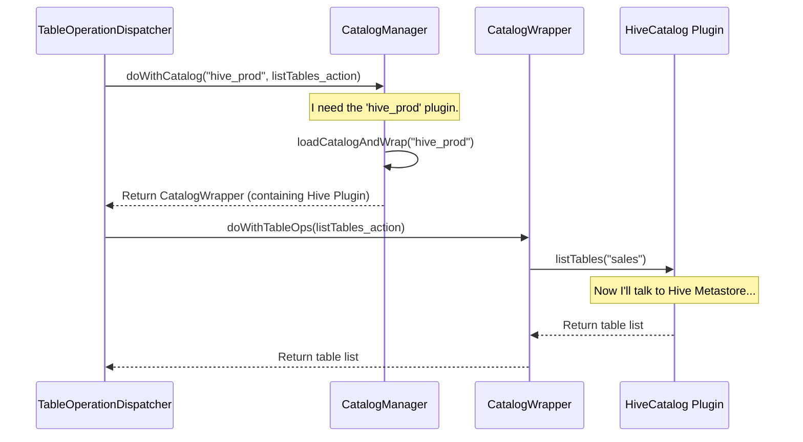

# Chapter 6: Metadata Operation Dispatching

In the [previous chapter](05_pluggable_authorization_framework_.md), we explored how Gravitino's [Pluggable Authorization Framework](05_pluggable_authorization_framework_.md) decides *what* a user is allowed to do. Now that a user is authenticated and authorized, a new question arises: when they ask to "list all tables in the Hive catalog," how does Gravitino know exactly how to talk to Hive? How does it route this request to the right place?

This is the job of the **Metadata Operation Dispatching** system.

### The Airport Control Tower Analogy

Imagine a busy airport. When a pilot from "Air Hive" radios the main control tower to request a landing, the tower doesn't handle the landing itself. The main tower's job is to identify the airline and say, "Air Hive, contact your ground dispatcher on frequency 121.5."

That ground dispatcher is an expert who knows all of Air Hive's specific procedures, gate assignments, and ground crew protocols. Another dispatcher for "Air Iceberg" would have a completely different set of procedures.

Gravitino works exactly the same way:

*   **The Main Control Tower:** This is the `CatalogManager`. It manages all the different "airlines" (catalogs) but doesn't know their internal details.
*   **The Airline Dispatcher:** These are the `OperationDispatcher` classes (e.g., `TableOperationDispatcher`, `SchemaOperationDispatcher`). Each is a specialist for a certain type of request (tables, schemas, etc.).
*   **The Airline Pilot & Crew:** This is the actual catalog plugin (e.g., a `HiveCatalog` object). It contains the specific code to interact with the underlying data source.

This system keeps the main server logic clean and allows new data sources (airlines) to be plugged in easily, each with its own expert dispatcher and crew.

```mermaid
graph TD
    A[User Request: "list tables in hive_prod"] --> B{Gravitino Server};
    B -- "It's a table operation" --> C[TableOperationDispatcher];
    subgraph C
        D{"Which catalog? It's 'hive_prod'"} --> E[Ask CatalogManager for the 'hive_prod' plugin];
    end
    F[CatalogManager] -->|"Here's the HiveCatalog plugin"| E;
    E --> G[HiveCatalog Plugin];
    G -- "Execute Hive-specific code" --> H[Hive Metastore];
```

### A Practical Example: Listing Tables in a Schema

Let's follow a request to list all tables in the schema `dev_lake.hive_prod.sales`.

When you make this call using the [Gravitino Client](02_gravitino_client_.md), the request arrives at the Gravitino server. The server sees that this is a request to `listTables` and immediately hands it off to the specialist: the `TableOperationDispatcher`.

```java
// From: core/src/main/java/org/apache/gravitino/catalog/TableOperationDispatcher.java

public class TableOperationDispatcher extends OperationDispatcher implements TableDispatcher {
    // ...
    @Override
    public NameIdentifier[] listTables(Namespace namespace) throws NoSuchSchemaException {
        // The dispatcher receives the request for the "sales" schema.
        return doWithCatalog(
            getCatalogIdentifier(NameIdentifier.of(namespace.levels())), // Extracts "hive_prod"
            catalog -> catalog.doWithTableOps(ops -> ops.listTables(namespace)), // The action to perform
            NoSuchSchemaException.class
        );
    }
    // ...
}
```
This code is the heart of the dispatching logic. The `TableOperationDispatcher` doesn't contain any Hive-specific code. Instead, it does two things:
1.  It figures out the catalog identifier (`hive_prod`) from the full namespace.
2.  It calls a helper method, `doWithCatalog`, telling it *what to do* once it finds the right catalog.

### How It Works Under the Hood: The Dispatch Flow

The magic happens inside the `doWithCatalog` method, which is defined in the base `OperationDispatcher` class. This method is the central routing function.

1.  **Identify the Target:** The `TableOperationDispatcher` calls `doWithCatalog` with the catalog's name (`hive_prod`).
2.  **Request the Plugin:** `doWithCatalog` turns to the `CatalogManager` (the main control tower) and says, "Please give me the active plugin for `hive_prod`."
3.  **Load and Wrap:** The `CatalogManager` finds the configuration for `hive_prod`, loads the necessary code (the `HiveCatalog` plugin), and wraps it in a special `CatalogWrapper`. This wrapper ensures the plugin's code runs in isolation, preventing conflicts with other plugins.
4.  **Execute the Action:** `doWithCatalog` receives the `CatalogWrapper` and executes the action that the `TableOperationDispatcher` gave it earlier. In this case, it calls `listTables` on the `HiveCatalog` object.
5.  **Final Execution:** The `HiveCatalog` object, which is the expert for Hive, finally makes a call to the Hive Metastore to get the list of tables.
6.  **Return the Result:** The list of tables is passed all the way back up to the user.

Let's visualize this flow.



#### The Routing Logic: `doWithCatalog`

The core routing logic is surprisingly simple. It takes the catalog's name, gets the corresponding `CatalogWrapper`, and runs a function using it.

```java
// From: core/src/main/java/org/apache/gravitino/catalog/OperationDispatcher.java

// Simplified for clarity
public abstract class OperationDispatcher {
    private final CatalogManager catalogManager;

    // ... constructor ...

    protected <R> R doWithCatalog(
        NameIdentifier ident, // e.g., "hive_prod"
        ThrowableFunction<CatalogManager.CatalogWrapper, R> fn // e.g., the listTables action
    ) {
        // 1. Get the catalog plugin from the main manager.
        CatalogManager.CatalogWrapper c = catalogManager.loadCatalogAndWrap(ident);
        
        // 2. Execute the provided action on that plugin.
        return fn.apply(c);
    }
}
```
This method elegantly separates the "what" from the "how." The `Dispatcher` decides *what* action to perform (`fn`), while the `CatalogManager` and `CatalogWrapper` handle *how* to load and interact with the correct underlying plugin.

#### The Plugin Holder: `CatalogWrapper`

The `CatalogWrapper` is a clever utility that holds the actual catalog plugin. Its main job is to ensure that any code executed on the plugin happens within that plugin's own isolated environment (its "classloader"). This prevents different catalog plugins from interfering with each other.

```java
// From: core/src/main/java/org/apache/gravitino/catalog/CatalogManager.java

public static class CatalogWrapper {
    private BaseCatalog catalog; // The actual HiveCatalog or IcebergCatalog object
    private IsolatedClassLoader classLoader;

    // ...

    public <R> R doWithTableOps(ThrowableFunction<TableCatalog, R> fn) throws Exception {
        // Runs the code within the plugin's safe, isolated environment.
        return classLoader.withClassLoader(cl -> {
            TableCatalog tableOps = (TableCatalog) catalog.ops();
            return fn.apply(tableOps);
        });
    }
}
```
When `doWithTableOps` is called, it uses the `classLoader` to safely execute the `listTables` function on the underlying `HiveCatalog` object.

### Conclusion

You've now learned about Gravitino's **Metadata Operation Dispatching**, the internal routing system that directs requests to the correct data source plugins.

-   It acts like an **airport control tower**, delegating tasks to specialized dispatchers.
-   **`OperationDispatcher`s** (like `TableOperationDispatcher`) are experts for a specific type of metadata (e.g., tables).
-   The central `doWithCatalog` method finds the right catalog plugin via the **`CatalogManager`**.
-   The **`CatalogWrapper`** ensures each plugin runs its code safely and in isolation.

This layered design is key to Gravitino's extensibility. It allows developers to add support for new data sources simply by creating a new plugin, without ever touching the core server logic.

We've seen how Gravitino routes live operations, but how does it remember all the metadata it manages, like the definitions of your catalogs, schemas, or user roles? In the next chapter, we'll look at how this information is stored in [Relational Entity Persistence](07_relational_entity_persistence_.md).

---

Generated by [AI Codebase Knowledge Builder](https://github.com/The-Pocket/Tutorial-Codebase-Knowledge)