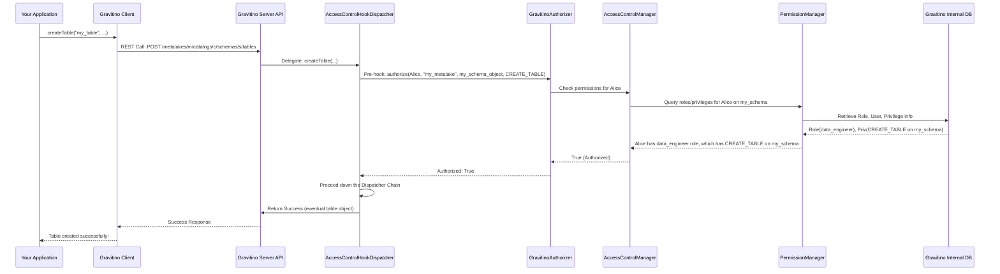

# Chapter 7: Authorization and Access Control

In the [previous chapter: Metadata Operation Dispatcher Chain](06_metadata_operation_dispatcher_chain_.md), we saw how Gravitino systematically handles every metadata operation, ensuring consistency and order. But there's a crucial question: who is allowed to perform these operations? Should just anyone be able to delete a critical production table, or even view sensitive metadata? Absolutely not!

Imagine Gravitino as a super important library that holds the blueprints for *all* your company's valuable data. Just like a physical library, it needs strict rules about who can enter, which sections they can access, and what they can do (read, borrow, or even change the catalog). This "security guard" and "rulebook" for your metadata library is what **Authorization and Access Control** is all about in Gravitino.

## What is Authorization and Access Control?

**Authorization and Access Control** is Gravitino's security system that decides **who can do what** with your metadata. It's like having a highly organized security team that:

1.  **Identifies users and groups**: Knows who is trying to access the metadata (e.g., "Alice," "Bob's Team").
2.  **Defines roles**: Creates specific job descriptions with associated permissions (e.g., "Data Analyst Role," "DB Admin Role").
3.  **Grants privileges**: Specifies what actions are allowed on which metadata objects (e.g., "Data Analyst Role can `SELECT` from `sales_data` table").
4.  **Enforces rules**: Every time someone tries to do something, it checks if they have the necessary permission.

This robust framework ensures your metadata is secure, compliant, and only accessible by authorized individuals or applications.

### Key Concepts

Let's break down the main components that make this security system work:

*   **`User` and `Group`**: These are the fundamental identities.
    *   A **`User`** is an individual person or service account.
    *   A **`Group`** is a collection of users, making it easier to manage permissions for multiple people at once (e.g., "all engineers," "all data scientists").

*   **`Role`**: A role is a named set of permissions. Instead of granting individual privileges to every user, you assign users (or groups) to roles. For example, you might have a "Read-Only Auditor" role that can only view data, and an "Admin" role that can create and delete anything.

*   **`Privilege`**: This defines a specific action that can be performed on a `MetadataObject`. Examples include `CREATE_TABLE`, `SELECT_TABLE`, `ALTER_SCHEMA`, `READ_FILESET`.

*   **`MetadataObject`**: This refers to *what* you're trying to access or control. It could be a `Metalake`, a `Catalog`, a `Schema`, a `Table`, a `Fileset`, or even a `Column`. Permissions are granted "on" these objects.

*   **`AccessControlManager`**: This is the central control panel for Gravitino's security. It's the orchestrator that manages `User`s, `Group`s, `Role`s, and `Privilege`s. It doesn't do the actual storage or permission checking itself, but it directs other components to do so.

*   **`UserGroupManager` and `RoleManager`**: These managers are responsible for the actual storage and retrieval of `User`, `Group`, and `Role` definitions in Gravitino's internal store (its database).

*   **`PermissionManager`**: This component handles the core logic of granting and revoking `Privilege`s to `Role`s on specific `MetadataObject`s. It's where the rules about "who can do what on what" are recorded and updated.

*   **`GravitinoAuthorizer`**: This is the core engine that performs the actual authorization *check*. When an operation is attempted, the `GravitinoAuthorizer` is asked, "Is this user allowed to perform this privilege on this metadata object?" It makes the final "yes" or "no" decision.

*   **`AuthorizationPlugin`**: Gravitino's design allows for flexibility. If your company already uses an external security system (like Apache Ranger or Apache Atlas), you can integrate it by implementing an `AuthorizationPlugin`. This plugin will then be called by `GravitinoAuthorizer` to delegate the actual permission checks to your external system.

Together, these components form a comprehensive security framework, acting as a security guard for all your valuable metadata assets.

## How to Set Up Access Control (Admin Perspective)

As a Gravitino administrator, you would use the Gravitino client to perform operations related to authorization and access control. While the following snippets are simplified, they illustrate the *types* of operations you'd execute.

**Scenario**: You want to create a role called "data_engineer" and grant it the ability to create tables in a specific schema (`my_catalog.my_schema`).

First, you'd ensure your admin user has the necessary privileges to manage roles and users. Then, you'd typically perform these steps:

1.  **Add Users and Groups (if not already present)**:
    ```java
    // Example: Adding a user (conceptual)
    // GravitinoClient client = ...
    // client.accessControlManager().addUser("my_metalake", "alice");
    // System.out.println("User 'alice' added to my_metalake.");
    ```
    This operation creates a new `User` entity in Gravitino's internal store.

2.  **Create a Role**:
    ```java
    import org.apache.gravitino.MetadataObjects;
    import org.apache.gravitino.authorization.Privilege;
    import org.apache.gravitino.authorization.Role;
    import org.apache.gravitino.authorization.SecurableObject;
    import java.util.Arrays;
    import java.util.Collections;

    // Example: Creating a 'data_engineer' role (conceptual)
    // GravitinoClient client = ...
    String metalakeName = "test_metalake";
    String roleName = "data_engineer";
    
    // Initial role, no privileges yet.
    // Role newRole = client.accessControlManager().createRole(
    //     metalakeName,
    //     roleName,
    //     Collections.emptyMap(), // No specific properties
    //     Collections.emptyList() // No securable objects (privileges) initially
    // );
    // System.out.println("Role '" + newRole.name() + "' created.");
    ```
    This operation creates a new `Role` entity.

3.  **Grant Privileges to the Role**: Here, we define what the `data_engineer` role *can do*.
    ```java
    // Example: Granting CREATE_TABLE privilege on a schema to the 'data_engineer' role
    // GravitinoClient client = ...
    String catalogName = "my_catalog";
    String schemaName = "my_schema";

    // Define the MetadataObject for the schema
    SecurableObject schemaObject = MetadataObjects.ofSchema(
        schemaName,
        catalogName,
        Collections.singletonList(Privilege.of(Privilege.Name.CREATE_TABLE, Privilege.Action.ALLOW))
    );

    // Grant the privilege to the role
    // Role updatedRole = client.accessControlManager().grantPrivilegeToRole(
    //     metalakeName,
    //     roleName,
    //     schemaObject,
    //     Collections.singleton(Privilege.of(Privilege.Name.CREATE_TABLE, Privilege.Action.ALLOW))
    // );
    // System.out.println("Privilege 'CREATE_TABLE' granted on schema 'my_schema' to role 'data_engineer'.");
    ```
    This updates the `data_engineer` role's definition, associating it with a `SecurableObject` (the schema) and a `Privilege` (create table).

4.  **Grant Roles to Users/Groups**: Finally, assign the "data\_engineer" role to actual users or groups.
    ```java
    // Example: Granting 'data_engineer' role to user 'alice'
    // GravitinoClient client = ...
    // client.accessControlManager().grantRolesToUser(
    //     metalakeName,
    //     Collections.singletonList(roleName),
    //     "alice"
    // );
    // System.out.println("Role 'data_engineer' granted to user 'alice'.");
    ```
    Now, "alice" (and any other users assigned this role) can create tables in `my_catalog.my_schema`.

This sequence of operations sets up the permissions using Gravitino's security framework.

## Under the Hood: How Authorization Works

Let's trace what happens when an application (acting as "Alice") tries to perform an action, like creating a table, after these permissions have been configured. This process integrates heavily with the [Metadata Operation Dispatcher Chain](06_metadata_operation_dispatcher_chain_.md).

### Step-by-Step Walkthrough

1.  **Application Initiates Operation**: Your application (authenticated as `Alice`) calls `gravitinoClient.createTable(...)`.
2.  **Server Receives Request**: The Gravitino server's API receives the `createTable` request.
3.  **Hook Dispatcher Intercepts**: As part of the [Metadata Operation Dispatcher Chain](06_metadata_operation_dispatcher_chain_.md), the `TableHookDispatcher` (or a general `AccessControlHookDispatcher`) is the first to process the request.
4.  **Authorization Pre-Hook**: Inside the hook, a pre-operation check is performed. It invokes the `GravitinoAuthorizer`.
5.  **`GravitinoAuthorizer` Query**: The `GravitinoAuthorizer` is asked: "Is `Alice` allowed to `CREATE_TABLE` on `my_catalog.my_schema`?"
    *   It checks its internal policies or delegates to an `AuthorizationPlugin` if configured.
    *   It consults the `AccessControlManager`, which then uses the `PermissionManager` to check if `Alice` (or a group `Alice` belongs to) has a role that grants `CREATE_TABLE` privilege on the specified `MetadataObject` (the schema).
6.  **Decision**: The `GravitinoAuthorizer` returns `true` (authorized) or `false` (denied).
7.  **Execution or Rejection**:
    *   **If authorized**: The `TableHookDispatcher` allows the request to proceed down the [Metadata Operation Dispatcher Chain](06_metadata_operation_dispatcher_chain_.md) to the `TableNormalizeDispatcher` and then `TableOperationDispatcher` for actual table creation.
    *   **If denied**: An `AccessDeniedException` (or similar `ForbiddenException`) is thrown immediately, preventing the operation, and the application receives an error.
8.  **Post-Hook (if authorized)**: After the table is successfully created by the `TableOperationDispatcher`, the `TableHookDispatcher` executes post-hooks, such as setting the table owner (e.g., to `Alice`) and logging the operation for audit purposes.

Here's a simplified sequence diagram:



### Deeper Dive into the Code (Java)

Let's look at key classes and methods that implement this authorization flow.

#### 1. `GravitinoAuthorizer` Interface

This is the core interface that any authorization mechanism must implement. The default `PassThroughAuthorizer` simply allows everything, meaning authorization is not actively enforced until a custom authorizer is configured.

```java
// File: core/src/main/java/org/apache/gravitino/authorization/GravitinoAuthorizer.java
public interface GravitinoAuthorizer extends Closeable {
  void initialize();

  // The core method for checking if a principal can perform a privilege on a metadata object
  boolean authorize(
      Principal principal,
      String metalake,
      MetadataObject metadataObject,
      Privilege.Name privilege);

  // Checks if the principal is the owner of the metadata object
  boolean isOwner(Principal principal, String metalake, MetadataObject metadataObject);

  // ... other methods for specific checks and notifications ...
}
```
**Explanation**: The `authorize` method is the most important one. It takes the `Principal` (the authenticated user), the `metalake`, the `MetadataObject` (e.g., `my_schema`), and the `Privilege.Name` (e.g., `CREATE_TABLE`) and returns a `boolean` indicating if the operation is allowed.

And its default "do nothing" implementation:
```java
// File: server-common/src/main/java/org/apache/gravitino/server/authorization/PassThroughAuthorizer.java
public class PassThroughAuthorizer implements GravitinoAuthorizer {
  @Override
  public void initialize() {}

  // Always returns true, effectively disabling authorization checks
  @Override
  public boolean authorize(
      Principal principal,
      String metalake,
      MetadataObject metadataObject,
      Privilege.Name privilege) {
    return true; // Allows all operations by default
  }

  // ... other methods also return true or do nothing ...
  @Override
  public void close() throws IOException {}
}
```
**Explanation**: The `PassThroughAuthorizer` is what Gravitino uses if no specific authorizer is configured. Its `authorize` method always returns `true`, meaning all operations are permitted. In a real-world secure environment, you would configure a different `GravitinoAuthorizer` implementation.

#### 2. `AccessControlHookDispatcher`: The Interceptor

This dispatcher acts as a proxy, intercepting calls and delegating to the actual `AccessControlDispatcher` but adding hooks. The actual authorization check often happens *before* the core operation.

```java
// File: core/src/main/java/org/apache/gravitino/hook/AccessControlHookDispatcher.java
@Slf4j
public class AccessControlHookDispatcher implements AccessControlDispatcher {
  private final AccessControlDispatcher dispatcher; // The actual manager to delegate to

  public AccessControlHookDispatcher(AccessControlDispatcher dispatcher) {
    this.dispatcher = dispatcher;
  }

  // Example: createRole method with pre-hook
  @Override
  public Role createRole(
      String metalake,
      String role,
      Map<String, String> properties,
      List<SecurableObject> securableObjects)
      throws RoleAlreadyExistsException, NoSuchMetalakeException {

    // PRE-HOOK: Check if the current user has permission to create roles
    // This calls GravitinoAuthorizer implicitly via AuthorizationUtils.checkCurrentUser
    AuthorizationUtils.checkCurrentUser(metalake, PrincipalUtils.getCurrentUserName());

    // Delegate to the actual AccessControlManager for the core operation
    Role createdRole = dispatcher.createRole(metalake, role, properties, securableObjects);

    // POST-HOOK: Set the creator as the owner of the new role
    OwnerDispatcher ownerDispatcher = GravitinoEnv.getInstance().ownerDispatcher();
    if (ownerDispatcher != null) {
      ownerDispatcher.setOwner(
          metalake,
          NameIdentifierUtil.toMetadataObject(
              AuthorizationUtils.ofRole(metalake, role), Entity.EntityType.ROLE),
          PrincipalUtils.getCurrentUserName(),
          Owner.Type.USER);
    }
    return createdRole;
  }
  // ... other methods like grantRolesToUser, grantPrivilegeToRole also have hooks ...
}
```
**Explanation**: This shows how a hook dispatcher wraps the underlying manager. The `AuthorizationUtils.checkCurrentUser()` call at the beginning is a pre-hook that ensures the user initiating the `createRole` operation is valid and authorized to do so. The `ownerDispatcher.setOwner()` is a post-hook, assigning ownership after the role is created.

#### 3. `AuthorizationUtils.checkCurrentUser()`: The Gatekeeper Helper

This utility method is often called in the `*HookDispatcher`s to perform an initial authorization check using the `GravitinoAuthorizer`.

```java
// File: core/src/main/java/org/apache/gravitino/authorization/AuthorizationUtils.java
public class AuthorizationUtils {
  // ... static fields ...

  public static void checkCurrentUser(String metalake, String user) {
    try {
      AccessControlDispatcher dispatcher = GravitinoEnv.getInstance().accessControlDispatcher();
      // Only when we enable authorization, we need to check the current user
      if (dispatcher != null) {
        // This line checks if the user exists in the metalake,
        // and indirectly validates their basic authorization context.
        dispatcher.getUser(metalake, user);
      }
    } catch (NoSuchUserException nsu) {
      throw new ForbiddenException(
          "Current user %s doesn't exist in the metalake %s, you should add the user to the metalake first",
          user, metalake);
    }
  }

  // ... other utility methods for authorization ...
}
```
**Explanation**: The `checkCurrentUser` method ensures that the currently authenticated user (`user`) actually *exists* within the specified `metalake` in Gravitino's security context. If the user doesn't exist, it throws a `ForbiddenException`, preventing any further operations. This is a foundational check, often followed by more granular `authorize` calls.

#### 4. `AccessControlManager`: The Orchestrator

The `AccessControlManager` receives requests and delegates them to the appropriate `UserGroupManager`, `RoleManager`, or `PermissionManager`. Notice the `TreeLockUtils.doWithTreeLock` calls, which ensure that access control operations are thread-safe and prevent conflicts.

```java
// File: core/src/main/java/org/apache/gravitino/authorization/AccessControlManager.java
public class AccessControlManager implements AccessControlDispatcher {
  private final UserGroupManager userGroupManager;
  private final RoleManager roleManager;
  private final PermissionManager permissionManager;

  public AccessControlManager(EntityStore store, IdGenerator idGenerator, Config config) {
    this.roleManager = new RoleManager(store, idGenerator);
    this.userGroupManager = new UserGroupManager(store, idGenerator);
    this.permissionManager = new PermissionManager(store, roleManager);
  }

  @Override
  public User addUser(String metalake, String user)
      throws UserAlreadyExistsException, NoSuchMetalakeException {
    return TreeLockUtils.doWithTreeLock(
        // ... locking mechanism ...
        () -> userGroupManager.addUser(metalake, user)); // Delegates to UserGroupManager
  }

  @Override
  public Role createRole(
      String metalake,
      String role,
      Map<String, String> properties,
      List<SecurableObject> securableObjects)
      throws RoleAlreadyExistsException, NoSuchMetalakeException {
    return TreeLockUtils.doWithTreeLock(
        // ... locking mechanism ...
        () -> roleManager.createRole(metalake, role, properties, securableObjects)); // Delegates to RoleManager
  }

  @Override
  public Role grantPrivilegeToRole(
      String metalake, String role, MetadataObject object, Set<Privilege> privileges)
      throws NoSuchRoleException, NoSuchMetalakeException {
    return TreeLockUtils.doWithTreeLock(
        // ... locking mechanism ...
        () -> permissionManager.grantPrivilegesToRole(metalake, role, object, privileges)); // Delegates to PermissionManager
  }
  // ... many other methods for user, group, role, and permission management ...
}
```
**Explanation**: This class is the central coordinator. When `createRole` is called on `AccessControlManager`, it doesn't implement the logic itself; it calls `roleManager.createRole()`. Similarly, `grantPrivilegeToRole` is delegated to `permissionManager.grantPrivilegesToRole()`. This separation of concerns keeps the code modular and easier to understand.

#### 5. `PermissionManager`: Managing Privileges

The `PermissionManager` handles the complex logic of updating roles with new privileges and revoking existing ones.

```java
// File: core/src/main/java/org/apache/gravitino/authorization/PermissionManager.java
class PermissionManager {
  private final EntityStore store;
  private final RoleManager roleManager;

  PermissionManager(EntityStore store, RoleManager roleManager) {
    this.store = store;
    this.roleManager = roleManager;
  }

  Role grantPrivilegesToRole(
      String metalake, String role, MetadataObject object, Set<Privilege> privileges) {
    try {
      // Updates the RoleEntity in the store to include the new privileges
      Role updatedRole =
          store.update( // Update method on the entity store
              AuthorizationUtils.ofRole(metalake, role),
              RoleEntity.class,
              Entity.EntityType.ROLE,
              roleEntity -> {
                List<SecurableObject> grantedSecurableObjects =
                    generateNewSecurableObjects(
                        roleEntity.securableObjects(),
                        object,
                        targetObject -> { /* ... logic to add new privileges ... */ });

                // ... update audit info and build new RoleEntity ...
                return RoleEntity.builder()
                    // ... with updated securableObjects ...
                    .withSecurableObjects(grantedSecurableObjects)
                    .build();
              });

      // Notifies any AuthorizationPlugins about the change
      AuthorizationUtils.callAuthorizationPluginForMetadataObject(
          metalake,
          object,
          authorizationPlugin -> { /* ... onRoleUpdated event ... */ });

      return updatedRole;
    } catch (IOException ioe) { /* ... error handling ... */ throw new RuntimeException(ioe); }
  }
  // ... methods for revokePrivilegesFromRole, grantRolesToUser, etc. ...
}
```
**Explanation**: This snippet shows how `PermissionManager` updates a `RoleEntity`. When `grantPrivilegesToRole` is called, it retrieves the existing `RoleEntity`, modifies its list of `SecurableObject`s (adding the new `Privilege`s for the specified `MetadataObject`), updates the audit information, and then saves the modified `RoleEntity` back to the `EntityStore`. It also calls any configured `AuthorizationPlugin` to inform it of the change.

## Conclusion

**Authorization and Access Control** is a vital security layer in Gravitino, acting as the gatekeeper for your metadata assets. By defining `User`s, `Group`s, `Role`s, and `Privilege`s, and orchestrating their management through the `AccessControlManager`, Gravitino ensures that only authorized entities can perform specific actions on specific `MetadataObject`s. The `GravitinoAuthorizer` is the decision-maker, often integrated as a pre-hook in the [Metadata Operation Dispatcher Chain](06_metadata_operation_dispatcher_chain_.md) to enforce permissions diligently. This robust system protects your valuable metadata, maintaining security and compliance.

In the next chapter, we will delve into the **[Metadata Persistence Layer](08_metadata_persistence_layer_.md)**, which is where all these `User`, `Group`, `Role`, `Privilege`, and `MetadataObject` definitions (along with all other Gravitino metadata) are reliably stored and retrieved.

[Next Chapter: Metadata Persistence Layer](08_metadata_persistence_layer_.md)

---

Generated by [AI Codebase Knowledge Builder](https://github.com/The-Pocket/Tutorial-Codebase-Knowledge)