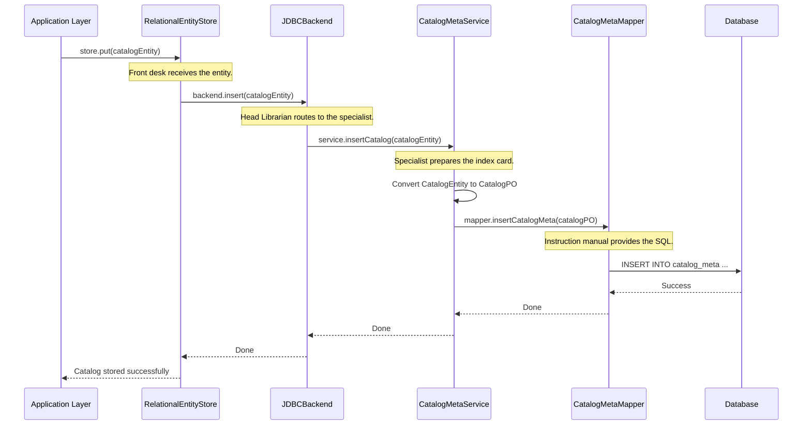

# Chapter 7: Relational Entity Persistence

In the [previous chapter](06_metadata_operation_dispatching_.md), we saw how Gravitino's [Metadata Operation Dispatching](06_metadata_operation_dispatching_.md) acts like an airport control tower, routing live requests to the correct data source plugins. But this raises a question: where does Gravitino store its *own* information?

When you create a new catalog, a user, or a role, Gravitino needs to remember that information permanently. If it just kept it in memory, everything would be lost after a server restart. This is where **Relational Entity Persistence** comes in—it's Gravitino's long-term memory.

### The Problem: How to Remember Everything?

Imagine you're building a library. You have many different types of books: fiction, non-fiction, biographies, etc. You can't just pile them up in a corner. You need a system to organize and store them on shelves so you can find them again later.

Gravitino faces the same challenge. It manages many types of metadata entities: `Metalake`, `Catalog`, `User`, `Role`, and so on. It needs a robust, organized way to save these entities to a durable storage system, like a database.

### The Solution: A Well-Organized Library System

Gravitino's persistence layer works just like a professional librarian. It uses a clear, structured system to store every piece of information in a relational database (like H2 or PostgreSQL).

Let's meet the team that runs this library:

*   **The Head Librarian (`RelationalBackend`)**: This is the main manager of the library. It knows the basic operations for storing and retrieving any "book" (entity). It doesn't need to know the specific details of each book type, just the general process.
*   **Specialist Librarians (`*MetaService`)**: For each type of book (e.g., Catalogs, Users, Roles), there is a specialist librarian. The `CatalogMetaService` is an expert on catalogs, the `UserMetaService` is an expert on users, and so on. They handle all the specific rules for their section.
*   **Standardized Index Cards (`*PO`)**: Before a book is put on a shelf, its details (title, author, etc.) are written onto a simple, standardized index card. In Gravitino, these are **Persistent Objects (`*PO`)**, like `CatalogPO`. They are simple Java objects that directly map to the columns of a database table, making them easy to store.
*   **The Instruction Manuals (`*MetaMapper`)**: Each specialist librarian has an instruction manual that contains the exact SQL commands needed to read from or write the index cards to the database shelves. These are MyBatis `Mapper` interfaces, like `CatalogMetaMapper`.

```mermaid
graph TD
    A["User request: Create 'hive_prod' catalog"] --> B{Head Librarian<br/>(RelationalBackend)};
    B -- "This is a catalog" --> C{Specialist Librarian<br/>(CatalogMetaService)};
    subgraph C
        D[Converts 'CatalogEntity' to 'CatalogPO' index card] --> E[Uses Instruction Manual<br/>(CatalogMetaMapper)];
    end
    E -- "INSERT INTO catalog_meta ..." --> F[(Database Shelves)];
```

### A Practical Example: Storing a New Catalog

Let's see this system in action. A user wants to create a new catalog named `dev_catalog`.

1.  The request arrives at Gravitino. After processing, the system needs to save the new `CatalogEntity`.
2.  It hands the `CatalogEntity` to the `RelationalEntityStore`, which acts as the front desk of the library.
3.  The front desk passes the entity to the Head Librarian, an implementation of `RelationalBackend` called `JDBCBackend`.
4.  The `JDBCBackend` looks at the entity type and sees it's a `CATALOG`. It knows exactly who to call: the catalog specialist, `CatalogMetaService`.
5.  The `CatalogMetaService` takes the complex `CatalogEntity` and translates its information onto a simple `CatalogPO` index card.
6.  Finally, the `CatalogMetaService` uses its `CatalogMetaMapper` instruction manual to execute the correct SQL `INSERT` statement, storing the `CatalogPO`'s data as a new row in the `catalog_meta` table in the database.

The catalog is now safely stored and can be retrieved later.

### How It Works Under the Hood: The Storage Flow

Let's trace the journey of that `CatalogEntity` from the application layer all the way to the database.



This multi-layered design keeps everything organized and maintainable. Let's look at the code for each layer.

#### 1. The Router: `JDBCBackend`

The `JDBCBackend` is the main router. Its `insert` method is a giant switch that delegates work to the correct specialist based on the entity's type.

```java
// From: core/src/main/java/org/apache/gravitino/storage/relational/JDBCBackend.java

public <E extends Entity & HasIdentifier> void insert(E e, boolean overwritten) {
    if (e instanceof CatalogEntity) {
        // It's a Catalog! Send it to the Catalog specialist.
        CatalogMetaService.getInstance().insertCatalog((CatalogEntity) e, overwritten);
    } else if (e instanceof SchemaEntity) {
        // It's a Schema! Send it to the Schema specialist.
        SchemaMetaService.getInstance().insertSchema((SchemaEntity) e, overwritten);
    } else if (e instanceof TableEntity) {
        TableMetaService.getInstance().insertTable((TableEntity) e, overwritten);
    }
    // ... and so on for every entity type
}
```
This class acts as a central hub, ensuring that every entity type is handled by its dedicated service.

#### 2. The Specialist: `CatalogMetaService`

The `CatalogMetaService` contains the business logic for catalogs. It knows how to convert the application-level `CatalogEntity` into a database-friendly `CatalogPO` and then tells the `Mapper` to save it.

```java
// From: core/src/main/java/org/apache/gravitino/storage/relational/service/CatalogMetaService.java

public void insertCatalog(CatalogEntity catalogEntity, boolean overwrite) {
    // ...
    Long metalakeId = CommonMetaService.getInstance().getParentEntityIdByNamespace(...);

    SessionUtils.doWithCommit(
        CatalogMetaMapper.class,
        mapper -> {
            // 1. Convert the entity to a simple POJO (the "index card").
            CatalogPO po = POConverters.initializeCatalogPOWithVersion(catalogEntity, metalakeId);
            // 2. Use the mapper (the "instruction manual") to insert it.
            if (overwrite) {
                mapper.insertCatalogMetaOnDuplicateKeyUpdate(po);
            } else {
                mapper.insertCatalogMeta(po);
            }
        });
}
```
This keeps the logic for handling catalogs all in one place.

#### 3. The Index Card: `CatalogPO`

The `CatalogPO` is a simple data container. It has no complex logic; its only job is to hold the data that will be written to the database. Its fields directly match the columns in the `catalog_meta` table.

```java
// From: core/src/main/java/org/apache/gravitino/storage/relational/po/CatalogPO.java

public class CatalogPO {
  private Long catalogId;
  private String catalogName;
  private Long metalakeId;
  private String type;
  private String provider;
  // ... other fields and getters ...

  public static Builder builder() {
    return new Builder();
  }
}
```
The simplicity of the `PO` makes database operations straightforward. The conversion logic is handled separately in a helper class called `POConverters`.

#### 4. The Instruction Manual: `CatalogMetaMapper`

This is a MyBatis interface that defines the methods which will execute SQL queries. The actual SQL can be in an XML file or defined using annotations. This interface is the bridge between our Java code and the database.

```java
// From: core/src/main/java/org/apache/gravitino/storage/relational/mapper/CatalogMetaMapper.java

public interface CatalogMetaMapper {
  String TABLE_NAME = "catalog_meta";

  // This method corresponds to an SQL INSERT statement.
  @InsertProvider(type = CatalogMetaSQLProviderFactory.class, method = "insertCatalogMeta")
  void insertCatalogMeta(@Param("catalogMeta") CatalogPO catalogPO);

  // This method corresponds to an SQL SELECT statement.
  @SelectProvider(type = CatalogMetaSQLProviderFactory.class, method = "selectCatalogMetaByName")
  CatalogPO selectCatalogMetaByName(
      @Param("metalakeName") String metalakeName, @Param("catalogName") String catalogName);
}
```
This completely separates the SQL from the Java business logic, making the code cleaner and easier to manage.

### Conclusion

You've now learned about Gravitino's **Relational Entity Persistence** system, the backbone that provides its long-term memory.

-   It uses a layered, librarian-style architecture to store metadata in a relational database.
-   **`RelationalBackend` (`JDBCBackend`)** is the Head Librarian, routing requests.
-   **`*MetaService`** classes are the Specialist Librarians, containing the logic for each entity type.
-   **`*PO`** classes are the standardized Index Cards, representing data for the database.
-   **`*MetaMapper`** interfaces are the Instruction Manuals, containing the raw SQL commands.

This robust and organized system ensures that all of Gravitino's metadata is stored safely and efficiently.

Now that we know how data is stored on the "shelves," you might wonder if we have to go to the database every single time we need something. This can be slow. In the next chapter, we'll explore how Gravitino speeds up data access with its [Metadata Entity Caching](08_metadata_entity_caching_.md).

---

Generated by [AI Codebase Knowledge Builder](https://github.com/The-Pocket/Tutorial-Codebase-Knowledge)