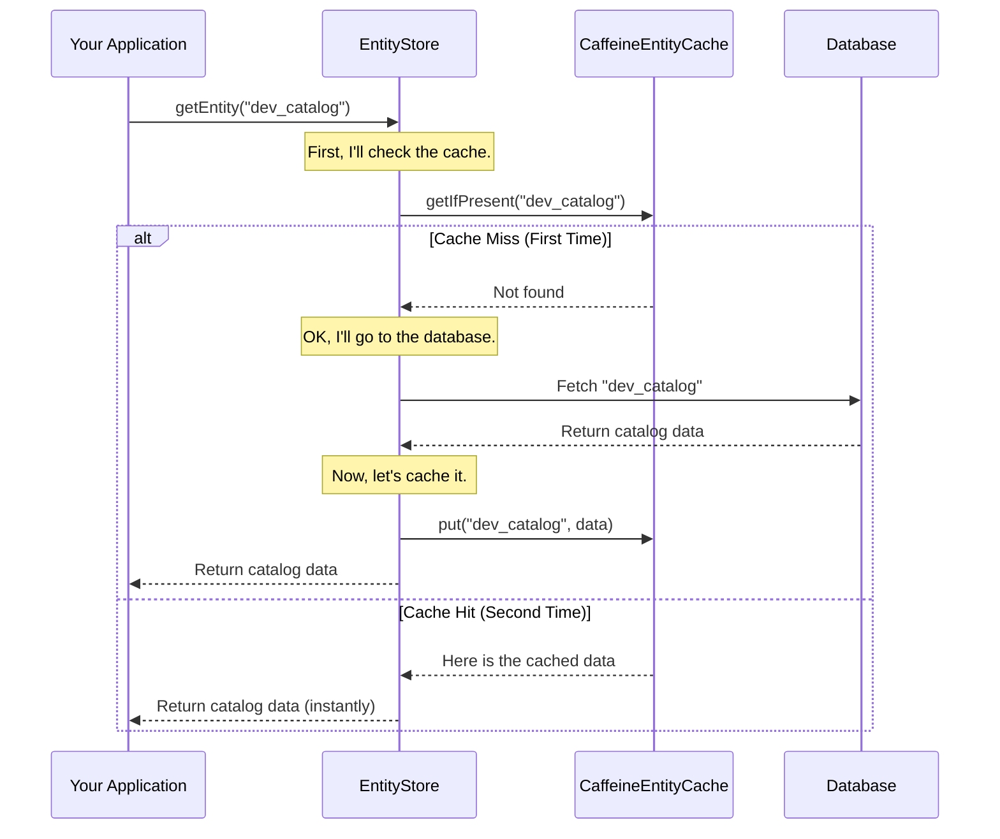

# Chapter 8: Metadata Entity Caching

In the [previous chapter](07_relational_entity_persistence_.md), we learned how Gravitino uses its [Relational Entity Persistence](07_relational_entity_persistence_.md) layer as a long-term memory, like a vast library, to safely store all its metadata. But what happens if you need to access the same information over and over? Constantly walking to the back of the library to fetch the same book is slow and inefficient.

This is where Gravitino's **Metadata Entity Caching** comes in. It's a clever system designed to make frequently accessed data available almost instantly.

### The Personal Assistant with a Great Memory

Imagine the main database (the "library") is in the basement. Every time you need to know the details of a catalog, you have to go all the way down to the basement to look it up. This is reliable, but it takes time.

Now, imagine you hire a personal assistant who sits at a desk right outside your office. The first time you ask for information about the `hive_prod` catalog, the assistant goes to the basement library, gets the details, gives them to you, and—most importantly—writes down a copy of those details on a sticky note and keeps it on their desk.

The next time you ask for the same information, the assistant doesn't go to the basement. They just glance at the sticky note on their desk and give you the answer immediately. This is incredibly fast.

This "personal assistant" is Gravitino's `EntityCache`. The "sticky notes" on their desk are managed by a high-performance, in-memory cache called `CaffeineEntityCache`.

```mermaid
graph TD
    A[Your Request: "Get 'hive_prod' catalog"] --> B{Personal Assistant (EntityCache)};
    subgraph "First Time (Cache Miss)"
        B -- "I don't have a note for that." --> C[Goes to Library (Database)];
        C --> D[Fetches Details];
        D --> B;
        B --> E[Writes a sticky note];
    end
    B --> F[Gives you the answer];
```

```mermaid
graph TD
    A[Your Request: "Get 'hive_prod' catalog"] --> B{Personal Assistant (EntityCache)};
    subgraph "Second Time (Cache Hit)"
        B -- "I have a note for that!" --> E[Reads sticky note];
    end
    B --> F[Gives you the answer instantly];
```

### Key Operations of the Cache

The personal assistant is smart. They know how to perform a few key tasks to keep their notes useful.

1.  **`getIfPresent`**: This is the first thing the assistant does. They check their desk to see if they already have a note for what you're asking for. If they do, they give it to you. If not, they tell you they don't have it.
2.  **`put`**: When the assistant gets new information (after a trip to the library), they `put` a new sticky note on their desk so they can remember it for next time.
3.  **`invalidate`**: The assistant is also smart enough to know that information can become outdated. If someone updates a book in the library, the assistant must `invalidate` (throw away) their old sticky note. The next time you ask, they'll have to fetch the new, updated version from the library, ensuring you never get stale information.

### How Caching Works in Practice

Let's see how Gravitino uses these operations. The main data access component, the `EntityStore`, always talks to the cache first.

#### Case 1: Cache Hit (The information is on the desk)

When you ask for a catalog, the `EntityStore` first calls `getIfPresent` on the cache.

```java
// From: core/src/main/java/org/apache/gravitino/cache/SupportsEntityStoreCache.java

public interface SupportsEntityStoreCache {
  // Retrieves an entity from the cache if it exists.
  <E extends Entity & HasIdentifier> Optional<E> getIfPresent(
      NameIdentifier ident, Entity.EntityType type);
  // ...
}
```
This interface defines the contract for our "personal assistant." The `getIfPresent` method looks for an entity by its unique `NameIdentifier` and `type`. If found, it's returned immediately. No database trip needed!

#### Case 2: Cache Miss (The assistant goes to the library)

If `getIfPresent` returns empty, the `EntityStore` knows it needs to fetch the data from the database. After it gets the data, it helps the assistant by telling them to `put` it in the cache for next time.

```java
// From: core/src/main/java/org/apache/gravitino/cache/SupportsEntityStoreCache.java

public interface SupportsEntityStoreCache {
  // ...
  // Puts an entity into the cache.
  <E extends Entity & HasIdentifier> void put(E entity);
}
```
This simple `put` operation ensures that the next request for the same entity will be a fast "cache hit."

#### Case 3: Keeping Data Fresh (The assistant throws away old notes)

If you update a catalog (e.g., change its comment), Gravitino needs to make sure the cache doesn't hold onto the old, stale version. After updating the database, it explicitly tells the cache to `invalidate` the old entry.

```java
// From: core/src/main/java/org/apache/gravitino/cache/SupportsEntityStoreCache.java

public interface SupportsEntityStoreCache {
  // ...
  // Invalidates the cache entry for the given entity.
  boolean invalidate(NameIdentifier ident, Entity.EntityType type);
}
```
This keeps the cache fast without sacrificing data accuracy.

### How It Works Under the Hood

Let's trace a request for a catalog named `dev_catalog` to see the whole system in action.

1.  **Request**: Your code asks the `EntityStore` for the `dev_catalog`.
2.  **Cache Check**: The `EntityStore` first asks the `CaffeineEntityCache`, "Do you have `dev_catalog`?" by calling `getIfPresent`.
3.  **Cache Miss**: It's the first time, so the cache says no.
4.  **Database Fetch**: The `EntityStore` turns to the [Relational Entity Persistence](07_relational_entity_persistence_.md) layer (the library) and fetches the catalog details from the database.
5.  **Cache Update**: The `EntityStore` receives the catalog details. Before returning them to you, it says to the cache, "Here are the details for `dev_catalog`. Please `put` this in your memory for next time."
6.  **Response**: The `EntityStore` returns the catalog details to your code.

The *next* time you ask for `dev_catalog`, the process stops at step 2, and the cache returns the data instantly.



#### The Engine: `CaffeineEntityCache`

Gravitino uses a popular, high-performance caching library called Caffeine. The `CaffeineEntityCache` class is an adapter that implements Gravitino's caching interfaces using a Caffeine `Cache` object.

```java
// From: core/src/main/java/org/apache/gravitino/cache/CaffeineEntityCache.java

public class CaffeineEntityCache extends BaseEntityCache {
  // The actual high-performance cache from the Caffeine library.
  private final Cache<EntityCacheRelationKey, List<Entity>> cacheData;

  // ... constructor ...

  @Override
  public <E extends Entity & HasIdentifier> Optional<E> getIfPresent(
      NameIdentifier ident, Entity.EntityType type) {
    
    // It creates a key and asks the underlying Caffeine cache for the data.
    List<Entity> entitiesFromCache = cacheData.getIfPresent(EntityCacheRelationKey.of(ident, type));

    // ... logic to return the entity ...
  }
}
```
This snippet shows that `CaffeineEntityCache` is a wrapper. It translates Gravitino's request into a format that the underlying Caffeine engine understands. It uses a special `EntityCacheKey` to uniquely identify each "sticky note."

```java
// From: core/src/main/java/org/apache/gravitino/cache/EntityCacheKey.java

// A key is just a combination of the entity's name and its type.
public class EntityCacheKey {
  private final NameIdentifier identifier; // e.g., NameIdentifier.of("metalake", "catalog")
  private final Entity.EntityType type;    // e.g., EntityType.CATALOG

  // ...
}
```
This key ensures that the assistant can quickly find the exact sticky note you're asking for without any confusion.

### Conclusion

You've just learned about Gravitino's **Metadata Entity Caching**, a critical feature for high performance.

-   It acts like a **personal assistant with a great memory**, keeping frequently used data close at hand.
-   It dramatically **speeds up read operations** by avoiding unnecessary trips to the database.
-   The core operations are **`getIfPresent`**, **`put`**, and **`invalidate`**, which manage the cache's lifecycle.
-   It uses the powerful **Caffeine** library under the hood for efficient in-memory storage.

This caching layer makes Gravitino feel fast and responsive. But how does the system know *when* to invalidate the cache? An update or deletion is an "event." In the next chapter, we'll explore how Gravitino uses a powerful [Event Listening Framework](09_event_listening_framework_.md) to react to such changes.

---

Generated by [AI Codebase Knowledge Builder](https://github.com/The-Pocket/Tutorial-Codebase-Knowledge)