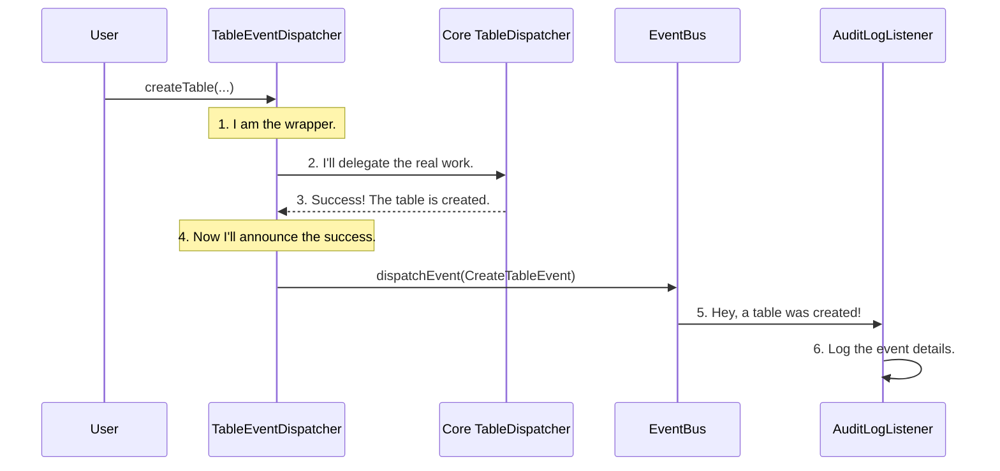

# Chapter 9: Event Listening Framework

In the [previous chapter](08_metadata_entity_caching_.md), we learned how [Metadata Entity Caching](08_metadata_entity_caching_.md) acts like a personal assistant, keeping frequently used data nearby for quick access. But how does the assistant know when their notes are outdated? If a table is deleted, how do we know to invalidate its cache entry?

The answer lies in Gravitino's internal notification system: the **Event Listening Framework**.

### The Smartphone Notification Analogy

Think about your smartphone. When you get a new text message, the phone's operating system sends out a notification. Many different apps can react to this single event:
*   The **Messages app** shows a red badge.
*   Your **smartwatch** vibrates.
*   Your **car's display** shows a pop-up.

The phone's OS doesn't need to know about your watch or your car. It just announces, "A new message has arrived!" Any app that has subscribed to "new message" notifications will then perform its own action.

Gravitino's Event Listening Framework works exactly the same way. When an action happens—like a table being created—Gravitino's core system dispatches an "event." Other parts of the system, or custom plugins, can "listen" for these events and perform actions automatically.

```mermaid
graph TD
    A[Action: Create a new Table] --> B{Gravitino Core};
    B -- "Announces 'CreateTableEvent'" --> C[EventBus];

    subgraph Listeners (Subscribed Apps)
        D[Audit Logger]
        E[Cache Invalidator]
        F[Custom Data Pipeline Trigger]
    end

    C -- Sends notification to --> D;
    C -- Sends notification to --> E;
    C -- Sends notification to --> F;
```

This creates a flexible, pluggable system where you can add new functionality without changing Gravitino's core code.

### A Practical Example: Logging Table Creations

Let's say we want a simple audit log. Every time a user successfully creates a table, we want to print a log message like: `AUDIT: User 'admin' created table 'sales.orders'`.

How can we do this without modifying the table creation logic itself? We can create a simple `EventListenerPlugin`.

1.  **The Event**: When a table is created, Gravitino fires a `CreateTableEvent`. This event is a small data package containing all the relevant information: the user who performed the action (`admin`) and the identifier of the new table (`sales.orders`).
2.  **The Listener**: We write a custom plugin that "listens" for `CreateTableEvent`s.
3.  **The Action**: When our listener receives a `CreateTableEvent`, it extracts the user and table name and prints our desired log message.

This listener is completely decoupled from the table creation process. It just waits for the notification and reacts.

### How It Works Under the Hood: The Event Dispatcher Wrapper

Gravitino cleverly injects this event-firing mechanism using a "wrapper" or "decorator" pattern. Instead of a user's request going directly to the core logic, it first goes through an `EventDispatcher`.

Let's trace a `createTable` request:

1.  **Request Arrives**: A user's request to create a table hits the `TableEventDispatcher`.
2.  **Pre-Event (Optional)**: The `TableEventDispatcher` first sends a `CreateTablePreEvent`. This is a chance for listeners to inspect or even reject the action *before* it happens.
3.  **Delegate to Core Logic**: The `TableEventDispatcher` then passes the request to the real `TableOperationDispatcher` (from [Chapter 6](06_metadata_operation_dispatching_.md)), which does the actual work of creating the table in the underlying data source.
4.  **Post-Event**:
    *   If the operation was **successful**, the `TableEventDispatcher` sends a `CreateTableEvent` to the `EventBus`.
    *   If the operation **failed**, it sends a `CreateTableFailureEvent` instead.
5.  **Broadcast**: The `EventBus` takes the event and broadcasts it to all registered listeners.



This design is brilliant because the core logic (`TableOperationDispatcher`) has no idea that events are being fired. All the event-related responsibility is neatly contained within the dispatcher wrappers.

#### The Wrapper in Action: `TableEventDispatcher`

Let's look at a simplified version of how the `TableEventDispatcher` handles a `createTable` call. It's a `try-catch` block that wraps the real operation.

```java
// From: core/src/main/java/org/apache/gravitino/listener/TableEventDispatcher.java

public Table createTable(NameIdentifier ident, ...) {
    // ... send PreEvent ...
    try {
        // Delegate to the actual dispatcher to do the work.
        Table table = dispatcher.createTable(ident, ...);

        // If it succeeds, create and send a success event.
        eventBus.dispatchEvent(
            new CreateTableEvent(PrincipalUtils.getCurrentUserName(), ident, new TableInfo(table)));
        return table;
    } catch (Exception e) {
        // If it fails, create and send a failure event.
        eventBus.dispatchEvent(
            new CreateTableFailureEvent(PrincipalUtils.getCurrentUserName(), ident, e, ...));
        throw e;
    }
}
```
This code clearly shows the "wrapper" pattern. It does its event-related work before and after calling the `dispatcher` that contains the core business logic. You can see similar `*EventDispatcher` classes for `Catalog`, `Schema`, and `Metalake`.

#### The Central Hub: `EventBus`

The `EventBus` is the central post office. Its job is simple: take an event and deliver it to every listener that has subscribed.

```java
// From: core/src/main/java/org/apache/gravitino/listener/EventBus.java

public class EventBus {
  // A list of all registered listener plugins.
  private final List<EventListenerPlugin> eventListeners;

  // ...

  public Optional<BaseEvent> dispatchEvent(BaseEvent baseEvent) {
    if (baseEvent instanceof Event) {
        // This is a post-event (like CreateTableEvent).
        dispatchPostEvent((Event) baseEvent);
    }
    // ... logic for pre-events ...
  }

  private void dispatchPostEvent(Event postEvent) {
    // Simply loop through all listeners and notify them.
    eventListeners.forEach(eventListener -> eventListener.onPostEvent(postEvent));
  }
}
```
The `EventBus` doesn't need to know what the events are or what the listeners do. It just delivers the mail.

#### The Subscriber: `EventListenerPlugin`

Finally, this is the interface you would implement to create your own listener. It's a simple contract that defines how your plugin will receive events.

```java
// From: core/src/main/java/org/apache/gravitino/listener/api/EventListenerPlugin.java

public interface EventListenerPlugin {
  // ... other lifecycle methods like init() and start() ...

  /**
   * Handle post-events generated after the completion of an operation.
   */
  default void onPostEvent(Event postEvent) throws RuntimeException {}

  /**
   * Handle pre-events generated before the operation.
   */
  default void onPreEvent(PreEvent preEvent) throws ForbiddenException {}
}
```
To create our audit logger, we would implement this interface and put our logging logic inside the `onPostEvent` method, checking if the event is a `CreateTableEvent`.

### Conclusion

You've just learned about Gravitino's powerful **Event Listening Framework**, the key to its extensibility.

-   It works like a **smartphone's notification system**, announcing events to any subscribed listeners.
-   It uses **wrapper dispatchers** (e.g., `TableEventDispatcher`) to fire events before and after core operations without modifying them.
-   The **`EventBus`** acts as a central hub, broadcasting events to all listeners.
-   You can create custom **`EventListenerPlugin`s** to react to these events and add new functionality like logging, monitoring, or triggering external workflows.

This framework is the foundation for many advanced features in Gravitino. In the next chapter, we'll see a concrete and powerful application of this system: [Event-Driven Auditing and Listening](10_event_driven_auditing_and_listening_.md).

---

Generated by [AI Codebase Knowledge Builder](https://github.com/The-Pocket/Tutorial-Codebase-Knowledge)