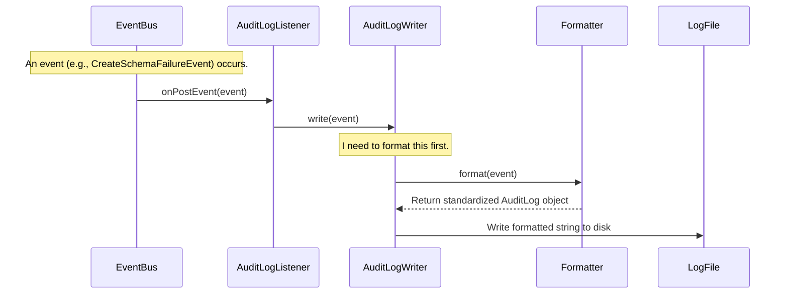

# Chapter 10: Event-Driven Auditing and Listening

In the [previous chapter](09_event_listening_framework_.md), we discovered Gravitino's internal notification system, the [Event Listening Framework](09_event_listening_framework_.md). We learned how Gravitino can make public announcements whenever a significant action occurs.

Now, we'll see one of the most powerful applications of this framework: building a complete, automatic audit log that tracks every important change in your metadata universe.

### The Security Office for Your Data Center

Let's go back to our analogy of a large building with a public announcement system. Every time a door opens (`CreateTableEvent`) or a window is broken (`DropTableFailureEvent`), an announcement is made.

But who is listening to these announcements, and why? The most important listener is the **security office**. Their job is to keep a detailed log of everything that happens in the building. They don't open the doors or break the windows themselves; they just listen, interpret the announcements, and write them down in their security logbook.

In Gravitino, this "security office" is the `AuditLogManager`. It's a built-in listener that automatically subscribes to all the announcements from the [Event Listening Framework](09_event_listening_framework_.md) to create a comprehensive audit trail.

```mermaid
graph TD
    A[Action: User 'alice' drops a table] --> B{Gravitino Core};
    B -- Announces --> C[EventBus: "DropTableEvent from 'alice'"];

    subgraph The Security Office
        D(AuditLogManager Listener) -- Hears --> C;
        D -- "I need to log this" --> E(Formatter);
        E -- "Here's the standard log format" --> F(AuditLogWriter);
        F -- "Writing to the logbook" --> G[audit.log file];
    end
```

### Key Components of the Auditing System

The `AuditLogManager` doesn't work alone. It has a team of specialists to help it do its job properly:

1.  **The Listener (`AuditLogManager`)**: The main component. Its only job is to listen for events from the `EventBus`.
2.  **The Translator (`Formatter`)**: Events come in many different shapes and sizes (`CreateTableEvent`, `AlterSchemaEvent`, etc.). The `Formatter`'s job is to translate the details from *any* event into a single, standardized log format called an `AuditLog`. This ensures every entry in the logbook looks consistent.
3.  **The Scribe (`AuditLogWriter`)**: This component is responsible for the physical act of writing the standardized log entry to a destination. This destination is pluggable—it could be a simple file, a database, or a message queue like Kafka.

This separation of duties makes the system incredibly flexible. You can change *where* the logs are written (by swapping the `AuditLogWriter`) or *how* they are formatted (by swapping the `Formatter`) without ever touching the core listening logic.

### A Practical Example: Auditing a Failed Action

Let's say a user, Bob, tries to create a schema that already exists. The operation will fail. How does Gravitino audit this?

1.  **The Event**: The action fails, so Gravitino's [Event Listening Framework](09_event_listening_framework_.md) fires a `CreateSchemaFailureEvent`. This event contains the user ('Bob'), the schema name, and the exception that occurred.
2.  **The Listener**: The `AuditLogManager`, which is listening for all events, receives this `CreateSchemaFailureEvent`.
3.  **The Translation**: It passes the event to the `Formatter`, which converts it into a standard `AuditLog` object. This object has fields like `user`, `operationType`, `identifier`, and `operationStatus` (which would be 'FAILURE').
4.  **The Write**: The `AuditLogManager` gives the standardized `AuditLog` object to the `AuditLogWriter`. The writer then formats this into a string and writes it to its configured log file.

**The final entry in `audit.log` might look something like this:**

```
INFO [main] JsonFormatter: {"user":"bob","identifier":"dev_lake.hive_prod.sales","operationType":"CREATE_SCHEMA","operationStatus":"FAILURE","timestamp":1678886400000,...}
```
As you can see, we have a clear, machine-readable record of the failed attempt, all thanks to this event-driven process.

### How It Works Under the Hood

The magic of the `AuditLogManager` is that it's just a regular `EventListenerPlugin`. When Gravitino starts, it initializes the `AuditLogManager`, which then registers itself with the `EventBus`.

Let's look at the code that makes this happen.

```java
// From: core/src/main/java/org/apache/gravitino/audit/AuditLogManager.java

public class AuditLogManager {
  public void init(Config config, EventListenerManager eventBusManager) {
    // ... load formatter and writer based on config ...

    // The key step: register a new listener with the EventBus.
    eventBusManager.addEventListener(
        "audit-log",
        new EventListenerPlugin() {
          @Override
          public void onPostEvent(Event event) {
            // When an event is heard...
            try {
              // ...tell the writer to write it.
              auditLogWriter.write(event);
            } catch (Exception e) {
              LOG.warn("Failed to write audit log.", e);
            }
          }
          // ... other lifecycle methods ...
        });
  }
}
```
This snippet is the heart of the system. The `AuditLogManager` creates a simple, anonymous `EventListenerPlugin`. The only thing this listener does in its `onPostEvent` method is call `auditLogWriter.write(event)`. It's a direct and efficient pipeline from event to log file.

Let's trace the flow from event to the final log entry.



#### The Standardized Log Format: `AuditLog`

The `Formatter`'s job is to convert any type of event into an object that implements the `AuditLog` interface. This interface defines the standard fields that every audit entry must have.

```java
// From: core/src/main/java/org/apache/gravitino/audit/AuditLog.java

public interface AuditLog {
  // Who performed the action?
  String user();
  
  // What was the action? (e.g., CREATE_SCHEMA)
  OperationType operationType();

  // What was it performed on?
  String identifier();

  // When did it happen?
  long timestamp();

  // Was it successful?
  OperationStatus operationStatus();
}
```
By enforcing this standard, the system ensures that the audit log is consistent and easy to parse, regardless of which event triggered the entry.

#### The Pluggable Writer: `AuditLogWriter`

The `AuditLogWriter` interface is what makes the log destination configurable. It defines a simple contract for writing an `AuditLog` entry.

```java
// From: core/src/main/java/org/apache/gravitino/audit/AuditLogWriter.java

public interface AuditLogWriter extends Closeable {
  // Initialize the writer with config properties.
  void init(Formatter formatter, Map<String, String> properties);

  // The main method to write the event.
  default void write(Event event) {
    // It uses its formatter to standardize the event before writing.
    doWrite(getFormatter().format(event));
  }

  void doWrite(AuditLog auditLog);
}
```
Gravitino provides a default implementation that writes to a file, but you could easily create a `KafkaAuditLogWriter` or a `DatabaseAuditLogWriter` by implementing this interface.

### Conclusion

You've just seen a real-world application of Gravitino's event system: **Event-Driven Auditing and Listening**.

-   This system provides a **complete, automatic audit trail** for all significant metadata operations.
-   It leverages the [Event Listening Framework](09_event_listening_framework_.md) by using a specialized listener, the **`AuditLogManager`**.
-   It uses a **`Formatter`** to standardize diverse events into a consistent `AuditLog` format.
-   It uses a pluggable **`AuditLogWriter`** to send logs to configurable destinations like files or message queues.

This decoupled, event-driven architecture is a perfect example of how Gravitino is designed to be not only powerful but also highly extensible and maintainable.

---

**Congratulations!** You have completed the Gravitino tutorial. Over the last ten chapters, you have journeyed from the high-level [Entity Hierarchy](01_entity_hierarchy_.md) to the deep internals of caching and event-driven systems. You now have a comprehensive understanding of the core concepts that make Gravitino a powerful and unified metadata management platform. We encourage you to continue exploring, experimenting, and building with Gravitino

---

Generated by [AI Codebase Knowledge Builder](https://github.com/The-Pocket/Tutorial-Codebase-Knowledge)