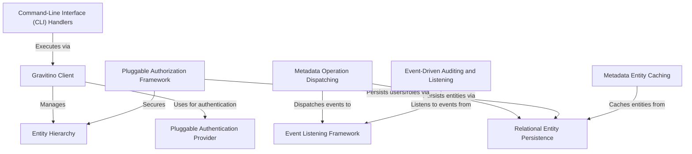

# Tutorial: gravitino

Gravitino is a system for managing *metadata* from various data sources in a single, unified place. It uses a clear **hierarchical structure** (like folders on a computer) to organize everything, starting from a top-level workspace called a *Metalake*.

Users can interact with Gravitino through a **client library** or a command-line tool. The system is highly extensible, allowing developers to plug in different *data sources* (like Hive or Iceberg), custom security rules for authentication and authorization, and react to metadata changes through an internal **event notification system**.

**Source Repository:** [None](None)

## Chapters

1. [Entity Hierarchy
](01_entity_hierarchy_.md)
2. [Gravitino Client
](02_gravitino_client_.md)
3. [Command-Line Interface (CLI) Handlers
](03_command_line_interface__cli__handlers_.md)
4. [Pluggable Authentication Provider
](04_pluggable_authentication_provider_.md)
5. [Pluggable Authorization Framework
](05_pluggable_authorization_framework_.md)
6. [Metadata Operation Dispatching
](06_metadata_operation_dispatching_.md)
7. [Relational Entity Persistence
](07_relational_entity_persistence_.md)
8. [Metadata Entity Caching
](08_metadata_entity_caching_.md)
9. [Event Listening Framework
](09_event_listening_framework_.md)
10. [Event-Driven Auditing and Listening
](10_event_driven_auditing_and_listening_.md)

---

Generated by [AI Codebase Knowledge Builder](https://github.com/The-Pocket/Tutorial-Codebase-Knowledge)