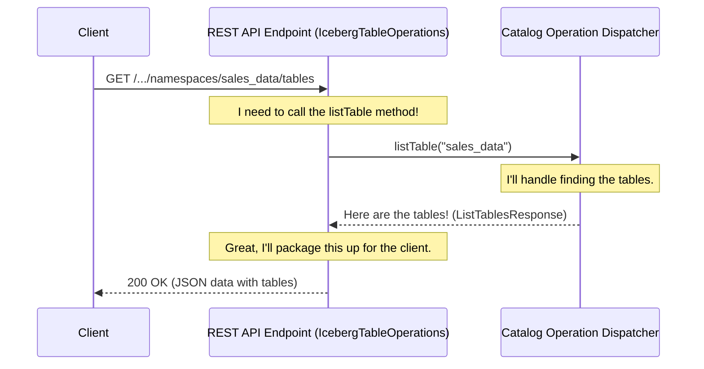

# Chapter 1: REST API Endpoints

Welcome to the first chapter of our journey into the Iceberg REST service! Before we dive deep, let's start at the very beginning: how does a client, like a data processing engine, talk to our service? This chapter will introduce you to the front door of our application: the REST API Endpoints.

### The Problem: How Do We Take Orders?

Imagine you're building a massive, automated warehouse for data tables. Data engineers and analysts from all over need to interact with it. They might want to ask:

*   "What databases (or 'namespaces') do you have?"
*   "Show me all the tables in the `sales_data` database."
*   "I have a new table called `daily_reports`, please store it for me."

How do we create a standardized, reliable way for any tool or person to make these requests and get answers? We need a public-facing "front desk" or a team of "waiters" who know exactly how to handle these questions. In the world of web services, this front desk is called a **REST API**.

### Our Solution: The Waiter in the Code

In our service, the REST API Endpoints are like waiters in a restaurant. They listen for incoming customer requests, understand what the customer wants based on a well-defined menu (the API contract), and then carry that order to the kitchen to be prepared.

Let's look at how this "waiter" is defined in our Java code. We use a popular framework called **JAX-RS**, which provides a set of annotations (special labels starting with `@`) to turn a regular Java class into a web endpoint.

Here are the key annotations you'll see:

*   `@Path`: This is like assigning a specific section of the restaurant to our waiter. It defines the URL that this class will be responsible for.
*   `@GET`, `@POST`, `@DELETE`: These define the *actions* the waiter can perform in their section. `@GET` is for fetching information (like listing tables), `@POST` is for creating something new (like a new table), and `@DELETE` is for removing something.

Let's see this in action for a common request: listing all tables in a namespace.

The client sends an HTTP request that looks something like this:
**GET** `/v1/my_catalog/namespaces/sales_data/tables`

Our service needs to catch this request and run the right piece of code.

```java
// File: iceberg-rest-server/src/main/java/org/apache/gravitino/iceberg/service/rest/IcebergTableOperations.java

@Path("/v1/{prefix:([^/]*/)?}namespaces/{namespace}/tables")
public class IcebergTableOperations {
    // ... class members and constructor ...

    @GET
    @Produces(MediaType.APPLICATION_JSON)
    public Response listTable(
        @PathParam("prefix") String prefix,
        @Encoded() @PathParam("namespace") String namespace) {
        // ... logic to list tables ...
        return tableOperationDispatcher.listTable(context, icebergNS);
    }
}
```

This code might look complex, but let's break it down simply:

1.  `@Path("/v1/.../{namespace}/tables")`: This tells our service that the `IcebergTableOperations` class handles any URL that matches this pattern. The parts in curly braces `{}` are placeholders.
2.  `@GET`: Inside the class, this annotation marks the `listTable` method as the one to run when an HTTP `GET` request arrives at that path.
3.  `@PathParam("namespace") String namespace`: This is the magic part! It tells the service to take the value from the `{namespace}` placeholder in the URL (in our example, `"sales_data"`) and pass it as an argument to our `listTable` method.

So, when a request for `GET /v1/my_catalog/namespaces/sales_data/tables` comes in, our service knows *exactly* which method to call (`listTable`) and what information to give it (`namespace = "sales_data"`).

### How It Works: A Step-by-Step Flow

So what happens when that request to list tables hits our server? Let's follow its journey.

1.  **The Request Arrives**: A client sends the `GET` request.
2.  **The Endpoint Catches It**: The web server sees the URL and, thanks to the `@Path` annotation, hands the request to an instance of `IcebergTableOperations`.
3.  **The Method is Called**: Because it's a `GET` request, the `listTable` method is executed. The namespace `"sales_data"` is passed in as a parameter.
4.  **The Handoff**: The endpoint's job is not to find the tables itself. Its job is to be a good waiter. It takes the parsed request and hands it off to the "kitchen manager" — in our case, a component we call the [Catalog Operation Dispatcher](02_catalog_operation_dispatcher_.md).
5.  **The Response is Sent**: Once the dispatcher returns the list of tables, the endpoint's final job is to package that list into a standard HTTP response and send it back to the client who asked for it.

Here’s a simple diagram illustrating this flow:



### Looking at Another Endpoint: Creating a Namespace

The pattern is the same for other operations too. Let's look at how a namespace (like a database) is created.

The client sends a different kind of request:
**POST** `/v1/my_catalog/namespaces`
(with details of the new namespace in the request body)

The code to handle this lives in a different "waiter" class.

```java
// File: iceberg-rest-server/src/main/java/org/apache/gravitino/iceberg/service/rest/IcebergNamespaceOperations.java

@Path("/v1/{prefix:([^/]*/)?}namespaces")
public class IcebergNamespaceOperations {
    // ...

    @POST
    public Response createNamespace(
        @PathParam("prefix") String prefix,
        CreateNamespaceRequest createNamespaceRequest) {
        // ... logic to prepare the request ...
        return namespaceOperationDispatcher.createNamespace(context, createNamespaceRequest);
    }
}
```

Notice the similarities:
*   The `@Path` defines the URL this class is responsible for.
*   The `@POST` annotation directs creation requests to the `createNamespace` method.
*   The method takes the request details and, once again, passes the work to a dispatcher (`namespaceOperationDispatcher`).

These endpoint classes are the clean, public-facing interface of our service. They handle the messy details of HTTP, parse the requests, and delegate the actual business logic to deeper layers of the application.

### Conclusion

In this chapter, we've met the "waiters" of our Iceberg REST service: the **REST API Endpoints**. We learned that these are Java classes that use JAX-RS annotations like `@Path`, `@GET`, and `@POST` to define a clear, public contract for clients. Their primary role is to receive and understand incoming HTTP requests, and then pass the real work on to the next layer.

Now that we've seen how a request is received, what happens after the handoff? Where does the dispatcher send the order? We'll explore that in the next chapter, where we dive into the brains of the operation: the [Catalog Operation Dispatcher](02_catalog_operation_dispatcher_.md).

---

Generated by [AI Codebase Knowledge Builder](https://github.com/The-Pocket/Tutorial-Codebase-Knowledge)