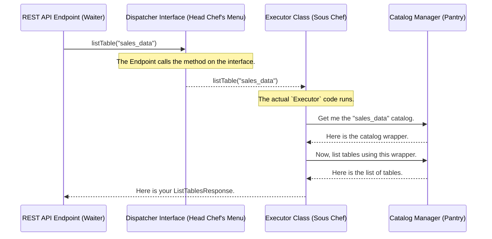

# Chapter 2: Catalog Operation Dispatcher

In our last chapter, [REST API Endpoints](01_rest_api_endpoints_.md), we met the "waiters" of our service. They take orders from clients, but they don't do the cooking themselves. Instead, they pass the order to the kitchen. So, who's in charge of the kitchen? Who takes the order from the waiter and makes sure it gets to the right station?

Welcome to the kitchen's command center: the **Catalog Operation Dispatcher**.

### The Problem: A Chaotic Kitchen

Imagine a restaurant where every waiter runs directly to the grill chef, the salad chef, and the dessert chef for every single order. It would be chaos! The grill chef would be interrupted with questions about salads, and waiters would need to know the detailed cooking steps for every dish.

In our software, this is a real problem. If our REST Endpoint classes contained all the logic for creating tables, listing databases, and updating views, they would become massive, confusing, and difficult to maintain. The "waiter" (API logic) would be tangled up with the "chef's" work (business logic). We need a better system.

### Our Solution: The Head Chef

The Catalog Operation Dispatcher acts as the "head chef" of our kitchen. It stands between the waiters (REST Endpoints) and the line cooks (the actual catalog logic).

When a waiter brings an order, they don't shout it out to the whole kitchen. They give it to the head chef. The head chef looks at the order and says:
*   "This is a request for a steak." -> Sends it to the grill station.
*   "This is a request for a salad." -> Sends it to the salad station.
*   "This is a request for a list of all desserts." -> Asks the pastry station for the menu.

This keeps everything organized. The waiter only needs to talk to one person (the head chef), and the individual cooks can focus on their specific tasks.

In our code, this pattern is implemented using two main parts for each type of operation (like for tables, views, or namespaces):

1.  **The Dispatcher Interface (The Menu):** This is a contract that defines *what* operations are possible. It's like the official menu that the head chef works from. For table operations, this is the `IcebergTableOperationDispatcher`.
2.  **The Executor Class (The Sous Chef):** This is the actual implementation that knows *how* to perform the operations. It's like the specialized sous chef who takes directions from the head chef and executes the recipe. For table operations, this is the `IcebergTableOperationExecutor`.

Let's see what the "menu" for table operations looks like.

```java
// File: iceberg-rest-server/src/main/java/org/apache/gravitino/iceberg/service/dispatcher/IcebergTableOperationDispatcher.java

public interface IcebergTableOperationDispatcher {

  // A "menu item" for listing tables
  ListTablesResponse listTable(IcebergRequestContext context, Namespace namespace);

  // A "menu item" for creating a table
  LoadTableResponse createTable(
      IcebergRequestContext context, Namespace namespace, CreateTableRequest createTableRequest);

  // ... other menu items for tables ...
}
```

This Java `interface` is just a list of methods. It doesn't contain any logic. It simply promises that anyone who claims to be an `IcebergTableOperationDispatcher` will know how to perform these actions.

Now, let's meet the "sous chef" who actually does the work.

```java
// File: iceberg-rest-server/src/main/java/org/apache/gravitino/iceberg/service/dispatcher/IcebergTableOperationExecutor.java

public class IcebergTableOperationExecutor implements IcebergTableOperationDispatcher {

  // ...

  @Override
  public ListTablesResponse listTable(IcebergRequestContext context, Namespace namespace) {
    // Hey CatalogManager, get me the right catalog
    // and then ask it to list the tables in this namespace.
    return icebergCatalogWrapperManager
        .getCatalogWrapper(context.catalogName())
        .listTable(namespace);
  }

  // ... implementations for other menu items ...
}
```
Notice that `IcebergTableOperationExecutor` *implements* `IcebergTableOperationDispatcher`. This is the code's way of saying, "I promise to provide all the dishes listed on the menu." The `listTable` method here contains the actual steps to get the list of tables.

### How It Works: Following the Order

Let's trace the journey of our request from Chapter 1 to see how the Dispatcher fits in.

1.  **Request Arrives**: A client sends `GET /v1/my_catalog/namespaces/sales_data/tables`.
2.  **Endpoint Catches It**: The `IcebergTableOperations` endpoint (our waiter) receives the request.
3.  **Handoff to the Dispatcher**: The endpoint's job is simple. It calls the `listTable` method on its `tableOperationDispatcher` variable. It doesn't know or care *how* the tables are listed; it just trusts the "head chef" to handle it.
4.  **Dispatcher Delegates to Executor**: The service is configured so that the `tableOperationDispatcher` variable holds an instance of our "sous chef", `IcebergTableOperationExecutor`. The call is therefore dispatched to the `listTable` method inside the executor.
5.  **Executor Does the Work**: The executor knows the recipe: get the correct catalog and ask it to perform the operation.
6.  **Response is Returned**: The result travels back up the chain—from the Executor to the Endpoint, which then packages it into an HTTP response for the client.

This flow cleanly separates the responsibilities.



### Why Bother with this Separation?

This "Dispatcher" pattern might seem like an extra step, but it's incredibly powerful.

*   **Clarity and Focus**: Each part has one job. The Endpoint handles web stuff. The Dispatcher defines the contract. The Executor handles the business logic. This makes the code much easier to read and understand.
*   **Flexibility and Testing**: Because the Endpoint only knows about the `IcebergTableOperationDispatcher` *interface* (the menu), we can easily swap out the implementation. For tests, we could plug in a fake `TestExecutor` that returns sample data without ever touching a real catalog. The Endpoint wouldn't know the difference!

### Conclusion

In this chapter, we met the "head chef" of our service: the **Catalog Operation Dispatcher**. We learned that it's a design pattern that separates the API layer from the business logic layer using two key components:

*   **Dispatcher Interfaces** (`IcebergTableOperationDispatcher`): Define a clear "menu" of available operations.
*   **Executor Classes** (`IcebergTableOperationExecutor`): Provide the actual "recipes" for how to perform those operations.

This architecture keeps our code clean, organized, and flexible. The Executor's job is to orchestrate the work, but it needs tools and ingredients to do it. Where does it get the actual connection to the underlying Iceberg catalog? That's the job of our next component, which we'll explore in [Chapter 3: Catalog Wrapper & Manager](03_catalog_wrapper___manager_.md).

---

Generated by [AI Codebase Knowledge Builder](https://github.com/The-Pocket/Tutorial-Codebase-Knowledge)