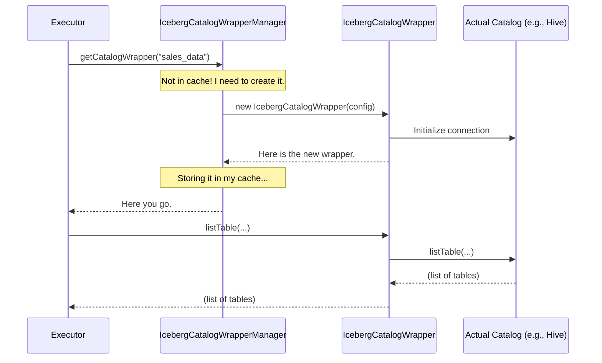

# Chapter 3: Catalog Wrapper & Manager

In the last chapter, [Catalog Operation Dispatcher](02_catalog_operation_dispatcher_.md), we met our "head chef" (the Executor) who knows the recipes for handling requests. We saw that the Executor needs to talk to a specific Iceberg catalog to get its work done.

But this raises a big question: Iceberg can store its data in many different systems—a Hive Metastore, a JDBC database, or even just in memory. Does our Executor need to know the specific commands for every single one of these? That would be like a chef needing to know how to operate every brand of oven ever made. It's not a good design!

### The Problem: Too Many Different Remotes

Imagine you have a TV from Sony, a sound system from Bose, and a streaming box from Apple. Each one comes with its own remote control, and they all have slightly different buttons and layouts. To simply watch a movie, you'd be juggling three different remotes. It’s confusing and inefficient.

This is exactly the problem our service faces. We could be asked to get tables from a Hive catalog one moment and a JDBC catalog the next. If our core logic (the Executor) has to write special code for each type, it becomes incredibly complex and hard to maintain.

We need a "universal remote" for our catalogs.

### Our Solution: A Universal Remote and a Librarian

To solve this, we introduce two key components:

1.  **`IcebergCatalogWrapper` (The Universal Remote):** This is an adapter that "wraps" around any specific catalog (like Hive, JDBC, etc.). It makes every catalog, no matter its type, look and behave in the exact same way. It provides a standard set of buttons—`listTable`, `createTable`, etc.—that our Executor can use without ever knowing what brand of "TV" it's controlling.

2.  **`IcebergCatalogWrapperManager` (The Librarian):** This component is like a librarian who manages a collection of these universal remotes. When our Executor needs to talk to a catalog named `sales_data`, it doesn't build the remote itself. It just asks the librarian: "Can I have the remote for `sales_data`?" The librarian finds the right one, creates it if it's the first time being asked, and hands it over. For efficiency, the librarian also keeps recently used remotes on the desk (caching) so they can be handed out faster next time.

Let's look at how these two parts work together.

#### Part 1: The `IcebergCatalogWrapper`

The wrapper's main job is to hide the details. When it's created, it reads the configuration and figures out what kind of catalog it needs to manage. It then creates the *real* catalog object and keeps it hidden inside.

```java
// File: iceberg-common/src/main/java/org/apache/gravitino/iceberg/common/ops/IcebergCatalogWrapper.java

public class IcebergCatalogWrapper implements AutoCloseable {

    protected Catalog catalog; // The real, hidden catalog (e.g., HiveCatalog)

    public IcebergCatalogWrapper(IcebergConfig icebergConfig) {
        // ... reads config to find the backend type ...
        this.catalog = IcebergCatalogUtil.loadCatalogBackend(catalogBackend, icebergConfig);
    }

    // A standard "button" on our universal remote
    public ListTablesResponse listTable(Namespace namespace) {
        // It just presses the corresponding button on the real remote.
        return CatalogHandlers.listTables(catalog, namespace);
    }
}
```

*   In the constructor, it uses a helper (`IcebergCatalogUtil`) to look at the configuration and create the correct, specific catalog object (like `HiveCatalog` or `JdbcCatalog`).
*   The `listTable` method is simple: it just passes the request along to the *real* catalog object it's holding.

The rest of our application can now call `wrapper.listTable(...)` and get a consistent result, whether the underlying catalog is Hive, JDBC, or anything else.

#### Part 2: The `IcebergCatalogWrapperManager`

The manager's job is to create, cache, and provide these wrappers. It holds a cache (a temporary, high-speed storage) of wrappers that have already been created.

When a request comes in for a catalog named "production_db", the manager does the following:

1.  Look in the cache for "production_db".
2.  If it's there, return it immediately.
3.  If not, create a *new* `IcebergCatalogWrapper` for "production_db", add it to the cache, and then return it.

```java
// File: iceberg-rest-server/src/main/java/org/apache/gravitino/iceberg/service/IcebergCatalogWrapperManager.java

public class IcebergCatalogWrapperManager {

    // A cache to store recently used catalog wrappers
    private final Cache<String, CatalogWrapperForREST> icebergCatalogWrapperCache;
    // ...

    // The main method: our "librarian's desk"
    public CatalogWrapperForREST getCatalogWrapper(String catalogName) {
        return icebergCatalogWrapperCache.get(catalogName, k -> createCatalogWrapper(catalogName));
    }

    private CatalogWrapperForREST createCatalogWrapper(String catalogName) {
        // 1. Get the configuration for this catalog
        IcebergConfig config = configProvider.getIcebergCatalogConfig(catalogName).get();

        // 2. Create a new wrapper with that configuration
        return new CatalogWrapperForREST(catalogName, config);
    }
}
```

The line `icebergCatalogWrapperCache.get(catalogName, k -> createCatalogWrapper(catalogName))` is a clever shortcut. It means "try to get the item with this key from the cache. If it doesn't exist, run this creation code, put the result in the cache, and then return it."

### How It Works: Following the Executor's Request

Let's revisit the flow from Chapter 2 and see where our new components fit in.

1.  **The Executor Needs a Tool**: The `IcebergTableOperationExecutor` is asked to list tables for the `sales_data` catalog.
2.  **Ask the Librarian**: The Executor doesn't create the catalog connection itself. It asks the `IcebergCatalogWrapperManager`: `getCatalogWrapper("sales_data")`.
3.  **The Librarian Checks the Shelves**: The Manager checks its cache for a "sales_data" wrapper. Let's say this is the first time, so it's not there.
4.  **Build a New Tool**: The Manager realizes it needs to create a new wrapper. It will ask another component, the [Catalog Configuration Provider](04_catalog_configuration_provider_.md), for the settings for `sales_data`.
5.  **The Wrapper Initializes**: The new `IcebergCatalogWrapper` is created with these settings. Inside its constructor, it initializes the *actual* backend connection (e.g., it connects to the Hive Metastore).
6.  **Cache and Return**: The Manager places this new wrapper into its cache and returns it to the Executor.
7.  **The Executor Does Its Job**: The Executor now has the wrapper. It calls `wrapper.listTable(...)` and gets the result, without ever knowing the backend details.

Here is a diagram showing this process:



This design keeps our system clean and modular. The Executor is the "chef," the Wrapper is the "universal remote," and the Manager is the "librarian" who ensures the chef always has the right tool for the job.

### Conclusion

In this chapter, we peeled back another layer of our service and discovered two critical components that provide abstraction and efficiency:

*   **`IcebergCatalogWrapper`**: Acts as a universal adapter, making all underlying storage backends look the same. This keeps our business logic simple.
*   **`IcebergCatalogWrapperManager`**: Manages the lifecycle of these wrappers, creating them on-demand and caching them to ensure our service is fast and responsive.

We saw that the manager needs to fetch configuration settings to create a new wrapper. But where do these settings come from? How does our service know that the `sales_data` catalog is a Hive catalog located at a specific address? We'll answer that in our next chapter, where we explore the [Catalog Configuration Provider](04_catalog_configuration_provider_.md).

---

Generated by [AI Codebase Knowledge Builder](https://github.com/The-Pocket/Tutorial-Codebase-Knowledge)