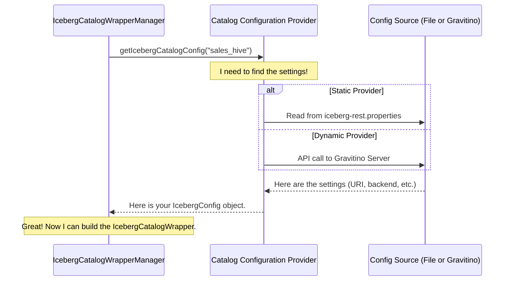

# Chapter 4: Catalog Configuration Provider

In our last chapter, [Catalog Wrapper & Manager](03_catalog_wrapper___manager_.md), we met the "librarian" (`IcebergCatalogWrapperManager`) who creates and manages our universal remotes for catalogs. We saw that when the librarian needs to build a *new* remote for a catalog like "sales_data", its first step is to find the instruction manual—the configuration settings for that catalog.

But where does the librarian find this manual? Is it in a single, massive book? Does it have to call a central office to ask for it? This is a critical question for building a flexible and manageable system.

### The Problem: Where Do We Keep the Blueprints?

Imagine you're the manager of a large apartment complex. You have hundreds of apartments, and each one might have a different layout, different appliances, and different utility hookups. When a new tenant moves in, you need to give them the correct key and the correct "welcome packet" with information specific to their unit.

If you kept all this information only in your head or on scattered sticky notes, it would be a disaster. You need an organized, reliable system to look up the details for "Apartment 4B" or "Penthouse 2" on demand.

Our REST service has the same problem. It might be responsible for dozens or even hundreds of different Iceberg catalogs. Each one has its own unique settings:
*   **Catalog `sales_hive`**: A Hive Metastore located at `thrift://hive-meta:9083`.
*   **Catalog `marketing_db`**: A JDBC catalog using a PostgreSQL database at `jdbc:postgresql://...`.
*   **Catalog `testing_mem`**: An in-memory catalog for temporary use.

How does our `IcebergCatalogWrapperManager` find the right "blueprint" for a requested catalog? Hardcoding them is not an option. We need a dedicated directory service.

### Our Solution: A Building Directory for Catalogs

This is where the **Catalog Configuration Provider** comes in. It acts as the central building directory for our service. When the `IcebergCatalogWrapperManager` needs the settings for a catalog named "sales_hive", it doesn't search for them itself. It simply walks over to the directory and asks: "What are the details for `sales_hive`?"

The "directory" then looks up the information and hands back a neat package of settings. The beauty of this design is that we can plug in different *kinds* of directories depending on our needs. Our service supports two main types.

#### 1. The Printed Directory: `StaticIcebergConfigProvider`

This is the simplest approach. It's like a classic, printed directory in a building lobby. All the information is defined upfront in a single configuration file on the server. This is great for environments where the set of catalogs is stable and doesn't change often.

You would define your catalogs in a properties file like this:

```properties
# File: iceberg-rest.properties

# Settings for the 'sales_hive' catalog
gravitino.iceberg-rest.catalog.sales_hive.catalog-backend = hive
gravitino.iceberg-rest.catalog.sales_hive.uri = thrift://hive-meta:9083

# Settings for the 'marketing_db' catalog
gravitino.iceberg-rest.catalog.marketing_db.catalog-backend = jdbc
gravitino.iceberg-rest.catalog.marketing_db.uri = jdbc:postgresql://...
```

The `StaticIcebergConfigProvider` simply reads this file at startup and stores the settings in a map. When asked for `sales_hive`, it finds all the keys that start with `gravitino.iceberg-rest.catalog.sales_hive` and packages them up.

```java
// File: .../provider/StaticIcebergConfigProvider.java
public class StaticIcebergConfigProvider implements IcebergConfigProvider {
    // A map to hold all the catalog settings loaded from the file
    private Map<String, IcebergConfig> catalogConfigs;

    // ... startup logic to load the properties file into the map ...

    @Override
    public Optional<IcebergConfig> getIcebergCatalogConfig(String catalogName) {
        // Just look it up in the map!
        return Optional.ofNullable(catalogConfigs.get(catalogName));
    }
}
```
This is simple, fast, and easy to understand.

#### 2. The Live, Digital Directory: `DynamicIcebergConfigProvider`

Now, imagine your apartment complex is part of a huge, city-wide rental company. Information about apartments changes daily. A printed directory would be instantly out of date. You need a live, digital kiosk that connects to the company's central database to get the latest information.

This is what the `DynamicIcebergConfigProvider` does. Instead of reading a local file, it's configured to talk to another service—Gravitino itself! When a request for a catalog like "finance_catalog" comes in, this provider makes a network call to Gravitino and asks, "Hey, do you manage a catalog called `finance_catalog`? If so, give me its properties."

This is incredibly powerful because it means you can add, remove, or update catalogs in your central Gravitino system, and the Iceberg REST service will *dynamically* pick up the changes without needing a restart. It makes the REST service a flexible proxy for a much larger data ecosystem.

```java
// File: .../provider/DynamicIcebergConfigProvider.java
public class DynamicIcebergConfigProvider implements IcebergConfigProvider {
    private GravitinoClient client; // A client to talk to the Gravitino server

    // ... startup logic to create the client ...

    @Override
    public Optional<IcebergConfig> getIcebergCatalogConfig(String catalogName) {
        try {
            // Ask the central Gravitino server for the catalog's properties
            Catalog catalog = client.loadMetalake(metalake).loadCatalog(catalogName);
            Map<String, String> properties = catalog.properties();
            return Optional.of(new IcebergConfig(properties));
        } catch (NoSuchCatalogException e) {
            // The central server doesn't know about this catalog
            return Optional.empty();
        }
    }
}
```

### How It Works: The Manager Consults the Directory

Let's trace the full journey of a request to see how these pieces fit together. This diagram shows the flow when the `IcebergCatalogWrapperManager` needs to create a catalog wrapper for the first time.



The `IcebergCatalogWrapperManager` doesn't care if the provider is static or dynamic. It just knows it can ask for configuration and get an answer. This is the power of using interfaces and abstraction.

#### Choosing Your Provider

So how does the service know which provider to use? It's controlled by a single setting in the main configuration file. A simple factory class reads this property and creates the correct provider instance when the server starts.

```java
// File: .../provider/IcebergConfigProviderFactory.java
public class IcebergConfigProviderFactory {
    public static IcebergConfigProvider create(Map<String, String> properties) {
        // Read the provider name from the config
        String providerName = properties.get("catalog-provider");

        if ("static".equals(providerName)) {
            return new StaticIcebergConfigProvider();
        } else if ("dynamic".equals(providerName)) {
            return new DynamicIcebergConfigProvider();
        }
        // ... error handling ...
    }
}
```
This makes the entire configuration lookup system pluggable and easy to extend in the future.

### Conclusion

In this chapter, we uncovered the directory service of our application: the **Catalog Configuration Provider**. We learned that this component is responsible for one crucial task: looking up the configuration for a given catalog.

We explored the two main implementations:
*   **`StaticIcebergConfigProvider`**: A simple provider that reads settings from a local file, perfect for fixed environments.
*   **`DynamicIcebergConfigProvider`**: A powerful provider that fetches settings from a central Gravitino server, enabling a highly flexible, dynamic, and scalable architecture.

This provider is the final piece of the puzzle for how our service handles a request. It provides the necessary blueprints to the `IcebergCatalogWrapperManager`, which then builds the tools needed by the `Catalog Operation Dispatcher` to do its work.

Now that we've seen all the core components that handle a request, how does the service itself start, stop, and get wired together? In the next chapter, we'll take a step back and look at the big picture in [Chapter 5: REST Service Lifecycle](05_rest_service_lifecycle_.md).

---

Generated by [AI Codebase Knowledge Builder](https://github.com/The-Pocket/Tutorial-Codebase-Knowledge)