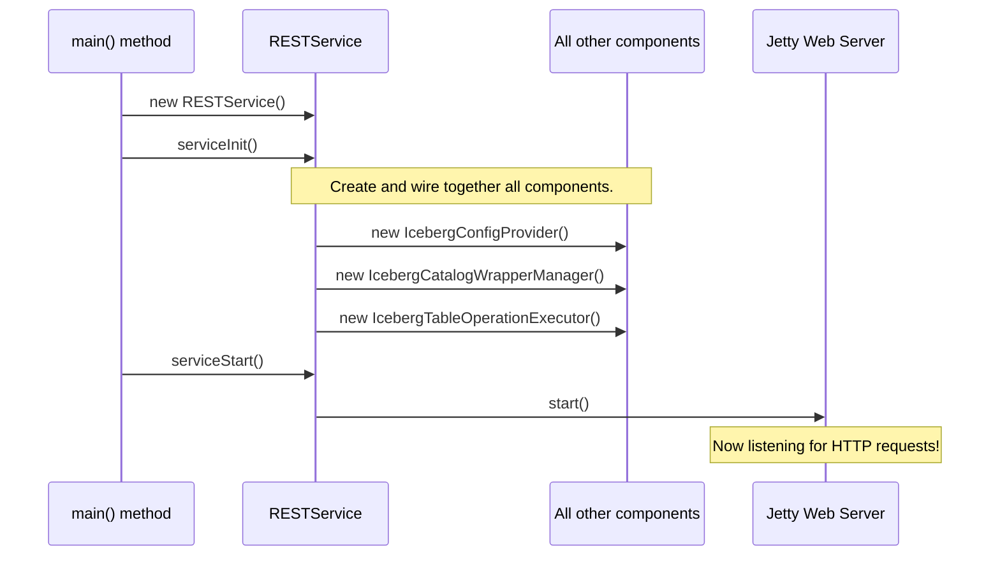

# Chapter 5: REST Service Lifecycle

In the last four chapters, we've met all the key players in our Iceberg REST service: the "waiters" ([REST API Endpoints](01_rest_api_endpoints_.md)), the "head chef" ([Catalog Operation Dispatcher](02_catalog_operation_dispatcher_.md)), the "librarian" with the universal remotes ([Catalog Wrapper & Manager](03_catalog_wrapper___manager_.md)), and the "building directory" ([Catalog Configuration Provider](04_catalog_configuration_provider_.md)).

We have all the individual staff members and tools for our restaurant. But who unlocks the doors in the morning, turns on the lights, hires everyone, and makes sure they know how to work together? How does this collection of parts become a living, breathing service?

### The Problem: Assembling the Machine

Imagine you have all the parts for a brand new car: an engine, wheels, a chassis, and seats. They are all expertly crafted, but they are just sitting in a pile on the factory floor. They can't do anything on their own. You need a master mechanic and an assembly line to put them all together in the right order, connect the wires, and finally, turn the key to start the engine.

Our software components are just like those car parts. We have the `IcebergTableOperations` endpoint, the `IcebergTableOperationExecutor`, and the `IcebergCatalogWrapperManager`, but they are just separate classes. We need a master conductor to:
1.  Create an instance of each component.
2.  "Wire" them together so they can talk to each other (e.g., give the endpoint a way to talk to the dispatcher).
3.  Start the underlying web server to begin listening for customer requests.
4.  Gracefully shut everything down when the service is stopped.

### Our Solution: The Restaurant Manager

The **`RESTService`** class is the "restaurant manager" or the "master mechanic" of our application. It is the central engine responsible for the entire lifecycle of the server. Its job isn't to handle individual requests but to manage the entire operation from startup to shutdown.

This lifecycle has three distinct phases, just like a restaurant's day:
1.  **Opening Prep (`serviceInit`):** The manager arrives before opening. They turn on the ovens, set up the tables, and make sure the waiters and chefs are ready. In our code, this is where all our service components are created and connected.
2.  **Open for Business (`serviceStart`):** The manager unlocks the front door and flips the sign to "Open". The web server starts, and the service begins accepting HTTP requests from clients.
3.  **Closing Time (`serviceStop`):** At the end of the day, the manager locks the door, turns off the equipment, and sends the staff home. The web server stops listening, and all resources are cleanly released.

Let's look at how this manager, the `RESTService` class, performs these duties.

#### Phase 1: Opening Prep (`serviceInit`)

This is the most important phase. The `serviceInit` method is the assembly line where everything is put together.

```java
// File: iceberg-rest-server/src/main/java/org/apache/gravitino/iceberg/RESTService.java

@Override
public void serviceInit(Map<String, String> properties) {
    // 1. Create the server but don't start it yet.
    server = new JettyServer();
    server.initialize(serverConfig, SERVICE_NAME, false);

    // 2. Create the configuration provider (the "directory").
    this.configProvider = IcebergConfigProviderFactory.create(properties);

    // 3. Create the catalog manager (the "librarian").
    this.icebergCatalogWrapperManager =
        new IcebergCatalogWrapperManager(properties, configProvider);

    // 4. Create the operation executor (the "sous chef").
    IcebergTableOperationExecutor tableExecutor =
        new IcebergTableOperationExecutor(icebergCatalogWrapperManager);
    
    // ... create other executors for views and namespaces ...

    // 5. Wire everything together for the web server.
    // (More on this magic step below)
    ...
}
```
Here's what's happening, step-by-step:
1.  A `JettyServer` object is created. This is the underlying web server that will handle HTTP requests, but it's still "off" at this point.
2.  The [Catalog Configuration Provider](04_catalog_configuration_provider_.md) is created.
3.  The [Catalog Wrapper & Manager](03_catalog_wrapper___manager_.md) is created and, crucially, is given the `configProvider` so it knows where to find its blueprints.
4.  The [Catalog Operation Dispatcher](02_catalog_operation_dispatcher_.md)'s executor is created. It's given the `icebergCatalogWrapperManager` so it knows how to get the tools it needs.

You can see how each new component is given the previously created one it depends on. This is called **dependency injection**, and it's how we build our chain of command.

##### The Magic Wiring Step

The final part of `serviceInit` is telling our web framework which component handles which job. We do this by "binding" an interface to its implementation.

```java
// File: iceberg-rest-server/src/main/java/org/apache/gravitino/iceberg/RESTService.java

config.register(
    new AbstractBinder() {
      @Override
      protected void configure() {
        // When a REST Endpoint asks for an IcebergTableOperationDispatcher...
        // ...give it our executor instance!
        bind(icebergTableEventDispatcher)
            .to(IcebergTableOperationDispatcher.class);
      }
    });
```
This might look complex, but the idea is simple. It's like the manager telling the new front desk staff: "If a customer asks for the 'Table Manager', point them to this person, our head chef." It ensures that when a request hits our [REST API Endpoints](01_rest_api_endpoints_.md), the framework knows exactly which "executor" object to pass the work to.

#### Phase 2: Open for Business (`serviceStart`)

This part is much simpler. All the hard work was done in `serviceInit`. Now, the manager just needs to flip the switch.

```java
// File: iceberg-rest-server/src/main/java/org/apache/gravitino/iceberg/RESTService.java

@Override
public void serviceStart() {
    if (server != null) {
        try {
            // Turn on the web server!
            server.start();
            LOG.info("Iceberg REST service started");
        } catch (Exception e) {
            // ... error handling ...
        }
    }
}
```
With that one `server.start()` call, our Jetty server powers up and starts listening for HTTP requests on the configured port. Our restaurant is now officially open!

#### Phase 3: Closing Time (`serviceStop`)

When the application needs to shut down, the `serviceStop` method is called to ensure a clean exit.

```java
// File: iceberg-rest-server/src/main/java/org/apache/gravitino/iceberg/RESTService.java

@Override
public void serviceStop() throws Exception {
    if (server != null) {
        // Stop the web server from accepting new requests.
        server.stop();
    }
    // Clean up resources used by our components.
    if (configProvider != null) {
        configProvider.close();
    }
    if (icebergCatalogWrapperManager != null) {
        icebergCatalogWrapperManager.close();
    }
}
```
This is the reverse of the startup process. First, the server is stopped to prevent any new customers from coming in. Then, each component is told to `close()`, allowing it to release any resources it was holding, like database connections or cached data.

### The Big Picture: From Ignition to Running Engine

So how does this `RESTService` itself get started? There's one final piece: the `main` method, which acts as the ignition switch for the whole car. This lives in a class called `GravitinoIcebergRESTServer`.

Here’s a simplified view of the startup sequence:



The `main` method is the entry point that a human operator runs from the command line. It creates our "manager" (`RESTService`) and then tells it to `init` and `start`. Once the server is running, the manager's job is mostly done until it's time to shut down.

### Conclusion

In this chapter, we took a step back to see the big picture. We learned about the **REST Service Lifecycle**, managed by the `RESTService` class. This class acts as the master conductor of our application.

*   It uses the `serviceInit` method as an assembly line to **create** all the individual components we've learned about and **wire** them together.
*   It uses `serviceStart` to **start** the underlying web server, opening the service to the world.
*   It uses `serviceStop` to gracefully **shut down** all components and release resources.

We've now seen how a request is received, processed through multiple layers, and how the entire service is brought to life. But what if we want to know *when* something interesting happens, like a new table being created? How can other parts of a larger system react to changes happening inside our service?

In the next chapter, we'll explore a powerful mechanism for communication: the [Iceberg Events System](06_iceberg_events_system_.md).

---

Generated by [AI Codebase Knowledge Builder](https://github.com/The-Pocket/Tutorial-Codebase-Knowledge)