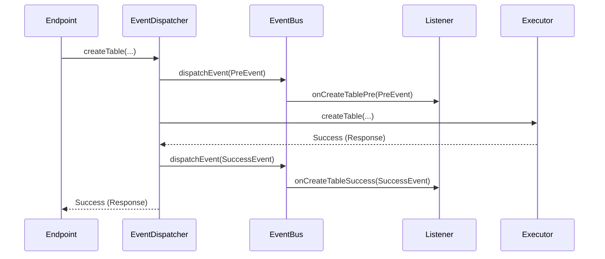

# Chapter 6: Iceberg Events System

In our last chapter, [REST Service Lifecycle](05_rest_service_lifecycle_.md), we saw how the entire service is assembled and brought to life. We now have a fully functional "restaurant" where requests come in, are processed by the right staff, and responses are sent back. But what if we want to keep an eye on what's happening? What if we need a record of every order, or want an alert when a special VIP customer arrives?

Our service is running, but it's like a kitchen with no cameras and no announcement system. We can't easily see what's going on inside.

### The Problem: How Do We Observe and React?

Imagine you are the restaurant manager. You want to implement a few new policies:
*   **Auditing:** For security, you want to log every time a new "dish" (table) is added to the menu.
*   **Notifications:** You want your team to get a Slack message whenever a popular dish is ordered (a table is loaded).
*   **Validation:** Before a new dish is officially added to the menu, you want the head chef to give it a final look-over, perhaps adding a garnish (a metadata tag).

How could you do this? You *could* go into the kitchen and tell every single chef to add these steps directly into their cooking process. But this would be a nightmare! The cooking logic would get cluttered with logging, notification, and validation code. If you change your logging system, you'd have to update every recipe. This isn't scalable or clean.

We need a way for the core logic to remain focused on its job, while allowing other parts of the system to listen in and react to important moments.

### Our Solution: A Security Camera and Announcement System

This is exactly what the **Iceberg Events System** provides. It's a publish-subscribe system built right into the heart of our service. It works just like a modern security and PA system in a building.

The system is built on three simple ideas:

1.  **Events (The Announcements):** An event is a simple message that says "Something is about to happen," "Something just succeeded," or "Something just failed." They are named very clearly.
    *   `IcebergCreateTablePreEvent`: "Attention: A request to create a new table has just arrived."
    *   `IcebergCreateTableEvent`: "Announcement: A new table was just created successfully."
    *   `IcebergCreateTableFailureEvent`: "Alert: The attempt to create a new table has failed."

2.  **EventBus (The PA System):** This is the central broadcaster. When an event is created, it's sent to the EventBus, which then announces it to anyone who is listening.

3.  **Listeners (The Security Guards & Notification Bots):** These are separate components you can write that "subscribe" to the EventBus. A `LoggingListener` might listen for all success and failure events to write them to a file. A `SlackNotificationListener` might only listen for `DropTableEvent` to send an alert.

### How It Works: The Announcer in the Middle

So, who actually makes these announcements? We don't want to clutter our "chef" (the `IcebergTableOperationExecutor`) with this job. Instead, we use a clever decorator pattern. We wrap our executor with a special **Event Dispatcher**.

Meet the `IcebergTableEventDispatcher`. It sits between the [REST API Endpoints](01_rest_api_endpoints_.md) and the `IcebergTableOperationExecutor`. Its *only* job is to make announcements before and after the real work is done.

Let's look at its `createTable` method. It follows a very specific pattern for every operation:

```java
// File: .../dispatcher/IcebergTableEventDispatcher.java

public LoadTableResponse createTable(
    IcebergRequestContext context, Namespace namespace, CreateTableRequest request) {
  
  // 1. Announce what we're ABOUT to do.
  IcebergCreateTablePreEvent preEvent = new IcebergCreateTablePreEvent(context, ..., request);
  eventBus.dispatchEvent(preEvent);

  LoadTableResponse response;
  try {
    // 2. Ask the real executor to do the work.
    response = icebergTableOperationDispatcher.createTable(context, namespace, request);

  } catch (Exception e) {
    // 3a. If it fails, announce the failure.
    eventBus.dispatchEvent(new IcebergCreateTableFailureEvent(context, ..., request, e));
    throw e;
  }

  // 3b. If it succeeds, announce the success.
  eventBus.dispatchEvent(new IcebergCreateTableEvent(context, ..., request, response));
  return response;
}
```
This is a beautiful and clean design:
1.  **Fire a `PreEvent`**: Announce the intent to perform an action. A listener could even modify the `request` at this stage!
2.  **Delegate the Work**: Call the actual `IcebergTableOperationExecutor` to perform the core logic.
3.  **Fire a Result Event**: If the operation succeeded, fire a success event. If it threw an error, fire a failure event.

This wrapper ensures that every single operation is announced, without the core logic ever knowing about the event system.

### A Closer Look at an "Announcement"

What does an event object actually look like? It's just a simple data container. It holds all the information a listener would need to understand what happened.

```java
// File: .../event/IcebergCreateTableEvent.java

public class IcebergCreateTableEvent extends IcebergEvent {

  // The original request to create the table
  private final CreateTableRequest createTableRequest;
  
  // The successful response from the catalog
  private final LoadTableResponse loadTableResponse;

  // ... constructor and getter methods ...
}
```
As you can see, it's not complex. It's just a package of information that the EventBus can deliver. The base `IcebergEvent` class also contains helpful context, like who made the request (`userName`) and their IP address.

### Under the Hood: Tracing the Flow of an Event

Let's trace a `createTable` request from start to finish to see how all the pieces interact.

1.  A request to create a table hits our service.
2.  The `IcebergTableOperations` endpoint passes the request to the dispatcher.
3.  The `IcebergTableEventDispatcher` gets the call.
4.  It creates an `IcebergCreateTablePreEvent` and sends it to the `EventBus`.
5.  The `EventBus` forwards this event to all subscribed listeners (e.g., an `AuditListener`).
6.  The `EventDispatcher` then calls the real `IcebergTableOperationExecutor` to create the table.
7.  The executor succeeds and returns a response.
8.  The `EventDispatcher` creates an `IcebergCreateTableEvent` and sends it to the `EventBus`.
9.  The `EventBus` again forwards this to the `AuditListener`, which now logs the successful creation.
10. The `EventDispatcher` returns the final response up the chain.

Here's a diagram of that flow:



This system makes our service incredibly **extensible** and **observable**. Want to add metrics? Just write a `MetricsListener`. Want to add custom access control? Write an `AccessControlListener` that listens to `PreEvents` and can throw an exception to stop an operation before it even starts. You can add all this new functionality without ever touching the core, tested catalog logic.

### Conclusion

In this chapter, we've discovered the **Iceberg Events System**, the central nervous system of our service. It allows the application to communicate what it's doing, enabling powerful features like auditing, notifications, and custom logic.

We learned about:
*   **Events**: Simple messages that describe an operation (`PreEvent`, `...Event`, `...FailureEvent`).
*   **EventBus**: The central broadcaster that delivers these messages.
*   **Listeners**: Custom components that can subscribe to events and react to them.
*   **Event Dispatchers**: Special wrappers that sit in front of the core logic to transparently send out events for every action.

---

And with that, our journey through the architecture of the Iceberg REST service is complete!

You've traveled from the front door ([REST API Endpoints](01_rest_api_endpoints_.md)), through the organized kitchen ([Catalog Operation Dispatcher](02_catalog_operation_dispatcher_.md)), seen the universal tools and the librarian who manages them ([Catalog Wrapper & Manager](03_catalog_wrapper___manager_.md)), learned where the blueprints are stored ([Catalog Configuration Provider](04_catalog_configuration_provider_.md)), understood how the whole operation starts up and shuts down ([REST Service Lifecycle](05_rest_service_lifecycle_.md)), and finally, explored the announcement system that makes it all observable ([Iceberg Events System](06_iceberg_events_system_.md)).

Congratulations! You now have a solid, high-level understanding of how all the major pieces of the `iceberg` project fit together to create a robust, flexible, and extensible service.

---

Generated by [AI Codebase Knowledge Builder](https://github.com/The-Pocket/Tutorial-Codebase-Knowledge)