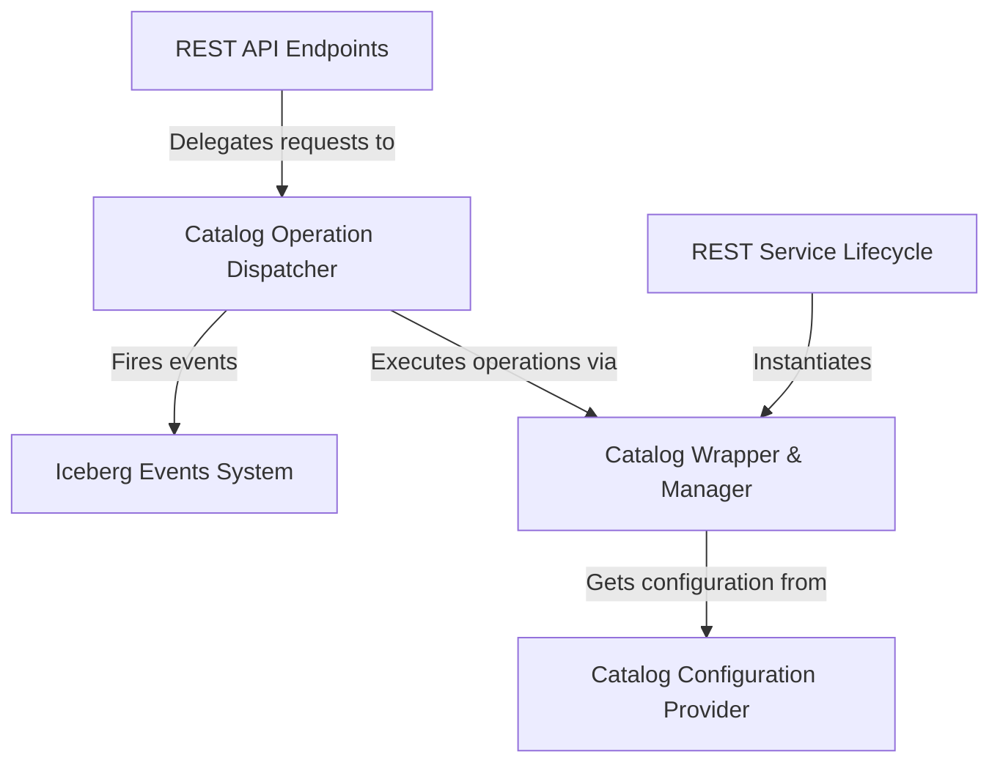

# Tutorial: iceberg

This project provides a **standalone REST service** that acts as a universal gateway for managing *Apache Iceberg* data catalogs. It allows clients to perform operations like creating, dropping, and listing tables and namespaces over standard HTTP, abstracting away the specific details of the underlying storage backends like Hive or JDBC.

**Source Repository:** [None](None)

## Chapters

1. [REST API Endpoints
](01_rest_api_endpoints_.md)
2. [Catalog Operation Dispatcher
](02_catalog_operation_dispatcher_.md)
3. [Catalog Wrapper & Manager
](03_catalog_wrapper___manager_.md)
4. [Catalog Configuration Provider
](04_catalog_configuration_provider_.md)
5. [REST Service Lifecycle
](05_rest_service_lifecycle_.md)
6. [Iceberg Events System
](06_iceberg_events_system_.md)

---

Generated by [AI Codebase Knowledge Builder](https://github.com/The-Pocket/Tutorial-Codebase-Knowledge)