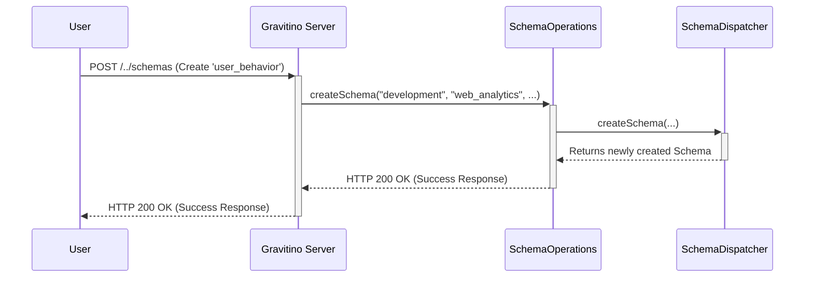

# Chapter 1: REST API Endpoints

Welcome to the Gravitino server tutorial! This is the very first chapter, where we'll start our journey by exploring the front door of the server: its REST API Endpoints.

Imagine you're building a massive, modern library for all your company's data. You have books (tables), sections (schemas), and entire floors (catalogs). How do people find, check out, or add new books? They can't just wander into the back rooms! They need to go to the front desk.

This is exactly what REST API Endpoints do for the Gravitino server. They act as the "front desk," providing a clear, public way for users and applications to interact with the metadata (the data about your data) that Gravitino manages.

### The Library Analogy

Think of the Gravitino server as a grand library. The API endpoints are the specialized librarians at the front desk:

*   If you want to know about different floors (Metalakes), you talk to the `MetalakeOperations` librarian.
*   If you need to manage a specific section (a Catalog), you go to the `CatalogOperations` librarian.
*   For help with a collection of books (a Schema), the `SchemaOperations` librarian is your person.
*   And for a single book (a Table), you'll be directed to the `TableOperations` librarian.

Each librarian (`...Operations` class) knows exactly how to handle requests for their specific area. This keeps everything organized and efficient.

### Our Goal: Creating a New Schema

Let's set a simple goal: we want to create a new "schema" (a container for tables). Think of it as adding a new, labeled shelf to one of the library's sections.

To do this, a user would send a request to the server that looks something like this:

*   **Action:** Create something new (`POST` request).
*   **Where:** To the "schemas" area, within the "web_analytics" catalog, which is inside the "development" metalake.
*   **What:** A new schema named `user_behavior` with a comment.

The server needs to understand this request and direct it to the right place. Let's see how.

### Finding the Right Librarian: The `...Operations` Classes

In Gravitino, the code that defines these "librarians" is organized into classes ending with `Operations`. Each class is responsible for a single type of resource.

Here are a few examples from the codebase:
*   `MetalakeOperations.java`
*   `CatalogOperations.java`
*   `SchemaOperations.java`
*   `TableOperations.java`
*   `UserOperations.java`

Since our goal is to create a schema, the request will be handled by the `SchemaOperations.java` class.

### Anatomy of an Endpoint Method

Let's peek inside `SchemaOperations.java` to see how it defines the endpoint for creating a schema. We'll look at a simplified version of the `createSchema` method.

```java
// File: src/main/java/org/apache/gravitino/server/web/rest/SchemaOperations.java

@Path("/metalakes/{metalake}/catalogs/{catalog}/schemas")
public class SchemaOperations {

    @POST
    public Response createSchema(
        @PathParam("metalake") String metalake,
        @PathParam("catalog") String catalog,
        SchemaCreateRequest request) {
        // ... implementation details ...
        return Response.ok(/*... a schema response ...*/).build();
    }
}
```

This might look complex, but it's quite simple when you break it down:

*   `@Path("/metalakes/{metalake}/...")`: This annotation at the top of the class defines the base URL for all schema-related operations. It's like telling the post office the main address of the "Schema" department. The parts in curly braces `{}` are placeholders.
*   `@POST`: This annotation marks the `createSchema` method to handle HTTP `POST` requests, which are used for creating new resources.
*   `@PathParam("metalake") String metalake`: This tells the server to take the value from the `{metalake}` part of the URL and put it into the `metalake` variable.
*   `SchemaCreateRequest request`: This represents the body of the request, which contains details like the new schema's name and comments, sent in JSON format.

So, when a `POST` request arrives at `/metalakes/development/catalogs/web_analytics/schemas`, the server knows to call this exact `createSchema` method!

### Under the Hood: How a Request is Handled

What happens when your request hits the server? It's a simple, step-by-step process.

1.  **Arrival:** Your `POST` request arrives at the Gravitino server.
2.  **Routing:** The server's web framework (Jersey) looks at the URL and the HTTP method (`POST`). It matches this to the `@Path` and `@POST` annotations in `SchemaOperations.java`.
3.  **Delegation:** The framework calls the `createSchema` method, passing in the URL parameters and the request body.
4.  **Action:** The `createSchema` method takes over. It validates the request and then tells an internal "dispatcher" component to do the actual work of creating the schema in the backend storage.
5.  **Response:** Once the schema is created, the method wraps the information about the new schema into a success response and sends it back to you.

Here is a simplified diagram of that flow:



### A Closer Look at the Code

Now let's look at the real `createSchema` method in `SchemaOperations.java` and understand a few more details.

```java
// File: src/main/java/org/apache/gravitino/server/web/rest/SchemaOperations.java

@POST
@Produces("application/vnd.gravitino.v1+json")
@AuthorizationExpression(expression = "...")
public Response createSchema(
    @PathParam("metalake") String metalake,
    @PathParam("catalog") String catalog,
    SchemaCreateRequest request) {
    try {
        return Utils.doAs(httpRequest, () -> {
            // 1. Validate the incoming request
            request.validate();
            // 2. Delegate the actual creation task to the dispatcher
            Schema schema = dispatcher.createSchema(ident, ...);
            // 3. Create a successful response
            return Utils.ok(new SchemaResponse(DTOConverters.toDTO(schema)));
        });
    } catch (Exception e) {
        // Handle any errors that occur
        return ExceptionHandlers.handleSchemaException(...);
    }
}
```

Here are the new pieces:

*   `@Produces(...)`: This tells clients that this endpoint will return data in a specific JSON format.
*   `@AuthorizationExpression(...)`: This is a security check. Before any code in this method runs, the server checks if the current user has permission to create a schema. We'll learn more about this in the [Authorization Interceptor](03_authorization_interceptor_.md) chapter.
*   **Error Handling**: The `try...catch` block ensures that if anything goes wrong (e.g., a schema with the same name already exists), the server sends back a helpful error message instead of crashing. This is covered in detail in the [Centralized Exception Handling](04_centralized_exception_handling_.md) chapter.

Every `...Operations` class follows this same pattern for managing its resource, with methods for creating (`POST`), reading (`GET`), updating (`PUT`), and deleting (`DELETE`).

### Conclusion

In this chapter, we learned that REST API Endpoints are the public-facing entry points to the Gravitino server. They act like specialized librarians, organized into `...Operations` classes, where each class manages a specific type of resource (Metalakes, Catalogs, Schemas, etc.). We saw how annotations like `@Path` and `@POST` map incoming web requests to specific Java methods that handle the logic.

Now that you understand how individual requests are received and handled, you might be wondering: what holds all of these "librarians" together? What is the main program that starts the server and gets everything running?

That's exactly what we'll explore in the next chapter.

Next: [Gravitino Server Application](02_gravitino_server_application_.md)

---

Generated by [AI Codebase Knowledge Builder](https://github.com/The-Pocket/Tutorial-Codebase-Knowledge)