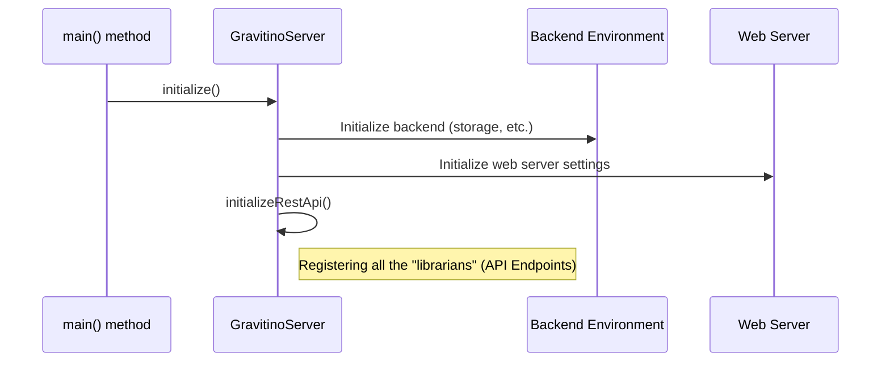

# Chapter 2: Gravitino Server Application

In the [previous chapter](01_rest_api_endpoints_.md), we met the "librarians" of our data library—the REST API Endpoints that handle specific requests like creating a schema. But this raises a bigger question: who hires all these librarians, unlocks the library doors in the morning, and makes sure the lights are on?

This is where the `GravitinoServer` class comes in. It's the main application, the heart of the entire server. Think of it as the general manager of a hotel or the director of our library. Its job is to orchestrate everything from startup to shutdown, ensuring all the pieces are in place and working together.

### The Hotel Manager Analogy

Imagine you are opening a brand-new hotel. You can't just open the doors and hope for the best. You need a manager to:

1.  **Read the Business Plan:** Understand the hotel's configuration—how many rooms, what the restaurant hours are, etc.
2.  **Hire Staff:** Bring in receptionists, chefs, and cleaners (our REST endpoints and other components).
3.  **Prepare the Building:** Turn on the power, water, and start the web server.
4.  **Open for Business:** Announce that the hotel is open and ready to accept guests (web requests).

The `GravitinoServer` class does exactly this for our application. It's the single entry point that brings the entire system to life.

### Our Goal: Starting the Server

Our goal for this chapter is simple: understand the sequence of events that happens when you run the command to start the Gravitino server. We'll follow the process from the very first line of code that executes to the point where the server is running and ready to accept the API requests we learned about in Chapter 1.

### The Startup Sequence: A Step-by-Step Journey

The entire startup process happens inside the `main` method of the `GravitinoServer.java` class. This is the universal starting point for any Java application.

Let's look at a simplified version of this `main` method.

```java
// File: src/main/java/org/apache/gravitino/server/GravitinoServer.java

public static void main(String[] args) {
    LOG.info("Starting Gravitino Server");
    // 1. Load configuration from the 'gravitino.conf' file
    ServerConfig serverConfig = loadConfig(...);

    // 2. Create the main server application instance
    GravitinoServer server = new GravitinoServer(serverConfig, ...);

    try {
        // 3. Initialize all components
        server.initialize();

        // 4. Start the web server and begin listening for requests
        server.start();
    } catch (Exception e) {
        LOG.error("Error while running server", e);
        System.exit(-1);
    }

    LOG.info("Done, Gravitino server started.");
    server.join(); // Wait until the server is shut down
}
```

This short block of code orchestrates the entire startup. Let's break it down:

1.  **Load Configuration:** The server first reads the `gravitino.conf` file. This is the "business plan" that tells it things like which network port to use.
2.  **Create Server Instance:** It creates an object of itself, the `GravitinoServer`.
3.  **Initialize:** This is the most important step. The `initialize()` method does the heavy lifting of preparing all the components.
4.  **Start:** The `start()` method flips the switch, starting the underlying web server (Jetty) and opening the doors for traffic.

### Under the Hood: The Initialization Process

Let's dive into the `initialize()` method. This is where the hotel manager hires all the staff.



The `initialize()` method coordinates several smaller tasks. Here's a simplified look at its code:

```java
// File: src/main/java/org/apache/gravitino/server/GravitinoServer.java

public void initialize() {
    // Prepare backend components like storage
    gravitinoEnv.initializeFullComponents(serverConfig);

    // Configure the embedded Jetty web server
    JettyServerConfig jettyConfig = JettyServerConfig.fromConfig(serverConfig, ...);
    server.initialize(jettyConfig, ...);

    // Set up and register all our REST API endpoints
    initializeRestApi();
}
```

The most interesting part for us is `initializeRestApi()`. This is the function that finds and registers all the `...Operations` classes we discussed in the first chapter.

### Connecting the Dots: Registering the API Endpoints

The `initializeRestApi()` method acts like a registrar. It tells the web server about all the "librarian" classes (`SchemaOperations`, `CatalogOperations`, etc.) so that the server knows where to send incoming requests.

Here's a simplified look at how it works:

```java
// File: src/main/java/org/apache/gravitino/server/GravitinoServer.java

private void initializeRestApi() {
    // 1. Tell the server to scan this package for API classes
    packages("org.apache.gravitino.server.web.rest");

    // 2. Register key components that the API classes will use
    register(new AbstractBinder() {
        protected void configure() {
            // Make the SchemaDispatcher available to SchemaOperations
            bind(gravitinoEnv.schemaDispatcher()).to(SchemaDispatcher.class);
            // ... and so on for catalogs, tables, etc.
        }
    });

    // 3. Add filters for cross-cutting concerns
    server.addFilter(new VersioningFilter(), "/*");
}
```

Let's break this down:

1.  **`packages(...)`**: This is a command that says, "Look inside the `org.apache.gravitino.server.web.rest` folder for any classes with REST annotations like `@Path`." This is how it automatically discovers `SchemaOperations`, `TableOperations`, and all the others.
2.  **`register(...)`**: This is where we make core components (like `SchemaDispatcher`, the actual worker that creates schemas) available to our API classes. This is a powerful technique called "Dependency Injection."
3.  **`addFilter(...)`**: This installs special components that can inspect or modify every single request. We will learn more about these in the chapters on [Web Request Filters](05_web_request_filters_.md) and the [Authorization Interceptor](03_authorization_interceptor_.md).

Once `initializeRestApi()` is complete, the server knows about all its endpoints and is almost ready to go. The final `server.start()` call in the `main` method is what officially opens it for business.

### Conclusion

In this chapter, we zoomed out from the individual "librarians" (REST endpoints) to meet the "library director"—the `GravitinoServer` application. We learned that this central class is responsible for the entire server lifecycle:

*   It starts from a standard `main` method.
*   It reads a configuration file to know how to behave.
*   It runs an `initialize()` process to set up all its components, including discovering and registering all the REST API endpoint classes from Chapter 1.
*   Finally, it calls `start()` to launch the web server and begin accepting requests.

Now that we understand how the server starts and how requests are routed to the right place, we can ask a more advanced question: How does the server know who is allowed to do what? How does it prevent a user from deleting a table they don't have permission to access?

That's the role of the security system, and we'll start exploring it in the next chapter.

Next: [Authorization Interceptor](03_authorization_interceptor_.md)

---

Generated by [AI Codebase Knowledge Builder](https://github.com/The-Pocket/Tutorial-Codebase-Knowledge)