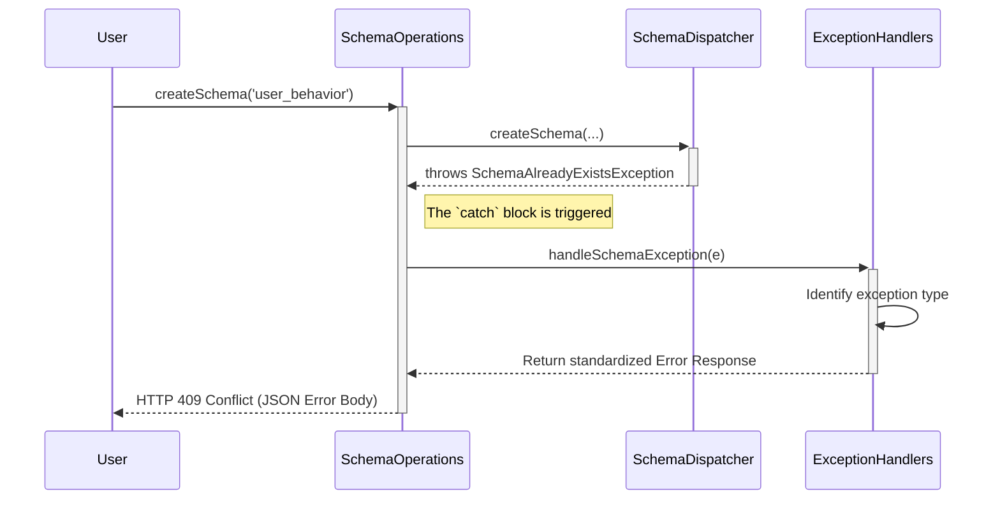

# Chapter 4: Centralized Exception Handling

In the [previous chapter](03_authorization_interceptor_.md), we saw how the Authorization Interceptor acts like a security guard, blocking unauthorized requests before they can cause any trouble. This is a specific kind of error handling. But what about all the other things that can go wrong?

What if a user tries to create a table that already exists? Or provides a malformed request? If we're not careful, the server might crash or send back a confusing, raw error message. This is where Centralized Exception Handling comes in.

### The Customer Support Analogy

Think of a well-run company. When you have a problem with a product, you don't talk directly to the engineers. You call the customer support department. They are trained to handle specific problems and give you a clear, standardized, and helpful response.

*   **Your Problem:** "I tried to create a schema named `user_logs`, but it failed." (An exception was thrown).
*   **Bad Response (Raw Error):** `java.sql.SQLIntegrityConstraintViolationException: Duplicate entry 'user_logs' for key 'schema.PRIMARY'` (Confusing for the user).
*   **Good Response (Customer Support):** "We're sorry, but a schema with the name `user_logs` already exists. Please choose a different name." (Clear and helpful).

Gravitino's Centralized Exception Handling system is this customer support department. It catches raw, technical exceptions and translates them into clean, standardized JSON error messages for the user.

### Our Goal: Handling a Common Error

Let's follow a simple but common scenario: a user tries to create a schema named `user_behavior`, but a schema with that name already exists in the catalog.

Without a proper error handling system, this could cause chaos. Our goal is to see how the server catches this specific error (`SchemaAlreadyExistsException`) and returns a helpful JSON response like this:

```json
{
  "code": 3,
  "type": "AlreadyExistsException",
  "message": "Failed to operate schema [user_behavior] operation [CREATE] under catalog [web_analytics], reason [Schema user_behavior already exists]"
}
```

This response is clear, machine-readable, and gives the user exactly the information they need to fix their request.

### How It Works: Two Layers of Support

Gravitino uses two main strategies for handling errors, working together like a two-tiered customer support team.

1.  **Generalists (`ExceptionMapper`):** These are the front-line support agents. They handle common, application-wide problems, especially those related to the web framework itself (like a user sending badly formatted JSON).
2.  **Specialists (`ExceptionHandlers`):** These are the expert agents. They handle very specific, application-level problems, like "a schema already exists" or "a catalog is not empty."

Let's see them in action.

### Level 1: The Generalists (`ExceptionMapper`)

The web framework that Gravitino uses has a built-in mechanism called `ExceptionMapper`. It's a special kind of class that you can write to "listen" for a specific type of exception. When that exception occurs anywhere in the application, the mapper's `toResponse` method is automatically called.

For example, let's look at what happens if a user sends a request with invalid JSON.

```java
// File: src/main/java/org/apache/gravitino/server/web/mapper/JsonParseExceptionMapper.java

// This mapper listens for JsonParseException
public class JsonParseExceptionMapper implements ExceptionMapper<JsonParseException> {

  @Override
  public Response toResponse(JsonParseException e) {
    // When the exception happens, this method is called.
    String errorMsg = "Malformed json request";
    // It builds a standard "illegal arguments" error response.
    return Utils.illegalArguments(..., errorMsg, e);
  }
}
```

This is incredibly powerful. We write this one simple class, and now *any* request with broken JSON will be handled gracefully, returning a clean error message instead of a server crash. These mappers are registered automatically when the [Gravitino Server Application](02_gravitino_server_application_.md) starts up.

### Level 2: The Specialists (`ExceptionHandlers`)

For more specific business logic errors, like our "schema already exists" problem, Gravitino uses a helper class called `ExceptionHandlers`. Let's look at the `createSchema` method we've seen before.

```java
// File: src/main/java/org/apache/gravitino/server/web/rest/SchemaOperations.java

public Response createSchema(...) {
    try {
        // ... code to create the schema ...
        // This line might throw SchemaAlreadyExistsException
        Schema schema = dispatcher.createSchema(ident, ...);
        return Utils.ok(...);
    } catch (Exception e) {
        // If an error occurs, delegate it to the specialist handler
        return ExceptionHandlers.handleSchemaException(
            OperationType.CREATE, "user_behavior", "web_analytics", e);
    }
}
```

Instead of putting complex error-checking logic inside the `catch` block, the method simply passes the exception to `ExceptionHandlers.handleSchemaException`. This keeps the API endpoint code clean and delegates the "customer support" work to a dedicated specialist.

### Under the Hood: The Error Handling Flow

Let's trace our use case from start to finish.

1.  **Request:** A user sends a `POST` request to create the `user_behavior` schema.
2.  **Execution:** The `createSchema` method in `SchemaOperations` is called. It attempts to create the schema in the backend.
3.  **Exception!** The backend logic discovers that `user_behavior` already exists and throws a `SchemaAlreadyExistsException`.
4.  **Catch and Delegate:** The `catch` block in `createSchema` catches the exception and immediately calls `ExceptionHandlers.handleSchemaException`.
5.  **Specialist Handling:** Inside the `ExceptionHandlers` class, the `SchemaExceptionHandler` takes over. It inspects the exception and sees that it's a `SchemaAlreadyExistsException`.
6.  **Response Building:** Based on the exception type, it calls a utility function, `Utils.alreadyExists()`, to construct the standardized JSON error response.
7.  **Return:** This final `Response` object is sent back to the user.

Here is a diagram of that process:



#### A Closer Look at the Specialist Code

The `ExceptionHandlers` class is a collection of static methods that route errors to the correct specialist `...ExceptionHandler` inner class. The real logic lives inside these inner classes.

```java
// File: src/main/java/org/apache/gravitino/server/web/rest/ExceptionHandlers.java

private static class SchemaExceptionHandler extends BaseExceptionHandler {
    @Override
    public Response handle(OperationType op, String schema, String catalog, Exception e) {
        // ... builds a detailed error message ...

        // Checks for specific, known exception types
        if (e instanceof NotFoundException) {
            return Utils.notFound(errorMsg, e);
        } else if (e instanceof SchemaAlreadyExistsException) {
            // This is our case!
            return Utils.alreadyExists(errorMsg, e);
        } else if (e instanceof NonEmptySchemaException) {
            return Utils.nonEmpty(errorMsg, e);
        }
        // ... and so on for other schema-related errors
    }
}
```

This `if/else if` structure is like a customer support flowchart. It allows the system to check for the most specific problems first and provide the most accurate and helpful response possible.

### Conclusion

In this chapter, we learned about Gravitino's robust, centralized system for handling errors. Instead of letting raw exceptions bubble up to the user, this system acts like a professional customer support department.

*   It uses **`ExceptionMapper`** classes to handle general, web-framework-level issues like malformed JSON.
*   It uses a dedicated **`ExceptionHandlers`** class with specialist sub-handlers to manage specific application logic errors, like trying to create a resource that already exists.
*   The ultimate goal is to translate any kind of error into a **standardized, user-friendly JSON response**, making the API predictable and easy for developers to work with.

We have now seen how the server handles requests from start to finish: routing, authorization, execution, and error handling. But what if we want to perform an action on *every single request* that comes in, like logging who made the request or checking API versions, even before routing begins?

That's the job of our next topic: filters.

Next: [Web Request Filters](05_web_request_filters_.md)

---

Generated by [AI Codebase Knowledge Builder](https://github.com/The-Pocket/Tutorial-Codebase-Knowledge)