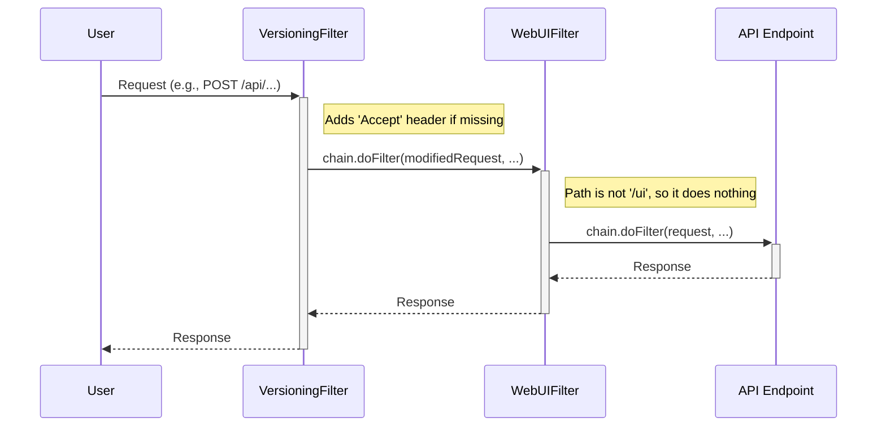

# Chapter 5: Web Request Filters

In the [previous chapter](04_centralized_exception_handling_.md), we learned how Gravitino acts like a helpful customer support department, catching specific errors and turning them into clean, standardized responses. This system is great for handling things that go *wrong*.

But what about tasks that need to happen for *every single request*, whether it succeeds or fails? Things like checking API versions, routing users to a web interface, or logging requests. We need a component that can inspect and act on every request at the front door, even before it reaches an API endpoint. This is the job of Web Request Filters.

### The Hotel Concierge Analogy

Think of Web Request Filters as the concierge at a grand hotel's entrance. The concierge doesn't check you into your room (that's the job of the front desk, our [REST API Endpoints](01_rest_api_endpoints_.md)). Instead, they perform essential, preliminary tasks for every guest who walks in:

*   **Checking Reservations:** Do you have a valid booking? (API Versioning)
*   **Giving Directions:** Are you here for a room (API) or the public art gallery (Web UI)?
*   **Announcing Arrivals:** Noting down who arrived and when. (Logging)

Filters are these concierges. They stand at the very beginning of the request-handling process and can inspect, modify, or even redirect requests before they go any further.

### Our Goal: Understanding API Versioning

Let's focus on a key task for our "concierge": managing API versions. A good API needs to evolve, but we can't break things for older applications that use it. Gravitino solves this by using a special "Accept" header in requests, like `Accept: application/vnd.gravitino.v1+json`.

Our goal is to see how the `VersioningFilter` handles two scenarios:

1.  A lazy client sends a request but **forgets to specify the API version**.
2.  An old client sends a request for an **unsupported API version**.

### How It Works: The `VersioningFilter`

The `VersioningFilter` is a component that intercepts every single API request. Its job is to ensure the request has a valid API version before it's allowed to proceed.

Let's look at the first scenario: the lazy client.

1.  **Request Arrives:** A client sends a request to create a schema, but with no special `Accept` header.
2.  **Filter Intercepts:** The `VersioningFilter` catches the request before anything else happens.
3.  **Check for Version:** The filter inspects the request's headers and sees that the version is missing.
4.  **Apply Latest Version:** It decides to be helpful and assumes the client wants the newest API version. It *adds* the header `Accept: application/vnd.gravitino.v1+json` to the request.
5.  **Pass It On:** The filter then passes the now-modified request along to the next step in the chain, which will eventually route it to the correct API endpoint.

The API endpoint code never even knows the header was originally missing! The filter handled it transparently.

### A Look at the Code: `VersioningFilter.java`

Let's see a simplified version of the code that implements this logic. The core of any filter is the `doFilter` method.

```java
// File: src/main/java/org/apache/gravitino/server/web/VersioningFilter.java

public class VersioningFilter implements Filter {
  @Override
  public void doFilter(ServletRequest request, ServletResponse response, FilterChain chain)
      throws IOException, ServletException {

    HttpServletRequest req = (HttpServletRequest) request;
    // 1. Check if the version header exists.
    if (requestHasVersionHeader(req)) {
      // ... logic to validate the version ...
    } else {
      // 2. If not, add the latest version header.
      MutableHttpServletRequest mutableRequest = new MutableHttpServletRequest(req);
      ApiVersion latest = ApiVersion.latestVersion();
      mutableRequest.putHeader("Accept", getAcceptVersion(latest.version()));

      // 3. Pass the MODIFIED request down the chain.
      chain.doFilter(mutableRequest, response);
    }
  }
}
```

This code is the "concierge's" instruction manual:

1.  **Check Headers:** It first checks if the guest (request) has presented their version information.
2.  **Add Header:** If not, it creates a special "mutable" request (like adding a note to the guest's file) and sets the `Accept` header to the latest supported version.
3.  **Send Along:** The `chain.doFilter()` command is crucial. It means "my job is done, pass this guest along to the next person in line."

Now, what if the client provides an *invalid* version?

```java
// File: src/main/java/org/apache/gravitino/server/web/VersioningFilter.java

// Inside the doFilter method's 'if' block...
Matcher m = ACCEPT_VERSION_REGEX.matcher(headerValue);
if (m.find()) {
    int version = Integer.parseInt(m.group(1));

    if (!ApiVersion.isSupportedVersion(version)) {
        // Stop right here and send an error!
        HttpServletResponse resp = (HttpServletResponse) response;
        resp.sendError(HttpServletResponse.SC_NOT_ACCEPTABLE, "Unsupported version");
    } else {
        // The version is valid, let it pass.
        chain.doFilter(request, response);
    }
}
```

Here, the filter finds a version but sees that it's not supported. It immediately blocks the request and sends an error back to the client. The request never reaches the API endpoint.

### Another Example: The `WebUIFilter`

Filters aren't just for APIs. Gravitino also has a web-based user interface (UI). When you visit `/ui/` in your browser, you expect to see a web page, not get a JSON error. The `WebUIFilter` handles this.

```java
// File: src/main/java/org/apache/gravitino/server/web/ui/WebUIFilter.java

public class WebUIFilter implements Filter {
  @Override
  public void doFilter(ServletRequest request, ServletResponse response, FilterChain chain)
      throws IOException, ServletException {

    HttpServletRequest httpRequest = (HttpServletRequest) request;
    String path = httpRequest.getRequestURI();

    if (path.equals("/ui") || path.equals("/ui/")) {
      // This is a UI request. Forward it to the main HTML page.
      httpRequest.getRequestDispatcher("/ui/index.html").forward(request, response);
    } else {
      // This is not a UI request. Let it continue to the API logic.
      chain.doFilter(request, response);
    }
  }
}
```

This filter is like a specialized concierge for the art gallery. If it sees a request for the `/ui/` path, it knows the user wants the web interface. It **forwards** the request internally to the actual `index.html` file, which then gets sent to the browser. If the path is anything else, it just calls `chain.doFilter()` to let the request proceed to the API handlers.

### Under the Hood: The Filter Chain

It's important to understand that there can be multiple filters. They form a "chain," where each filter processes the request and then passes it to the next one.

This allows for a clean separation of concerns. One filter handles versioning, another handles UI routing, and a third could handle logging, all without knowing about each other.



These filters are registered when the server starts up, inside the [Gravitino Server Application](02_gravitino_server_application_.md). The server application tells the web server to apply these filters to all incoming requests.

### Conclusion

In this chapter, we learned about Web Request Filters, which act as the server's "concierges." They intercept every request to perform cross-cutting tasks.

*   Filters operate at the **very beginning of the request lifecycle**, before the request is routed to a specific API endpoint.
*   They can **inspect, modify, or even block** requests based on their logic.
*   The `VersioningFilter` uses this power to enforce API versioning rules, making the API more robust.
*   The `WebUIFilter` uses it to route browser traffic to the web interface, separating UI requests from API requests.
*   The `chain.doFilter()` method is the key mechanism that passes a request from one filter to the next in the chain.

This concludes our tour of the Gravitino server's core architecture! We have journeyed from the front desk ([REST API Endpoints](01_rest_api_endpoints_.md)), to the main control room ([Gravitino Server Application](02_gravitino_server_application_.md)), met the security guards ([Authorization Interceptor](03_authorization_interceptor_.md)), visited the customer support team ([Centralized Exception Handling](04_centralized_exception_handling_.md)), and finally, greeted the concierges ([Web Request Filters](05_web_request_filters_.md)). You now have a comprehensive, high-level understanding of how a request travels through the server and how all the major components work together.

---

Generated by [AI Codebase Knowledge Builder](https://github.com/The-Pocket/Tutorial-Codebase-Knowledge)