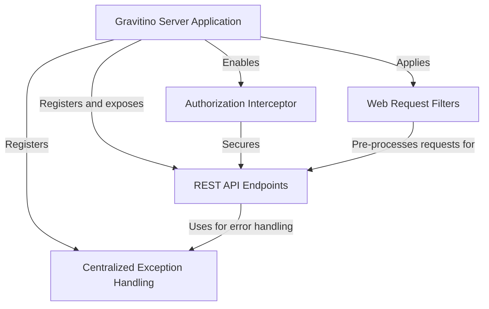

# Tutorial: server

The **Gravitino Server** is a central system for managing *metadata*, which is like a library catalog for your data.
It provides a **REST API** that allows applications to programmatically create, read, and organize data structures such as *metalakes*, *catalogs*, and *schemas*. The server includes built-in security to control access and ensures that errors are handled in a consistent, user-friendly way.

**Source Repository:** [None](None)

## Chapters

1. [REST API Endpoints
](01_rest_api_endpoints_.md)
2. [Gravitino Server Application
](02_gravitino_server_application_.md)
3. [Authorization Interceptor
](03_authorization_interceptor_.md)
4. [Centralized Exception Handling
](04_centralized_exception_handling_.md)
5. [Web Request Filters
](05_web_request_filters_.md)

---

Generated by [AI Codebase Knowledge Builder](https://github.com/The-Pocket/Tutorial-Codebase-Knowledge)