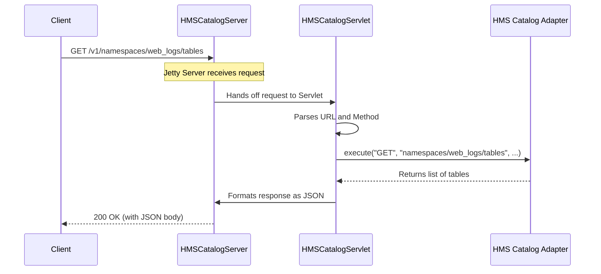

# Chapter 1: HMS Catalog Server & Servlet

Welcome to the first chapter of our journey into the Iceberg HMS REST Catalog! If you've ever wondered how different data processing engines like Spark or Flink can all talk to the same Iceberg catalog using a standard web API, you're in the right place.

This chapter introduces the front door to our catalog: the **HMS Catalog Server & Servlet**.

### The Problem: We Need a Universal Front Door

Imagine you have a massive library (your data catalog) filled with valuable books (your data tables). Many different people (data tools like Spark, Flink, Trino) want to access these books. How do you manage their requests in a standard, organized way?

You could teach each person a special, secret way to talk to the librarians, but that's inefficient. A much better solution is to set up a public front desk. Anyone can walk up to the front desk, make a request in a common language (like asking for a book by its title), and the front desk staff will handle it from there.

The `HMSCatalogServer` and `HMSCatalogServlet` work together to create this "front desk" for our data catalog, using the common language of HTTP.

### Meet the Key Players

Our "front desk" operation has two main components:

1.  **`HMSCatalogServer`**: The "Building Manager". This component's job is to get the library ready for visitors. It starts up the web server, turns on the lights, and puts the `HMSCatalogServlet` in place at the front desk. It handles all the one-time setup.

2.  **`HMSCatalogServlet`**: The "Front Desk Clerk". This component is the one that actively listens for and handles every single incoming request from clients. It figures out what the visitor wants (e.g., "list all tables in the `analytics` database") and passes that request to the right specialist to find the information.

Let's see how they work together.

### Starting the Server: Opening for Business

Before anyone can make a request, the server must be running. The `HMSCatalogServer` is responsible for this. Its main job is to configure and start a web server (specifically, a Jetty server) and tell it which servlet should handle incoming requests.

Here’s a simplified look at the `startServer` method that kicks everything off.

```java
// File: iceberg/rest/HMSCatalogServer.java

public static Server startServer(Configuration conf, HiveCatalog catalog) throws Exception {
    // 1. Get the port number from the configuration
    int port = MetastoreConf.getIntVar(conf, MetastoreConf.ConfVars.CATALOG_SERVLET_PORT);

    // 2. Create our "front desk clerk" - the servlet
    final HttpServlet servlet = createServlet(conf, catalog);

    // 3. Create a web server instance
    final Server httpServer = createHttpServer(conf, port);
    
    // 4. Tell the server to direct all requests to our servlet
    final ServletContextHandler context = new ServletContextHandler();
    context.addServlet(new ServletHolder(servlet), "/v1/*");
    httpServer.setHandler(context);

    // 5. Start the server and begin listening for requests!
    LOG.info("Starting HMS REST Catalog Server on port:{}", port);
    httpServer.start();
    return httpServer;
}
```

This code does five simple things:
1.  Reads the port number (like a street address for our library) from the configuration.
2.  Creates an instance of our `HMSCatalogServlet`.
3.  Creates a new `Server` object.
4.  Tells the server, "Hey, for any request that comes to a path like `/v1/...`, let the `HMSCatalogServlet` handle it."
5.  Starts the server. Now it's officially open for business and listening for HTTP traffic!

### Handling a Request: A Visitor Arrives

Now that our server is running, let's imagine a client (like a Spark job) wants to list all tables in the `web_logs` database. It sends an HTTP GET request to our server, for example: `GET /v1/namespaces/web_logs/tables`.

The web server receives this request and, as instructed, hands it over to our `HMSCatalogServlet`.

The servlet's job is to:
1.  Receive the raw HTTP request.
2.  Parse it to understand the user's intent.
3.  Pass the structured request to a helper that knows how to fulfill it.

Let's look at a simplified version of how the servlet handles this.

```java
// File: iceberg/rest/HMSCatalogServlet.java

// The server calls this method for any GET request
@Override
protected void doGet(HttpServletRequest request, HttpServletResponse response) throws IOException {
    // The `security` object first checks permissions,
    // then calls our main `execute` method.
    security.execute(request, response, this::execute);
}

private void execute(HttpServletRequest request, HttpServletResponse response) throws IOException {
    // 1. Parse the raw request into a structured context
    ServletRequestContext context = ServletRequestContext.from(request);

    // 2. Delegate the actual work to the adapter
    Object responseBody = restCatalogAdapter.execute(
            context.method(), // e.g., GET
            context.path(),   // e.g., "namespaces/web_logs/tables"
            context.queryParams(),
            context.body(),
            // ... other details
    );

    // 3. Write the result from the adapter back to the client
    if (responseBody != null) {
        RESTObjectMapper.mapper().writeValue(response.getWriter(), responseBody);
    }
}
```

Here's what's happening:
1.  The `ServletRequestContext.from(request)` call is like our front desk clerk reading the request form. It deciphers the URL, the HTTP method (`GET`), and any other details.
2.  It then calls `restCatalogAdapter.execute(...)`. This is the crucial hand-off. The servlet doesn't know *how* to list tables itself. It just knows it needs to pass the request to the next component in the chain: the [HMS Catalog Adapter](03_hms_catalog_adapter_.md), which acts as a skilled librarian.
3.  Finally, once the adapter returns the result (a list of tables), the servlet takes that result and writes it back to the client as an HTTP response.

### The Big Picture: A Request's Journey

Let's visualize the entire flow with a simple diagram.



As you can see, the Server and Servlet act as the entry point and dispatcher. They are the public face of the catalog, responsible for receiving requests and directing traffic, but they delegate the "real" catalog logic to other specialized components.

### Conclusion

In this chapter, we learned about the two components that form the front door of our REST Catalog:

-   **`HMSCatalogServer`**: The setup crew that launches the web server and gets it ready.
-   **`HMSCatalogServlet`**: The friendly front desk clerk that handles all incoming HTTP requests, figures out what they mean, and passes them to the correct specialist.

Together, they provide a standard, reliable HTTP interface for any tool to interact with the Iceberg catalog.

But what happens when a request comes in? How do we make sure the person asking for data is allowed to see it? That's where security comes in. In our next chapter, we'll explore how the servlet ensures that every request is properly authenticated and authorized.

Next up: [Servlet Security & User Impersonation](02_servlet_security___user_impersonation_.md)

---

Generated by [AI Codebase Knowledge Builder](https://github.com/The-Pocket/Tutorial-Codebase-Knowledge)