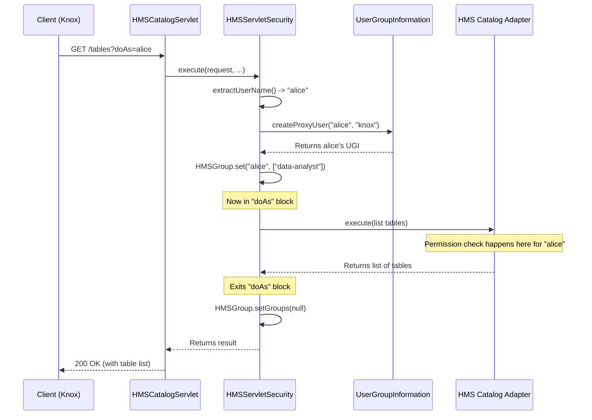

# Chapter 2: Servlet Security & User Impersonation

In our [previous chapter](01_hms_catalog_server___servlet_.md), we set up the "front desk" for our data library using the `HMSCatalogServlet`. Now that visitors can make requests, we need a security guard to check their credentials and ensure they only access the books they're allowed to.

This chapter introduces the `HMSServletSecurity` component, our catalog's security guard. It's responsible for figuring out *who* is making a request and what they're allowed to do.

### The Problem: Who Are You, Really?

Imagine a large company where data access is managed by a central gateway, like Apache Knox. A data scientist, Alice, wants to list some tables. She doesn't connect directly to our catalog service. Instead, she sends her request to Knox. Knox, a trusted service, then forwards the request to our catalog.

Now, our catalog service sees a request from Knox. But the request is *on behalf of* Alice. How does our service know to apply Alice's permissions, not Knox's? This is the core problem: we need to handle authentication (verifying the service) and impersonation (acting on behalf of the end-user).

### Meet the Key Security Concepts

Our security guard, `HMSServletSecurity`, handles this with three key ideas:

1.  **Authentication**: Verifying the identity of the direct caller. This is like the guard checking the Knox service's employee badge to confirm it's a legitimate, trusted system.
2.  **Impersonation (or "doAs")**: The ability of a trusted user (the "proxy user," like Knox) to perform an action on behalf of another user (the "end-user," like Alice). This is the most important concept for our use case.
3.  **Authorization**: Once we know the action is for Alice, we check if Alice has permission to perform it. This is typically handled by a tool like Apache Ranger, which reads the user's identity to enforce policies.

The `HMSServletSecurity` component coordinates all of this before any data is ever touched.

### The Impersonation Flow: A Request in Disguise

Let's follow a request from Alice, through Knox, to our catalog to see how this works.

1.  Alice sends a request to list tables in the `web_logs` database.
2.  Knox receives it, authenticates Alice, and then forwards the request to our HMS Catalog. Crucially, it adds a special parameter to the URL: `?doAs=alice`.
3.  The request arriving at our servlet looks like this: `GET /v1/namespaces/web_logs/tables?doAs=alice`.
4.  Our `HMSCatalogServlet` immediately hands the request to `HMSServletSecurity`.

This is where the magic happens. The security component sees `doAs=alice` and understands it needs to handle an impersonation request.

### Under the Hood: The `execute` Method

Everything starts in the `execute` method of `HMSServletSecurity`. This method wraps the actual catalog logic, ensuring security checks are performed first.

```java
// File: hadoop/hive/metastore/HMSServletSecurity.java

@Override
public void execute(HttpServletRequest request, HttpServletResponse response, MethodExecutor executor)
    throws IOException {
    try {
        // 1. Figure out who the end-user is.
        String userFromHeader = extractUserName(request, response);

        // 2. Create a temporary security identity for this user.
        UserGroupInformation clientUgi = getUgi(userFromHeader, UserGroupInformation.getLoginUser());
        
        // 3. Store the user's groups for permission checks.
        // ... set user groups using HMSGroup ...

        // 4. Run the actual database command AS the user.
        clientUgi.doAs((PrivilegedExceptionAction<Void>) () -> {
            executor.execute(request, response);
            return null;
        });

    } finally {
        // 5. Clean up after the request is done.
        HMSGroup.setGroups(null);
    }
}
```

This might look complex, but it's just a five-step security checklist:
1.  **Extract User**: Find the `doAs` parameter in the URL.
2.  **Create Identity**: Use Hadoop's `UserGroupInformation` (UGI) to create a temporary "ID badge" for Alice.
3.  **Store Groups**: Note down Alice's group memberships (e.g., `data-analyst`) so the authorization system can use them.
4.  **Execute as User**: Use the `doAs` method to run the catalog command *within Alice's security context*.
5.  **Clean Up**: Clear the temporary security information so it doesn't leak to the next request.

Let's break down the most important parts.

#### Step 1: Finding the Real User

The `extractUserName` method looks for the `doAs` parameter in the request's URL.

```java
// File: hadoop/hive/metastore/HMSServletSecurity.java

private static String getDoAsQueryParam(HttpServletRequest request) {
    Map<String, String[]> params = request.getParameterMap();
    for (String key : params.keySet()) {
        if (key.equalsIgnoreCase("doAs")) {
            return params.get(key)[0]; // Found it! Returns "alice".
        }
    }
    return null;
}
```
This simple helper function scans the URL parameters and pulls out the username, which in our case is `alice`.

#### Step 2 & 4: Creating an ID Badge with `UserGroupInformation`

Hadoop's `UserGroupInformation` (or UGI) is the standard way to represent a user's identity. `HMSServletSecurity` uses it to create a proxy UGI. This is like creating a temporary visitor's pass that says "Guest: Alice, Escorted by: Knox".

```java
// File: hadoop/hive/metastore/HMSServletSecurity.java

// Simplified for clarity
UserGroupInformation getUgi(String realUser, UserGroupInformation loginUser) {
    // realUser is "alice", loginUser is the service user "knox"
    return UserGroupInformation.createProxyUser(realUser, loginUser);
}
```
The most powerful part is the `clientUgi.doAs(...)` block. Any code inside this block runs with the full identity and permissions of `alice`. When this code tries to access a table, the underlying system asks, "Is `alice` allowed to do this?" not "Is `knox` allowed to do this?".

#### Step 3 & 5: Remembering Groups with `HMSGroup`

How does the authorization system (like Ranger) know which groups Alice belongs to? Knox sends this information in an HTTP header. `HMSServletSecurity` needs a place to store this information *just for this one request*.

It uses a special class called `HMSGroup`, which relies on a `ThreadLocal`. Think of a `ThreadLocal` as a sticky note that is attached to a single request thread. It's private to that request and won't get mixed up with others.

```java
// File: hadoop/hive/metastore/HMSGroup.java

class HMSGroup {
  // Each thread gets its own private copy of this variable.
  private static final ThreadLocal<Map<String, List<String>>> GROUPS = new ThreadLocal<>();

  static void set(String user, String... groups) {
    // Attaches a "sticky note" with Alice's groups to the current request.
    Map<String, List<String>> group = Collections.singletonMap(user, Arrays.asList(groups));
    GROUPS.set(group);
  }

  static void setGroups(String json) {
    // Passing null here removes the "sticky note".
    GROUPS.remove();
  }
}
```
When `HMSServletSecurity` gets the group information for Alice, it calls `HMSGroup.set(...)`. Later, inside the `finally` block, it calls `setGroups(null)` to clean up the sticky note, ensuring the next request starts fresh.

### The Big Picture: A Security Checkpoint

Let's visualize the entire security flow for Alice's request.



This diagram shows how `HMSServletSecurity` acts as a mandatory checkpoint. It establishes the end-user's identity *before* handing the request off to the [HMS Catalog Adapter](03_hms_catalog_adapter_.md), which performs the actual work.

### Conclusion

In this chapter, we met the "security guard" of our catalog service, `HMSServletSecurity`. We learned how it handles the critical task of user impersonation, a common pattern in modern data platforms.

The key takeaways are:
- **Impersonation ("doAs")** allows a trusted service to act on behalf of an end-user.
- **`UserGroupInformation` (UGI)** is the Hadoop standard for representing a user's identity and is used to create a temporary security context for the impersonated user.
- **`HMSGroup`** uses a `ThreadLocal` to safely store a user's group memberships for a single request, ensuring correct authorization.

Now that we know the request is secure and we've identified the user, what happens next? The request is passed to the next layer, which translates the web request into an actual Hive Metastore command.

Next up: [HMS Catalog Adapter](03_hms_catalog_adapter_.md)

---

Generated by [AI Codebase Knowledge Builder](https://github.com/The-Pocket/Tutorial-Codebase-Knowledge)