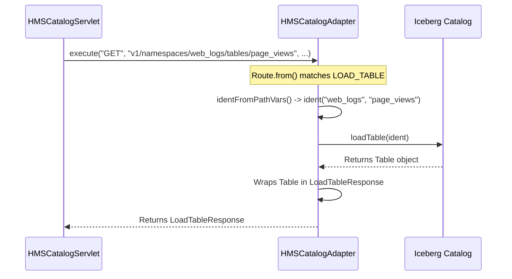

# Chapter 3: HMS Catalog Adapter

In our [previous chapter on Servlet Security](02_servlet_security___user_impersonation_.md), we saw how our service acts like a security guard, verifying who is making a request and ensuring they have the right permissions. The request has been approved, and we know it's from an authorized user.

But now what? The request is still just a web request, like `GET /v1/namespaces/web_logs/tables/page_views`. The underlying data catalog doesn't understand web addresses. It speaks a different language—the language of Java method calls.

This chapter introduces the **HMS Catalog Adapter**, the brain of our service that acts as a master translator.

### The Problem: We Need a Multilingual Librarian

Imagine you walk into a library and ask the front desk clerk, "I'd like the book located at Aisle 5, Shelf 3, Position 7." The clerk doesn't run to the shelf themselves. Instead, they pass your request to a skilled librarian.

This librarian is special. They understand your request (the aisle and shelf number) and know how to translate it into the library's internal, complex card catalog system to find the book's official record. They also know what to do if the book is missing—they won't just panic; they'll calmly tell the clerk, "That book is not here," who then relays that information back to you.

The `HMSCatalogAdapter` is this multilingual librarian for our data catalog. It takes the "visitor's language" (REST API requests) and translates it into the "library's internal language" (Iceberg Catalog API calls).

### Meet the Adapter: The Core Translator

The `HMSCatalogAdapter` has two primary responsibilities:

1.  **Request Translation**: It maps a specific HTTP request to a specific Java method call on the catalog object. For example, it knows that `GET /v1/namespaces/{ns}/tables/{tbl}` means "call the `catalog.loadTable()` method."
2.  **Error Translation**: If the catalog method fails (e.g., the table doesn't exist), it catches the specific Java exception (like `NoSuchTableException`) and translates it into a standard HTTP error response (like `404 Not Found`). This is crucial for giving clear feedback to clients.

Let's see how it handles a simple request to load a table.

### A Request's Journey Through the Adapter

Our client wants to read the metadata for the `page_views` table. The `HMSCatalogServlet` receives the request and, after security checks, passes the raw details to the adapter's `execute` method.

```java
// Simplified from HMSCatalogAdapter.java

public <T> T execute(HTTPMethod method, String path, /* ... other details */) {
    // 1. Figure out what the request means
    Pair<Route, Map<String, String>> routeAndVars = Route.from(method, path);

    // 2. If it's a known route, handle it
    if (routeAndVars != null) {
        try {
            // 3. Delegate to the main handler
            return handleRequest(routeAndVars.first(), routeAndVars.second(), ...);
        } catch (RuntimeException e) {
            // 4. If something goes wrong, translate the error
            configureResponseFromException(e, errorBuilder);
        }
    }
    // ... handle unknown routes ...
}
```

This method is the adapter's main entry point. Let's break it down:
1.  **`Route.from(method, path)`**: This is the first translation step. The adapter looks at the HTTP method (`GET`) and the path (`v1/namespaces/web_logs/tables/page_views`) to find a matching `Route`. The `Route` enum is like a dictionary that maps URL patterns to internal action names, such as `LOAD_TABLE`.
2.  **Check the Route**: If a match is found, the adapter knows what to do.
3.  **`handleRequest(...)`**: This is where the real work happens. The adapter calls another method to perform the specific catalog action.
4.  **`try...catch` block**: This is the safety net. If any part of the process fails, the `catch` block ensures the error is translated into a meaningful HTTP response instead of crashing the server.

#### Step 1: Matching the Route

The `Route` enum is a clever way to define all the possible API endpoints. Here's a tiny snippet of what it looks like:

```java
// Simplified from HMSCatalogAdapter.java

enum Route {
    // Defines that a GET request to this pattern is for loading a table
    LOAD_TABLE(
        HTTPMethod.GET, "v1/namespaces/{namespace}/tables/{table}", ...),

    // Defines that a DELETE request to this pattern is for dropping a table
    DROP_TABLE(
        HTTPMethod.DELETE, "v1/namespaces/{namespace}/tables/{table}");
    
    // ... other routes ...
}
```
When `Route.from(...)` is called with our request, it finds that the `LOAD_TABLE` pattern is a perfect match. It also extracts the variables: `namespace` is "web_logs" and `table` is "page_views".

#### Step 2: Calling the Catalog

Now that the adapter knows the user wants to `LOAD_TABLE`, the `handleRequest` method takes over. It uses a big `switch` statement to run the correct code for the matched route.

```java
// Simplified from HMSCatalogAdapter.java

public <T> T handleRequest(Route route, Map<String, String> vars, ...) {
    switch (route) {
        // ... other cases for LIST_TABLES, CREATE_TABLE, etc. ...

        case LOAD_TABLE: {
            // 1. Get the table identifier from the URL variables
            TableIdentifier ident = identFromPathVars(vars);
            
            // 2. Call the real Iceberg catalog method!
            return castResponse(responseType, loadTable(catalog, ident));
        }
    }
    return null;
}
```
This is the heart of the translation!
1.  First, it uses a helper (`identFromPathVars`) to combine the "web_logs" namespace and "page_views" table name into a proper `TableIdentifier` object that the catalog understands.
2.  Then, it calls `loadTable(catalog, ident)`. This is the final step where the web request is converted into a direct, native Java call to the underlying Iceberg catalog.

The `loadTable` helper then calls `catalog.loadTable(ident)` and wraps the result in a `LoadTableResponse` object, which is sent back to the client as JSON.

### The Big Picture: From Web Request to Java Call

Let's visualize the entire translation flow.



As you can see, the `HMSCatalogAdapter` is the bridge between the generic Servlet and the specific Iceberg Catalog.

### What Happens When Things Go Wrong?

What if a user requests a table that doesn't exist, like `GET /v1/namespaces/web_logs/tables/deleted_table`?

1.  The adapter follows the same steps and calls `catalog.loadTable(...)`.
2.  The Iceberg Catalog can't find the table and throws a `NoSuchTableException`.
3.  Without the adapter, this Java exception would cause a messy `500 Internal Server Error`.

But our adapter is smarter. The `try...catch` block in its `execute` method catches the exception. It then looks up the exception in a special map to find the right HTTP error code.

```java
// Simplified from HMSCatalogAdapter.java

private static final Map<Class<? extends Exception>, Integer> EXCEPTION_ERROR_CODES =
    ImmutableMap.builder()
        .put(NoSuchTableException.class, 404) // Table or Namespace not found
        .put(AlreadyExistsException.class, 409) // Resource already exists
        .put(NotAuthorizedException.class, 401) // Permission denied
        // ... more mappings ...
        .build();
```
Because `NoSuchTableException` is in the map, the adapter knows to generate a clean **HTTP 404 Not Found** error response. This is incredibly helpful for API clients, as they get a clear, standard signal about what went wrong.

### Conclusion

In this chapter, we've uncovered the role of the `HMSCatalogAdapter`, the true engine of our REST service. It's not just a simple passthrough; it's an intelligent translation and error-handling layer.

We learned that the adapter:
-   Acts as a **multilingual librarian**, translating REST requests into specific Iceberg Catalog Java API calls.
-   Uses a **routing system** to map URL patterns to internal actions like `LOAD_TABLE` or `DROP_TABLE`.
-   Acts as a **safety net**, translating Java exceptions from the catalog into clean, standard HTTP error codes.

So far, we've talked a lot about a mysterious `catalog` object that the adapter calls. But what *is* this object? How does it actually interact with the Hive Metastore? Our next chapter will dive into the implementation of this catalog.

Next up: [Hive Caching Catalog](04_hive_caching_catalog_.md)

---

Generated by [AI Codebase Knowledge Builder](https://github.com/The-Pocket/Tutorial-Codebase-Knowledge)