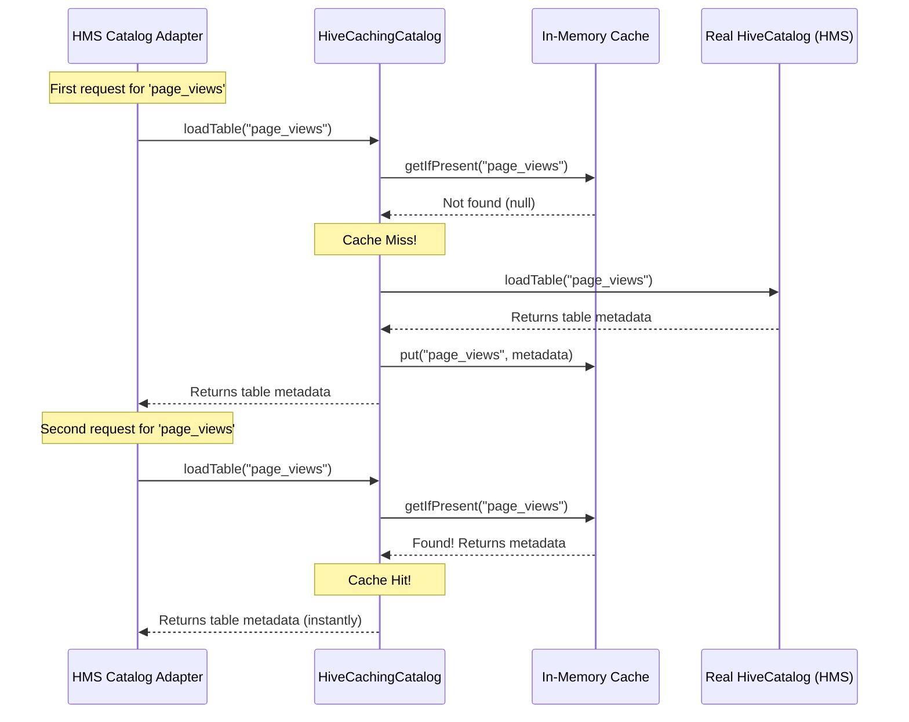

# Chapter 4: Hive Caching Catalog

In our [previous chapter on the HMS Catalog Adapter](03_hms_catalog_adapter_.md), we saw how our service translates web requests into actual calls to an Iceberg catalog. That works perfectly, but it has a potential performance problem. Every time we ask for a table's metadata, the adapter has to make a network trip to the Hive Metastore (HMS). If thousands of queries are asking for the same popular table, that's a lot of slow, repetitive trips!

This chapter introduces the **Hive Caching Catalog**, a smart component designed to solve this exact problem by making our catalog incredibly fast.

### The Problem: The Slow Walk to the Main Shelves

Imagine our librarian (the [HMS Catalog Adapter](03_hms_catalog_adapter_.md)) gets a request for the library's most popular book. They walk all the way to the back of the library (the Hive Metastore), find the book, bring it back, and give it to the visitor. A minute later, another visitor asks for the *same* popular book. The librarian sighs and makes the exact same long walk to the main shelves again. This is very inefficient.

A smart librarian would do something different. After the first request, they would keep a copy of that popular book right on their personal desk. The next time someone asks for it, they can hand it over instantly without taking a single step.

The `HiveCachingCatalog` is this "personal desk" for our data catalog. It's a high-speed, in-memory cache that stores metadata for frequently accessed tables.

### Meet the Caching Catalog: A Smart Wrapper

The `HiveCachingCatalog` isn't a completely new type of catalog. Instead, it's a clever **wrapper** that sits in front of the *real* catalog. When a request for a table arrives, it follows a simple, two-step process:

1.  **Check the Cache First**: It looks in its own super-fast, in-memory cache (the "personal desk").
2.  **Delegate if Necessary**: If the table isn't in the cache, it turns to the real catalog behind it, asks it to fetch the table from the Hive Metastore (the "main shelves"), and then—crucially—it saves a copy in its cache before returning it.

This way, the slow trip only happens once. Every subsequent request for that same table is served instantly from the cache.

### Under the Hood: Loading a Table

Let's see this in action by looking at the most important method: `loadTable`. This is the core of the caching logic.

```java
// File: iceberg/HiveCachingCatalog.java

@Override
public Table loadTable(TableIdentifier ident) {
    // 1. Check the "personal desk" (the cache) first.
    Table cached = tableCache.getIfPresent(ident);
    if (cached != null) {
      // 2. Found it! Return it instantly.
      return cached;
    }

    // 3. Not in the cache. Go to the "main shelves".
    // This special `get` method loads, caches, and returns the table.
    return tableCache.get(ident, this::loadTableHive);
}
```

This short piece of code is incredibly powerful. Let's break it down:
1.  It calls `tableCache.getIfPresent(ident)` to look for the table in the cache.
2.  If it gets a result (`cached != null`), it's a **cache hit**. The method returns the cached table immediately. This is the fast path!
3.  If the result is `null`, it's a **cache miss**. The code then calls `tableCache.get(ident, this::loadTableHive)`. This is a "get-or-compute" operation. It tells the cache:
    *   "Try to get the table for `ident` again."
    *   "If you still can't find it, run this function `this::loadTableHive` to fetch it from the real catalog."
    *   "Once you have the result, store it in the cache for next time, and then return it."

The `loadTableHive` method is just a simple helper that calls the *real* catalog:

```java
// File: iceberg/HiveCachingCatalog.java

private Table loadTableHive(TableIdentifier ident) {
  // This calls the wrapped catalog that actually talks to Hive.
  return catalog.loadTable(ident);
}
```

### The Big Picture: Cache Hit vs. Cache Miss

Let's visualize the journey of two requests for the same table.



As you can see, the first request does the "heavy lifting" by going all the way to the real catalog. The second request is much faster because it stops at the cache.

### Keeping the Cache Fresh

But what happens if a table is deleted or renamed? Our cache could hold onto old, "stale" information. The `HiveCachingCatalog` has two ways to keep its data fresh:

1.  **Active Invalidation**: When you perform an action that changes a table, the cache is cleared immediately. For example, look at the `dropTable` method:

    ```java
    // File: iceberg/HiveCachingCatalog.java

    @Override
    public boolean dropTable(TableIdentifier ident, boolean purge) {
      // First, do the actual work on the real catalog.
      boolean dropped = catalog.dropTable(ident, purge);
      // Now, immediately remove it from our cache.
      invalidateTable(ident);
      return dropped;
    }
    ```
    After dropping the table in the Hive Metastore, it immediately calls `invalidateTable` to remove the entry from the cache, ensuring no one can access the old metadata.

2.  **Time-Based Expiration**: The cache is also configured to automatically remove entries that haven't been used in a while. This is like the librarian noticing a book has been sitting on their desk for hours without anyone asking for it and deciding to put it back on the main shelf to free up space.

    ```java
    // File: iceberg/HiveCachingCatalog.java

    private Cache<TableIdentifier, Table> createTableCache(...) {
        Caffeine<Object, Object> cacheBuilder = Caffeine.newBuilder();
        if (expirationIntervalMillis > 0) {
            return cacheBuilder
                // Remove entries if not accessed for a certain time.
                .expireAfterAccess(Duration.ofMillis(expirationIntervalMillis))
                .build();
        }
        return cacheBuilder.build();
    }
    ```
    The `expireAfterAccess` configuration automatically keeps the cache clean and relevant, evicting old data to make room for new, popular items.

### Conclusion

In this chapter, we've learned about the `HiveCachingCatalog`, a critical component for ensuring our data catalog is fast and responsive.

The key takeaways are:
-   It acts as a **smart wrapper** around a real catalog to provide a high-speed, in-memory cache.
-   It dramatically improves performance by reducing slow network trips to the Hive Metastore for frequently accessed tables.
-   It uses a "check cache first, then delegate" strategy to serve requests.
-   It keeps its data fresh through **active invalidation** (on drop/rename) and **time-based expiration**.

With our efficient and secure catalog in place, we can now explore more advanced features. How do we enable different systems or teams to safely share data with each other? That's our next topic.

Next up: [Data Sharing](05_data_sharing_.md)

---

Generated by [AI Codebase Knowledge Builder](https://github.com/The-Pocket/Tutorial-Codebase-Knowledge)