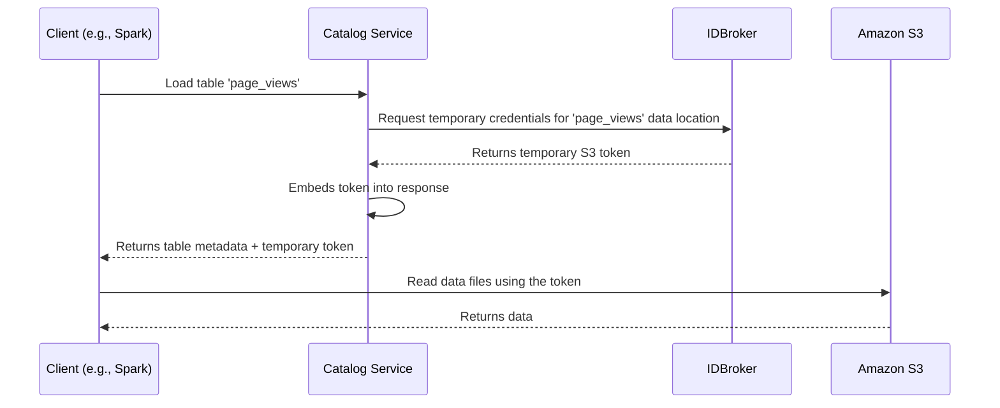

# Chapter 5: Data Sharing

In our [previous chapter on the Hive Caching Catalog](04_hive_caching_catalog_.md), we made our catalog fast by keeping popular table metadata close at hand. But that metadata only tells us *about* the data (like its schema) and *where* it is (e.g., a location in an S3 bucket). It doesn't help us actually *read* the data.

How can a client, like a Spark job, securely read data files from a cloud object store like S3? We could give the Spark job permanent, powerful AWS access keys, but that's like giving every library visitor a master key to the whole building—it's a huge security risk!

This chapter introduces **Data Sharing**, a clever abstraction that provides secure, temporary access to data in the cloud.

### The Problem: We Need a Secure Locker System

Imagine your data files are stored in secure lockers in a massive warehouse (S3). To read your files, you need a key. Giving every user a master key is dangerous. If they lose it, anyone can access everything.

A much better system would be to have a security desk at the front of the warehouse. To access your locker, you go to the desk, show your ID, and they give you a special, temporary key that *only* opens your specific locker and only works for the next 15 minutes. After that, the key becomes useless.

This is exactly what the `DataSharing` component does for data access. It acts as an intermediary that communicates with a "security desk" (an external service called an **IDBroker**) to get temporary, short-lived cloud credentials for a client.

### The Secure Key Exchange Flow

When a client asks for a table, our catalog service doesn't just return the table's metadata. If data sharing is enabled, it performs a secure key exchange in the background:

1.  The client (e.g., Spark) asks our catalog service for metadata for the `page_views` table.
2.  Our catalog service sees that the table's data is in S3.
3.  It contacts an **IDBroker** service and says, "This authenticated user needs to read the data at `s3://bucket/path/to/page_views`."
4.  The IDBroker validates the request and generates a set of temporary, short-lived S3 credentials (an access key, a secret key, and a session token).
5.  The IDBroker sends these temporary credentials back to our catalog service.
6.  Our catalog service embeds these credentials into the response it sends back to the client.
7.  The client can now use these temporary credentials to read the `page_views` data files directly from S3. The credentials will automatically expire after a short time.

Let's visualize this secure handshake.



### Under the Hood: The Code Path

How is this flow triggered in the code? It all starts inside the [HMS Catalog Adapter](03_hms_catalog_adapter_.md) when a table is loaded.

#### Step 1: The `dataSharingBuilder` is Called

When loading a table, the adapter uses a special helper method called `dataSharingBuilder`. This builder is responsible for preparing the response and, if needed, adding the temporary credentials.

```java
// File: iceberg/rest/HMSCatalogAdapter.java

private static LoadTableResponse accessTable(Catalog catalog, TableIdentifier ident, Table table) {
    if (table instanceof BaseTable) {
        // This builder will add data sharing tokens if configured.
        LoadTableResponse.Builder builder = dataSharingBuilder((BaseTable) table);
        
        // ... permission checks for the user happen here ...
        
        return builder.build();
    }
    // ... error handling ...
}
```
This code shows that before the final response is built, `dataSharingBuilder` is called to potentially add more information to it.

#### Step 2: Asking for an Access Token

Inside `dataSharingBuilder`, the code checks if data sharing is enabled. If it is, it gets the `DataSharing` object and asks it for an access token.

```java
// File: iceberg/rest/HMSCatalogAdapter.java

static LoadTableResponse.Builder dataSharingBuilder(BaseTable table) {
  return runAsHive(() -> {
    LoadTableResponse.Builder builder = LoadTableResponse.builder()
        .withTableMetadata(table.operations().current());
    
    DataSharing dataSharing = HMSCatalogServer.getDataSharing();
    if (dataSharing != null) {
        // Ask the DataSharing component for temporary S3 credentials
        Map<String, String> token = dataSharing.getAccessToken(table.location());
        token.forEach(builder::addConfig); // Add them to the response
    }
    return builder;
  });
}
```
The key line is `dataSharing.getAccessToken(table.location())`. This is the trigger that kicks off the entire communication with the IDBroker. The returned token (a map of key-value pairs) is then added to the response configuration.

#### Step 3: Inside the `DataSharing` Component

The `DataSharing` class is where the communication with the IDBroker happens. Its `getAccessToken` method orchestrates the process.

```java
// File: iceberg/rest/DataSharing.java

public Map<String, String> getAccessToken(String tableLocation) {
    // 1. First, get a token that lets our service talk to the IDBroker.
    // This proves our service's identity. This token is cached.
    IdBrokerDelegationToken delegationToken = fetchDelegationToken();
    if (delegationToken == null) {
        throw new NotAuthorizedException("Cannot get delegation token");
    }

    // 2. Now, use that token to ask for the actual S3 credentials.
    Map<String, String> s3Credentials = fetchAccessToken(delegationToken, tableLocation);
    return s3Credentials;
}
```
This process is a two-step handshake:
1.  Our service proves its own identity to the IDBroker to get a "delegation token". This is like our librarian showing their employee badge to the security desk.
2.  It then uses that delegation token to request the final S3 credentials for the end-user. This is like the librarian saying, "With my authority, please give this specific visitor a key for locker #123."

#### Step 4: Making the Network Call

The `fetchAccessToken` method handles the actual network call to the IDBroker.

```java
// File: iceberg/rest/DataSharing.java

private Map<String, String> fetchAccessToken(IdBrokerDelegationToken idt, String table) throws IOException {
    // 1. Build the URL to the IDBroker's credentials endpoint.
    URL url = accessTokenUrl(table);

    // 2. Make an HTTP GET request to the IDBroker, presenting our token.
    Object result = clientCall(idt.getDelegationToken(), url, "GET", null);

    // 3. Parse the S3 credentials from the JSON response.
    // ... logic to extract keys from the JSON result ...
    Map<String, String> tokenResponse = new HashMap<>();
    tokenResponse.put("s3.access-key-id", "TEMP_ACCESS_KEY_...");
    // ... add secret key and session token ...
    return tokenResponse;
}
```
This method constructs the correct URL, makes an HTTP request, and parses the temporary S3 credentials from the response. These credentials are then passed all the way back to the client.

### Conclusion

In this chapter, we explored the `DataSharing` abstraction, a powerful mechanism for providing secure, temporary access to data in cloud storage.

The key takeaways are:
-   It solves the problem of securely accessing cloud data without using risky, long-lived credentials.
-   It uses an external **IDBroker** service, which acts like a "security desk" to issue temporary keys.
-   The process is transparent to the end-user. The catalog service handles the entire secure token exchange in the background.
-   The result is a set of **short-lived credentials** that grant the client direct, temporary read access to the specific data files it needs.

This system is a cornerstone of building a secure, multi-tenant data platform. So far, we've seen how the catalog handles requests from the web, caches data, and shares it securely. But how does it actually talk to the Hive Metastore itself?

Next up: [Hive Actor](06_hive_actor_.md)

---

Generated by [AI Codebase Knowledge Builder](https://github.com/The-Pocket/Tutorial-Codebase-Knowledge)