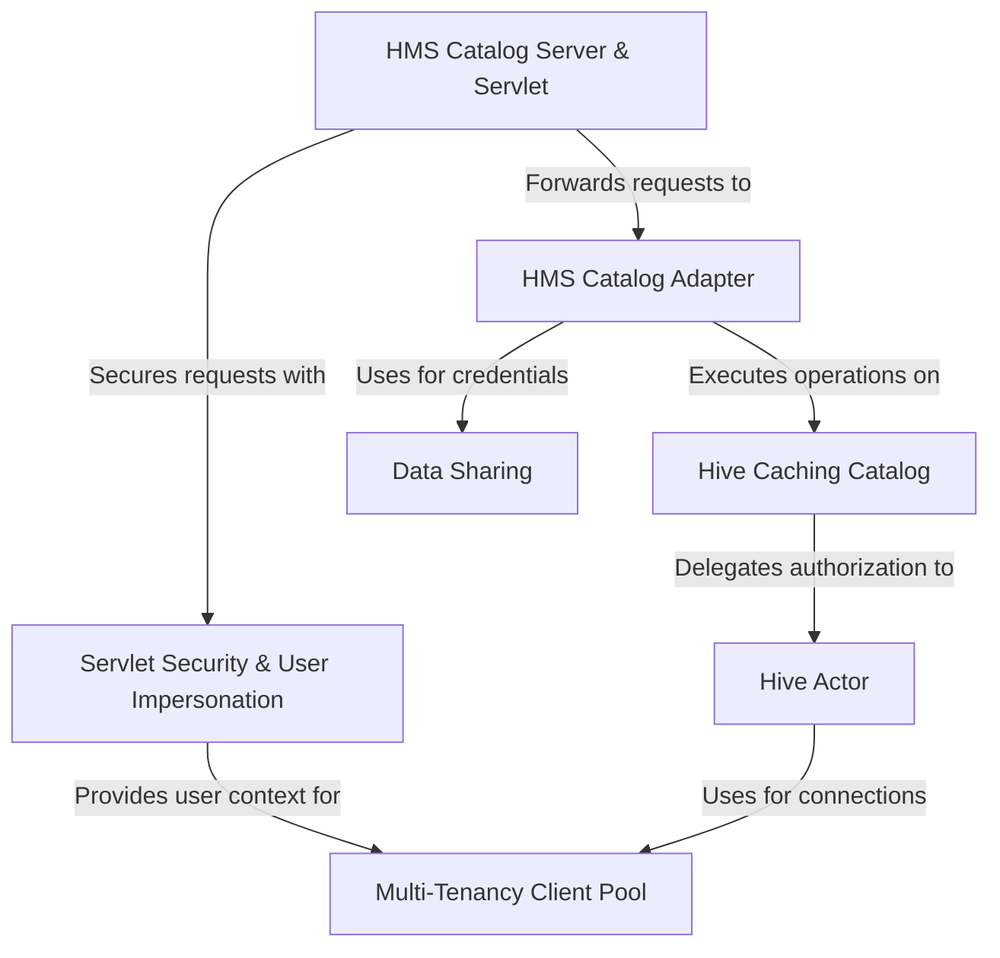

# Tutorial: apache

This project provides a **web service** that acts as a modern, RESTful API for managing *Apache Iceberg* tables. It serves as a bridge, translating simple web requests into operations on an underlying *Apache Hive Metastore*. Key features include **high-performance caching** to speed up metadata access, robust **security** with user impersonation for multi-tenant environments, and a *data sharing* mechanism to grant temporary, secure access to table data in cloud storage.

**Source Repository:** [None](None)

## Chapters

1. [HMS Catalog Server & Servlet
](01_hms_catalog_server___servlet_.md)
2. [Servlet Security & User Impersonation
](02_servlet_security___user_impersonation_.md)
3. [HMS Catalog Adapter
](03_hms_catalog_adapter_.md)
4. [Hive Caching Catalog
](04_hive_caching_catalog_.md)
5. [Data Sharing
](05_data_sharing_.md)
6. [Hive Actor
](06_hive_actor_.md)
7. [Multi-Tenancy Client Pool
](07_multi_tenancy_client_pool_.md)

---

Generated by [AI Codebase Knowledge Builder](https://github.com/The-Pocket/Tutorial-Codebase-Knowledge)