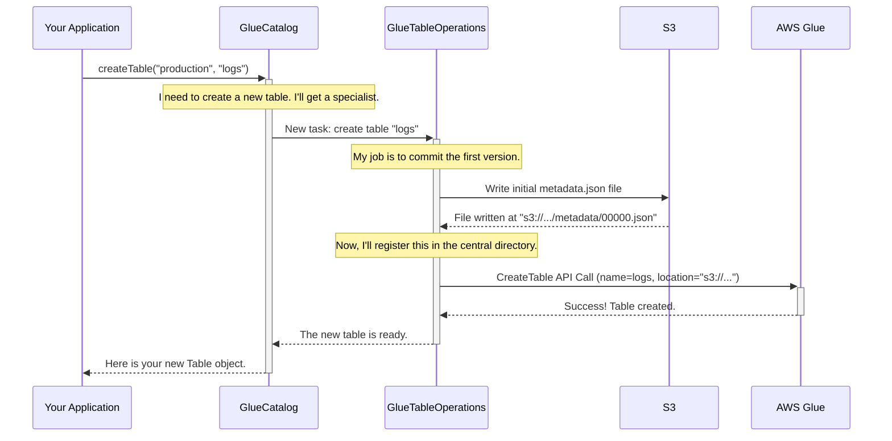

# Chapter 2: GlueCatalog

In the [previous chapter](01_configuration_properties__awsproperties__s3fileioproperties__etc___.md), we learned how to use a simple map of settings to configure Iceberg. Now, let's use those settings to power up our first major component: the `GlueCatalog`.

### The Problem: Where Do My Tables Live?

Imagine you have a massive library with thousands of books. If there were no catalog system, finding a specific book would be impossible. You'd have to wander through every aisle, looking at every spine.

A data lake is no different. You might have hundreds or thousands of Iceberg tables stored in Amazon S3. How do you find them? How do you know what tables are available? How do you create a new one or delete an old one?

You need a central directory, a "card catalog" for your data tables.

### The Solution: `GlueCatalog` - The Data Librarian

The `GlueCatalog` is Iceberg's "data librarian" for AWS. It uses the **AWS Glue Data Catalog** service as its central directory to keep track of all your tables.

When you ask Iceberg for a table, the `GlueCatalog` doesn't look in S3 directly. Instead, it asks the AWS Glue Data Catalog: "Hey, where can I find the metadata for the `sales` table?" Glue then provides the exact S3 path to the table's current state.

It's the bridge between Iceberg's world of tables and AWS's managed metadata service.

### How to Use the `GlueCatalog`

Let's see it in action. Our goal is to create a new Iceberg table called `logs` inside a database (or "namespace") called `production`.

First, we need to set up our librarian. Just like in the [previous chapter](01_configuration_properties__awsproperties__s3fileioproperties__etc___.md), we start with a properties map.

```java
// In Java
Map<String, String> properties = new HashMap<>();

// 1. Point to our main data storage location in S3
properties.put("warehouse", "s3://my-iceberg-data-bucket/warehouse");

// 2. Tell Iceberg we want to use the GlueCatalog
properties.put("catalog-impl", "org.apache.iceberg.aws.glue.GlueCatalog");

// 3. (Optional) Specify an AWS role for permissions
properties.put(AwsProperties.CLIENT_ASSUME_ROLE_ARN, "arn:aws:iam::...");
```
Notice the new `catalog-impl` property. This is how we tell Iceberg which librarian to hire!

Now, we can initialize our catalog and create a table.

```java
// Create and initialize the catalog
GlueCatalog catalog = new GlueCatalog();
catalog.initialize("my_aws_catalog", properties);

// Define the table's name and its "schema" (its columns)
Namespace myNamespace = Namespace.of("production");
TableIdentifier tableName = TableIdentifier.of(myNamespace, "logs");
Schema schema = new Schema(
    Types.NestedField.required(1, "level", Types.StringType.get()),
    Types.NestedField.required(2, "message", Types.StringType.get())
);

// Create the table!
Table table = catalog.createTable(tableName, schema);
```
That's it! With just a few lines of code, `GlueCatalog` has performed several actions in AWS:
1.  It checked if a Glue Database named `production` exists, and if not, it would have created it (if you called `catalog.createNamespace`).
2.  It wrote a new `metadata.json` file to your S3 warehouse path. This file describes your new `logs` table.
3.  It created a new table entry in the AWS Glue Data Catalog named `logs` and pointed it to the `metadata.json` file in S3.

Now, anyone else with access can load this table just by asking for its name:
```java
// Load the table from the catalog
Table loadedTable = catalog.loadTable(tableName);

System.out.println("Loaded table with schema: " + loadedTable.schema());
// Output: Loaded table with schema: table { 1: level: required string, 2: message: required string }
```

### Under the Hood: A Look Inside the Library

How does `GlueCatalog` actually work when you call `createTable` or `loadTable`? It coordinates a few key players.

1.  **You (The Application):** You make a request, like `createTable`.
2.  **`GlueCatalog` (The Librarian):** It manages the list of tables and databases. It knows how to talk to AWS Glue to list, find, or register tables.
3.  **`GlueTableOperations` (The Specialist):** For any operation on a *single* table (like creating it or updating it), the `GlueCatalog` hands the job over to a specialist: a `GlueTableOperations` object. This object handles the tricky task of making sure changes are atomic and safe. We will cover this in detail in the [next chapter](03_gluetableoperations_.md).
4.  **Amazon S3:** The actual storage for your data and metadata files.
5.  **AWS Glue Data Catalog:** The central directory service.

Here is a simplified sequence of what happens when you create a table:



The beauty of this design is its **separation of concerns**.

*   The `GlueCatalog` is concerned with the *collection* of tables. (e.g., `listTables`, `dropNamespace`).
*   The [GlueTableOperations](03_gluetableoperations_.md) is concerned with the *state of a single table*. (e.g., committing a new version).

Let's peek at the code that makes this happen.

**File: `src/main/java/org/apache/iceberg/aws/glue/GlueCatalog.java`**
When you call a method like `createTable`, `loadTable`, or `dropTable`, the `GlueCatalog` first creates a `GlueTableOperations` object for that specific table.

```java
// Simplified from GlueCatalog.java
@Override
protected TableOperations newTableOps(TableIdentifier tableIdentifier) {
  // ... a bunch of configuration setup ...

  // The catalog creates a specialist to handle this specific table.
  return new GlueTableOperations(
      glue,          // The AWS Glue client
      lockManager,   // A lock manager like DynamoDbLockManager
      catalogName,
      awsProperties,
      hadoopConf,
      tableIdentifier);
}
```
This `newTableOps` method is the factory that produces the specialist object responsible for all the low-level interactions with S3 and Glue for a single table. The `GlueCatalog` then uses this object to perform the requested action.

Similarly, when you list tables, `GlueCatalog` makes a direct call to the AWS Glue API.

**File: `src/main/java/org/apache/iceberg/aws/glue/GlueCatalog.java`**
```java
// Simplified from listTables in GlueCatalog.java
@Override
public List<TableIdentifier> listTables(Namespace namespace) {
    // ...
    GetTablesResponse response = glue.getTables(
        GetTablesRequest.builder()
            .databaseName(IcebergToGlueConverter.toDatabaseName(namespace, ...))
            .build());
    // ... loop through response and convert Glue tables to Iceberg identifiers
}
```
Here, the catalog is acting as the librarian, walking down the "aisle" (database) you specified and reading the titles of all the books (tables) on the shelf.

### Conclusion

You've now met the `GlueCatalog`, the central component for organizing your Iceberg data lake on AWS.

*   It acts as a **central directory** or "card catalog" for your tables.
*   It uses the **AWS Glue Data Catalog** as its backend metastore.
*   You use it to `createTable`, `loadTable`, `listTables`, and manage namespaces (databases).
*   It delegates the atomic, per-table work to a helper object, which we'll explore next.

With the `GlueCatalog` managing your table directory, how does Iceberg guarantee that changes to a table—like adding new data—are safe and reliable, even if multiple people are writing to it at once? The answer lies in the component our catalog just hired: the [GlueTableOperations](03_gluetableoperations_.md).

---

Generated by [AI Codebase Knowledge Builder](https://github.com/The-Pocket/Tutorial-Codebase-Knowledge)