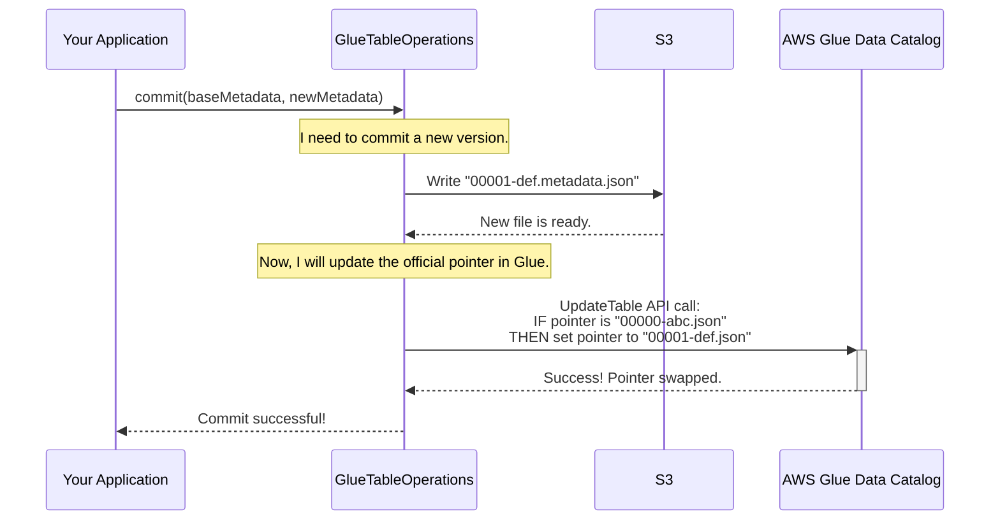

# Chapter 3: GlueTableOperations

In the [previous chapter](02_gluecatalog_.md), we met the `GlueCatalog`, our data librarian that keeps a directory of all our tables. We learned that for any work on a *single* table, the librarian delegates the task to a specialist. It's time to meet that specialist.

### The Problem: How Do You Safely Edit a Shared File?

Imagine you and a coworker are both editing the same critical report.
*   You open the report and start adding a new section.
*   At the same time, your coworker opens the *same original report* and starts fixing typos.
*   Your coworker saves first. A minute later, you save your changes.

What happens? Your coworker's typo fixes are gone! They were overwritten by your version of the document, which never had them in the first place. This is called a "race condition," and it leads to data loss and corruption.

An Iceberg table stored in S3 faces the exact same risk. Multiple data pipelines might try to write to the same table at the same time. How do we prevent them from overwriting each other's work and corrupting the table?

### The Solution: `GlueTableOperations` - The Transaction Engine

`GlueTableOperations` is the engine that drives safe, reliable changes for a single Iceberg table. Its most important job is to perform **atomic commits**. "Atomic" is a database term that means an operation either succeeds completely or fails completely, with no in-between state.

It achieves this with a clever two-step process:

1.  **Step 1: Write the New State.** First, it writes a new metadata file (e.g., `00001-....metadata.json`) to S3. This file represents the *proposed* new state of the table. The original table is not touched.
2.  **Step 2: Atomically Swap the Pointer.** Then, in a single, conditional operation, it tells the AWS Glue Data Catalog: "Please update the table pointer from the old metadata file to this new one, but *only if* the pointer is still pointing to the old one."

This "write-then-swap" strategy ensures the table's official state changes instantaneously. Readers will either see the complete old version or the complete new version—never a half-written mess.

### How Commits Work: A Step-by-Step Example

Let's say you want to add a new column `priority` to your `logs` table. When you run your code to commit this change, here’s what `GlueTableOperations` does behind the scenes:

1.  **Reads the Current State:** It first reads the current table state, noting that the official metadata is, for example, `s3://.../00000-abc.metadata.json`. This is the "base" version.
2.  **Writes a New Metadata File:** It creates a new metadata file in S3, `s3://.../00001-def.metadata.json`, which includes your new `priority` column.
3.  **Performs the Atomic Swap:** It makes a conditional API call to AWS Glue to update the table's properties.



If another process had managed to change the table just before our commit, the pointer in Glue would no longer be `00000-abc.json`. Our conditional update in Step 3 would fail, `GlueTableOperations` would throw a `CommitFailedException`, and we would know to retry our change on top of the newer version. The table remains safe and consistent.

### Under the Hood: A Look at the `doCommit` Method

The core logic for this process lives in the `doCommit` method within `GlueTableOperations`. Let's look at a simplified version of the code to see how it works.

**File: `src/main/java/org/apache/iceberg/aws/glue/GlueTableOperations.java`**

```java
// A simplified view of the doCommit method
@Override
protected void doCommit(TableMetadata base, TableMetadata metadata) {
    String newMetadataLocation = null;
    try {
        // Step 1: Write the new metadata file to S3 first.
        newMetadataLocation = writeNewMetadataIfRequired(base == null, metadata);

        // (Optional) Acquire a lock to prevent concurrent writers.
        // We'll explore this more with the DynamoDbLockManager.
        lock(newMetadataLocation);

        // Get the current table details from Glue.
        Table glueTable = getGlueTable();

        // Step 2: Check if someone else committed since we started.
        // If the location in Glue doesn't match our 'base', fail fast.
        checkMetadataLocation(glueTable, base);

        // Prepare properties for the Glue API call, including the new pointer.
        Map<String, String> properties = prepareProperties(glueTable, newMetadataLocation);

        // Step 3: Perform the atomic update in Glue.
        persistGlueTable(glueTable, properties, metadata);

    } catch (RuntimeException e) {
        // ... complex error handling to check if the commit secretly succeeded ...
        throw new CommitFailedException(e, "Commit failed!");
    } finally {
        // Clean up the lock and any orphaned metadata files.
        cleanupMetadataAndUnlock(commitStatus, newMetadataLocation);
    }
}
```

Let's break down the key parts:

1.  **`writeNewMetadataIfRequired(...)`**: This method uses the table's [S3FileIO](04_s3fileio_.md) to write the new `metadata.json` file to its unique path in S3. This happens *before* any changes are made in Glue.
2.  **`checkMetadataLocation(...)`**: This is our safety check. It compares the metadata location of our `base` version with what's currently stored in AWS Glue. If they don't match, it means another process has already committed a change, and our commit must fail to avoid overwriting it.
3.  **`persistGlueTable(...)`**: This is the climax! It makes the actual API call to AWS Glue to create or update the table record.

Let's peek inside `persistGlueTable`.

**File: `src/main/java/org/apache/iceberg/aws/glue/GlueTableOperations.java`**

```java
// A simplified view of the persistGlueTable method
void persistGlueTable(Table glueTable, Map<String, String> parameters, ...) {
    if (glueTable != null) {
        // This is an existing table, so we UPDATE it.
        UpdateTableRequest.Builder updateRequest = UpdateTableRequest.builder()
            .databaseName(databaseName)
            .name(tableName)
            .tableInput(
                // Creates a TableInput with the new parameters,
                // including the METADATA_LOCATION_PROP pointing to our new file.
            );

        // This is the atomic part. The request will fail if the table
        // has been modified by someone else since we read it.
        glue.updateTable(updateRequest.build());
    } else {
        // This is a new table, so we CREATE it.
        glue.createTable(...);
    }
}
```

This method is what formally tells AWS Glue about the new state of our table. The `updateTable` API call is designed to be conditional (using a mechanism called optimistic locking), which is the foundation of Iceberg's transactional guarantees on AWS.

### The Power of Failure

What makes `GlueTableOperations` so robust is how it handles failure.

*   **If the program crashes *before* the Glue update?** No problem. A new, unused metadata file (`00001-def.json`) is left in S3, but the official table pointer in Glue never changed. The table is still perfectly valid. The orphaned file can be cleaned up later.
*   **If two writers try to commit at once?** The first one to call `updateTable` wins. The second one's call will fail because the table has changed. It receives a `CommitFailedException` and knows it must retry its work based on the new, updated table state.
*   **If the network fails *during* the Glue update?** This is the trickiest case. Did the commit go through or not? `GlueTableOperations` enters a special state where it re-checks the table's status in Glue to determine the outcome, preventing a `CommitStateUnknownException` whenever possible.

This careful management of state and failure is what makes data lakes built on Iceberg and Glue so reliable.

### Conclusion

You've now explored the engine room of an Iceberg table on AWS.

*   `GlueTableOperations` is responsible for managing the state of a **single table**.
*   Its primary job is to perform **atomic commits** to prevent data corruption.
*   It uses a two-step **"write-then-swap"** process: write a new metadata file to S3, then atomically update the pointer in the AWS Glue Data Catalog.
*   This mechanism relies on **conditional updates** to ensure that concurrent operations don't overwrite each other.

`GlueTableOperations` handles the "swap" part of the commit. But what about the "write" part? How does Iceberg actually interact with Amazon S3 to read and write metadata and data files? We'll find out in the next chapter as we dive into [S3FileIO](04_s3fileio_.md).

---

Generated by [AI Codebase Knowledge Builder](https://github.com/The-Pocket/Tutorial-Codebase-Knowledge)