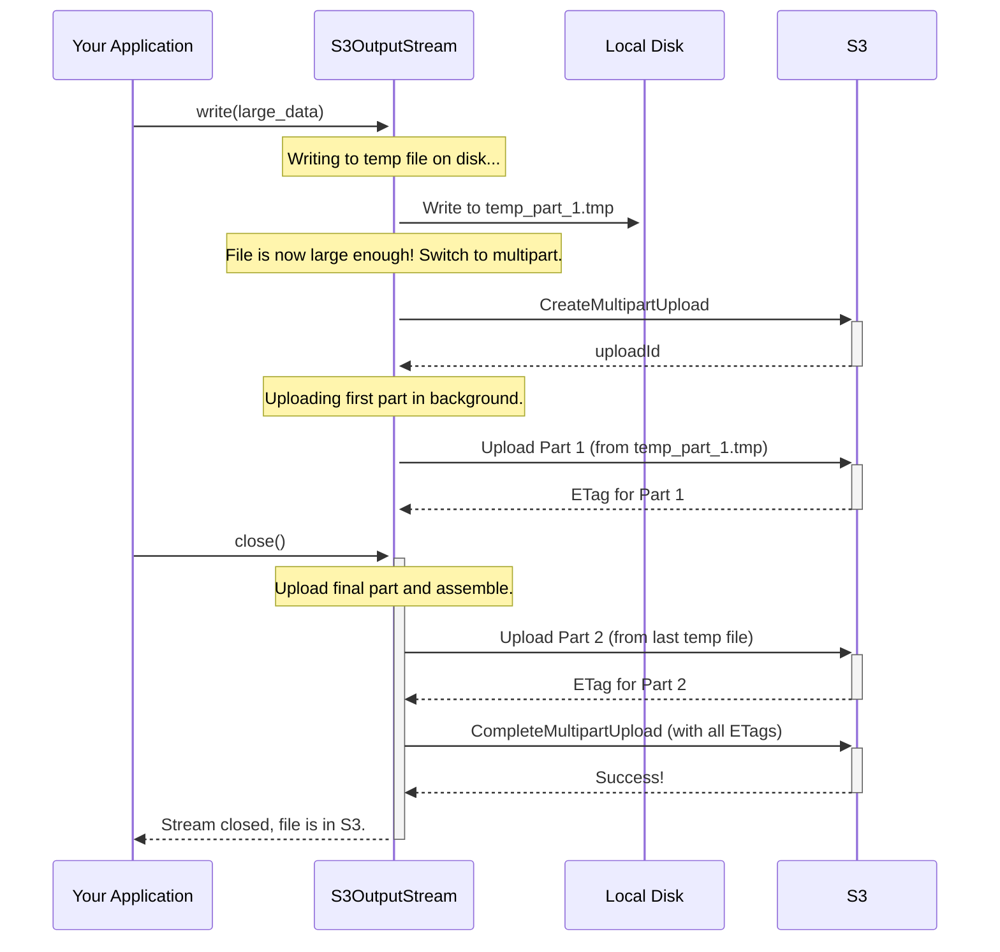

# Chapter 4: S3FileIO

In the [previous chapter](03_gluetableoperations_.md), we learned how `GlueTableOperations` safely commits changes to a table by atomically swapping a pointer in the AWS Glue Catalog. But we glossed over a key detail: how does Iceberg actually *write* the metadata and data files to Amazon S3? It's time to meet the component that does the heavy lifting.

### The Problem: Talking to the Cloud is Complicated

Reading and writing files on your local computer is simple. But Amazon S3 is not a local disk; it's a massive, distributed object storage service with its own API.

To interact with S3, you need to:
*   Authenticate your requests with AWS credentials.
*   Handle potential network errors and retry failed operations.
*   Encrypt data for security.
*   For large files (like a 50GB Parquet file), you can't just upload it in one go. You have to break it into smaller parts and upload them in parallel, a process called "multipart upload".

If every part of Iceberg had to implement this logic, the code would be incredibly complex and repetitive. We need a single, standardized way to handle all S3 communication.

### The Solution: `S3FileIO` - Your S3 Specialist

`S3FileIO` is Iceberg's dedicated specialist for all things S3. Think of it as a specialized librarian for a massive, cloud-based library (your S3 buckets). It knows exactly how to:
*   **Read files (`InputFile`):** Fetch a book from the shelf.
*   **Write files (`OutputFile`):** Add a new book to the library.
*   **Delete files:** Remove a book from the collection.

It handles all the S3-specific details, like multipart uploads and API communication, providing a simple, standardized way for the rest of the Iceberg framework to work with data in S3. Components like `GlueTableOperations` use `S3FileIO` without ever needing to know the complex details of the S3 API.

### How to Use `S3FileIO`

Most of the time, you won't use `S3FileIO` directly. It's automatically created and used by catalogs like `GlueCatalog` based on the properties you provide. However, understanding how it works is key.

Let's imagine we want to write a simple text file to S3, read it back, and then delete it.

First, we create an `S3FileIO` instance. For this example, we'll create it directly, but normally it's done for you.

```java
// In a real application, you wouldn't do this directly.
// The catalog would create it for you based on its properties.
S3FileIO s3FileIO = new S3FileIO();
s3FileIO.initialize(new HashMap<>()); // Using default settings for simplicity
```
This creates a new `S3FileIO` object, ready to talk to S3.

Now, let's write a file. We ask `S3FileIO` for an `OutputFile`, which represents a file we intend to write.

```java
String location = "s3://my-iceberg-data-bucket/greetings.txt";
OutputFile outputFile = s3FileIO.newOutputFile(location);
```

Next, we create a stream from the `OutputFile` and write our data to it.

```java
// createOrOverwrite() gives us a stream to write to.
try (PositionOutputStream stream = outputFile.createOrOverwrite()) {
    stream.write("Hello, S3!".getBytes(StandardCharsets.UTF_8));
}
```
When we close the stream, `S3FileIO` handles the actual upload to S3. The file `greetings.txt` now exists in our bucket!

Reading the file is just as simple. We ask for an `InputFile` and get a stream to read from it.

```java
InputFile inputFile = s3FileIO.newInputFile(location);

try (SeekableInputStream stream = inputFile.newStream()) {
    byte[] data = new byte[(int) inputFile.getLength()];
    stream.read(data);
    System.out.println(new String(data, StandardCharsets.UTF_8));
}
// Output: Hello, S3!
```

Finally, to clean up, we just tell `S3FileIO` to delete the file.

```java
s3FileIO.deleteFile(location);
```

Behind these simple `read`, `write`, and `delete` calls, `S3FileIO` is managing credentials, making secure API calls, and handling all the complexities of S3.

### Under the Hood: The Magic of Multipart Uploads

The real power of `S3FileIO` shines when writing large files. Uploading a 10GB file in a single request is slow and risky; if the network connection drops at 9.9GB, you have to start all over again.

`S3FileIO` solves this by automatically using S3's **multipart upload** capability. Here's a step-by-step look at what happens when you write a large file.

1.  **Start Writing:** When you call `outputFile.create()`, `S3FileIO` gives you an `S3OutputStream`. This stream doesn't write directly to S3. Instead, it starts writing to a **temporary file on your local disk**.
2.  **Threshold Reached:** As you write data, the `S3OutputStream` keeps track of the total size. Once the file size exceeds a configured threshold (e.g., 48MB, controlled by `s3.multipart.threshold`), it decides to switch to multipart mode.
3.  **Initiate Upload:** It sends an API call to S3: "I'm starting a multipart upload for `large-data-file.parquet`." S3 responds with a unique **Upload ID**.
4.  **Upload Parts in Background:** The first temporary file (now full) is queued for upload. `S3FileIO` uses a background thread pool to upload this "part" to S3, associating it with the *Upload ID*. Meanwhile, your application can continue writing data to a *new* temporary file without waiting.
5.  **Finalize:** When you finally call `stream.close()`, the last, partially-filled temporary file is uploaded as the final part. `S3FileIO` then sends one last API call to S3: "Please assemble all the parts for this *Upload ID* into the final file." S3 stitches the parts together in the cloud, and your file is ready.

This process is far more reliable and efficient, and `S3FileIO` manages it all for you.



Let's peek at the code that makes this decision.

**File: `src/main/java/org/apache/iceberg/aws/s3/S3OutputStream.java`**
The `write` method in `S3OutputStream` is responsible for triggering the switch to multipart mode.

```java
// A simplified view of S3OutputStream's write method
@Override
public void write(byte[] b, int off, int len) throws IOException {
    // ... logic to write to the current temporary file ...

    pos += len; // Update our total position

    // If we have written enough data and haven't started a multipart
    // upload yet, it's time to start one.
    if (multipartUploadId == null && pos >= multiPartThresholdSize) {
        initializeMultiPartUpload(); // This gets the Upload ID from S3
        uploadParts(); // This starts uploading completed temp files
    }
}
```
When `close()` is called, it checks if a multipart upload was ever started.

**File: `src/main/java/org/apache/iceberg/aws/s3/S3OutputStream.java`**
```java
// A simplified view of the logic in close()
private void completeUploads() {
    if (multipartUploadId == null) {
        // The file was small. We do a simple, single PutObject request.
        // All data is read from the one temporary file on disk.
        s3.putObject(...);
    } else {
        // The file was large. Upload the final part and then
        // send the "CompleteMultipartUpload" request to S3.
        uploadParts();
        completeMultiPartUpload();
    }
}
```
This intelligent design ensures small files are uploaded efficiently in one go, while large files automatically get the performance and reliability benefits of a multipart upload.

### Conclusion

You've now met `S3FileIO`, the workhorse responsible for all file operations in Amazon S3.

*   It provides a **simple and standard interface** for reading, writing, and deleting files.
*   It hides the complexity of the S3 API, including **authentication, encryption, and retries**.
*   It automatically handles **multipart uploads** for large files, ensuring efficient and reliable writes.
*   It is configured via the properties we learned about in [Chapter 1](01_configuration_properties__awsproperties__s3fileioproperties__etc___), especially the `S3FileIOProperties`.

With `GlueTableOperations` providing atomic commits and `S3FileIO` handling the storage, we have a robust system. But what happens if two processes try to commit to the same table at the exact same moment? The `GlueTableOperations` commit might fail for one of them, forcing it to retry. In highly concurrent systems, this can be inefficient. How can we ensure only one writer gets to attempt a commit at a time?

In the next chapter, we'll explore a component that solves this exact problem: the [DynamoDbLockManager](05_dynamodblockmanager_.md).

---

Generated by [AI Codebase Knowledge Builder](https://github.com/The-Pocket/Tutorial-Codebase-Knowledge)