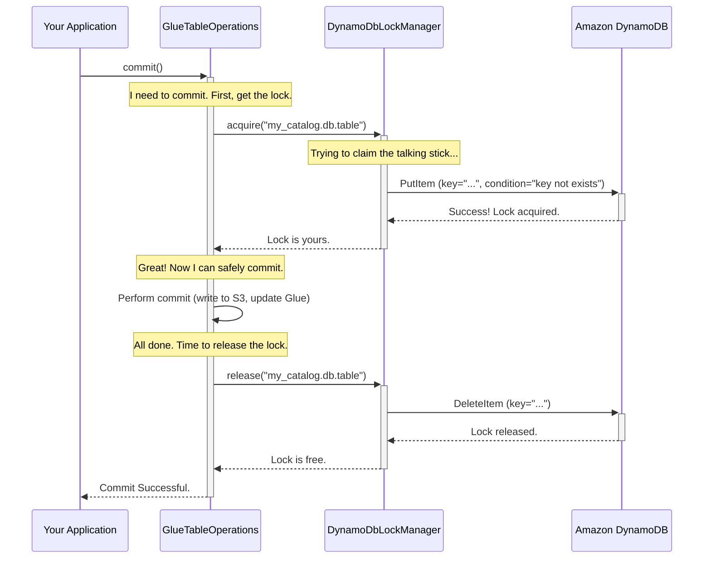

# Chapter 5: DynamoDbLockManager

In our previous chapters, we saw how [GlueTableOperations](03_gluetableoperations_.md) uses atomic "swap" operations to commit changes safely and how [S3FileIO](04_s3fileio_.md) handles the file storage. This system is robust, but it has a quirk. If two processes try to commit to the same table at the exact same time, the `GlueTableOperations` logic ensures only one will succeed. The other will get an error and have to retry its entire operation from scratch. In environments with many concurrent jobs, this "fail-and-retry" cycle can be inefficient.

What if we could make writers form an orderly queue, so only one attempts to commit at a time?

### The Problem: Talking Over Each Other

Imagine a group discussion where everyone tries to talk at once. It's chaos. To have a productive conversation, you might use a "talking stick"—only the person holding the stick is allowed to speak.

Concurrent write operations on a data table are just like this. If multiple Spark or Flink jobs try to commit changes simultaneously, they "talk over" each other. One commit will succeed, but the others will fail and have to start over. This wastes time and computing resources.

We need a "talking stick" for our data tables to ensure only one writer can attempt a commit at a time.

### The Solution: `DynamoDbLockManager` - The Talking Stick

The `DynamoDbLockManager` is Iceberg's "talking stick." It uses **Amazon DynamoDB**, a fast and scalable key-value database, to create a distributed locking system.

Here’s the simple idea:
1.  **Ask for the Stick:** Before a writer attempts a commit, it asks the `DynamoDbLockManager` for a "lock" (the talking stick) for a specific table.
2.  **Wait for Your Turn:** If another writer is already holding the lock, our writer will wait patiently until the lock is available.
3.  **Hold the Stick and Talk:** Once it acquires the lock, it has exclusive permission to commit. It performs its S3 writes and Glue Catalog update.
4.  **Pass the Stick:** After the commit succeeds (or fails), it releases the lock, allowing the next writer in line to take its turn.

This process transforms a chaotic free-for-all into an orderly, one-at-a-time sequence, dramatically improving efficiency in highly concurrent environments.

### How to Use the `DynamoDbLockManager`

The best part is that you don't need to write any complex locking code yourself. You just need to tell your catalog to use it. You enable it through the same configuration map we used in [Chapter 1](01_configuration_properties__awsproperties__s3fileioproperties__etc___.md).

Let's configure a `GlueCatalog` to use our new lock manager.

```java
// In Java
Map<String, String> properties = new HashMap<>();

// Standard catalog properties
properties.put("warehouse", "s3://my-iceberg-data-bucket/warehouse");
properties.put("catalog-impl", "org.apache.iceberg.aws.glue.GlueCatalog");

// --- Enable DynamoDB Locking ---
// 1. Specify the LockManager implementation
properties.put(CatalogProperties.LOCK_IMPL, DynamoDbLockManager.class.getName());

// 2. Provide a name for the DynamoDB table that will store the locks
properties.put(CatalogProperties.LOCK_TABLE, "my-iceberg-locks");
```
And that's it! You create your catalog just like before, and Iceberg handles the rest.

```java
// Initialize the catalog with our properties
GlueCatalog catalog = new GlueCatalog();
catalog.initialize("my_aws_catalog", properties);

// Now, any commit operation will automatically use the lock manager
Table myTable = catalog.loadTable(TableIdentifier.of("db", "table"));
myTable.newAppend().appendFile(someDataFile).commit(); // This is now lock-protected!
```
When you run this code, `DynamoDbLockManager` will automatically create the `my-iceberg-locks` table in DynamoDB if it doesn't already exist. From then on, all commit operations on any table managed by this catalog will be protected by locks.

### Under the Hood: The Life of a Lock

So what happens when you call `commit()` on a table with locking enabled? The `GlueTableOperations` object coordinates with the `DynamoDbLockManager`.

1.  **Acquire Lock:** Before doing anything else, `GlueTableOperations` asks the `DynamoDbLockManager` to acquire a lock for the table.
2.  **Attempt Atomic Write:** The `DynamoDbLockManager` attempts to write a new item into the DynamoDB lock table. The item's key is the unique identifier for the Iceberg table (e.g., `my_catalog.db.table`). DynamoDB guarantees that only one process can successfully write this item at a time.
3.  **Wait or Proceed:** If the lock is already held, our process waits. If it succeeds, it now holds the lock.
4.  **Commit:** `GlueTableOperations` proceeds with its normal commit logic (writing metadata to S3, updating Glue).
5.  **Release Lock:** Once the commit is finished, `GlueTableOperations` tells the `DynamoDbLockManager` to release the lock by deleting the item from the DynamoDB table.

This sequence ensures that the critical section—the commit itself—is only ever executed by one writer at a time.



### Heartbeating: What if a Writer Crashes?

There's a potential problem: what if a process acquires a lock and then crashes? The lock would be stuck forever, blocking all other writers.

`DynamoDbLockManager` solves this with a **lease and heartbeat** mechanism.
*   When a lock is acquired, it's given a short "lease" duration (e.g., 10 minutes).
*   The process holding the lock must send a "heartbeat" (a tiny update to the lock item in DynamoDB) every few seconds to show it's still alive.
*   If the process crashes, it stops sending heartbeats. The lease eventually expires, and DynamoDB makes the lock available for another process to acquire.

This clever mechanism ensures the system is resilient to failures. Let's look at the code that handles acquiring a lock.

**File: `src/main/java/org/apache/iceberg/aws/dynamodb/DynamoDbLockManager.java`**

The core logic for acquiring a lock tries to write a new lock item to DynamoDB. The magic is in the `conditionExpression`.

```java
// A simplified view of what happens when a lock doesn't exist yet
dynamo.putItem(
    PutItemRequest.builder()
        .tableName(lockTableName)
        .item(toNewItem(entityId, ownerId, ...))
        // This is the key: only succeed if the lock item doesn't already exist.
        .conditionExpression("attribute_not_exists(entityId)")
        .build());
```
This `conditionExpression` is an instruction to DynamoDB: "Only perform this write if an item with this `entityId` does not already exist." This is an atomic check-and-set operation. If two processes run this code at the same time, DynamoDB guarantees that only one will succeed.

Releasing a lock is also conditional, to prevent a process from accidentally releasing a lock that belongs to someone else.

```java
// A simplified view of releasing a lock
dynamo.deleteItem(
    DeleteItemRequest.builder()
        .tableName(lockTableName)
        .key(toKey(id))
        // Only delete the lock if we are the current owner.
        .conditionExpression("entityId = :eid AND ownerId = :oid")
        .build());
```
This ensures that only the rightful owner can release the lock, making the system secure and predictable.

### Conclusion

You've now learned about the `DynamoDbLockManager`, a powerful tool for managing concurrency in your Iceberg data lake.

*   It acts as a **distributed "talking stick"** to ensure only one writer can commit to a table at a time.
*   It uses **Amazon DynamoDB** to provide a fast and reliable locking backend.
*   It improves the efficiency of concurrent write workloads by **preventing commit failures** and retries.
*   It's enabled with simple configuration properties, with no changes needed to your application logic.
*   It includes a **heartbeat mechanism** to ensure the system is resilient to crashes.

So far, we've used AWS Glue to track our table list and S3 to store the actual metadata files. But what if you wanted a catalog that relies *entirely* on DynamoDB, without using Glue at all? In the next chapter, we'll explore exactly that with the [DynamoDbCatalog](06_dynamodbcatalog_.md).

---

Generated by [AI Codebase Knowledge Builder](https://github.com/The-Pocket/Tutorial-Codebase-Knowledge)