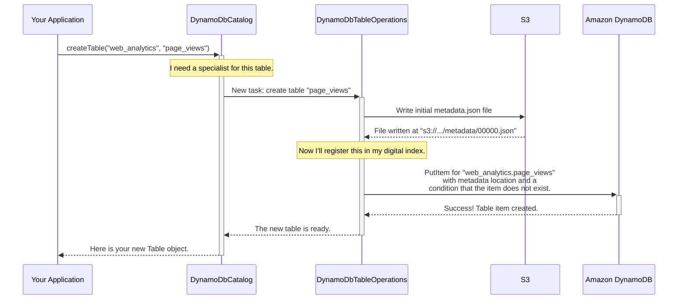

# Chapter 6: DynamoDbCatalog

In the [previous chapter](05_dynamodblockmanager_.md), we learned how to use Amazon DynamoDB as a high-performance "talking stick" with `DynamoDbLockManager` to manage concurrent writers. This showed how DynamoDB can enhance our `GlueCatalog`. But what if we went a step further? What if we used DynamoDB not just for locking, but to run the *entire catalog* itself?

### The Problem: What If I Don't Want to Use AWS Glue?

The [GlueCatalog](02_gluecatalog_.md) is a fantastic, managed solution for keeping track of your Iceberg tables. However, some teams might prefer a different approach for various reasons:
*   **Operational Simplicity:** They might already be heavy users of DynamoDB and prefer to stick with a familiar tool.
*   **Performance:** They may have workloads that benefit from DynamoDB's single-digit millisecond latency for metadata lookups.
*   **Cost Model:** The pay-per-request pricing of DynamoDB might be a better fit for their usage patterns.
*   **Architecture:** They might want a purely serverless catalog that doesn't depend on the Glue service.

In short, they need a choice. They want the power of Iceberg, but with a different backend for storing the table directory.

### The Solution: `DynamoDbCatalog` - The All-in-One DynamoDB Metastore

The `DynamoDbCatalog` is a complete, self-contained catalog implementation that uses a single Amazon DynamoDB table as its metastore. It handles all the responsibilities of a catalog—creating namespaces, listing tables, and tracking table metadata—without ever talking to AWS Glue.

Think of it as a different kind of librarian. Instead of using the central library's large, shared card catalog (AWS Glue), this librarian keeps their own, lightning-fast digital index card system (a DynamoDB table) to track all the books (tables).

It perfectly showcases one of Iceberg's most powerful features: the **pluggability of the catalog layer**. You can swap out the entire backend just by changing a few configuration settings.

### How to Use the `DynamoDbCatalog`

Using the `DynamoDbCatalog` is almost identical to using the `GlueCatalog` from the user's perspective. The only difference is in the initial setup.

Let's configure a catalog that uses DynamoDB. We start with our familiar properties map.

```java
// In Java
Map<String, String> properties = new HashMap<>();

// 1. Point to our main data storage location in S3
properties.put(CatalogProperties.WAREHOUSE_LOCATION, "s3://my-iceberg-data-bucket/warehouse");

// 2. Tell Iceberg to use the DynamoDbCatalog implementation
properties.put("catalog-impl", "org.apache.iceberg.aws.dynamodb.DynamoDbCatalog");

// 3. Provide a name for the DynamoDB table that will store the catalog
properties.put(AwsProperties.DYNAMODB_TABLE_NAME, "my-iceberg-catalog-table");
```
That's it! Notice the two key changes:
1.  `catalog-impl` now points to `org.apache.iceberg.aws.dynamodb.DynamoDbCatalog`.
2.  We provide a `dynamodb.table-name` instead of Glue-related properties.

Now, we can initialize our catalog and start working with tables, just like we did with `GlueCatalog`. The code is exactly the same.

```java
// Initialize the catalog with our properties
DynamoDbCatalog catalog = new DynamoDbCatalog();
catalog.initialize("my_dynamo_catalog", properties);

// Create a namespace (database)
Namespace myNamespace = Namespace.of("web_analytics");
catalog.createNamespace(myNamespace);

// Create a table
TableIdentifier tableName = TableIdentifier.of(myNamespace, "page_views");
Table table = catalog.createTable(tableName, schema);
```

Behind the scenes, the `DynamoDbCatalog` has automatically created the `my-iceberg-catalog-table` in DynamoDB (if it didn't exist) and added items to it representing your new namespace and table.

### Under the Hood: The Digital Index Card System

How does a single DynamoDB table manage both namespaces and tables? It uses a clever keying scheme. Each item in the table represents either a namespace or a table.

*   **A Table Item:**
    *   **Partition Key (`identifier`):** `web_analytics.page_views`
    *   **Sort Key (`namespace`):** `web_analytics`
    *   **Attributes:** Contains the all-important `metadata_location` pointer, a version number for locking, and other properties.
*   **A Namespace Item:**
    *   **Partition Key (`identifier`):** A special, fixed value `NAMESPACE`
    *   **Sort Key (`namespace`):** `web_analytics`
    *   **Attributes:** Contains properties for the namespace, like a default storage location.

When you perform an operation like `createTable`, the `DynamoDbCatalog` coordinates with its own specialist, the `DynamoDbTableOperations`, to commit the change.

Here’s a simplified sequence diagram for creating a table:



The commit process is atomic because the `PutItem` operation in DynamoDB is conditional. If two processes tried to create the same table at once, only one would succeed.

### A Look at the Code

Let's peek at how `DynamoDbCatalog` and its helper work.

When you create a namespace, the `DynamoDbCatalog` simply creates a new item in the DynamoDB table with the special `NAMESPACE` identifier.

**File: `src/main/java/org/apache/iceberg/aws/dynamodb/DynamoDbCatalog.java`**
```java
// A simplified view of createNamespace
@Override
public void createNamespace(Namespace namespace, Map<String, String> metadata) {
    // 1. Prepare the item to be written, including keys and properties.
    Map<String, AttributeValue> values = namespacePrimaryKey(namespace);
    // ... add metadata and version info to 'values' ...

    // 2. Perform the atomic write to DynamoDB.
    try {
        dynamo.putItem(
            PutItemRequest.builder()
                .tableName(awsProperties.dynamoDbTableName())
                // Fails if an item with this key already exists.
                .conditionExpression("attribute_not_exists(" + COL_VERSION + ")")
                .item(values)
                .build());
    } catch (ConditionalCheckFailedException e) {
        throw new AlreadyExistsException("Namespace %s already exists", namespace);
    }
}
```
The magic is in the `conditionExpression`, which makes the creation an atomic "create-if-not-exists" operation.

The commit logic for a table lives in `DynamoDbTableOperations`. Its `doCommit` method is very similar to the one in `GlueTableOperations`, but it talks to DynamoDB instead of Glue.

**File: `src/main/java/org/apache/iceberg/aws/dynamodb/DynamoDbTableOperations.java`**
```java
// A simplified view of doCommit
@Override
protected void doCommit(TableMetadata base, TableMetadata metadata) {
    // 1. Write the new metadata.json file to S3.
    String newMetadataLocation = writeNewMetadataIfRequired(base == null, metadata);

    try {
        // 2. Get the current state of the table item from DynamoDB.
        GetItemResponse table = dynamo.getItem(...);

        // 3. Check if someone else committed while we were working.
        checkMetadataLocation(table, base);

        // 4. Prepare and perform the atomic update in DynamoDB.
        persistTable(table, newMetadataLocation);

    } catch (ConditionalCheckFailedException e) {
        throw new CommitFailedException("Commit failed: concurrent update", e);
    }
    // ... error handling and cleanup ...
}
```
The `persistTable` method is where the pointer is swapped. It uses a conditional `UpdateItem` request, which only succeeds if the `version` attribute in DynamoDB hasn't changed. This is Iceberg's optimistic locking mechanism, implemented entirely with DynamoDB.

### Conclusion

You've now seen a powerful alternative to the standard `GlueCatalog`.

*   `DynamoDbCatalog` uses a single **Amazon DynamoDB table** as a complete metastore.
*   It provides the same functionality as `GlueCatalog` but with a different, serverless backend.
*   It demonstrates the **pluggable nature** of Iceberg's catalog architecture, allowing you to choose the right tool for your specific needs.
*   Configuration is as simple as changing a few properties in your setup.

Both `GlueCatalog` and `DynamoDbCatalog` rely on underlying AWS clients to communicate with services like Glue, DynamoDB, and S3. How does Iceberg create and configure these clients in a standardized and flexible way? In the next chapter, we'll dive into the factory that builds them all: the [AwsClientFactory](07_awsclientfactory_.md).

---

Generated by [AI Codebase Knowledge Builder](https://github.com/The-Pocket/Tutorial-Codebase-Knowledge)