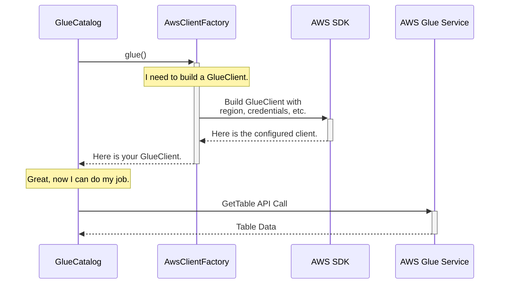

# Chapter 7: AwsClientFactory

In our journey so far, we've explored components like [GlueCatalog](02_gluecatalog_.md) and [DynamoDbCatalog](06_dynamodbcatalog_.md). We know they talk to AWS services like Glue and DynamoDB, but we haven't looked at *how* they establish that communication. How do they get the right credentials? How do they know which AWS region to talk to? Let's meet the component that manages all of this behind the scenes.

### The Problem: Who Builds the Tools?

Imagine you're building a house. You need a hammer, a saw, a drill, and a wrench. Each tool needs to be built correctly to do its job.
*   The hammer needs a strong head and a comfortable grip.
*   The saw needs a sharp blade.
*   The drill needs a charged battery.

Now, imagine if every single worker on your construction site had to build their own tools from scratch every morning. It would be incredibly inefficient and inconsistent. Some saws would be sharp, others dull.

This is the exact problem Iceberg faces.
*   [S3FileIO](04_s3fileio_.md) needs an `S3Client` to talk to S3.
*   [GlueCatalog](02_gluecatalog_.md) needs a `GlueClient` to talk to AWS Glue.
*   [DynamoDbLockManager](05_dynamodblockmanager_.md) needs a `DynamoDbClient` to talk to DynamoDB.

If each of these components created and configured its own AWS client, you'd have to provide configuration properties (like security credentials and region) in many different places. It would be a recipe for complexity and error.

### The Solution: `AwsClientFactory` - The Universal Tool Factory

The `AwsClientFactory` is Iceberg's "tool factory." It's a single, central place responsible for building all the AWS clients that Iceberg needs.

Think of it as the master toolmaker on the construction site. When the `GlueCatalog` needs a `GlueClient`, it doesn't build it itself. It goes to the `AwsClientFactory` and says, "I need a standard-issue Glue client." The factory then forges a perfectly configured client and hands it over.

This design has a massive advantage: **pluggability**. You can change the entire authentication method for your application just by swapping out the factory. For example:
*   Use the default factory to pick up credentials from your environment.
*   Plug in an `AssumeRoleAwsClientFactory` to make all clients use temporary credentials from a specific IAM role.
*   Plug in a `LakeFormationAwsClientFactory` to get credentials from AWS Lake Formation.

The components using the clients, like `GlueCatalog`, don't need to change at all. They just ask for a tool and get the right one for the job, configured exactly as you specified.

### How It Works: A Look at the Factory Floor

Let's see how `GlueCatalog` gets its client. The process is simple and clean.

1.  **Request a Client:** The `GlueCatalog` needs to make an API call, so it asks the `AwsClientFactory` for a `GlueClient`.
2.  **Factory Builds the Client:** The factory looks at the configuration properties you provided (from [Chapter 1](01_configuration_properties__awsproperties__s3fileioproperties__etc___.md)) to figure out how to build the client. It sets the region, credentials, and any other custom settings.
3.  **Client is Returned:** The factory returns a ready-to-use `GlueClient`.
4.  **Catalog Uses the Client:** The `GlueCatalog` uses this client to talk to the AWS Glue service.



This ensures that every client is built consistently and according to your central configuration.

### Under the Hood: The Power of an Interface

The "magic" that makes this pluggable system work is a standard Java concept: an **interface**. The `AwsClientFactory` is defined as a simple contract.

**File: `src/main/java/org/apache/iceberg/aws/AwsClientFactory.java`**
```java
// A simplified view of the AwsClientFactory interface
public interface AwsClientFactory extends Serializable {

  S3Client s3();

  GlueClient glue();

  KmsClient kms();

  DynamoDbClient dynamo();

  void initialize(Map<String, String> properties);
}
```
This interface says, "Anyone who wants to be an `AwsClientFactory` *must* know how to produce these four types of clients."

#### The Default Factory

If you don't specify otherwise, Iceberg uses the `DefaultAwsClientFactory`. This is a basic implementation that reads standard properties (like `s3.endpoint`) and uses the default AWS credential provider chain (which checks environment variables, system properties, etc.).

**File: `src/main/java/org/apache/iceberg/aws/AwsClientFactories.java`**
```java
// Simplified logic from DefaultAwsClientFactory
static class DefaultAwsClientFactory implements AwsClientFactory {
    private AwsProperties awsProperties;
    // ... other property holders

    @Override
    public GlueClient glue() {
        return GlueClient.builder()
            // It applies settings from the properties objects
            .applyMutation(awsProperties::applyGlueEndpointConfigurations)
            .build();
    }
    // ... implementations for s3(), kms(), dynamo() ...
}
```
This is the simple, "out-of-the-box" factory.

#### The Switchboard: How You Choose Your Factory

So how do you tell Iceberg to use a *different* factory, like one that assumes an IAM role? You use a special configuration property: `client.factory`.

**File: `src/main/java/org/apache/iceberg/aws/AwsClientFactories.java`**
```java
// A simplified view of the factory loader
public static AwsClientFactory from(Map<String, String> properties) {
    // 1. Look for the 'client.factory' property.
    String factoryImpl = properties.get(
        AwsProperties.CLIENT_FACTORY,
        DefaultAwsClientFactory.class.getName());

    // 2. Load the specified class and create a new instance.
    return loadClientFactory(factoryImpl, properties);
}
```
This small but powerful piece of code is the switchboard. It reads the `client.factory` property from your configuration map and dynamically loads that class.

Let's see it in action.

**Scenario 1: Using the Default Factory**
You provide a simple configuration map.

```java
Map<String, String> properties = new HashMap<>();
properties.put("warehouse", "s3://my-bucket/warehouse");
// No 'client.factory' is set.

// The from() method will load DefaultAwsClientFactory.
AwsClientFactory factory = AwsClientFactories.from(properties);
```

**Scenario 2: Plugging in the AssumeRole Factory**
You add one property to switch to a more advanced factory.

```java
Map<String, String> properties = new HashMap<>();
properties.put("warehouse", "s3://my-bucket/warehouse");

// Tell Iceberg which factory to use
properties.put(AwsProperties.CLIENT_FACTORY, 
    "org.apache.iceberg.aws.AssumeRoleAwsClientFactory");

// Provide the settings that the new factory needs
properties.put(AwsProperties.CLIENT_ASSUME_ROLE_ARN, "arn:aws:iam::...");

// The from() method will now load AssumeRoleAwsClientFactory.
AwsClientFactory factory = AwsClientFactories.from(properties);
```

Notice how the code that *uses* the factory doesn't change at all. You've completely altered the security model of your application just by changing configuration strings. This is the power of the factory pattern.

### Conclusion

You've now met the `AwsClientFactory`, the unsung hero that works behind the scenes to make Iceberg's AWS integrations so flexible and powerful.

*   It's the **central hub** for creating all AWS clients (for S3, Glue, DynamoDB, KMS).
*   It **centralizes configuration**, ensuring all clients are built consistently.
*   It is a **pluggable system** controlled by the `client.factory` property.
*   This design allows you to switch authentication and configuration strategies (like using an IAM role) without changing a single line of your application logic.

Now that we understand the factory concept, we can explore the powerful, specialized factories that Iceberg provides. In the next chapter, we'll dive into the most common one: the [`AssumeRoleAwsClientFactory`](08_assumeroleawsclientfactory_.md), which enables Iceberg to operate with secure, temporary credentials.

---

Generated by [AI Codebase Knowledge Builder](https://github.com/The-Pocket/Tutorial-Codebase-Knowledge)