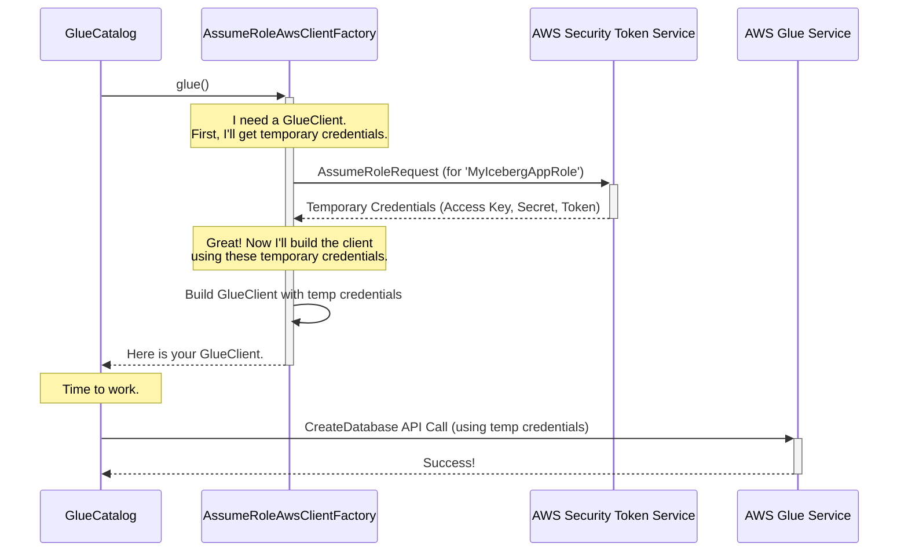

# Chapter 8: AssumeRoleAwsClientFactory

In the [previous chapter](07_awsclientfactory_.md), we learned about the `AwsClientFactory`, a pluggable "tool factory" that builds all the AWS clients Iceberg needs. We saw that you can swap out this factory just by changing a configuration property. Now, let's explore the most important and widely-used implementation of this factory, one that is a cornerstone of AWS security best practices.

### The Problem: The Risk of Permanent Keys

Imagine you have a master key that can open every door in your company's headquarters. If you give this key to a contractor, you have a security problem. What if they lose it? What if they accidentally leave it somewhere? Anyone who finds that key now has permanent, unrestricted access.

Using permanent AWS access keys (like those for an IAM user) in your application is just like handing out a master key. If those keys are ever accidentally leaked—in your code, in a log file, or in a configuration file—an attacker could gain long-term access to your AWS account. This is a huge security risk.

We need a safer way. We need to give our application a temporary security pass that only works for a short time and only for the specific doors it needs to open.

### The Solution: `AssumeRoleAwsClientFactory` - The Temporary Security Pass

The `AssumeRoleAwsClientFactory` is a specialized "tool factory" that solves this problem by using **temporary security credentials**. Instead of using permanent keys, it performs a special action called **"assuming a role"** through the AWS Security Token Service (STS).

Here's the analogy:
1.  Your application (the contractor) shows up for work with its own ID badge (its default AWS credentials).
2.  It goes to the security desk (AWS STS) and says, "I'm here to work on the data warehouse project. Please give me the temporary pass for that project."
3.  The security desk checks its list and confirms your application is allowed to get this pass. It then issues a temporary keycard (temporary credentials) that is only valid for a few hours and only opens the doors to the data warehouse floors (the specific AWS resources).
4.  Your application uses this temporary keycard for all its work. When it expires, it just goes back to the security desk to get a new one.

The `AssumeRoleAwsClientFactory` manages this entire process for you automatically. All AWS clients it creates will use these secure, short-lived credentials.

### How to Use the `AssumeRoleAwsClientFactory`

Enabling this powerful security feature is as simple as adding a few lines to your configuration map. You don't need to change any of your application logic.

Let's configure a `GlueCatalog` to use an IAM role named `MyIcebergAppRole`.

```java
// In Java
Map<String, String> properties = new HashMap<>();

// Standard catalog properties
properties.put("warehouse", "s3://my-iceberg-data-bucket/warehouse");
properties.put("catalog-impl", "org.apache.iceberg.aws.glue.GlueCatalog");

// --- Enable AssumeRole ---
// 1. Tell Iceberg which factory to use.
properties.put(AwsProperties.CLIENT_FACTORY, AssumeRoleAwsClientFactory.class.getName());

// 2. Specify the Amazon Resource Name (ARN) of the role to assume.
properties.put(AwsProperties.CLIENT_ASSUME_ROLE_ARN, 
    "arn:aws:iam::123456789012:role/MyIcebergAppRole");

// 3. Tell the factory which region the clients should operate in.
properties.put(AwsProperties.CLIENT_ASSUME_ROLE_REGION, "us-east-1");
```

That's it! When you initialize your catalog with these properties, Iceberg will automatically use the `AssumeRoleAwsClientFactory`.

```java
// Initialize the catalog as usual.
GlueCatalog catalog = new GlueCatalog();
catalog.initialize("my_secure_catalog", properties);

// From this point on, every AWS API call made by the catalog
// (e.g., to create a namespace) will use the temporary credentials
// from the 'MyIcebergAppRole'.
catalog.createNamespace(Namespace.of("secure_db"));
```

By adding just three properties, you've significantly improved the security posture of your application. The IAM role `MyIcebergAppRole` can now have fine-grained permissions, like only allowing access to specific S3 buckets or Glue databases.

### Under the Hood: The Journey to Get a Temporary Pass

So, what happens when the `GlueCatalog` asks our new factory for a `GlueClient`?

1.  **Request for a Client:** The `GlueCatalog` calls `factory.glue()` to get a client.
2.  **Call the Security Desk:** The `AssumeRoleAwsClientFactory` doesn't immediately build a `GlueClient`. First, it uses its *own* initial credentials to make an API call to the **AWS Security Token Service (STS)**.
3.  **Assume the Role:** It sends an `AssumeRole` request to STS, providing the role ARN you configured.
4.  **Receive Temporary Credentials:** STS verifies that the initial credentials have permission to assume that role. If so, it returns a set of temporary credentials: a temporary access key, a temporary secret key, and a session token.
5.  **Build the Client:** The factory now uses these *temporary* credentials to build the final `GlueClient`.
6.  **Return the Client:** The fully configured `GlueClient` is returned to the `GlueCatalog`, which can now do its work.

This all happens transparently every time a new client is needed. The factory also cleverly handles refreshing the credentials before they expire.



Let's peek at the code that wires this up. The core of the logic is in how the factory configures the AWS client builders.

**File: `src/main/java/org/apache/iceberg/aws/AssumeRoleAwsClientFactory.java`**
This method is applied to every client builder (for Glue, S3, etc.).

```java
// Simplified view of how the factory configures a client
protected <T extends AwsClientBuilder> T applyAssumeRoleConfigurations(T clientBuilder) {
    clientBuilder
        // 1. This is the key part: it plugs in a special credentials provider.
        .credentialsProvider(createCredentialsProvider())
        // 2. It sets the region you configured.
        .region(Region.of(awsProperties.clientAssumeRoleRegion()));
    return clientBuilder;
}
```
The `createCredentialsProvider()` method is where the STS client is set up to fetch the credentials.

**File: `src/main/java/org/apache/iceberg/aws/AssumeRoleAwsClientFactory.java`**
```java
// Simplified view of the credentials provider creation
private StsAssumeRoleCredentialsProvider createCredentialsProvider() {
    return StsAssumeRoleCredentialsProvider.builder()
        // It uses a standard STS client to make the call.
        .stsClient(sts())
        // It tells the provider what request to make when it needs new credentials.
        .refreshRequest(createAssumeRoleRequest())
        .build();
}
```

Finally, `createAssumeRoleRequest()` builds the actual request payload using the properties you provided in your configuration map.

**File: `src/main/java/org/apache/iceberg/aws/AssumeRoleAwsClientFactory.java`**
```java
// Simplified view of the request builder
private AssumeRoleRequest createAssumeRoleRequest() {
    return AssumeRoleRequest.builder()
        // It reads the role ARN from the properties you set.
        .roleArn(awsProperties.clientAssumeRoleArn())
        .roleSessionName(roleSessionName)
        // ... and other settings like timeout and external ID.
        .build();
}
```
This chain of methods connects your simple configuration properties directly to the underlying AWS SDK, enabling a robust and secure authentication mechanism with minimal effort.

### Conclusion

You've now mastered one of the most important components for running Iceberg securely on AWS.

*   The `AssumeRoleAwsClientFactory` allows your application to operate with **secure, temporary credentials** instead of risky, long-lived keys.
*   It works by **assuming an IAM role** via the AWS Security Token Service (STS).
*   It is a **best practice** for AWS security, enabling you to define fine-grained, short-lived permissions for your data applications.
*   Enabling it is as simple as setting three properties: `client.factory`, `client.assume-role.arn`, and `client.assume-role.region`.

This factory is perfect for most security needs. But what if you work in an environment that uses AWS Lake Formation to manage even more granular, table- and column-level permissions? Iceberg has a factory for that, too. In the next chapter, we'll explore the [LakeFormationAwsClientFactory](09_lakeformationawsclientfactory_.md).

---

Generated by [AI Codebase Knowledge Builder](https://github.com/The-Pocket/Tutorial-Codebase-Knowledge)