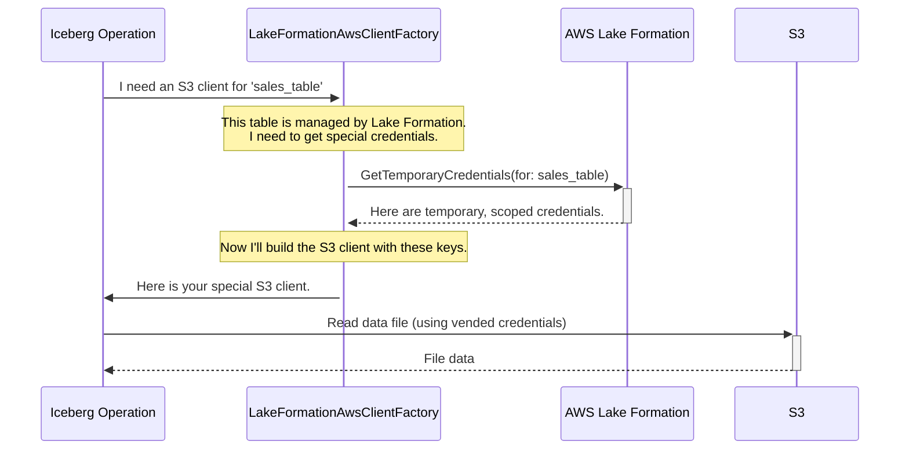

# Chapter 9: LakeFormationAwsClientFactory

In the [previous chapter](08_assumeroleawsclientfactory_.md), we discovered the `AssumeRoleAwsClientFactory`, a fantastic tool for using secure, temporary credentials based on an IAM role. This is a huge step up in security. But what if you need to be even more precise? What if you want to grant access not just to a project, but to a specific table, or even specific columns within that table?

### The Problem: One Key, Too Many Doors

Imagine our `AssumeRoleAwsClientFactory` gives our application a temporary pass that opens all the doors on the "Data Analytics" floor. This is secure, but that one pass can still open the door to the `employees` table, the `sales` table, and the `financials` table.

For ultra-sensitive data, you might want a system where a user can get a temporary key that *only* opens the door to the `sales` table, and *nothing else*. Managing hundreds of different IAM roles for every possible combination of access would be a nightmare. We need a central security desk that can issue these highly specific, on-demand keys.

### The Solution: `LakeFormationAwsClientFactory` - The High-Tech Security Desk

The `LakeFormationAwsClientFactory` is an advanced "tool factory" that integrates with **AWS Lake Formation** to provide exactly this kind of fine-grained access control. AWS Lake Formation acts as a central security desk for your entire data lake.

Instead of just assuming a general-purpose role, this factory goes to Lake Formation for every request and asks:
> "This user wants to read the `sales` table. Can you please give me a temporary key that *only* works for reading the S3 data belonging to that specific table?"

Lake Formation checks its central rulebook. If the user is allowed, it creates and "vends" (gives out) a set of super-short-lived credentials that are tightly scoped to that one operation. It's the ultimate in data lake security: permissions are granted on-demand, for a specific purpose, and for a short time.

### How to Use the `LakeFormationAwsClientFactory`

Enabling this advanced security system involves adding a few more properties to your configuration map. It builds on top of the `AssumeRole` configuration we already know.

```java
// In Java
Map<String, String> properties = new HashMap<>();

// 1. We start with the same AssumeRole properties from the last chapter.
properties.put(AwsProperties.CLIENT_FACTORY, 
    "org.apache.iceberg.aws.lakeformation.LakeFormationAwsClientFactory");
properties.put(AwsProperties.CLIENT_ASSUME_ROLE_ARN, 
    "arn:aws:iam::123456789012:role/MyIcebergAppRole");
properties.put(AwsProperties.CLIENT_ASSUME_ROLE_REGION, "us-east-1");

// 2. We enable Lake Formation integration for the Glue Catalog.
properties.put(AwsProperties.GLUE_LAKEFORMATION_ENABLED, "true");

// 3. We add a special tag to tell Lake Formation who is making the request.
// This is a security feature to identify the application.
properties.put(AwsProperties.CLIENT_ASSUME_ROLE_TAGS_PREFIX + 
    LakeFormationAwsClientFactory.LF_AUTHORIZED_CALLER, "MyDataApp");
```

Let's break down the new additions:
*   **`client.factory`**: We now point to `LakeFormationAwsClientFactory`. It's a more advanced version that extends `AssumeRoleAwsClientFactory`.
*   **`glue.lakeformation-enabled`**: This tells the [GlueCatalog](02_gluecatalog_.md) that it should expect to work with Lake Formation permissions.
*   **`client.assume-role.tags.LakeFormationAuthorizedCaller`**: This is a crucial security tag. It's like showing a special badge to the Lake Formation security desk so it knows your application is a trusted caller.

With this configuration, any Iceberg operation that needs to read or write data will now go through Lake Formation to get its S3 credentials.

### Under the Hood: A Trip to the Security Desk

When your application tries to scan a table, Iceberg needs an S3 client to read the data files. Here’s how our new factory gets one:

1.  **Request for S3 Client:** Iceberg asks the `LakeFormationAwsClientFactory` for an `S3Client`.
2.  **Check Registration:** The factory first checks if the table is registered with Lake Formation. If not, it falls back to the simple `AssumeRole` behavior. If it is, it proceeds.
3.  **Visit Lake Formation:** The factory makes an API call to AWS Lake Formation, saying "I need temporary credentials to access this specific table ARN."
4.  **Get Vended Credentials:** Lake Formation checks its policies. If access is granted, it returns a set of temporary credentials (access key, secret key, session token). These credentials only work for the S3 locations associated with that one table.
5.  **Build the S3 Client:** The factory builds the `S3Client` using these hyper-specific, temporary credentials.
6.  **Read Data:** Iceberg uses this client to read the table's data files from S3. Any attempt to access a different S3 path would be denied.



### A Look at the Code

The logic for this is beautifully contained within the factory itself. The factory's `s3()` method decides whether to use Lake Formation or fall back to the standard assumed-role credentials.

**File: `src/main/java/org/apache/iceberg/aws/lakeformation/LakeFormationAwsClientFactory.java`**
```java
@Override
public S3Client s3() {
    // Is this table registered with Lake Formation?
    if (isTableRegisteredWithLakeFormation()) {
        // If yes, get credentials from the Lake Formation security desk.
        return S3Client.builder()
            .credentialsProvider(
                new LakeFormationCredentialsProvider(lakeFormation(), buildTableArn()))
            .region(Region.of(region()))
            .build();
    } else {
        // If no, just behave like our parent, AssumeRoleAwsClientFactory.
        return super.s3();
    }
}
```
This shows the power of extending factories. We add a special case for S3 and KMS clients when Lake Formation is involved, but for everything else (like the Glue client), we reuse the logic from `AssumeRoleAwsClientFactory`.

The real magic happens in the `LakeFormationCredentialsProvider`. It's responsible for making the API call to Lake Formation.

**File: `src/main/java/org/apache/iceberg/aws/lakeformation/LakeFormationAwsClientFactory.java`**
```java
// A simplified view of the credential provider
static class LakeFormationCredentialsProvider implements AwsCredentialsProvider {
    // ... constructor ...

    @Override
    public AwsCredentials resolveCredentials() {
        // Prepare the request for the security desk
        GetTemporaryGlueTableCredentialsRequest request =
            GetTemporaryGlueTableCredentialsRequest.builder()
                .tableArn(tableArn)
                .supportedPermissionTypes(PermissionType.COLUMN_PERMISSION)
                .build();

        // Ask Lake Formation for the temporary keys
        GetTemporaryGlueTableCredentialsResponse response =
            client.getTemporaryGlueTableCredentials(request);

        // Return the vended credentials
        return AwsSessionCredentials.create(
            response.accessKeyId(), response.secretAccessKey(), response.sessionToken());
    }
}
```
This provider is called by the AWS SDK whenever the `S3Client` needs credentials. It transparently fetches the just-in-time credentials from Lake Formation, ensuring your data access is always governed by the latest, centrally-managed policies.

### Conclusion

You've just unlocked the highest level of security for Iceberg on AWS.

*   `LakeFormationAwsClientFactory` integrates Iceberg with **AWS Lake Formation** for fine-grained access control.
*   It "vends" **on-demand, temporary credentials** that are scoped to specific tables or even columns.
*   This allows you to **centrally manage permissions** in Lake Formation, rather than juggling complex IAM roles.
*   It's enabled by setting a few properties, including `glue.lakeformation-enabled` and a special session tag.

So far, all the clients we've discussed use the standard AWS SDKs. But what if your catalog isn't an AWS service like Glue or DynamoDB, but a custom REST API? In our final chapter on AWS components, we'll look at a special-purpose client for exactly that scenario: the [S3V4RestSignerClient](10_s3v4restsignerclient_.md).

---

Generated by [AI Codebase Knowledge Builder](https://github.com/The-Pocket/Tutorial-Codebase-Knowledge)