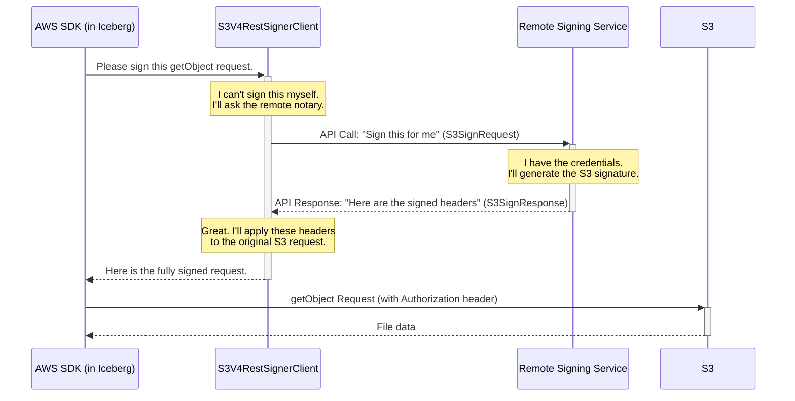

# Chapter 10: S3V4RestSignerClient

In the [previous chapter](09_lakeformationawsclientfactory_.md), we explored how the `LakeFormationAwsClientFactory` vends hyper-specific, temporary credentials for the ultimate in fine-grained access control. That factory, like all the others we've seen, still assumes that the application environment has *some* form of AWS credentials to start with, even if it's just the permission to assume a role.

But what if you're in an extremely high-security environment where applications are forbidden from having *any* AWS credentials at all? How can Iceberg talk to S3 then? Let's explore a powerful security pattern that makes this possible.

### The Problem: How to Get a Document Stamped With No Seal?

Imagine you need to send a legally binding document to a government office. The document requires an official seal from a notary to be considered valid. However, your company's policy is strict: you are not allowed to keep an official notary seal in your office due to security risks.

How do you get your document stamped? You can't do it yourself. The only solution is to take your unstamped document to a trusted, external Notary Public office. The notary there has their own seal, verifies your document, stamps it, and gives it back to you. Now you can send the officially notarized document to the government.

An S3 request is just like this document. It needs to be "stamped" with a cryptographic signature (an `Authorization` header) to be considered valid by AWS. If your application has no AWS credentials, it has no "seal" to stamp the request with.

### The Solution: `S3V4RestSignerClient` - The Digital Notary Office

The `S3V4RestSignerClient` is a specialized component that implements this "digital notary" pattern. It's an AWS Signer that, instead of signing S3 requests locally, **delegates the signing to a remote REST service**.

Here's how it works:
1.  **Prepare the Request:** Your Iceberg application prepares an S3 request (e.g., to read a Parquet file).
2.  **Send to Notary:** Instead of sending it to S3, the `S3V4RestSignerClient` intercepts it. It packages the request details (like the S3 path and HTTP method) into a new JSON message.
3.  **Delegate Signing:** It sends this JSON message to a trusted REST endpoint you've configured (the "notary office"). This service is a completely separate application that you or your organization maintains, and *it* is the only thing that holds AWS credentials.
4.  **Receive the Signed Request:** The remote service signs the request and sends back the required headers, including the all-important `Authorization` header.
5.  **Send to S3:** The `S3V4RestSignerClient` applies these headers to the original S3 request and finally sends it to Amazon S3.

This powerful pattern completely isolates your application from AWS credentials, providing a huge security benefit by centralizing credential management and auditing in one hardened service.

### How It Works: A Look at the Notarization Process

Using `S3V4RestSignerClient` is a bit different from the factories we've seen before. It's not a catalog property, but rather a custom `Signer` that you configure for the S3 client itself. This is an advanced configuration, but it's enabled by simple properties.

You would typically set this up inside a custom [AwsClientFactory](07_awsclientfactory_.md). The key properties are:

```java
// In Java
Map<String, String> properties = new HashMap<>();

// 1. The address of your remote "notary" signing service.
properties.put("s3.signer.uri", "https://my-secure-signing-service.example.com/");

// 2. The credential needed to talk to the notary service itself (not AWS).
//    This uses OAuth2 to authenticate your application to the signing service.
properties.put("s3.signer.credential", "my-app-id:my-app-secret");
```

When an S3 client is built with this signer, every S3 request goes through the following delegation flow:



### Under the Hood: A Look at the `sign` Method

The core of this entire process happens within the `sign` method of the `S3V4RestSignerClient`. Let's look at a simplified version of the code.

**File: `src/main/java/org/apache/iceberg/aws/s3/signer/S3V4RestSignerClient.java`**
```java
// A simplified view of the sign method
@Override
public SdkHttpFullRequest sign(
    SdkHttpFullRequest request, ExecutionAttributes executionAttributes) {
    
    // 1. Package the original S3 request details into a JSON object.
    S3SignRequest remoteSigningRequest =
        ImmutableS3SignRequest.builder()
            .method(request.method().name())
            .region(signerParams.signingRegion().id())
            .uri(request.getUri())
            .headers(request.headers())
            .build();
    
    // ... Caching logic to avoid re-signing the same request ...

    // 2. Send the JSON object to the remote signing service.
    S3SignResponse s3SignResponse =
        httpClient()
            .withAuthSession(authSession()) // Handles OAuth2 token
            .post(endpoint(), remoteSigningRequest, S3SignResponse.class, ...);

    // 3. Apply the signed headers from the response to the original request.
    SdkHttpFullRequest.Builder mutableRequest = request.toBuilder();
    reconstructHeaders(s3SignResponse.headers(), mutableRequest);

    return mutableRequest.build();
}
```

Let's break this down:

1.  **`S3SignRequest`**: This is a simple data object defined in `S3SignRequest.java` that holds all the information the remote service needs to sign the request.
2.  **`httpClient().post(...)`**: This makes the actual REST API call to your notary service. It uses a helper, `authSession()`, to automatically handle the OAuth2 authentication, ensuring the communication between your app and the signing service is secure.
3.  **`reconstructHeaders(...)`**: This takes the headers from the `S3SignResponse` (the reply from the notary) and carefully applies them to the original `SdkHttpFullRequest`, getting it ready to be sent to S3.

The client is also smart about performance. It includes a small in-memory cache, so if your application asks to sign the same `GET` request multiple times in a short period, it will return the cached signature instead of making another network call to the remote service.

### Conclusion: Your Journey Through Iceberg on AWS

You've just learned about the `S3V4RestSignerClient`, a component that enables a highly secure pattern for interacting with S3 by delegating the signing process to a remote service.
*   It implements a **"digital notary"** pattern.
*   It allows your application to work with S3 **without having any local AWS credentials**.
*   It **centralizes credential management** and policy enforcement in a separate, hardened REST service.

This chapter concludes our tour of the core components in the `iceberg-aws` module. You've gone from the ground up, learning about:

*   **Configuration:** How to control everything with a simple map of properties ([Chapter 1](01_configuration_properties__awsproperties__s3fileioproperties__etc___.md)).
*   **Catalogs:** Using AWS Glue ([Chapter 2](02_gluecatalog_.md)) or DynamoDB ([Chapter 6](06_dynamodbcatalog_.md)) as your table directory.
*   **Transactions:** How atomic commits provide reliability ([Chapter 3](03_gluetableoperations_.md)) and how locks prevent conflicts ([Chapter 5](05_dynamodblockmanager_.md)).
*   **Storage:** How Iceberg efficiently reads from and writes to S3 ([Chapter 4](04_s3fileio_.md)).
*   **Security & Client Creation:** The flexible factory pattern ([Chapter 7](07_awsclientfactory_.md)) that enables best practices like temporary credentials ([Chapter 8](08_assumeroleawsclientfactory_.md)), fine-grained permissions ([Chapter 9](09_lakeformationawsclientfactory_.md)), and even credential delegation ([Chapter 10](10_s3v4restsignerclient_.md)).

With this knowledge, you are now well-equipped to build, manage, and secure robust, high-performance data lakes using Apache Iceberg on the AWS cloud.

---

Generated by [AI Codebase Knowledge Builder](https://github.com/The-Pocket/Tutorial-Codebase-Knowledge)